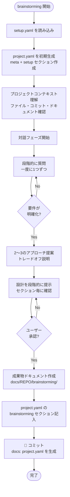

# ブレインストーミングスキル

アイデアを対話を通じて完全な設計仕様に発展させるスキルです。プロジェクトの現状を理解し、一度に1つずつ質問してアイデアを洗練させ、設計を小さなセクションで提示しながら確認を取ります。

**重要**: このスキルは `setup.yaml` を基に `project.yaml` を生成します。`project.yaml` は全プロセスの SSOT（Single Source of Truth）として機能し、以降の全スキル（investigation, design, plan, implement等）がこのファイルを入力として使用します。

## 主要機能

- `setup.yaml` を基に `project.yaml` を生成（**全プロセスのSSOT**）
- プロジェクトコンテキストの理解（ファイル、ドキュメント、最近のコミット確認）
- 段階的な質問による要件の明確化
- **テスト戦略の明確化**（単体/結合/E2E、テスト方法、判定基準）
- 2〜3つのアプローチ提案とトレードオフ説明
- 設計の段階的提示と確認
- ブレインストーミング成果物の作成（`docs/{repo}/brainstorming/` 配下）

## 入力 / 出力

### 入力

| ファイル     | 必須 | 説明                                       |
| ------------ | ---- | ------------------------------------------ |
| `setup.yaml` | ✅    | issue-to-setup-yaml で生成されたタスク定義 |

### 出力

| ファイル                         | 説明                                                            |
| -------------------------------- | --------------------------------------------------------------- |
| `project.yaml`                   | 全プロセスのSSOT。meta + setup + brainstorming セクションを含む |
| `docs/{repo}/brainstorming/*.md` | ブレインストーミングの詳細ドキュメント                          |

## 処理フロー



## project.yaml 生成手順

### 1. setup.yaml の読み込み

```bash
# setup.yaml の存在確認と読み込み
cat setup.yaml
```

### 2. project.yaml の初期生成

setup.yaml を基に以下の構造で `project.yaml` を生成:

```yaml
# =============================================================================
# project.yaml — プロジェクトコンテキストファイル（全プロセスの SSOT）
# =============================================================================
# brainstorming プロセスが setup.yaml を基に初期生成。
# 以降の各プロセスが自セクションを追記し、コミットする。

# -----------------------------------------------------------------------------
# メタ情報
# -----------------------------------------------------------------------------
meta:
  version: "1.0"
  ticket_id: "{setup.yamlのチケットID}"
  task_name: "{タスク名}"
  target_repo: "{対象リポジトリ名}"
  branch: "{ブランチ名}"
  created_at: "{ISO 8601形式の現在時刻}"
  updated_at: "{ISO 8601形式の現在時刻}"

# -----------------------------------------------------------------------------
# setup（setup.yaml から引き継ぎ — 読み取り専用）
# -----------------------------------------------------------------------------
setup:
  description:
    overview: "{setup.yamlのoverview}"
    purpose: "{setup.yamlのpurpose}"
    background: "{setup.yamlのbackground}"
    requirements:
      functional: ["{機能要件...}"]
      non_functional: ["{非機能要件...}"]
    acceptance_criteria: ["{受け入れ基準...}"]
    scope: ["{スコープ...}"]
    out_of_scope: ["{スコープ外...}"]
    notes: "{備考}"
  related_repositories: [{name: "...", url: "..."}]
  target_repositories: [{name: "...", url: "..."}]
  options:
    create_design_document: true
    design_document_dir: "docs"
    submodules_dir: "submodules"

# -----------------------------------------------------------------------------
# brainstorming（対話完了後に記入）
# -----------------------------------------------------------------------------
brainstorming:
  status: pending  # pending | in_progress | completed
  started_at: "{ISO 8601形式の現在時刻}"
```

### 3. 対話プロセス実行

1. **コンテキスト理解**: プロジェクトファイル、ドキュメント、最近のコミットを確認
2. **段階的質問**: 一度に1つずつ質問し、要件を明確化
3. **テスト戦略の明確化**: 以下を利用可能な対話用ツール（`ask_user` または `askQuestions`）で確認（必須）
   - テスト範囲（単体テスト / 結合テスト / E2Eテスト）
   - E2Eテストが必要な場合: 実行方法、判定基準、対象環境
   - acceptance_criteria の各項目をどのテスト種別で検証するか
   - 対象リポジトリのテストフレームワーク・ツールの把握
4. **アプローチ提案**: 2〜3つの設計方針とトレードオフを説明
5. **設計提示**: 小さなセクションで設計を提示し、確認を取る

⚠️ **重要**: acceptance_criteria に実環境での動作確認が必要な項目（例: 「○○にデプロイできる」「△△サービスと連携する」「ログが□□に出力される」等）が含まれる場合、E2Eテストの実施を積極的に推奨し、テスト戦略に含めること。

### 4. brainstorming セクションの完成

対話完了後、brainstorming セクションを yq で更新:

```bash
# brainstorming セクションの更新（yq 使用）
yq -i '.brainstorming.status = "completed"' project.yaml
yq -i ".brainstorming.completed_at = \"$(date -Iseconds)\"" project.yaml
yq -i '.brainstorming.summary = "対話の要約: 何を検討し、何を決定したか"' project.yaml
yq -i '.brainstorming.decisions = [{"question": "質啡1", "decision": "決定1"}]' project.yaml
yq -i '.brainstorming.refined_requirements = ["追加要件1", "追加要件2"]' project.yaml
yq -i ".brainstorming.artifacts = \"docs/${TARGET_REPO}/brainstorming/\"" project.yaml

# テスト戦略の記録（必須）
yq -i '.brainstorming.test_strategy.scope = ["unit", "e2e"]' project.yaml  # 例: unit, integration, e2e から選択
yq -i '.brainstorming.test_strategy.unit.framework = "xUnit"' project.yaml
yq -i '.brainstorming.test_strategy.unit.target = "全コンポーネントの単体テスト"' project.yaml
yq -i '.brainstorming.test_strategy.e2e.method = "AWS環境にデプロイして動作確認"' project.yaml
yq -i '.brainstorming.test_strategy.e2e.criteria = ["acceptance_criteriaの対象項目"]' project.yaml
yq -i '.brainstorming.test_strategy.e2e.environment = "AWS ap-northeast-1"' project.yaml

# meta.updated_at を更新
yq -i ".meta.updated_at = \"$(date -Iseconds)\"" project.yaml
```

またはヘルパーの update コマンドで簡易更新：

```bash
./scripts/project-yaml-helper.sh update brainstorming --status completed \
  --summary "対話の要約" --artifacts "docs/${TARGET_REPO}/brainstorming/"
```

#### brainstorming セクションのフィールド詳細

| フィールド             | 型     | 説明                                                     |
| ---------------------- | ------ | -------------------------------------------------------- |
| `status`               | string | `pending` → `in_progress` → `completed`                  |
| `completed_at`         | string | ISO 8601形式の完了日時                                   |
| `summary`              | string | 対話の要約（何を検討し、何を決定したか）                 |
| `decisions`            | array  | 主要な決定事項（最大5件）。各項目は question と decision |
| `refined_requirements` | array  | ブレインストーミングで追加・修正された要件               |
| `test_strategy`        | object | テスト戦略。scope（配列: unit/integration/e2e）、各テスト種別の詳細（framework, method, criteria, environment 等）を含む。**必須フィールド** |
| `artifacts`            | string | 成果物ドキュメントのパス                                 |

### 5. コミット

```bash
# 成果物とproject.yamlをコミット
git add project.yaml docs/{repo}/brainstorming/
git commit -m "docs: project.yaml を生成"

# バリデーション（任意）
# scripts/validate-project-yaml.sh project.yaml
```

## 使用タイミング

- 新機能の設計前
- コンポーネントの構築前
- 機能追加や動作変更の前
- 要件が曖昧なとき

## 対話のガイドライン

### 質問のベストプラクティス

- **一度に1つの質問**に絞る
- **具体的な選択肢**を提示する（可能な場合）
- **なぜその情報が必要か**を説明する
- 前の回答を踏まえて**次の質問を調整**する

### 設計提示のベストプラクティス

- **小さなセクション**で提示（一度に全体を見せない）
- 各セクションで**確認を取る**
- **トレードオフ**を明示する
- ユーザーのフィードバックを**即座に反映**する

## 関連スキル

| 関係 | スキル                | 説明                     |
| ---- | --------------------- | ------------------------ |
| 前提 | `issue-to-setup-yaml` | setup.yaml の生成        |
| 後続 | `submodule-overview`  | 対象リポジトリの概要把握 |
| 後続 | `investigation`       | 詳細調査                 |
| 後続 | `design`              | 詳細設計                 |
| 後続 | `plan`                | 実装計画作成             |
