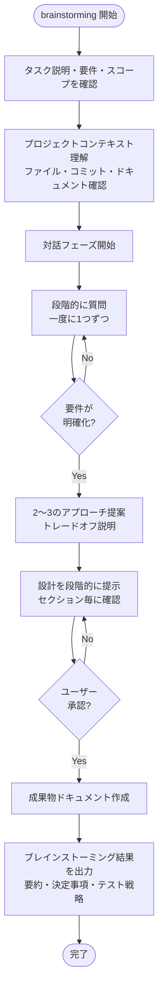

# ブレインストーミングスキル

アイデアを対話を通じて完全な設計仕様に発展させるスキルです。プロジェクトの現状を理解し、一度に1つずつ質問してアイデアを洗練させ、設計を小さなセクションで提示しながら確認を取ります。

## 主要機能

- プロジェクトコンテキストの理解（ファイル、ドキュメント、最近のコミット確認）
- 段階的な質問による要件の明確化
- **テスト戦略の明確化**（単体/結合/E2E、テスト方法、判定基準）
- 2〜3つのアプローチ提案とトレードオフ説明
- 設計の段階的提示と確認
- ブレインストーミング成果物のドキュメント作成

## 入力 / 出力

### 入力

| 情報               | 必須 | 説明                                         |
| ------------------ | ---- | -------------------------------------------- |
| タスク説明         | ✅    | 実現したい機能・変更の概要                   |
| 要件               | ✅    | 機能要件・非機能要件・受け入れ基準           |
| スコープ           | ○    | 対象範囲とスコープ外の定義                   |
| 背景・目的         | ○    | なぜこのタスクが必要かの文脈情報             |

### 出力

| 成果物                       | 説明                                   |
| ---------------------------- | -------------------------------------- |
| ブレインストーミング結果     | 要約、決定事項、追加要件、テスト戦略   |
| 成果物ドキュメント           | ブレインストーミングの詳細ドキュメント |

## 処理フロー



## ブレインストーミング手順

### 1. 入力情報の確認

タスク説明、要件、スコープなどの入力情報を確認する。入力は以下のいずれかの形式で受け取る:

- ユーザーとの対話による口頭説明
- Issue やチケットの内容
- 要件定義ドキュメント
- 既存の設定ファイル

### 2. 対話プロセス実行

1. **コンテキスト理解**: プロジェクトファイル、ドキュメント、最近のコミットを確認
2. **段階的質問**: 一度に1つずつ質問し、要件を明確化
3. **テスト戦略の明確化**: 以下を `ask_user` ツールで確認（必須）
   - テスト範囲（単体テスト / 結合テスト / E2Eテスト）
   - E2Eテストが必要な場合: 実行方法、判定基準、対象環境
   - 受け入れ基準の各項目をどのテスト種別で検証するか
   - 対象リポジトリのテストフレームワーク・ツールの把握
4. **アプローチ提案**: 2〜3つの設計方針とトレードオフを説明
5. **設計提示**: 小さなセクションで設計を提示し、確認を取る

⚠️ **重要**: 受け入れ基準に実環境での動作確認が必要な項目（例: 「○○にデプロイできる」「△△サービスと連携する」「ログが□□に出力される」等）が含まれる場合、E2Eテストの実施を積極的に推奨し、テスト戦略に含めること。

### 3. ブレインストーミング結果の出力

対話完了後、以下の結果をまとめて出力する:

#### 出力フィールド

| フィールド             | 型     | 説明                                                     |
| ---------------------- | ------ | -------------------------------------------------------- |
| `summary`              | string | 対話の要約（何を検討し、何を決定したか）                 |
| `decisions`            | array  | 主要な決定事項（最大5件）。各項目は question と decision |
| `refined_requirements` | array  | ブレインストーミングで追加・修正された要件               |
| `test_strategy`        | object | テスト戦略。scope（配列: unit/integration/e2e）、各テスト種別の詳細（framework, method, criteria, environment 等）を含む。**必須フィールド** |
| `artifacts`            | string | 成果物ドキュメントのパス（作成した場合）                 |

#### テスト戦略の構造例

```yaml
test_strategy:
  scope: ["unit", "e2e"]  # unit, integration, e2e から選択
  unit:
    framework: "xUnit"
    target: "全コンポーネントの単体テスト"
  e2e:
    method: "環境にデプロイして動作確認"
    criteria: ["受け入れ基準の対象項目"]
    environment: "対象環境"
```

## 使用タイミング

- 新機能の設計前
- コンポーネントの構築前
- 機能追加や動作変更の前
- 要件が曖昧なとき

## 対話のガイドライン

### 質問のベストプラクティス

- **一度に1つの質問**に絞る
- **具体的な選択肢**を提示する（可能な場合）
- **なぜその情報が必要か**を説明する
- 前の回答を踏まえて**次の質問を調整**する

### 設計提示のベストプラクティス

- **小さなセクション**で提示（一度に全体を見せない）
- 各セクションで**確認を取る**
- **トレードオフ**を明示する
- ユーザーのフィードバックを**即座に反映**する

## 関連スキル

| 関係 | スキル            | 説明                     |
| ---- | ----------------- | ------------------------ |
| 後続 | `investigation`   | 詳細調査                 |
| 後続 | `design`          | 詳細設計                 |
| 後続 | `plan`            | 実装計画作成             |
