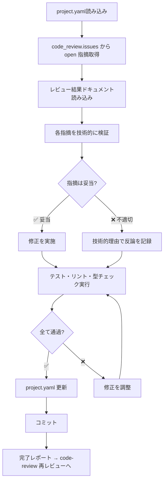

# コードレビュー修正スキル（code-review-fix）

code-review スキルの指摘事項を受けて、技術的に検証した上で修正を実施します。

> **SSOT**: `project.yaml` を全プロセスの Single Source of Truth として使用します。
> - レビュー指摘の参照: `code_review` セクション
> - 修正結果の記録: `code_review` セクション（同セクション更新）
>
> **技術的厳密さ**: 指摘を盲目的に受け入れず、必ず技術的に検証してから修正します。

## 概要

このスキルは以下を実現します：

1. **project.yaml** の `code_review.issues` から未解決の指摘事項を取得
2. **レビュー結果ドキュメント** (`docs/{target_repo}/code-review/round-{NN}.md`) を参照
3. **各指摘を技術的に検証** — コードベースの現実と照合
4. **妥当な指摘に対して修正を実施**
5. **不適切な指摘に対して技術的理由を付けて反論を記録**
6. **修正後にテスト・リント・型チェックを実行して確認**
7. **project.yaml の code_review セクション** を更新してコミット

## レスポンスパターン

各指摘に対して以下の手順で対応します：

1. **READ**: 指摘内容を正確に理解する
2. **VERIFY**: コードベースの現実と照合する
3. **EVALUATE**: この指摘は技術的に正しいか？
4. **IMPLEMENT/DISPUTE**: 修正を実施、または技術的理由で反論

### 反論すべきケース

- 提案が既存機能を壊す場合
- 指摘がコードの完全なコンテキストを欠いている場合
- YAGNI違反（未使用機能の追加要求）の場合
- この技術スタックで技術的に不正確な場合

## 入力

### 1. project.yaml（必須・SSOT）

```yaml
code_review:
  status: conditional           # conditional | rejected
  round: 1
  issues:
    - id: CR-001
      severity: major
      category: "設計準拠性"
      description: "APIレスポンス形式が設計と異なる"
      file: "src/api/handler.ts"
      line: 42
      suggestion: "設計に従い { data, error } 形式に修正"
      status: open                # ← 未解決
    - id: CR-002
      severity: minor
      description: "console.log が残留"
      file: "src/utils.ts"
      line: 15
      suggestion: "削除または適切なロガーに置換"
      status: open
```

### 2. レビュー結果ドキュメント

`docs/{target_repo}/code-review/round-{NN}.md` — 指摘の詳細コンテキスト。

## 処理フロー



## project.yaml 更新内容

修正完了後、`code_review` セクションの `issues` を更新：

```yaml
code_review:
  issues:
    - id: CR-001
      severity: major
      status: fixed              # open → fixed（修正済み）
      fixed_description: "APIレスポンスを { data, error } 形式に修正"
    - id: CR-002
      severity: minor
      status: fixed
      fixed_description: "console.log を削除"
    - id: CR-003
      severity: minor
      status: disputed           # open → disputed（反論）
      dispute_reason: "この関数は内部APIのみで使用されるため、追加のバリデーションはYAGNI違反"
```

### issues の status 遷移

| status | 説明 |
|--------|------|
| `open` | 未対応（code-review が設定） |
| `fixed` | 修正済み（code-review-fix が設定） |
| `disputed` | 技術的理由で反論（code-review-fix が設定） |
| `resolved` | 再レビューで解決確認（code-review が設定） |
| `wontfix` | 再レビューで反論承認（code-review が設定） |

## コミット

```bash
git add -A
git commit -m "fix: {ticket_id} コードレビュー指摘を修正 (round {round})

- 修正: {fixed_count}件
- 反論: {disputed_count}件
- 対象: {file_list}"
```

## 完了レポート

```markdown
## コードレビュー修正完了

### 対応結果
- **修正**: {fixed_count}件
- **反論**: {disputed_count}件

### 修正内容
| ID | 重大度 | 対応 | 説明 |
|----|--------|------|------|
| CR-001 | Major | 修正 | APIレスポンス形式を設計に合わせて修正 |
| CR-002 | Minor | 修正 | console.log を削除 |
| CR-003 | Minor | 反論 | YAGNI違反のため対応不要 |

### 検証結果
- テスト: ✅ 全通過
- リント: ✅ エラーなし
- 型チェック: ✅ エラーなし

### 次のステップ
code-review スキルで再レビューを実施してください。
```

## 注意事項

- **技術的検証が最優先**: 指摘を盲目的に受け入れない
- **テスト確認必須**: 修正後に既存テストが壊れていないか確認
- **反論は具体的に**: 技術的理由を明確に記載
- **1指摘ずつ対応**: まとめて修正せず、各指摘を個別に検証・対応

## 関連スキル

- 前提スキル: `code-review` - コードレビュー（指摘を生成）
- 後続スキル: `code-review` - 再レビュー（修正結果を検証）
- 品質ルール: `verification-before-completion` - 修正後の検証
- 品質ルール: `test-driven-development` - テストファーストの修正

## SSOT参照

| project.yaml フィールド | 用途 |
| ----------------------- | ---- |
| `code_review.issues` | 未解決指摘事項の取得 |
| `code_review.round` | 現在のレビューラウンド |
| `code_review.issues[].status` (出力) | fixed / disputed に更新 |
