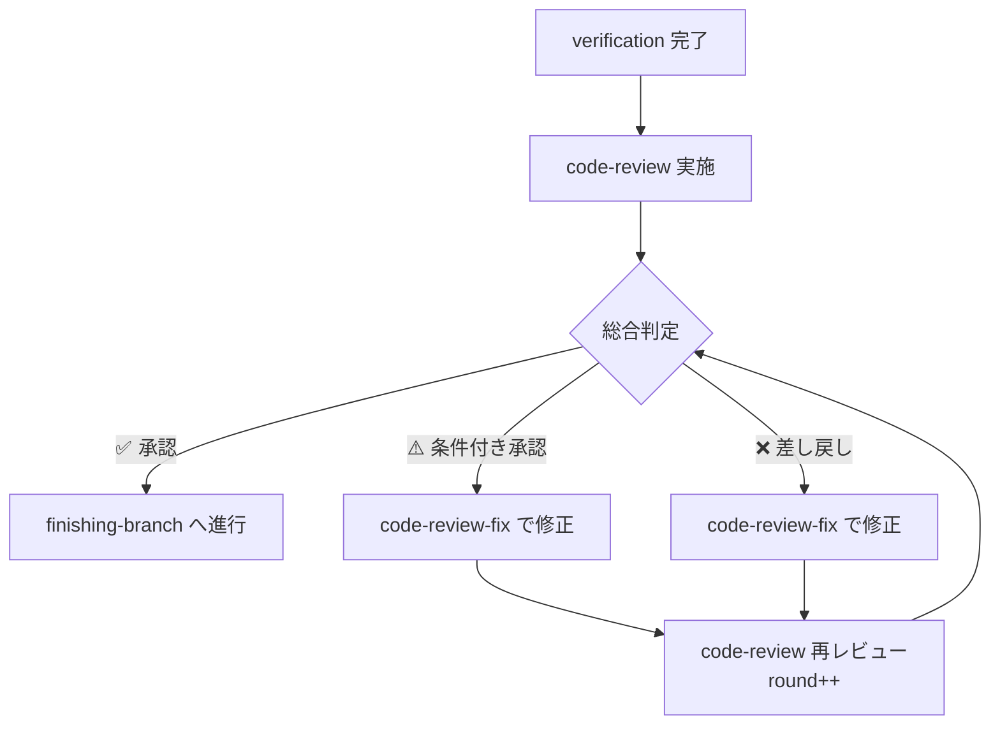
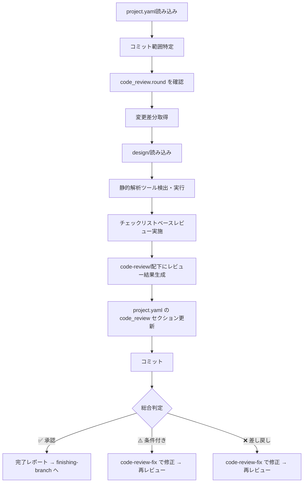

# コードレビュースキル（code-review）

project.yaml + 実装変更（コミット範囲/差分）を入力として、PRレビュー相当のチェックリストベースレビューを実施し、指摘と修正案を提示します。

> **SSOT**: `project.yaml` を全プロセスの Single Source of Truth として使用します。
> - 設計成果物の参照: `design` セクション
> - 実装状況の参照: `implement` セクション
> - 検証結果の参照: `verification` セクション
> - レビュー結果の出力: `code_review` セクション
>
> **責務の範囲**: このスキルは「指摘と修正案の提示」までが責務です。指摘に対する修正は `code-review-fix` スキルが担当します。

> [!CAUTION]
> **レビュー品質方針（ゼロトレランス）**
> - レビュアーは **不具合を出さないことに命が懸かっている** つもりで、些細な問題も見逃さず指摘すること
> - **Minor を含む全ての指摘は修正必須** — 「後で対応」「次フェーズで対応」は許容しない
> - コードスタイル違反・命名の不統一・ドキュメント不備など軽微に見える問題も、品質劣化の入口であるため必ず指摘する
> - 可能な限り品質向上に努め、「問題ない」と判断する前に本当に問題がないか再度確認する

## 概要

このスキルは以下を実現します：

1. **project.yaml** からチケット情報・対象リポジトリ・設計情報を取得
2. **コミット範囲**（BASE_SHA..HEAD_SHA）から変更差分を特定
3. **チェックリスト** に基づき8カテゴリのレビューを実施
4. **静的解析ツール** をプロジェクト内で利用可能な場合は実行
5. **docs/{target_repo}/code-review/** ディレクトリにレビュー結果を出力
6. **project.yaml の code_review セクション** を更新してコミット

> **Note**: 旧 `requesting-code-review` スキルの「SHAベースのレビュー依頼フレーム」機能はこのスキルに統合されました。

## レビューループ



指摘がなくなるまで code-review ⇄ code-review-fix を繰り返します。
各ラウンドの指摘内容は `project.yaml` の `code_review` セクションで追跡されます。

## 入力

### 1. project.yaml（必須・SSOT）

```yaml
setup:
  ticket_id: "PROJ-123"
  target_repositories:
    - name: "target-repo"

design:
  status: completed
  artifacts:
    - "docs/target-repo/design/01_implementation-approach.md"

implement:
  status: completed

code_review:                       # ← このスキルが更新
  status: in_progress
  round: 1
```

### 2. コミット範囲（必須）

レビュー対象の変更を特定するためのSHA範囲：

```bash
# main との差分全体をレビュー
BASE_SHA=$(git merge-base HEAD origin/main)
HEAD_SHA=$(git rev-parse HEAD)

# または project.yaml の implement セクションから取得
# implement.base_sha / implement.head_sha
```

### 3. design/（参照）

設計通りに実装されているかの検証に使用。

## レビューチェックリスト

8カテゴリのチェックリストでレビューを実施します。このチェックリストは `project.yaml` の `code_review.review_checklist` に記録され、各項目の結果が子要素として管理されます。

### 1. 設計準拠性（Design Conformance）

| ID    | チェック項目               | 説明                                                          |
| ----- | -------------------------- | ------------------------------------------------------------- |
| DC-01 | 設計成果物との整合性       | `docs/{target_repo}/design/` の設計通りに実装されているか     |
| DC-02 | API/インターフェース互換性 | 設計で定義されたAPI・インターフェースが正しく実装されているか |
| DC-03 | データ構造の一致           | 設計で定義されたデータ構造が正しく実装されているか            |
| DC-04 | 処理フローの一致           | 設計で定義された処理フロー通りの実装か                        |

### 2. 静的解析・フォーマット（Static Analysis & Formatting）

| ID    | チェック項目       | 説明                                                                                                              |
| ----- | ------------------ | ----------------------------------------------------------------------------------------------------------------- |
| SA-01 | .editorconfig 準拠 | インデント、改行コード、文字コード、末尾空白が `.editorconfig` に従っているか                                     |
| SA-02 | フォーマッター適用 | プロジェクトで設定されたフォーマッター（prettier / black / gofmt / rustfmt / dotnet format 等）が適用されているか |
| SA-03 | リンターエラーなし | プロジェクトで設定されたリンター（eslint / flake8 / golangci-lint / clippy 等）で新規エラーがないか               |
| SA-04 | 型チェック通過     | TypeScript（tsc）/ mypy / pyright 等の型チェッカーが通過するか                                                    |

**実行方法:**
```bash
# プロジェクト内のツール検出と実行
# .editorconfig チェック
command -v editorconfig-checker && editorconfig-checker

# フォーマッター（検出して実行）
test -f package.json && npx prettier --check .
test -f pyproject.toml && python -m black --check .
command -v gofmt && gofmt -l .

# リンター（検出して実行）
test -f .eslintrc* && npx eslint .
test -f .flake8 && python -m flake8
test -f .golangci.yml && golangci-lint run

# 型チェック
test -f tsconfig.json && npx tsc --noEmit
test -f mypy.ini && python -m mypy .
```

### 3. 言語別ベストプラクティス（Language-Specific Best Practices）

| ID    | チェック項目          | 説明                                                 |
| ----- | --------------------- | ---------------------------------------------------- |
| LP-01 | アンチパターン不在    | 各言語固有のアンチパターンがないか（下記参照）       |
| LP-02 | エラーハンドリング    | 適切な例外処理・エラーハンドリングが実装されているか |
| LP-03 | null/undefined 安全性 | null参照・undefined アクセスの適切な処理             |
| LP-04 | リソース管理          | ファイル・DB接続・ネットワーク接続の適切なクローズ   |
| LP-05 | 命名規則              | 言語・プロジェクトの命名規則に従っているか           |

**言語別チェックポイント:**

| 言語                      | 主なチェック観点                                                                          |
| ------------------------- | ----------------------------------------------------------------------------------------- |
| **JavaScript/TypeScript** | `any` 型の乱用、未処理の Promise、`==` vs `===`、メモリリーク（イベントリスナー解除漏れ） |
| **Python**                | 可変デフォルト引数、bare except、グローバル変数の乱用、f-string vs format の統一          |
| **Go**                    | エラーの握りつぶし、goroutine リーク、defer の誤用、interface{} の乱用                    |
| **Java/Kotlin**           | null安全性、リソース try-with-resources、過剰な継承、不適切な例外キャッチ                 |
| **Rust**                  | unwrap() の乱用、不要な clone()、ライフタイムの不適切な使用                               |
| **C#**                    | IDisposable の未実装、async/await の不適切な使用、LINQ の過剰使用                         |

### 4. セキュリティ（Security）

| ID    | チェック項目                 | 説明                                                     |
| ----- | ---------------------------- | -------------------------------------------------------- |
| SE-01 | シークレット漏洩             | API キー、パスワード、トークン等のハードコードがないか   |
| SE-02 | 入力バリデーション           | ユーザー入力の適切なバリデーション・サニタイズ           |
| SE-03 | 出力エンコーディング         | XSS 対策（HTMLエスケープ等）が適切に実装されているか     |
| SE-04 | SQLインジェクション対策      | パラメータ化クエリの使用、文字列連結でのSQL構築がないか  |
| SE-05 | コマンドインジェクション対策 | シェルコマンドへのユーザー入力の安全な処理               |
| SE-06 | 認証・認可                   | 認証チェックの漏れ、権限検証の不足がないか               |
| SE-07 | 暗号化・ハッシュ             | 安全なアルゴリズムの使用（MD5/SHA1の非推奨用途がないか） |
| SE-08 | 依存パッケージ脆弱性         | 既知の脆弱性を持つ依存パッケージがないか                 |

**実行方法:**
```bash
# シークレット検出
command -v gitleaks && gitleaks detect --no-git
command -v trufflehog && trufflehog filesystem .

# 依存パッケージ脆弱性
test -f package-lock.json && npm audit
test -f requirements.txt && pip-audit -r requirements.txt 2>/dev/null
test -f go.sum && govulncheck ./... 2>/dev/null
```

### 5. テスト・CI（Tests & CI）

| ID    | チェック項目     | 説明                                                               |
| ----- | ---------------- | ------------------------------------------------------------------ |
| TC-01 | テスト追加/更新  | 新規・変更された機能に対してテストが追加/更新されているか          |
| TC-02 | テストカバレッジ | 変更箇所のテストカバレッジが十分か                                 |
| TC-03 | テスト品質       | テストが実装の詳細でなく振る舞いを検証しているか                   |
| TC-04 | テスト全通過     | 既存テスト含め全テストが通過するか                                 |
| TC-05 | CI設定整合性     | CI/CD パイプラインが新しいテスト・ビルドステップをカバーしているか |

**実行方法:**
```bash
# テスト実行（プロジェクトに応じて）
test -f package.json && npm test
test -f pytest.ini && python -m pytest
test -f go.mod && go test ./...
test -f Makefile && make test
```

### 6. パフォーマンス（Performance）

| ID    | チェック項目           | 説明                                                   |
| ----- | ---------------------- | ------------------------------------------------------ |
| PF-01 | N+1 クエリ             | ループ内でのDB/APIクエリが発生していないか             |
| PF-02 | 不要な処理             | 不要なループ・重複計算・過剰なオブジェクト生成がないか |
| PF-03 | メモリ・リソースリーク | メモリリーク、ファイルディスクリプタリーク等がないか   |
| PF-04 | アルゴリズム効率       | 不適切な計算量（O(n²) で O(n) が可能等）がないか       |
| PF-05 | キャッシュ活用         | 繰り返しアクセスされるデータの適切なキャッシュ         |

### 7. ドキュメント（Documentation）

| ID    | チェック項目       | 説明                                                                            |
| ----- | ------------------ | ------------------------------------------------------------------------------- |
| DO-01 | API ドキュメント   | 公開API・インターフェースにドキュメント（JSDoc / docstring / GoDoc 等）があるか |
| DO-02 | README 更新        | 機能追加時にREADMEが更新されているか                                            |
| DO-03 | CHANGELOG 更新     | 変更履歴が記録されているか（CHANGELOG がある場合）                              |
| DO-04 | インラインコメント | 複雑なロジックに適切なコメントがあるか（過剰コメントでないか）                  |

### 8. Git 作法（Git Hygiene）

| ID    | チェック項目       | 説明                                                                               |
| ----- | ------------------ | ---------------------------------------------------------------------------------- |
| GH-01 | コミット粒度       | 論理的な単位でコミットが分割されているか                                           |
| GH-02 | コミットメッセージ | 明確で規約に従ったコミットメッセージか                                             |
| GH-03 | デバッグコード残留 | `console.log` / `print` / `debugger` / `TODO` 等のデバッグ用コードが残っていないか |
| GH-04 | 不要ファイル       | ビルド成果物・一時ファイル・IDE設定等が含まれていないか                            |
| GH-05 | .gitignore 整合性  | `.gitignore` が新規ファイルタイプをカバーしているか                                |

## 処理フロー



## 再レビュー時の処理

再レビュー（round > 1）では以下の追加手順を実行します：

1. **前ラウンドの指摘確認**: `code_review.issues` で `status: open` の指摘を優先チェック
2. **解決確認**: 対応済み指摘を `status: resolved`、`resolved_in_round: {current_round}` に更新
3. **新規指摘追加**: 新たに発見された問題を新しい `id` で追加
4. **チェックリスト再実行**: 静的解析ツールを再実行し結果を更新

## 出力ファイル構成

レビュー結果は `docs/{target_repository}/code-review/` に出力：

```
docs/
└── {target_repository}/
    └── code-review/
        ├── round-01.md                    # 第1ラウンド レビュー結果
        ├── round-02.md                    # 第2ラウンド レビュー結果（再レビュー時）
        └── ...
```

### ラウンドレポート構成（round-NN.md）

各ラウンドのレポートには以下を含みます：

```markdown
# レビュー結果 - Round {N}

## レビュー情報
- チケット: {ticket_id}
- リポジトリ: {target_repo}
- ベースSHA: {base_sha}
- ヘッドSHA: {head_sha}
- レビュー日時: {timestamp}

## チェックリスト結果

### 1. 設計準拠性
- [x] DC-01: 設計成果物との整合性 — ✅ OK
- [ ] DC-02: API/インターフェース互換性 — 🟠 指摘あり（CR-001）
...

### 2. 静的解析・フォーマット
- [x] SA-01: .editorconfig 準拠 — ✅ OK
...

（8カテゴリ全て）

## 指摘事項

### 🔴 Critical
（なし）

### 🟠 Major
- **CR-001**: API/インターフェース互換性
  - カテゴリ: 設計準拠性
  - 説明: {問題の詳細}
  - 該当ファイル: {file_path}:{line_number}
  - 修正提案: {具体的な修正内容}

### 🟡 Minor
...

### 🔵 Info
...

## 静的解析ツール実行結果
- editorconfig-checker: ✅ PASS
- prettier: ⚠️ 2 files need formatting
- eslint: ✅ PASS
- tsc: ✅ PASS
- npm audit: ✅ 0 vulnerabilities
- npm test: ✅ All tests passed

## 総合判定
- **判定**: {✅ 承認 / ⚠️ 条件付き承認 / ❌ 差し戻し}
- **理由**: {判定理由}

## 前ラウンドからの変化（round > 1 の場合）
- 解決済み: {count}件
- 新規指摘: {count}件
- 未解決: {count}件
```

## レビュー判定基準

### 重大度レベル

| レベル     | 説明                                             | 対応                                                   |
| ---------- | ------------------------------------------------ | ------------------------------------------------------ |
| 🔴 Critical | 本番障害・セキュリティ脆弱性・データ損失のリスク | 差し戻し：即座に修正が必要                             |
| 🟠 Major    | バグ・設計違反・品質上の重大な問題               | 条件付き承認：マージ前に修正が必要                     |
| 🟡 Minor    | コードスタイル・軽微な改善点                     | 条件付き承認：マージ前に修正が必要                     |
| 🔵 Info     | 情報・提案・ベストプラクティスの紹介             | 承認：ただし改善提案として記録し、可能な限り対応を推奨 |

### 総合判定

| 判定           | 条件                              | 次のステップ                   |
| -------------- | --------------------------------- | ------------------------------ |
| ✅ 承認         | Critical/Major/Minorの指摘なし    | finishing-branchへ進行         |
| ⚠️ 条件付き承認 | Minor以上の指摘あり、Criticalなし | 指摘事項を修正後、再レビュー   |
| ❌ 差し戻し     | Criticalの指摘あり                | 重大な修正を実施後、再レビュー |

## project.yaml 更新内容

`project.yaml` の `code_review` セクションを更新：

```yaml
code_review:
  status: approved                  # in_progress / approved / conditional / rejected
  round: 2                          # ラウンド番号
  base_sha: "abc1234"
  head_sha: "def5678"
  started_at: "2025-01-15T12:00:00+09:00"
  completed_at: "2025-01-15T15:00:00+09:00"
  latest_verdict: "承認"
  summary: "全指摘解決済み。Critical/Major/Minor指摘なし。"
  review_checklist:
    design_conformance:
      - id: DC-01
        name: "設計成果物との整合性"
        result: pass                 # pass / fail / warn / skip
      - id: DC-02
        name: "API/インターフェース互換性"
        result: pass
      - id: DC-03
        name: "データ構造の一致"
        result: pass
      - id: DC-04
        name: "処理フローの一致"
        result: pass
    static_analysis:
      - id: SA-01
        name: ".editorconfig 準拠"
        result: pass
      - id: SA-02
        name: "フォーマッター適用"
        result: warn
        detail: "prettier: 2 files need formatting"
      - id: SA-03
        name: "リンターエラーなし"
        result: pass
      - id: SA-04
        name: "型チェック通過"
        result: pass
    language_best_practices:
      - id: LP-01
        name: "アンチパターン不在"
        result: pass
      - id: LP-02
        name: "エラーハンドリング"
        result: pass
      - id: LP-03
        name: "null/undefined 安全性"
        result: pass
      - id: LP-04
        name: "リソース管理"
        result: pass
      - id: LP-05
        name: "命名規則"
        result: pass
    security:
      - id: SE-01
        name: "シークレット漏洩"
        result: pass
      - id: SE-02
        name: "入力バリデーション"
        result: pass
      - id: SE-03
        name: "出力エンコーディング"
        result: pass
      - id: SE-04
        name: "SQLインジェクション対策"
        result: skip
        detail: "該当なし"
      - id: SE-05
        name: "コマンドインジェクション対策"
        result: skip
        detail: "該当なし"
      - id: SE-06
        name: "認証・認可"
        result: pass
      - id: SE-07
        name: "暗号化・ハッシュ"
        result: skip
        detail: "該当なし"
      - id: SE-08
        name: "依存パッケージ脆弱性"
        result: pass
    tests_ci:
      - id: TC-01
        name: "テスト追加/更新"
        result: pass
      - id: TC-02
        name: "テストカバレッジ"
        result: pass
      - id: TC-03
        name: "テスト品質"
        result: pass
      - id: TC-04
        name: "テスト全通過"
        result: pass
      - id: TC-05
        name: "CI設定整合性"
        result: pass
    performance:
      - id: PF-01
        name: "N+1 クエリ"
        result: pass
      - id: PF-02
        name: "不要な処理"
        result: pass
      - id: PF-03
        name: "メモリ・リソースリーク"
        result: pass
      - id: PF-04
        name: "アルゴリズム効率"
        result: pass
      - id: PF-05
        name: "キャッシュ活用"
        result: skip
        detail: "該当なし"
    documentation:
      - id: DO-01
        name: "API ドキュメント"
        result: pass
      - id: DO-02
        name: "README 更新"
        result: pass
      - id: DO-03
        name: "CHANGELOG 更新"
        result: skip
        detail: "CHANGELOG なし"
      - id: DO-04
        name: "インラインコメント"
        result: pass
    git_hygiene:
      - id: GH-01
        name: "コミット粒度"
        result: pass
      - id: GH-02
        name: "コミットメッセージ"
        result: pass
      - id: GH-03
        name: "デバッグコード残留"
        result: warn
        detail: "console.log 1件検出"
      - id: GH-04
        name: "不要ファイル"
        result: pass
      - id: GH-05
        name: ".gitignore 整合性"
        result: pass
  issues:
    - id: CR-001
      severity: minor
      category: "Git作法"
      checklist_id: GH-03
      description: "src/utils.ts:42 にデバッグ用 console.log が残留"
      file: "src/utils.ts"
      line: 42
      suggestion: "console.log を削除するか、適切なロガーに置換"
      status: resolved
      resolved_in_round: 2
    - id: CR-002
      severity: minor
      category: "静的解析"
      checklist_id: SA-02
      description: "prettier のフォーマットが未適用のファイルが2件"
      suggestion: "npx prettier --write で適用"
      status: resolved
      resolved_in_round: 2
  rounds:
    - round: 1
      result: conditional
      timestamp: "2025-01-15T12:30:00+09:00"
      critical_count: 0
      major_count: 0
      minor_count: 2
      info_count: 0
      new_issues: ["CR-001", "CR-002"]
    - round: 2
      result: approved
      timestamp: "2025-01-15T15:00:00+09:00"
      critical_count: 0
      major_count: 0
      minor_count: 0
      info_count: 0
      resolved_issues: ["CR-001", "CR-002"]
  artifacts:
    - "docs/{target_repo}/code-review/round-01.md"
    - "docs/{target_repo}/code-review/round-02.md"
```

### ラウンド管理ルール

- **初回レビュー**: `round: 1` で開始
- **再レビュー**: 前ラウンドの `round` をインクリメント
- **issues**: 全ラウンドの指摘を累積保持（`resolved_in_round` で解決ラウンドを追跡）
- **review_checklist**: 最新ラウンドの結果で上書き（各チェック項目の `result` を更新）
- **rounds**: 各ラウンドの結果サマリーを累積記録
- **status 遷移**: `in_progress` → `rejected` / `conditional` / `approved`

## 実行手順

### 1. project.yaml読み込み

```bash
test -f "project.yaml" || { echo "Error: project.yaml not found"; exit 1; }
```

`project.yaml` から情報を yq で取得:

```bash
# メタ情報
TICKET_ID=$(yq '.meta.ticket_id' project.yaml)
TARGET_REPO=$(yq '.meta.target_repo' project.yaml)

# 設計成果物のパス（設計準拠性チェック用）
yq '.design.artifacts' project.yaml

# コミット範囲（implement セクションから）
BASE_SHA=$(yq '.implement.base_sha // ""' project.yaml)
HEAD_SHA=$(yq '.implement.head_sha // ""' project.yaml)

# 再レビューの場合: 前回のラウンドと指摘を取得
CURRENT_ROUND=$(yq '.code_review.round // 0' project.yaml)
yq '.code_review.issues[] | select(.status == "open")' project.yaml
```

### 2. コミット範囲の特定

```bash
# project.yaml から取得、またはgitから自動検出
if [ -n "$IMPLEMENT_BASE_SHA" ]; then
    BASE_SHA="$IMPLEMENT_BASE_SHA"
else
    BASE_SHA=$(git merge-base HEAD origin/main)
fi
HEAD_SHA=$(git rev-parse HEAD)

# 変更ファイル一覧
git diff --name-only "$BASE_SHA..$HEAD_SHA"

# 変更統計
git diff --stat "$BASE_SHA..$HEAD_SHA"
```

### 3. 静的解析ツールの検出と実行

プロジェクト内で利用可能なツールを検出し実行します。

**検出対象:**
- `.editorconfig` → editorconfig-checker
- `package.json` → prettier / eslint / tsc / npm audit / npm test
- `pyproject.toml` / `setup.py` → black / flake8 / mypy / pytest / pip-audit
- `go.mod` → gofmt / golangci-lint / go test / govulncheck
- `Cargo.toml` → rustfmt / clippy / cargo test / cargo audit
- `*.csproj` / `*.sln` → dotnet format / dotnet build / dotnet test
- `Makefile` → make lint / make test
- `.github/workflows/` → CI設定の確認

**実行結果は `project.yaml` の `review_checklist` 各項目の `result` / `detail` に記録します。**

### 4. チェックリストベースレビュー

8カテゴリのチェック項目について、差分内容・静的解析結果を基にレビューを実施：

1. **設計準拠性**: design/ の各ドキュメントと実装の対応を検証
2. **静的解析・フォーマット**: ツール実行結果の確認
3. **言語別ベストプラクティス**: 変更ファイルの言語に応じたアンチパターン検出
4. **セキュリティ**: セキュリティチェックリストに基づく検証
5. **テスト・CI**: テスト実行結果・カバレッジの確認
6. **パフォーマンス**: 差分内のパフォーマンス問題検出
7. **ドキュメント**: ドキュメント更新の確認
8. **Git作法**: コミット履歴・デバッグコード残留の確認

**再レビュー時（round > 1）の追加手順:**
- 前ラウンドの `code_review.issues` で `status: open` の指摘を優先確認
- 対応済み指摘を `status: resolved`、`resolved_in_round: {current_round}` に更新
- 新規指摘は新しい `id` で追加

### 5. レビュー結果ファイル生成

```bash
for repo in "${target_repositories[@]}"; do
    REVIEW_DIR="docs/${repo}/review"
    mkdir -p "$REVIEW_DIR"
done
```

`docs/{target_repo}/code-review/round-{NN}.md` にラウンドレポートを生成。

### 6. project.yaml 更新

```bash
# code_review セクションの初期化（ヘルパー使用）
./scripts/project-yaml-helper.sh init-section code_review

# ステータス・ラウンド・タイムスタンプ
yq -i '.code_review.status = "approved"' project.yaml  # approved / conditional / rejected
yq -i ".code_review.round = $((CURRENT_ROUND + 1))" project.yaml
yq -i ".code_review.base_sha = \"${BASE_SHA}\"" project.yaml
yq -i ".code_review.head_sha = \"${HEAD_SHA}\"" project.yaml
yq -i ".code_review.completed_at = \"$(date -Iseconds)\"" project.yaml
yq -i '.code_review.latest_verdict = "承認"' project.yaml
yq -i '.code_review.summary = "全指摘解決済み。Critical/Major/Minor指摘なし。"' project.yaml

# 指摘事項の追加（存在する場合）
yq -i '.code_review.issues += [{"id": "CR-001", "severity": "minor", "status": "open", "description": "指摘内容"}]' project.yaml

# 指摘の解決更新（再レビュー時）
yq -i '(.code_review.issues[] | select(.id == "CR-001")).status = "resolved"' project.yaml
yq -i "(.code_review.issues[] | select(.id == \"CR-001\")).resolved_in_round = $((CURRENT_ROUND + 1))" project.yaml

# 成果物パス
yq -i ".code_review.artifacts += [\"docs/${TARGET_REPO}/code-review/round-$(printf '%02d' $((CURRENT_ROUND + 1))).md\"]" project.yaml

# meta.updated_at を更新
yq -i ".meta.updated_at = \"$(date -Iseconds)\"" project.yaml
```

### 7. コミット

```bash
git add docs/ project.yaml
git commit -m "docs: {ticket_id} 実装レビュー結果を追加 (round {round})

- docs/{target_repo}/code-review/round-{NN}.md にレビュー結果を出力
- project.yaml の code_review セクションを更新
- チェックリスト: {pass_count}/{total_count} 通過
- 指摘: Critical {c}件 / Major {m}件 / Minor {mi}件 / Info {i}件"
```

## 完了レポート

```markdown
## 実装レビュー完了 ✅

### レビュー対象
- チケット: {ticket_id}
- リポジトリ: {target_repositories}
- コミット範囲: {base_sha}..{head_sha}
- ラウンド: {round}

### 総合判定
- **判定**: {✅ 承認 / ⚠️ 条件付き承認 / ❌ 差し戻し}

### チェックリスト結果
- ✅ Pass: {count}項目
- ⚠️ Warn: {count}項目
- ❌ Fail: {count}項目
- ⏭️ Skip: {count}項目

### 指摘事項サマリー
- 🔴 Critical: {count}件
- 🟠 Major: {count}件
- 🟡 Minor: {count}件
- 🔵 Info: {count}件

### 静的解析ツール実行結果
{ツール名: 結果}

### 生成されたファイル
- docs/{target_repo}/code-review/round-{NN}.md

### 次のステップ
1. ✅ 承認の場合: finishing-branchスキルへ進行
2. ⚠️ 条件付き承認の場合: code-review-fixスキルで修正後、再レビュー
3. ❌ 差し戻しの場合: code-review-fixスキルで修正後、再レビュー
```

## エラーハンドリング

### project.yamlが見つからない

```
エラー: project.yamlが見つかりません

brainstormingスキルでproject.yamlを生成してください。
```

### 実装が完了していない

```
エラー: 実装が完了していません
project.yaml の implement.status が completed ではありません。

implementスキルで実装を完了してください。
```

### コミット範囲が特定できない

```
警告: コミット範囲が自動検出できません。
手動でBASE_SHAとHEAD_SHAを指定してください。

例: BASE_SHA=$(git merge-base HEAD origin/main)
    HEAD_SHA=$(git rev-parse HEAD)
```

## 注意事項

- レビューは `target_repositories` の変更のみ対象
- 静的解析ツールはプロジェクト内で設定されている場合のみ実行（未設定の場合はスキップ）
- チェックリスト項目で該当しないものは `result: skip` として記録
- レビューは客観的・再現可能な基準に基づいて実施し、主観的な判断は避ける
- ツール実行結果と手動レビューの両方を組み合わせて判定する
- **再帰ループ**: 差し戻し/条件付き承認 → code-review-fix で修正 → code-review 再レビューを繰り返す

## 関連スキル

- 前提スキル: `implement` - 実装（code-reviewの対象を生成）
- 前提スキル: `verification` - 検証（テスト・ビルド・リント通過の確認）
- 後続スキル: `code-review-fix` - レビュー指摘の修正対応
- 後続スキル: `finishing-branch` - ブランチ完了（承認後に進行）
- 関連スキル: `review-design` / `review-plan` - 設計/計画フェーズレビュー

## SSOT参照

| project.yaml フィールド        | 用途                               |
| ------------------------------ | ---------------------------------- |
| `design.artifacts`             | 設計準拠性の検証基準               |
| `implement.base_sha`           | レビュー対象コミット範囲の開始点   |
| `implement.head_sha`           | レビュー対象コミット範囲の終了点   |
| `code_review` (出力)           | レビュー結果・チェックリスト・指摘 |
| `code_review.review_checklist` | チェック項目と結果の構造化記録     |
| `code_review.issues`           | 指摘事項の追跡（累積）             |
| `code_review.rounds`           | ラウンドごとの結果サマリー         |

## 典型的なワークフロー

```
[project.yaml読み込み] --> パースしてバリデーション
        |
[code_review.round確認] --> 再レビューの場合、前回指摘を読み込み
        |
[コミット範囲特定] --> BASE_SHA..HEAD_SHA
        |
[変更差分取得] --> git diff / git log
        |
[design/読み込み] --> 設計成果物の読み込み（設計準拠性チェック用）
        |
[静的解析ツール検出・実行] --> 利用可能なツールを実行
        |
[チェックリストベースレビュー] --> 8カテゴリ × 各チェック項目
        |
[code-review/round-NN.md生成] --> ラウンドレポートを生成
        |
[project.yaml更新] --> code_review セクションを更新
        |
[コミット] --> 変更をコミット
        |
[判定分岐] --> ✅承認→finishing-branch / ⚠️条件付き→code-review-fix→再レビュー / ❌差し戻し→code-review-fix→再レビュー
```