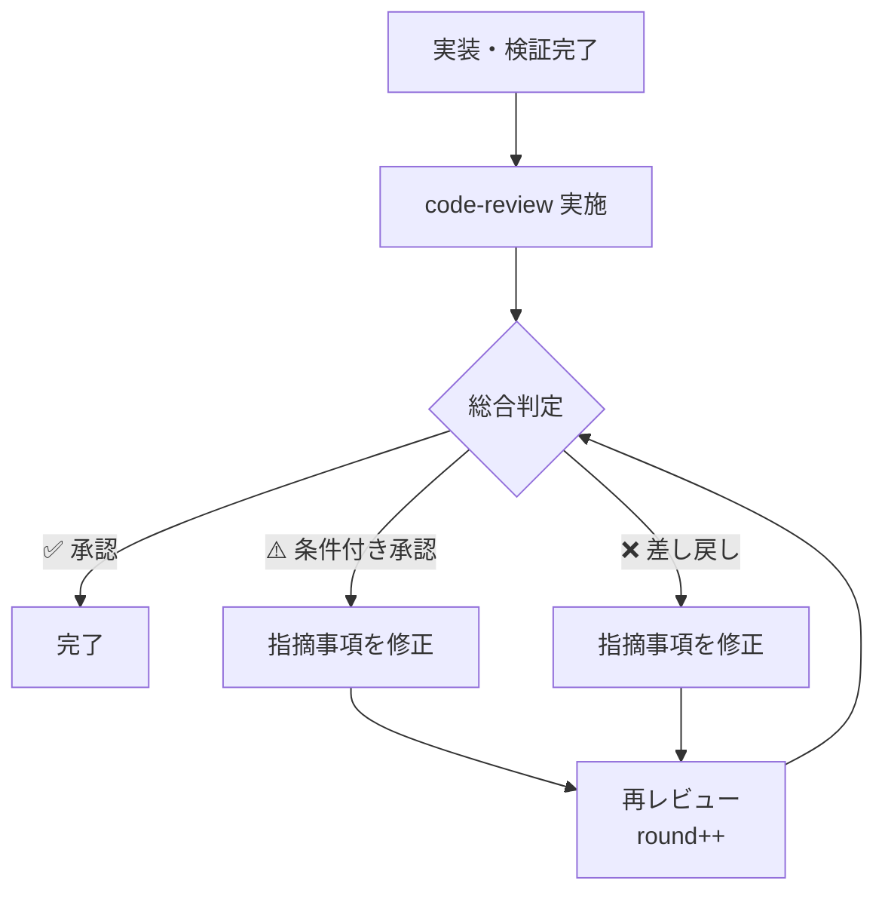
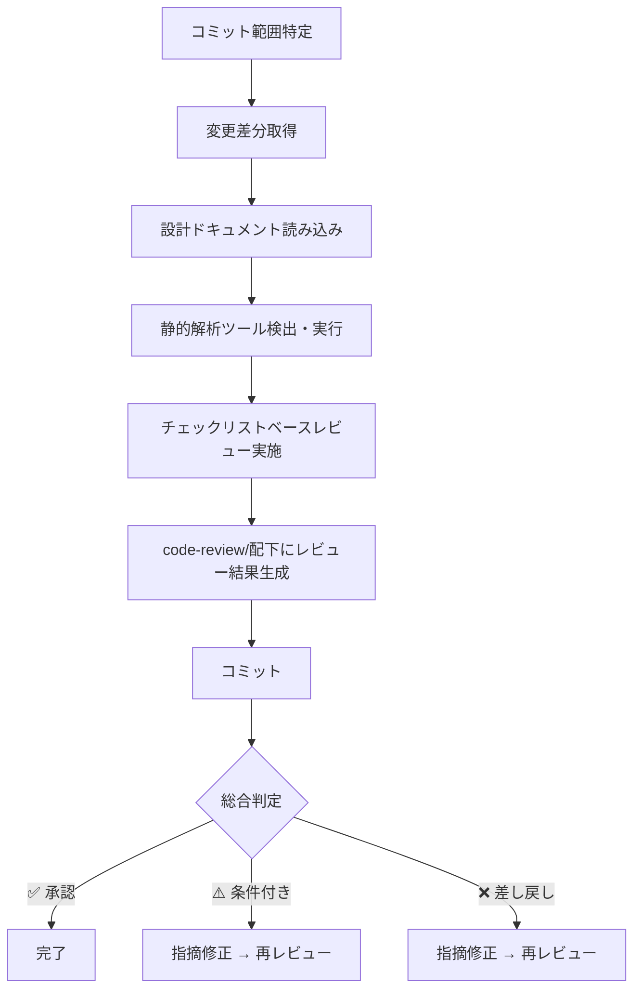

# コードレビュースキル（code-review）

ブランチ差分・設計ドキュメント・レビュー基準を入力として、PRレビュー相当のチェックリストベースレビューを実施し、指摘と修正案を提示します。

> **責務の範囲**: このスキルは「指摘と修正案の提示」までが責務です。指摘に対する修正は別途対応してください。

> [!CAUTION]
> **レビュー品質方針（ゼロトレランス）**
> - レビュアーは **不具合を出さないことに命が懸かっている** つもりで、些細な問題も見逃さず指摘すること
> - **Minor を含む全ての指摘は修正必須** — 「後で対応」「次フェーズで対応」は許容しない
> - コードスタイル違反・命名の不統一・ドキュメント不備など軽微に見える問題も、品質劣化の入口であるため必ず指摘する
> - 可能な限り品質向上に努め、「問題ない」と判断する前に本当に問題がないか再度確認する

## 概要

このスキルは以下を実現します：

1. **ブランチ差分**（BASE_SHA..HEAD_SHA）から変更差分を特定
2. **設計ドキュメント**（提供された場合）を参照し設計準拠性を検証
3. **チェックリスト** に基づき8カテゴリのレビューを実施
4. **静的解析ツール** をプロジェクト内で利用可能な場合は実行
5. **docs/{target}/code-review/** ディレクトリにレビュー結果を出力

## レビューループ


```mermaid
flowchart TD
    A[実装・検証完了] --> B[code-review 実施]
    B --> C{総合判定}
    C -->|✅ 承認| D[完了]
    C -->|⚠️ 条件付き承認| E[指摘事項を修正]
    C -->|❌ 差し戻し| F[指摘事項を修正]
    E --> G[再レビュー\nround++]
    F --> G
    G --> C
```

指摘がなくなるまでレビュー ⇄ 修正を繰り返します。
各ラウンドの指摘内容はレビュー結果ファイルで追跡されます。

## 入力

### 1. ブランチ差分（必須）

レビュー対象の変更を特定するためのSHA範囲：

```bash
# main との差分全体をレビュー
BASE_SHA=$(git merge-base HEAD origin/main)
HEAD_SHA=$(git rev-parse HEAD)
```

### 2. 設計ドキュメント（推奨）

設計通りに実装されているかの検証に使用します。`docs/{target}/design/` 配下のドキュメント、またはレビュー依頼者から提供された設計資料を参照します。

### 3. レビュー基準（任意）

プロジェクト固有のレビュー基準やコーディング規約が提供された場合、チェックリストに加えて追加の観点として使用します。

## レビューチェックリスト

8カテゴリのチェックリストでレビューを実施します。各項目の結果はラウンドレポートに記録されます。

### 1. 設計準拠性（Design Conformance）

| ID    | チェック項目               | 説明                                                          |
| ----- | -------------------------- | ------------------------------------------------------------- |
| DC-01 | 設計成果物との整合性       | 設計ドキュメントの通りに実装されているか                      |
| DC-02 | API/インターフェース互換性 | 設計で定義されたAPI・インターフェースが正しく実装されているか |
| DC-03 | データ構造の一致           | 設計で定義されたデータ構造が正しく実装されているか            |
| DC-04 | 処理フローの一致           | 設計で定義された処理フロー通りの実装か                        |

### 2. 静的解析・フォーマット（Static Analysis & Formatting）

| ID    | チェック項目       | 説明                                                                                                              |
| ----- | ------------------ | ----------------------------------------------------------------------------------------------------------------- |
| SA-01 | .editorconfig 準拠 | インデント、改行コード、文字コード、末尾空白が `.editorconfig` に従っているか                                     |
| SA-02 | フォーマッター適用 | プロジェクトで設定されたフォーマッター（prettier / black / gofmt / rustfmt / dotnet format 等）が適用されているか |
| SA-03 | リンターエラーなし | プロジェクトで設定されたリンター（eslint / flake8 / golangci-lint / clippy 等）で新規エラーがないか               |
| SA-04 | 型チェック通過     | TypeScript（tsc）/ mypy / pyright 等の型チェッカーが通過するか                                                    |

**実行方法:**
```bash
# プロジェクト内のツール検出と実行
# .editorconfig チェック
command -v editorconfig-checker && editorconfig-checker

# フォーマッター（検出して実行）
test -f package.json && npx prettier --check .
test -f pyproject.toml && python -m black --check .
command -v gofmt && gofmt -l .

# リンター（検出して実行）
test -f .eslintrc* && npx eslint .
test -f .flake8 && python -m flake8
test -f .golangci.yml && golangci-lint run

# 型チェック
test -f tsconfig.json && npx tsc --noEmit
test -f mypy.ini && python -m mypy .
```

### 3. 言語別ベストプラクティス（Language-Specific Best Practices）

| ID    | チェック項目          | 説明                                                 |
| ----- | --------------------- | ---------------------------------------------------- |
| LP-01 | アンチパターン不在    | 各言語固有のアンチパターンがないか（下記参照）       |
| LP-02 | エラーハンドリング    | 適切な例外処理・エラーハンドリングが実装されているか |
| LP-03 | null/undefined 安全性 | null参照・undefined アクセスの適切な処理             |
| LP-04 | リソース管理          | ファイル・DB接続・ネットワーク接続の適切なクローズ   |
| LP-05 | 命名規則              | 言語・プロジェクトの命名規則に従っているか           |

**言語別チェックポイント:**

| 言語                      | 主なチェック観点                                                                          |
| ------------------------- | ----------------------------------------------------------------------------------------- |
| **JavaScript/TypeScript** | `any` 型の乱用、未処理の Promise、`==` vs `===`、メモリリーク（イベントリスナー解除漏れ） |
| **Python**                | 可変デフォルト引数、bare except、グローバル変数の乱用、f-string vs format の統一          |
| **Go**                    | エラーの握りつぶし、goroutine リーク、defer の誤用、interface{} の乱用                    |
| **Java/Kotlin**           | null安全性、リソース try-with-resources、過剰な継承、不適切な例外キャッチ                 |
| **Rust**                  | unwrap() の乱用、不要な clone()、ライフタイムの不適切な使用                               |
| **C#**                    | IDisposable の未実装、async/await の不適切な使用、LINQ の過剰使用                         |

### 4. セキュリティ（Security）

| ID    | チェック項目                 | 説明                                                     |
| ----- | ---------------------------- | -------------------------------------------------------- |
| SE-01 | シークレット漏洩             | API キー、パスワード、トークン等のハードコードがないか   |
| SE-02 | 入力バリデーション           | ユーザー入力の適切なバリデーション・サニタイズ           |
| SE-03 | 出力エンコーディング         | XSS 対策（HTMLエスケープ等）が適切に実装されているか     |
| SE-04 | SQLインジェクション対策      | パラメータ化クエリの使用、文字列連結でのSQL構築がないか  |
| SE-05 | コマンドインジェクション対策 | シェルコマンドへのユーザー入力の安全な処理               |
| SE-06 | 認証・認可                   | 認証チェックの漏れ、権限検証の不足がないか               |
| SE-07 | 暗号化・ハッシュ             | 安全なアルゴリズムの使用（MD5/SHA1の非推奨用途がないか） |
| SE-08 | 依存パッケージ脆弱性         | 既知の脆弱性を持つ依存パッケージがないか                 |

**実行方法:**
```bash
# シークレット検出
command -v gitleaks && gitleaks detect --no-git
command -v trufflehog && trufflehog filesystem .

# 依存パッケージ脆弱性
test -f package-lock.json && npm audit
test -f requirements.txt && pip-audit -r requirements.txt 2>/dev/null
test -f go.sum && govulncheck ./... 2>/dev/null
```

### 5. テスト・CI（Tests & CI）

| ID    | チェック項目     | 説明                                                               |
| ----- | ---------------- | ------------------------------------------------------------------ |
| TC-01 | テスト追加/更新  | 新規・変更された機能に対してテストが追加/更新されているか          |
| TC-02 | テストカバレッジ | 変更箇所のテストカバレッジが十分か                                 |
| TC-03 | テスト品質       | テストが実装の詳細でなく振る舞いを検証しているか                   |
| TC-04 | テスト全通過     | 既存テスト含め全テストが通過するか                                 |
| TC-05 | CI設定整合性     | CI/CD パイプラインが新しいテスト・ビルドステップをカバーしているか |

**実行方法:**
```bash
# テスト実行（プロジェクトに応じて）
test -f package.json && npm test
test -f pytest.ini && python -m pytest
test -f go.mod && go test ./...
test -f Makefile && make test
```

### 6. パフォーマンス（Performance）

| ID    | チェック項目           | 説明                                                   |
| ----- | ---------------------- | ------------------------------------------------------ |
| PF-01 | N+1 クエリ             | ループ内でのDB/APIクエリが発生していないか             |
| PF-02 | 不要な処理             | 不要なループ・重複計算・過剰なオブジェクト生成がないか |
| PF-03 | メモリ・リソースリーク | メモリリーク、ファイルディスクリプタリーク等がないか   |
| PF-04 | アルゴリズム効率       | 不適切な計算量（O(n²) で O(n) が可能等）がないか       |
| PF-05 | キャッシュ活用         | 繰り返しアクセスされるデータの適切なキャッシュ         |

### 7. ドキュメント（Documentation）

| ID    | チェック項目       | 説明                                                                            |
| ----- | ------------------ | ------------------------------------------------------------------------------- |
| DO-01 | API ドキュメント   | 公開API・インターフェースにドキュメント（JSDoc / docstring / GoDoc 等）があるか |
| DO-02 | README 更新        | 機能追加時にREADMEが更新されているか                                            |
| DO-03 | CHANGELOG 更新     | 変更履歴が記録されているか（CHANGELOG がある場合）                              |
| DO-04 | インラインコメント | 複雑なロジックに適切なコメントがあるか（過剰コメントでないか）                  |

### 8. Git 作法（Git Hygiene）

| ID    | チェック項目       | 説明                                                                               |
| ----- | ------------------ | ---------------------------------------------------------------------------------- |
| GH-01 | コミット粒度       | 論理的な単位でコミットが分割されているか                                           |
| GH-02 | コミットメッセージ | 明確で規約に従ったコミットメッセージか                                             |
| GH-03 | デバッグコード残留 | `console.log` / `print` / `debugger` / `TODO` 等のデバッグ用コードが残っていないか |
| GH-04 | 不要ファイル       | ビルド成果物・一時ファイル・IDE設定等が含まれていないか                            |
| GH-05 | .gitignore 整合性  | `.gitignore` が新規ファイルタイプをカバーしているか                                |

## 処理フロー


```mermaid
flowchart TD
    A[コミット範囲特定] --> B[変更差分取得]
    B --> C[設計ドキュメント読み込み]
    C --> D[静的解析ツール検出・実行]
    D --> E[チェックリストベースレビュー実施]
    E --> F[code-review/配下にレビュー結果生成]
    F --> G[コミット]
    G --> H{総合判定}
    H -->|✅ 承認| I[完了]
    H -->|⚠️ 条件付き| J[指摘修正 → 再レビュー]
    H -->|❌ 差し戻し| K[指摘修正 → 再レビュー]
```

## 再レビュー時の処理

再レビュー（round > 1）では以下の追加手順を実行します：

1. **前ラウンドの指摘確認**: 前回のレビュー結果ファイルから未解決の指摘を優先チェック
2. **解決確認**: 対応済み指摘のステータスを更新
3. **新規指摘追加**: 新たに発見された問題を新しい ID で追加
4. **チェックリスト再実行**: 静的解析ツールを再実行し結果を更新

## 出力ファイル構成

レビュー結果は `docs/{target}/code-review/` に出力：

```
docs/
└── {target}/
    └── code-review/
        ├── round-01.md                    # 第1ラウンド レビュー結果
        ├── round-02.md                    # 第2ラウンド レビュー結果（再レビュー時）
        └── ...
```

### ラウンドレポート構成（round-NN.md）

各ラウンドのレポートには以下を含みます：

```markdown
# レビュー結果 - Round {N}

## レビュー情報
- リポジトリ: {target}
- ベースSHA: {base_sha}
- ヘッドSHA: {head_sha}
- レビュー日時: {timestamp}

## チェックリスト結果

### 1. 設計準拠性
- [x] DC-01: 設計成果物との整合性 — ✅ OK
- [ ] DC-02: API/インターフェース互換性 — 🟠 指摘あり（CR-001）
...

### 2. 静的解析・フォーマット
- [x] SA-01: .editorconfig 準拠 — ✅ OK
...

（8カテゴリ全て）

## 指摘事項

### 🔴 Critical
（なし）

### 🟠 Major
- **CR-001**: API/インターフェース互換性
  - カテゴリ: 設計準拠性
  - 説明: {問題の詳細}
  - 該当ファイル: {file_path}:{line_number}
  - 修正提案: {具体的な修正内容}

### 🟡 Minor
...

### 🔵 Info
...

## 静的解析ツール実行結果
- editorconfig-checker: ✅ PASS
- prettier: ⚠️ 2 files need formatting
- eslint: ✅ PASS
- tsc: ✅ PASS
- npm audit: ✅ 0 vulnerabilities
- npm test: ✅ All tests passed

## 総合判定
- **判定**: {✅ 承認 / ⚠️ 条件付き承認 / ❌ 差し戻し}
- **理由**: {判定理由}

## 前ラウンドからの変化（round > 1 の場合）
- 解決済み: {count}件
- 新規指摘: {count}件
- 未解決: {count}件
```

## レビュー判定基準

### 重大度レベル

| レベル     | 説明                                             | 対応                                                   |
| ---------- | ------------------------------------------------ | ------------------------------------------------------ |
| 🔴 Critical | 本番障害・セキュリティ脆弱性・データ損失のリスク | 差し戻し：即座に修正が必要                             |
| 🟠 Major    | バグ・設計違反・品質上の重大な問題               | 条件付き承認：マージ前に修正が必要                     |
| 🟡 Minor    | コードスタイル・軽微な改善点                     | 条件付き承認：マージ前に修正が必要                     |
| 🔵 Info     | 情報・提案・ベストプラクティスの紹介             | 承認：ただし改善提案として記録し、可能な限り対応を推奨 |

### 総合判定

| 判定           | 条件                              | 次のステップ                   |
| -------------- | --------------------------------- | ------------------------------ |
| ✅ 承認         | Critical/Major/Minorの指摘なし    | 完了                           |
| ⚠️ 条件付き承認 | Minor以上の指摘あり、Criticalなし | 指摘事項を修正後、再レビュー   |
| ❌ 差し戻し     | Criticalの指摘あり                | 重大な修正を実施後、再レビュー |

## ラウンド管理ルール

- **初回レビュー**: round 1 で開始
- **再レビュー**: 前ラウンドの round をインクリメント
- **指摘事項**: 全ラウンドの指摘を累積保持（解決ラウンドを追跡）
- **チェックリスト**: 最新ラウンドの結果で上書き
- **ラウンド記録**: 各ラウンドの結果サマリーを累積記録

## 実行手順

### 1. コミット範囲の特定

```bash
# ベースブランチとの差分を特定
BASE_SHA=$(git merge-base HEAD origin/main)
HEAD_SHA=$(git rev-parse HEAD)

# 変更ファイル一覧
git diff --name-only "$BASE_SHA..$HEAD_SHA"

# 変更統計
git diff --stat "$BASE_SHA..$HEAD_SHA"
```

### 2. 静的解析ツールの検出と実行

プロジェクト内で利用可能なツールを検出し実行します。

**検出対象:**
- `.editorconfig` → editorconfig-checker
- `package.json` → prettier / eslint / tsc / npm audit / npm test
- `pyproject.toml` / `setup.py` → black / flake8 / mypy / pytest / pip-audit
- `go.mod` → gofmt / golangci-lint / go test / govulncheck
- `Cargo.toml` → rustfmt / clippy / cargo test / cargo audit
- `*.csproj` / `*.sln` → dotnet format / dotnet build / dotnet test
- `Makefile` → make lint / make test
- `.github/workflows/` → CI設定の確認

**実行結果はラウンドレポートの各チェック項目に記録します。**

### 3. チェックリストベースレビュー

8カテゴリのチェック項目について、差分内容・静的解析結果を基にレビューを実施：

1. **設計準拠性**: design/ の各ドキュメントと実装の対応を検証
2. **静的解析・フォーマット**: ツール実行結果の確認
3. **言語別ベストプラクティス**: 変更ファイルの言語に応じたアンチパターン検出
4. **セキュリティ**: セキュリティチェックリストに基づく検証
5. **テスト・CI**: テスト実行結果・カバレッジの確認
6. **パフォーマンス**: 差分内のパフォーマンス問題検出
7. **ドキュメント**: ドキュメント更新の確認
8. **Git作法**: コミット履歴・デバッグコード残留の確認

**再レビュー時（round > 1）の追加手順:**
- 前ラウンドのレビュー結果ファイルから未解決の指摘を優先確認
- 対応済み指摘のステータスを resolved に更新
- 新規指摘は新しい ID で追加

### 4. レビュー結果ファイル生成

```bash
REVIEW_DIR="docs/${TARGET}/code-review"
mkdir -p "$REVIEW_DIR"
```

`docs/{target}/code-review/round-{NN}.md` にラウンドレポートを生成。

### 5. コミット

```bash
git add docs/
git commit -m "docs: 実装レビュー結果を追加 (round {round})

- docs/{target}/code-review/round-{NN}.md にレビュー結果を出力
- チェックリスト: {pass_count}/{total_count} 通過
- 指摘: Critical {c}件 / Major {m}件 / Minor {mi}件 / Info {i}件"
```

## 完了レポート

```markdown
## 実装レビュー完了 ✅

### レビュー対象
- リポジトリ: {target}
- コミット範囲: {base_sha}..{head_sha}
- ラウンド: {round}

### 総合判定
- **判定**: {✅ 承認 / ⚠️ 条件付き承認 / ❌ 差し戻し}

### チェックリスト結果
- ✅ Pass: {count}項目
- ⚠️ Warn: {count}項目
- ❌ Fail: {count}項目
- ⏭️ Skip: {count}項目

### 指摘事項サマリー
- 🔴 Critical: {count}件
- 🟠 Major: {count}件
- 🟡 Minor: {count}件
- 🔵 Info: {count}件

### 静的解析ツール実行結果
{ツール名: 結果}

### 生成されたファイル
- docs/{target}/code-review/round-{NN}.md

### 次のステップ
1. ✅ 承認の場合: レビュー完了
2. ⚠️ 条件付き承認の場合: 指摘事項を修正後、再レビュー
3. ❌ 差し戻しの場合: 指摘事項を修正後、再レビュー
```

## エラーハンドリング

### コミット範囲が特定できない

```
警告: コミット範囲が自動検出できません。
手動でBASE_SHAとHEAD_SHAを指定してください。

例: BASE_SHA=$(git merge-base HEAD origin/main)
    HEAD_SHA=$(git rev-parse HEAD)
```

## 注意事項

- レビューは指定されたリポジトリ・ブランチの変更のみ対象
- 静的解析ツールはプロジェクト内で設定されている場合のみ実行（未設定の場合はスキップ）
- チェックリスト項目で該当しないものは skip として記録
- レビューは客観的・再現可能な基準に基づいて実施し、主観的な判断は避ける
- ツール実行結果と手動レビューの両方を組み合わせて判定する
- **再帰ループ**: 差し戻し/条件付き承認 → 修正 → 再レビューを繰り返す

## 典型的なワークフロー

```
[コミット範囲特定] --> BASE_SHA..HEAD_SHA
        |
[変更差分取得] --> git diff / git log
        |
[設計ドキュメント読み込み] --> 設計成果物の読み込み（設計準拠性チェック用）
        |
[静的解析ツール検出・実行] --> 利用可能なツールを実行
        |
[チェックリストベースレビュー] --> 8カテゴリ × 各チェック項目
        |
[code-review/round-NN.md生成] --> ラウンドレポートを生成
        |
[コミット] --> 変更をコミット
        |
[判定分岐] --> ✅承認→完了 / ⚠️条件付き→修正→再レビュー / ❌差し戻し→修正→再レビュー
```