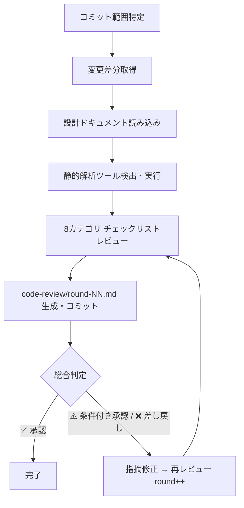

# コードレビュースキル（code-review）

ブランチ差分・設計ドキュメント・レビュー基準を入力として、PRレビュー相当のチェックリストベースレビューを実施し、指摘と修正案を提示します。

> **責務の範囲**: このスキルは「指摘と修正案の提示」までが責務です。指摘に対する修正は別途対応してください。

> [!CAUTION]
> **レビュー品質方針（ゼロトレランス）**
> - レビュアーは **不具合を出さないことに命が懸かっている** つもりで、些細な問題も見逃さず指摘すること
> - **Minor を含む全ての指摘は修正必須** — 「後で対応」「次フェーズで対応」は許容しない
> - コードスタイル違反・命名の不統一・ドキュメント不備など軽微に見える問題も、品質劣化の入口であるため必ず指摘する
> - 可能な限り品質向上に努め、「問題ない」と判断する前に本当に問題がないか再度確認する

## ワークフロー

```mermaid
flowchart TD
    A[コミット範囲特定] --> B[変更差分取得]
    B --> C[設計ドキュメント読み込み]
    C --> D[静的解析ツール検出・実行]
    D --> E[8カテゴリ チェックリストレビュー]
    E --> F[code-review/round-NN.md 生成・コミット]
    F --> G{総合判定}
    G -->|✅ 承認| H[完了]
    G -->|⚠️ 条件付き承認 / ❌ 差し戻し| I[指摘修正 → 再レビュー round++]
    I --> E
```

📖 詳細は [references/execution-procedure.md](references/execution-procedure.md) を参照

## 入力

| 入力 | 必須 | 説明 |
|------|------|------|
| ブランチ差分 | ✅ | `BASE_SHA=$(git merge-base HEAD origin/main)` .. `HEAD_SHA` |
| 設計ドキュメント | 推奨 | `docs/{target}/design/` 配下、または提供された設計資料 |
| レビュー基準 | 任意 | プロジェクト固有のコーディング規約等 |

## レビューチェックリスト（8カテゴリ）

| # | カテゴリ | 主なチェック観点 |
|---|----------|------------------|
| 1 | 設計準拠性 | 設計成果物・API・データ構造・処理フローとの整合性 |
| 2 | 静的解析・フォーマット | .editorconfig / フォーマッター / リンター / 型チェック |
| 3 | 言語別ベストプラクティス | アンチパターン / エラーハンドリング / null安全性 / 命名規則 |
| 4 | セキュリティ | シークレット漏洩 / インジェクション / 認証認可 / 依存脆弱性 |
| 5 | テスト・CI | テスト追加更新 / カバレッジ / 品質 / 全通過 / CI整合性 |
| 6 | パフォーマンス | N+1クエリ / 不要処理 / メモリリーク / アルゴリズム効率 |
| 7 | ドキュメント | APIドキュメント / README / CHANGELOG / インラインコメント |
| 8 | Git作法 | コミット粒度・メッセージ / デバッグコード残留 / 不要ファイル |

📖 詳細は [references/review-checklist.md](references/review-checklist.md) を参照

## 重大度レベルと判定基準

| レベル | 説明 | 判定への影響 |
|--------|------|--------------|
| 🔴 Critical | 本番障害・セキュリティ脆弱性・データ損失 | → ❌ 差し戻し |
| 🟠 Major | バグ・設計違反・品質上の重大な問題 | → ⚠️ 条件付き承認 |
| 🟡 Minor | コードスタイル・軽微な改善点 | → ⚠️ 条件付き承認 |
| 🔵 Info | 情報・提案・ベストプラクティス紹介 | → ✅ 承認（対応推奨） |

**総合判定**: Critical/Major/Minor の指摘が全てゼロ → ✅ 承認

## 再レビュー（round > 1）

前ラウンドの未解決指摘を優先確認し、解決済みステータスを更新、新規指摘を追加する。

📖 詳細は [references/re-review-procedure.md](references/re-review-procedure.md) を参照

## 出力

レビュー結果は `docs/{target}/code-review/round-{NN}.md` に出力。各ラウンドレポートにはチェックリスト結果・指摘事項・静的解析結果・総合判定を含む。

📖 詳細は [references/output-template.md](references/output-template.md) を参照

## 注意事項

- レビュー対象は指定リポジトリ・ブランチの変更のみ
- 静的解析ツールはプロジェクト内で設定されている場合のみ実行
- 該当しないチェック項目は skip として記録
- レビューは客観的・再現可能な基準に基づいて実施
- 差し戻し/条件付き承認 → 修正 → 再レビューを指摘解消まで繰り返す