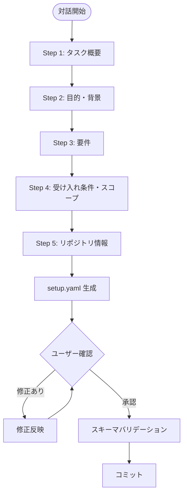

# 対話的 setup.yaml 作成スキル

ユーザーとの対話を通じて、開発タスクの setup.yaml を0から生成します。

> **位置づけ**: `issue-to-setup-yaml`（GitHub Issue → 自動抽出）とは異なり、本スキルはIssueが存在しない場合やゼロベースでタスクを定義したい場合に使用します。

## 概要

- ユーザーと**段階的に対話**しながら情報を収集
- 階層化された description フォーマット（SSOT対応）で出力
- `setup.schema.yaml` に準拠した YAML を生成
- 生成後にユーザーの確認・修正を経てコミット

## 入出力

| 種別 | 内容                               |
| ---- | ---------------------------------- |
| 入力 | ユーザーとの対話（質問→回答）      |
| 出力 | `setup.yaml`（プロジェクトルート） |

## 処理フロー



---

## 対話手順

### Step 1: タスク概要の確認

最初にプロジェクトの概要を把握するため、以下を質問します。
**一度に全部聞かず、自然な会話で段階的に質問してください。**

```markdown
まず、これから取り組むタスクについて教えてください。

1. **タスク名**: どのようなタスクですか？（例: 「ユーザー認証機能の改善」）
2. **チケットID**: チケットIDはありますか？（例: PROJ-123、#456）
   - なければ適当なIDを決めましょう
3. **概要**: このタスクで何を実現しますか？
```

**収集する情報:**
- `task_name` (必須)
- `ticket_id` (必須)
- `description.overview`

### Step 2: 目的・背景の深掘り

概要を理解したら、目的と背景を掘り下げます。

```markdown
ありがとうございます。もう少し詳しく教えてください。

4. **目的**: なぜこのタスクが必要ですか？（ビジネス上の理由、技術的な理由）
5. **背景**: 現状どのような問題・課題がありますか？
   - 既存のコードや仕組みに関する情報があれば教えてください
```

**収集する情報:**
- `description.purpose`
- `description.background`

### Step 3: 要件の整理

具体的な要件を整理します。

```markdown
要件を整理しましょう。

6. **機能要件**: このタスクで実現すべき機能は何ですか？
   - 箇条書きで挙げてください
7. **非機能要件**: パフォーマンス、セキュリティ、可用性などの制約はありますか？
```

**収集する情報:**
- `description.requirements.functional` (配列)
- `description.requirements.non_functional` (配列)

### Step 4: 受け入れ条件・スコープの定義

完了条件と範囲を明確にします。

```markdown
完了条件と範囲を決めましょう。

8. **受け入れ条件**: どうなったら完了と言えますか？
   - テスト観点やチェックリストがあれば教えてください
9. **テスト範囲**: どこまでテストを行いますか？
   - 単体テストのみ？結合テストも？E2Eテスト（実環境での動作確認）も必要？
   - E2Eテストが必要な場合、実行方法（デプロイして確認、ローカル環境等）
10. **スコープ**: 今回対象とする範囲は？
11. **スコープ外**: 明確に今回対象外とするものはありますか？
12. **補足**: その他、気をつけるべきことはありますか？
```

**収集する情報:**
- `description.acceptance_criteria` (配列)
- `description.test_scope` (テスト範囲: unit / integration / e2e)
- `description.scope` (配列)
- `description.out_of_scope` (配列)
- `description.notes`

### Step 5: リポジトリ情報の確認

最後にリポジトリ情報を確認します。

```markdown
リポジトリの設定をしましょう。

12. **修正対象リポジトリ**: コード変更を行うリポジトリは？
    - リポジトリ名と URL を教えてください
    - ベースブランチは main ですか？
13. **関連リポジトリ**: 参照のみで追加したいリポジトリはありますか？
```

**収集する情報:**
- `target_repositories` (必須・1つ以上)
- `related_repositories` (任意)

---

## setup.yaml 生成

対話で収集した情報を以下の形式で `setup.yaml` に出力します：

```yaml
# =============================================================================
# 開発セットアップ設定ファイル（SSOT: Single Source of Truth）
# =============================================================================
# 生成日時: {ISO 8601形式の現在時刻}
# スキル: create-setup-yaml（対話的生成）
# =============================================================================

task_name: "{収集したタスク名}"
ticket_id: "{収集したチケットID}"

# =============================================================================
# 説明（階層化フォーマット）
# =============================================================================
description:
  overview: |
    {収集した概要}

  purpose: |
    {収集した目的}

  background: |
    {収集した背景}

  requirements:
    functional:
      - "{機能要件1}"
      - "{機能要件2}"
    non_functional:
      - "{非機能要件1}"

  acceptance_criteria:
    - "{受け入れ条件1}"
    - "{受け入れ条件2}"

  scope:
    - "{スコープ1}"

  out_of_scope:
    - "{スコープ外1}"

  notes: |
    {補足情報}

# =============================================================================
# リポジトリ設定
# =============================================================================
related_repositories:
  - name: "{関連リポ名}"
    url: "{関連リポURL}"

target_repositories:
  - name: "{対象リポ名}"
    url: "{対象リポURL}"
    base_branch: "main"

# オプション設定
options:
  create_design_document: true
  design_document_dir: "docs"
  submodules_dir: "submodules"
```

---

## ユーザー確認ループ

生成した setup.yaml をユーザーに提示し、確認を求めます：

```markdown
setup.yaml を生成しました。内容を確認してください。

修正したい箇所があれば教えてください。
問題なければ「OK」と言ってください。
```

修正依頼があった場合は該当箇所を更新し、再度確認を求めます。

---

## バリデーション

確認完了後、スキーマバリデーションを実行：

```bash
# スキーマバリデーション
python3 -c "
import yaml
from jsonschema import validate
with open('setup.schema.yaml') as s:
    schema = yaml.safe_load(s)
with open('setup.yaml') as f:
    data = yaml.safe_load(f)
validate(data, schema)
print('✅ setup.yaml はスキーマに準拠しています')
"
```

---

## コミット

```bash
git add setup.yaml
git commit -m "docs: setup.yaml を作成

- タスク: {task_name}
- チケット: {ticket_id}
- 対象リポジトリ: {target_repositories}"
```

---

## 対話のガイドライン

### やるべきこと
- **一度に1〜2つの質問**: ユーザーを圧倒しない
- **具体例を提示**: 入力のイメージがわくように
- **回答を言い換えて確認**: 「〜ということですね？」
- **不明点は聞き返す**: 曖昧な要件は具体化する
- **情報が足りない場合は提案**: 「非機能要件として〜も追加しますか？」

### やってはいけないこと
- 全質問を一度にまとめて聞く
- ユーザーの回答を勝手に解釈して進める
- 必須情報（task_name, ticket_id, target_repositories）を省略する

---

## 完了レポート

```markdown
## setup.yaml 作成完了 ✅

### 作成された情報
- タスク名: {task_name}
- チケットID: {ticket_id}
- 対象リポジトリ: {target_repos}

### description 充足状況

| フィールド                  | 状況       |
| --------------------------- | ---------- |
| overview                    | ✅          |
| purpose                     | ✅          |
| background                  | ✅          |
| requirements.functional     | ✅（{n}件） |
| requirements.non_functional | ✅（{n}件） |
| acceptance_criteria         | ✅（{n}件） |
| scope                       | ✅（{n}件） |
| out_of_scope                | ✅（{n}件） |
| notes                       | ✅          |

### 次のステップ
1. `init-work-branch` スキルで開発環境を初期化
2. `brainstorming` スキルで要件を深掘り → project.yaml を生成
3. `investigation` スキルで対象リポジトリを調査
```

---

## エラーハンドリング

### 必須情報が収集できない

```
⚠️ 以下の必須情報がまだ確認できていません:
- {不足フィールド名}

この情報がないと setup.yaml を生成できません。
もう少し教えていただけますか？
```

### バリデーションエラー

```
❌ スキーマバリデーションエラー:
{エラー詳細}

修正して再度バリデーションを実行します。
```

---

## 関連スキル

| スキル                | 関係                                                       |
| --------------------- | ---------------------------------------------------------- |
| `issue-to-setup-yaml` | GitHub Issue → setup.yaml（自動抽出。本スキルはIssue不要） |
| `init-work-branch`    | setup.yaml → ブランチ初期化                                |
| `brainstorming`       | setup.yaml → project.yaml 生成                             |
| `investigation`       | setup.yaml の description.background を参照                |
