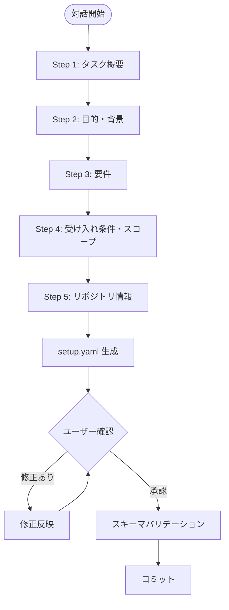

# 対話的 setup.yaml 作成スキル

ユーザーとの対話を通じて、開発タスクの setup.yaml を0から生成します。

> **位置づけ**: `issue-to-setup-yaml`（GitHub Issue → 自動抽出）とは異なり、本スキルはIssueが存在しない場合やゼロベースでタスクを定義したい場合に使用します。

## 概要

- ユーザーと**段階的に対話**しながら情報を収集
- 階層化された description フォーマット（SSOT対応）で出力
- `setup.schema.yaml` に準拠した YAML を生成
- 生成後にユーザーの確認・修正を経てコミット

## 入出力

| 種別 | 内容                               |
| ---- | ---------------------------------- |
| 入力 | ユーザーとの対話（質問→回答）      |
| 出力 | `setup.yaml`（プロジェクトルート） |

## 処理フロー

```mermaid
flowchart TD
    Start([対話開始]) --> Q1[Step 1: タスク概要]
    Q1 --> Q2[Step 2: 目的・背景]
    Q2 --> Q3[Step 3: 要件]
    Q3 --> Q4[Step 4: 受け入れ条件・スコープ]
    Q4 --> Q5[Step 5: リポジトリ情報]
    Q5 --> Gen[setup.yaml 生成]
    Gen --> Review{ユーザー確認}
    Review -->|修正あり| Fix[修正反映]
    Fix --> Review
    Review -->|承認| Validate[スキーマバリデーション]
    Validate --> Commit[コミット]
```

## 対話手順（概要）

5つのステップで段階的に情報を収集する。**一度に全部聞かず、自然な会話で進める。**

| Step | 内容                   | 収集する主な情報                                              |
| ---- | ---------------------- | ------------------------------------------------------------- |
| 1    | タスク概要の確認       | `task_name`(必須), `ticket_id`(必須), `description.overview`  |
| 2    | 目的・背景の深掘り     | `description.purpose`, `description.background`               |
| 3    | 要件の整理             | `requirements.functional`, `requirements.non_functional`      |
| 4    | 受け入れ条件・スコープ | `acceptance_criteria`, `test_scope`, `scope`, `out_of_scope`  |
| 5    | リポジトリ情報の確認   | `target_repositories`(必須), `related_repositories`           |

📖 各ステップの質問例・詳細は [references/dialogue-steps.md](references/dialogue-steps.md) を参照

## setup.yaml 生成

収集した情報を `setup.schema.yaml` 準拠の YAML として出力する。

📖 テンプレートは [references/setup-yaml-template.md](references/setup-yaml-template.md) を参照

## ユーザー確認・バリデーション・コミット

1. 生成した setup.yaml をユーザーに提示し確認を求める
2. 修正依頼があれば反映し再確認（確認ループ）
3. 承認後スキーマバリデーションを実行
4. バリデーション通過後コミット

📖 確認フロー・バリデーションコマンド・コミット例は [references/review-validation-commit.md](references/review-validation-commit.md) を参照

## 対話のガイドライン

- 一度に1〜2つの質問に留め、具体例を提示する
- 回答を言い換えて確認し、不明点は聞き返す
- 必須情報（task_name, ticket_id, target_repositories）は省略しない

📖 詳細は [references/dialogue-guidelines.md](references/dialogue-guidelines.md) を参照

## 完了レポート・エラーハンドリング

- 完了時は description 充足状況と次のステップを提示する
- 必須情報不足・バリデーションエラー時は適切にガイドする

📖 完了レポートテンプレートは [references/completion-report-template.md](references/completion-report-template.md) を参照
📖 エラーハンドリングは [references/error-handling.md](references/error-handling.md) を参照

## 関連スキル

| スキル                | 関係                                                       |
| --------------------- | ---------------------------------------------------------- |
| `issue-to-setup-yaml` | GitHub Issue → setup.yaml（自動抽出。本スキルはIssue不要） |
| `init-work-branch`    | setup.yaml → ブランチ初期化                                |
| `brainstorming`       | setup.yaml → project.yaml 生成                             |
| `investigation`       | setup.yaml の description.background を参照                |
