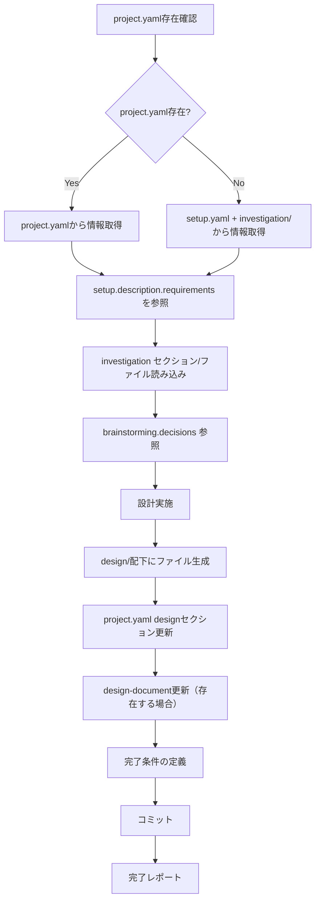
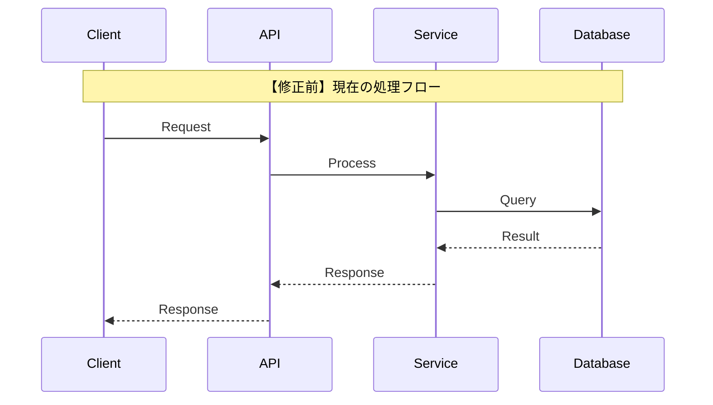
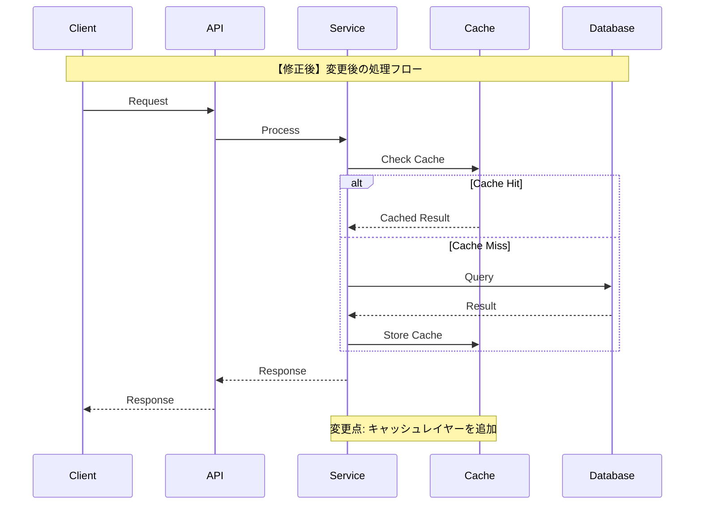

# 開発設計スキル

project.yaml（または setup.yaml + investigation/）を入力として、調査結果を基に詳細設計を行い、project.yaml の design セクションを更新します。

> **SSOT**: project.yaml を全プロセスの Single Source of Truth として使用します。
> - 設計の要件: `setup.description.requirements`
> - 調査結果の参照: `investigation` セクション
> - レビュー指摘の参照: `design.review.issues`（再設計時）
> - 設計結果の出力: `design` セクション
>
> **再設計時**: `design.review` セクションが存在し `status` が `rejected` または `conditional` の場合、
> `issues` 内の `status: open` の指摘を優先的に対応してください。

## 概要

このスキルは以下を実現します：

1. **project.yaml** からチケット情報・対象リポジトリ・調査結果を取得
2. **project.yaml の setup.description.requirements** を設計の要件（機能/非機能）として参照
3. **project.yaml の investigation セクション** から調査結果を参照
4. **docs/{target_repo}/design/** ディレクトリに詳細設計結果を出力
5. **project.yaml の design セクション** を更新してコミット
6. **完了条件** を構造化して定義

## 入力ファイル

### 1. project.yaml（推奨・SSOT）

`brainstorming` → `investigation` スキルで更新されたプロジェクトコンテキストファイル。

```yaml
# project.yaml から参照するセクション
meta:
  ticket_id: "PROJ-123"
  task_name: "機能追加タスク"
  target_repo: "target-repo"
  branch: "feature/PROJ-123"

setup:
  description:
    overview: "概要..."
    purpose: "目的..."
    background: "背景..."
    requirements:                    # ← このスキルが参照
      functional:
        - "ユーザーが○○を実行できること"
        - "結果が△△形式で出力されること"
      non_functional:
        - "応答時間: 200ms以内"
        - "同時リクエスト: 100件/秒対応"
    acceptance_criteria: [...]
  target_repositories:
    - name: "target-repo"
      url: "git@github.com:org/target-repo.git"
      base_branch: "main"

# brainstorming の結果（参照可能）
brainstorming:
  status: completed
  refined_requirements: [...]
  decisions:
    - question: "認証方式は？"
      decision: "JWTベース"

# investigation の結果（必須参照）
investigation:                       # ← このスキルが参照
  status: completed
  summary: |
    既存認証基盤のアーキテクチャを調査。
    ミドルウェア層での拡張が最適と判断。
  key_findings:
    - "認証ミドルウェアは middleware/auth.go に集約"
    - "既存テストカバレッジ: 78%"
  risks:
    - "セッションストア移行時のダウンタイム"
  artifacts: "docs/{repo}/investigation/"
```

### 2. setup.yaml + investigation/（fallback）

project.yaml が存在しない場合のみ使用。

```yaml
# setup.yaml
ticket_id: "PROJ-123"
task_name: "機能追加タスク"

description:
  requirements:
    functional: [...]
    non_functional: [...]

target_repositories:
  - name: "target-repo"
    url: "git@github.com:org/target-repo.git"
```

investigation/ ディレクトリ：
```
docs/
└── {target_repository}/
    └── investigation/
        ├── 01_architecture.md
        ├── 02_data-structure.md
        ├── 03_dependencies.md
        ├── 04_existing-patterns.md
        ├── 05_integration-points.md
        └── 06_risks-and-constraints.md
```

### 3. design-document: docs/{ticket_id}.md（任意）

init-work-branchスキルで生成された設計ドキュメント。存在する場合は設計セクションも更新。

## 処理フロー



## project.yaml からの情報取得

### 要件の参照

`project.yaml` の `setup.description.requirements` を設計の基準として活用します：

```yaml
# project.yaml から取得
setup:
  description:
    requirements:
      functional:
        - "ユーザーが○○を実行できること"
        - "結果が△△形式で出力されること"
      non_functional:
        - "応答時間: 200ms以内"
        - "同時リクエスト: 100件/秒対応"
```

### brainstorming 結果の参照

`brainstorming` セクションで決定された方針を設計に反映します：

```yaml
# project.yaml から取得
brainstorming:
  decisions:
    - question: "認証方式は？"
      decision: "JWTベース"
    - question: "セッション管理は？"
      decision: "Redis で管理"
  refined_requirements:
    - "リフレッシュトークンによる自動更新"
```

### investigation 結果の参照

`investigation` セクションから調査結果を取得し、設計に活用します：

```yaml
# project.yaml から取得
investigation:
  status: completed
  key_findings:
    - "認証ミドルウェアは middleware/auth.go に集約"
    - "既存テストカバレッジ: 78%"
  risks:
    - "セッションストア移行時のダウンタイム"
  artifacts: "docs/{repo}/investigation/"
```

**活用方法:**
- **機能要件** → インターフェース/API設計、データ構造設計の入力
- **非機能要件** → 実装方針決定、テスト計画の入力
- **brainstorming.decisions** → 技術選定の根拠として使用
- **investigation.key_findings** → 既存コードとの整合性を考慮
- **investigation.risks** → リスク軽減策を設計に組み込む
- 設計が要件を満たしているかの検証基準として使用

## 設計実施項目

### 1. 実装方針決定（01_implementation-approach.md）

- 調査結果に基づいた最適なアプローチの選定
- 代替案の比較検討
- 採用理由の明確化
- 技術選定の根拠

### 2. インターフェース/API設計（02_interface-api-design.md）

- 公開API・エンドポイントの設計
- 関数シグネチャの定義
- リクエスト/レスポンス形式
- エラーハンドリング方式

### 3. データ構造設計（03_data-structure-design.md）

- エンティティ・モデルの設計
- スキーマ変更の定義
- 型定義・インターフェースの設計
- マイグレーション計画

### 4. 処理フロー設計（04_process-flow-design.md）

- シーケンス図（修正前/修正後の対比）
- 状態遷移図
- エラーフローの定義
- 非同期処理フロー

### 5. テスト計画（05_test-plan.md）

- 新規テストケースの洗い出し
- 既存テストの修正が必要なもの
- テスト方針（単体/結合/E2E）
- テストデータ設計

### 6. 弊害検証計画（06_side-effect-verification.md）

- 副作用が発生しやすい箇所の特定
- 弊害検証として実行すべきテスト
- パフォーマンス検証項目
- セキュリティ検証項目
- 互換性検証項目

## 出力ファイル構成

設計結果は `docs/{target_repository}/design/` に出力：

```
docs/
└── {target_repository}/
    └── design/
        ├── 01_implementation-approach.md    # 実装方針
        ├── 02_interface-api-design.md       # インターフェース/API設計
        ├── 03_data-structure-design.md      # データ構造設計
        ├── 04_process-flow-design.md        # 処理フロー設計
        ├── 05_test-plan.md                  # テスト計画
        └── 06_side-effect-verification.md   # 弊害検証計画
```

## シーケンス図のガイドライン

**重要**: 修正前と修正後を対比可能な形式で記載すること。

### 修正前シーケンス図



### 修正後シーケンス図



### 変更点サマリー

```markdown
## 変更点サマリー

| 項目        | 修正前 | 修正後    | 理由               |
| ----------- | ------ | --------- | ------------------ |
| キャッシュ  | なし   | Redis導入 | パフォーマンス改善 |
| API呼び出し | 同期   | 非同期    | 応答速度向上       |
```

## テスト計画のガイドライン

### 新規テストケース

```markdown
## 新規テストケース

### 単体テスト

| No   | テスト対象   | テスト内容               | 期待結果                     |
| ---- | ------------ | ------------------------ | ---------------------------- |
| UT-1 | CacheService | キャッシュヒット時の動作 | キャッシュ値を返す           |
| UT-2 | CacheService | キャッシュミス時の動作   | DBから取得してキャッシュ保存 |

### 結合テスト

| No   | テスト対象          | テスト内容             | 期待結果       |
| ---- | ------------------- | ---------------------- | -------------- |
| IT-1 | API->Service->Cache | エンドツーエンドフロー | 正常レスポンス |

### E2Eテスト

| No    | テストシナリオ | 手順                      | 期待結果     |
| ----- | -------------- | ------------------------- | ------------ |
| E2E-1 | ユーザーフロー | 1. ログイン 2. データ取得 | 画面表示成功 |
```

### 既存テスト修正

```markdown
## 既存テスト修正

| ファイル        | 修正内容   | 理由                 |
| --------------- | ---------- | -------------------- |
| service.test.ts | モック追加 | CacheService依存追加 |
```

## 弊害検証計画のガイドライン

### 副作用分析

```markdown
## 副作用が発生しやすい箇所

| 箇所         | 影響度 | 発生可能性 | 検証方法       |
| ------------ | ------ | ---------- | -------------- |
| 既存API      | 高     | 中         | 回帰テスト     |
| データ整合性 | 高     | 低         | 整合性チェック |
```

### 検証項目

```markdown
## 弊害検証項目

### パフォーマンス検証
- [ ] レスポンスタイム測定（目標: 200ms以下）
- [ ] スループット測定（目標: 1000req/s）
- [ ] メモリ使用量確認

### セキュリティ検証
- [ ] 認証・認可の動作確認
- [ ] 入力値検証の確認
- [ ] SQLインジェクション対策確認

### 互換性検証
- [ ] 後方互換性の確認
- [ ] クライアントバージョン互換性
- [ ] データマイグレーション確認
```

## design-document更新内容

`docs/{ticket_id}.md` の「2. 設計」セクションを更新：

```markdown
## 2. 設計

### 2.1 設計方針

{実装方針の要約}

詳細は [design/01_implementation-approach.md](./{target_repo}/design/01_implementation-approach.md) を参照。

### 2.2 変更箇所

#### 追加ファイル

| ファイル | 目的 |
| -------- | ---- |
| ...      | ...  |

#### 修正ファイル

| ファイル | 変更内容 |
| -------- | -------- |
| ...      | ...      |

#### 削除ファイル

| ファイル | 理由 |
| -------- | ---- |
| ...      | ...  |

### 2.3 インターフェース設計

{API/インターフェースの要約}

詳細は [design/02_interface-api-design.md](./{target_repo}/design/02_interface-api-design.md) を参照。

### 2.4 データ構造

{データ構造の要約}

詳細は [design/03_data-structure-design.md](./{target_repo}/design/03_data-structure-design.md) を参照。
```

## 完了条件の定義

`docs/{ticket_id}.md` の「6.2 承認」セクションを以下の構造に更新：

```markdown
### 6.2 承認

#### 完了条件

##### 実装レビュー完了
- [ ] コード品質確認
  - [ ] コーディング規約準拠
  - [ ] 可読性・保守性確認
  - [ ] 重複コード排除確認
- [ ] 設計方針の遵守確認
  - [ ] 設計書との整合性確認
  - [ ] アーキテクチャ準拠確認
- [ ] セキュリティレビュー完了
  - [ ] 脆弱性チェック
  - [ ] 認証・認可確認
  - [ ] 入力値検証確認

##### テスト完了
- [ ] テスト計画に記載のテスト実行完了
  - [ ] 単体テスト完了
  - [ ] 結合テスト完了
  - [ ] E2Eテスト完了
- [ ] テストカバレッジ確認
  - [ ] 目標カバレッジ達成
  - [ ] 未カバー箇所の妥当性確認
- [ ] テスト結果レポート作成
  - [ ] テスト結果サマリー
  - [ ] 不具合一覧と対応状況

##### 弊害検証完了
- [ ] 弊害検証計画に記載のテスト実行完了
  - [ ] 回帰テスト完了
  - [ ] 副作用確認完了
- [ ] パフォーマンス検証確認
  - [ ] レスポンスタイム確認
  - [ ] スループット確認
  - [ ] リソース使用量確認
- [ ] 弊害検証結果レポート作成
  - [ ] 検証結果サマリー
  - [ ] 発見した問題と対応状況
```

## 実行手順

### 1. project.yaml / setup.yaml 読み込み

```bash
# project.yaml を優先、なければ setup.yaml を使用
if [ -f "project.yaml" ]; then
    CONFIG_FILE="project.yaml"
    echo "project.yaml を使用"
else
    CONFIG_FILE="${1:-setup.yaml}"
    test -f "$CONFIG_FILE" || { echo "Error: $CONFIG_FILE not found"; exit 1; }
    echo "setup.yaml を使用（project.yaml なし）"
fi
```

**project.yaml からの情報抽出:**
- `meta.ticket_id` - チケットID
- `meta.task_name` - タスク名
- `meta.target_repo` - 主要設計対象リポジトリ
- `setup.description.requirements` - 機能/非機能要件
- `brainstorming.decisions` - 技術的決定事項（存在する場合）
- `investigation` セクション - 調査結果

### 2. investigation 確認

```bash
# project.yaml の場合: investigation セクションの status を確認
# setup.yaml の場合: investigation/ ディレクトリを確認

if [ -f "project.yaml" ]; then
    # investigation.status == "completed" を確認
    echo "project.yaml の investigation セクションを参照"
else
    for repo in "${target_repositories[@]}"; do
        INVESTIGATION_DIR="docs/${repo}/investigation"
        test -d "$INVESTIGATION_DIR" || { echo "Error: $INVESTIGATION_DIR not found"; exit 1; }
    done
fi
```

### 3. design-document確認（任意）

```bash
DOCS_DIR="${options.design_document_dir:-docs}"
DESIGN_DOC="$DOCS_DIR/${ticket_id}.md"
if [ -f "$DESIGN_DOC" ]; then
    echo "design-document を発見: $DESIGN_DOC"
fi
```

### 4. 調査結果の読み込みと分析

**project.yaml から取得:**
- `investigation.summary` - 調査結果の要約
- `investigation.key_findings` - 重要な発見
- `investigation.risks` - 特定されたリスク
- `investigation.artifacts` - 詳細ドキュメントのパス

詳細は `investigation.artifacts` パスの各ファイルを参照：
- アーキテクチャ情報
- データ構造情報
- 依存関係情報
- 既存パターン情報
- 統合ポイント情報
- リスク・制約情報

### 5. 設計の実施

各設計項目について、調査結果・要件・決定事項を基に詳細設計を実施：

1. 実装方針の決定（brainstorming.decisions を反映）
2. インターフェース/API設計
3. データ構造設計
4. 処理フロー設計（シーケンス図の修正前/修正後対比）
5. テスト計画策定
6. 弊害検証計画策定（investigation.risks を反映）

### 6. design/配下にファイル生成

```bash
for repo in "${target_repositories[@]}"; do
    DESIGN_DIR="docs/${repo}/design"
    mkdir -p "$DESIGN_DIR"
    
    # 各設計ファイルを生成
    # 01_implementation-approach.md
    # 02_interface-api-design.md
    # 03_data-structure-design.md
    # 04_process-flow-design.md
    # 05_test-plan.md
    # 06_side-effect-verification.md
done
```

### 7. project.yaml の design セクション更新

設計結果の要約を project.yaml に追記：

```yaml
# project.yaml に追記
design:
  status: completed
  completed_at: "2025-02-11T13:00:00+09:00"
  summary: "JWT + Redis 構成の認証基盤を設計"
  approach: "ミドルウェア層にJWT検証を追加、Redisでセッション管理"
  key_decisions:
    - "{設計上の主要決定1}"
    - "{設計上の主要決定2}"
  review:
    status: pending    # pending | approved | revision_required
  artifacts: "docs/{target_repo}/design/"
```

### 8. design-document更新（存在する場合）

`docs/{ticket_id}.md` の「2. 設計」セクションと「6.2 承認」セクションを更新。

### 9. コミット

```bash
# project.yaml と設計結果をコミット
git add project.yaml docs/
git commit -m "docs: design 完了

- project.yaml の design セクションを更新
- docs/{target_repo}/design/ に詳細設計を出力"
```

## 完了レポート

```markdown
## 設計完了 ✅

### 設計対象
- チケット: {ticket_id}
- タスク: {task_name}
- リポジトリ: {target_repositories}

### project.yaml 更新内容

\`\`\`yaml
design:
  status: completed
  completed_at: "{timestamp}"
  summary: "{設計方針の要約}"
  approach: "{実装アプローチ}"
  key_decisions:
    - "{決定1}"
    - "{決定2}"
  review:
    status: pending
  artifacts: "docs/{target_repo}/design/"
\`\`\`

### 生成されたファイル

#### 詳細設計結果
- docs/{target_repo}/design/01_implementation-approach.md
- docs/{target_repo}/design/02_interface-api-design.md
- docs/{target_repo}/design/03_data-structure-design.md
- docs/{target_repo}/design/04_process-flow-design.md
- docs/{target_repo}/design/05_test-plan.md
- docs/{target_repo}/design/06_side-effect-verification.md

### 設計サマリー
- 実装方針: {approach_summary}
- 変更ファイル数: {file_count}
- 新規テストケース数: {test_case_count}
- 弊害検証項目数: {verification_item_count}

### 次のステップ
1. 設計レビューを実施（review-design）
2. タスク計画スキル（plan）でタスク分割を実施
3. 実行スキル（implement）で実装を開始
```

## エラーハンドリング

### project.yaml も setup.yaml も見つからない

```
エラー: project.yaml も setup.yaml も見つかりません

brainstorming スキルで project.yaml を生成するか、
init-work-branch スキルで setup.yaml を作成してください。
```

### investigation が完了していない

```
エラー: investigation が完了していません

project.yaml の場合: investigation.status が "completed" ではありません
setup.yaml の場合: docs/{target_repo}/investigation/ が見つかりません

investigation スキルで調査を完了してください。
```

### design-documentが見つからない

```
警告: design-documentが見つかりません
ファイル: docs/{ticket_id}.md

design-document の更新はスキップします。
project.yaml の design セクションは更新されます。
```

## 注意事項

- 設計は `target_repositories` のみ対象
- investigation が完了していない場合はエラー終了
- 既存の `design/` ディレクトリがある場合は上書き確認を行う
- シーケンス図は必ず修正前/修正後を対比させる
- **project.yaml を SSOT として使用し、design セクションを更新**
- brainstorming.decisions がある場合、技術選定の根拠として反映
- investigation.risks がある場合、リスク軽減策を設計に組み込む

## 参照ファイル

- 前提スキル: `brainstorming` - 要件深掘り（project.yaml を生成）
- 前提スキル: `investigation` - 開発タスク用詳細調査
- 前提スキル: `init-work-branch` - 作業ブランチ初期化
- 後続スキル: `review-design` - 設計レビュー
- 後続スキル: `plan` - タスク計画
- 後続スキル: `implement` - 実装

## SSOT参照

| project.yaml フィールド                         | 用途                                     |
| ----------------------------------------------- | ---------------------------------------- |
| `meta.ticket_id`                                | チケットID                               |
| `meta.task_name`                                | タスク名                                 |
| `meta.target_repo`                              | 主要設計対象リポジトリ                   |
| `setup.description.requirements.functional`     | 機能要件 → API設計、データ構造設計の入力 |
| `setup.description.requirements.non_functional` | 非機能要件 → 実装方針、テスト計画の入力  |
| `brainstorming.decisions`                       | 技術的決定事項（参照）                   |
| `brainstorming.refined_requirements`            | 深掘りされた要件（参照）                 |
| `investigation.key_findings`                    | 調査の重要な発見（参照）                 |
| `investigation.risks`                           | 特定されたリスク（参照）                 |
| `investigation.artifacts`                       | 詳細調査ドキュメントのパス               |

## 出力（project.yaml への書き込み）

| design フィールド | 説明                                         |
| ----------------- | -------------------------------------------- |
| `status`          | `pending` / `in_progress` / `completed`      |
| `completed_at`    | 完了日時（ISO 8601形式）                     |
| `summary`         | 設計の要約（1行）                            |
| `approach`        | 実装アプローチの説明                         |
| `key_decisions`   | 設計上の主要決定（5件以内）                  |
| `review.status`   | `pending` / `approved` / `revision_required` |
| `artifacts`       | 詳細設計ドキュメントのパス                   |

## 典型的なワークフロー

```
[project.yaml読み込み] --> YAMLをパースしてバリデーション
        |
[investigation確認] --> investigation.status == completed を確認
        |
[調査結果・要件参照] --> investigation, setup.requirements, brainstorming を読み込み
        |
[設計実施] --> 実装方針・API・データ構造・処理フロー設計
        |
[design/生成] --> 設計ファイルを生成
        |
[project.yaml更新] --> design セクションを追記
        |
[design-document更新] --> 設計セクション・完了条件を更新（存在する場合）
        |
[コミット] --> 変更をコミット
        |
[完了レポート] --> 設計結果を表示
```
