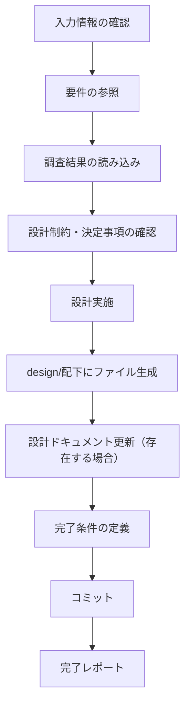
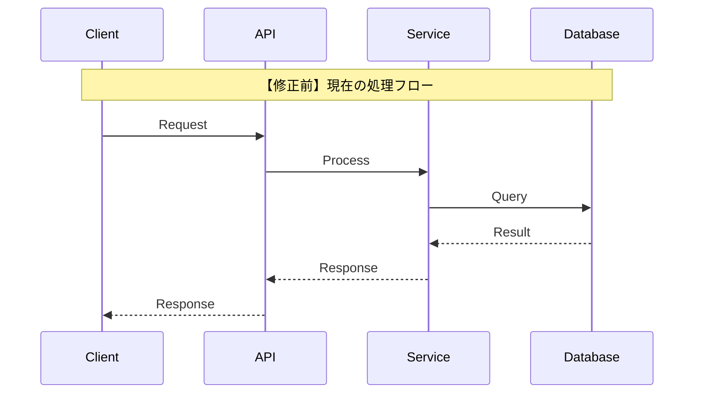
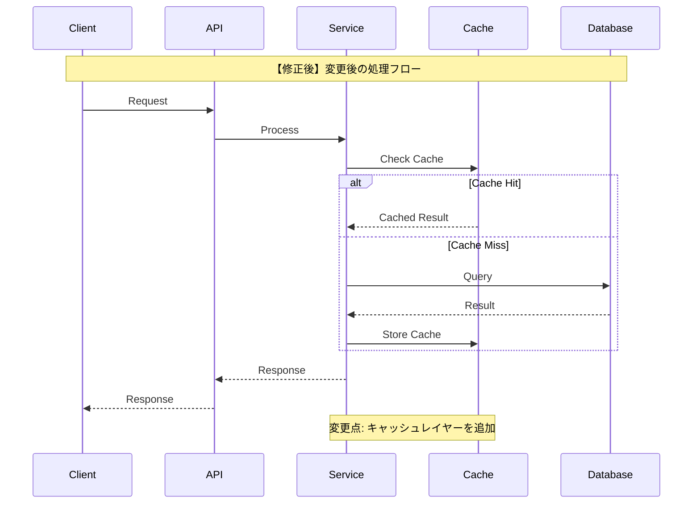

# 開発設計スキル

要件・調査結果・設計制約を入力として、詳細設計を行い、docs/{target}/design/ ディレクトリに設計ドキュメントを出力します。

> **再設計時**: 設計レビューで指摘がある場合、未解決（`status: open`）の指摘を優先的に対応してください。

## 概要

このスキルは以下を実現します：

1. **要件**（機能/非機能）、**調査結果**、**設計制約・決定事項** を入力として受け取る
2. **docs/{target}/design/** ディレクトリに詳細設計結果を出力
3. **完了条件** を構造化して定義

## 入力情報

### 1. 要件（必須）

設計の基礎となる要件情報：

- **機能要件**: ユーザーが実行できる操作、出力形式等
- **非機能要件**: 応答時間、スループット、セキュリティ要件等
- **受入基準**: 設計が満たすべき完了条件

### 2. 調査結果（必須）

事前調査で得られた知見：

- **調査サマリー**: アーキテクチャ調査結果の要約
- **重要な発見**: 既存コードの構造、テストカバレッジ等
- **リスク**: 特定されたリスク事項
- **調査ドキュメント**: docs/{target}/investigation/ 配下のファイル

調査ドキュメントの典型的な構成：

```
docs/
└── {target}/
    └── investigation/
        ├── 01_architecture.md
        ├── 02_data-structure.md
        ├── 03_dependencies.md
        ├── 04_existing-patterns.md
        ├── 05_integration-points.md
        └── 06_risks-and-constraints.md
```

### 3. 設計制約・決定事項（任意）

ブレインストーミングやチーム討議で決定された方針：

- **技術的決定**: 認証方式、データストア選定等
- **深掘り要件**: 追加で明確化された要件
- **制約条件**: 技術的・ビジネス的制約

### 4. 設計ドキュメント（任意）

既存の設計ドキュメントがある場合は、設計セクションも更新します。

## 処理フロー


```mermaid
flowchart TD
    A[入力情報の確認] --> B[要件の参照]
    B --> C[調査結果の読み込み]
    C --> D[設計制約・決定事項の確認]
    D --> E[設計実施]
    E --> F[design/配下にファイル生成]
    F --> G[設計ドキュメント更新（存在する場合）]
    G --> H[完了条件の定義]
    H --> I[コミット]
    I --> J[完了レポート]
```

## 入力情報の活用方法

### 要件の参照

機能要件・非機能要件を設計の基準として活用します：

- **機能要件** → インターフェース/API設計、データ構造設計の入力
- **非機能要件** → 実装方針決定、テスト計画の入力

### 調査結果の参照

調査で得られた知見を設計に反映します：

- **重要な発見** → 既存コードとの整合性を考慮
- **リスク** → リスク軽減策を設計に組み込む

### 設計制約・決定事項の参照

チームで決定された方針を設計に反映します：

- **技術的決定** → 技術選定の根拠として使用
- **深掘り要件** → 要件の詳細化
- 設計が要件を満たしているかの検証基準としても使用

## 設計実施項目

### 1. 実装方針決定（01_implementation-approach.md）

- 調査結果に基づいた最適なアプローチの選定
- 代替案の比較検討
- 採用理由の明確化
- 技術選定の根拠

### 2. インターフェース/API設計（02_interface-api-design.md）

- 公開API・エンドポイントの設計
- 関数シグネチャの定義
- リクエスト/レスポンス形式
- エラーハンドリング方式

### 3. データ構造設計（03_data-structure-design.md）

- エンティティ・モデルの設計
- スキーマ変更の定義
- 型定義・インターフェースの設計
- マイグレーション計画

### 4. 処理フロー設計（04_process-flow-design.md）

- シーケンス図（修正前/修正後の対比）
- 状態遷移図
- エラーフローの定義
- 非同期処理フロー

### 5. テスト計画（05_test-plan.md）

- 新規テストケースの洗い出し
- 既存テストの修正が必要なもの
- テスト方針（単体/結合/E2E）
- テストデータ設計
- **事前に決定されたテスト戦略を必ず参照し、定義されたテスト範囲を全て計画に含めること**
- **E2Eテストがスコープに含まれる場合**: E2Eテストの具体的な実行手順、対象環境、判定基準を記載
- **acceptance_criteria との対応表**: 各 acceptance_criteria をどのテスト種別（単体/結合/E2E）で検証するかを明記

### 6. 弊害検証計画（06_side-effect-verification.md）

- 副作用が発生しやすい箇所の特定
- 弊害検証として実行すべきテスト
- パフォーマンス検証項目
- セキュリティ検証項目
- 互換性検証項目

## 出力ファイル構成

設計結果は `docs/{target_repository}/design/` に出力：

```
docs/
└── {target_repository}/
    └── design/
        ├── 01_implementation-approach.md    # 実装方針
        ├── 02_interface-api-design.md       # インターフェース/API設計
        ├── 03_data-structure-design.md      # データ構造設計
        ├── 04_process-flow-design.md        # 処理フロー設計
        ├── 05_test-plan.md                  # テスト計画
        └── 06_side-effect-verification.md   # 弊害検証計画
```

## シーケンス図のガイドライン

**重要**: 修正前と修正後を対比可能な形式で記載すること。

### 修正前シーケンス図


```mermaid
sequenceDiagram
    participant C as Client
    participant A as API
    participant S as Service
    participant D as Database
    
    Note over C,D: 【修正前】現在の処理フロー
    
    C->>A: Request
    A->>S: Process
    S->>D: Query
    D-->>S: Result
    S-->>A: Response
    A-->>C: Response
```

### 修正後シーケンス図


```mermaid
sequenceDiagram
    participant C as Client
    participant A as API
    participant S as Service
    participant Cache as Cache
    participant D as Database
    
    Note over C,D: 【修正後】変更後の処理フロー
    
    C->>A: Request
    A->>S: Process
    S->>Cache: Check Cache
    alt Cache Hit
        Cache-->>S: Cached Result
    else Cache Miss
        S->>D: Query
        D-->>S: Result
        S->>Cache: Store Cache
    end
    S-->>A: Response
    A-->>C: Response
    
    Note over S,Cache: 変更点: キャッシュレイヤーを追加
```

### 変更点サマリー

```markdown
## 変更点サマリー

| 項目        | 修正前 | 修正後    | 理由               |
| ----------- | ------ | --------- | ------------------ |
| キャッシュ  | なし   | Redis導入 | パフォーマンス改善 |
| API呼び出し | 同期   | 非同期    | 応答速度向上       |
```

## テスト計画のガイドライン

### 新規テストケース

```markdown
## 新規テストケース

### 単体テスト

| No   | テスト対象   | テスト内容               | 期待結果                     |
| ---- | ------------ | ------------------------ | ---------------------------- |
| UT-1 | CacheService | キャッシュヒット時の動作 | キャッシュ値を返す           |
| UT-2 | CacheService | キャッシュミス時の動作   | DBから取得してキャッシュ保存 |

### 結合テスト

| No   | テスト対象          | テスト内容             | 期待結果       |
| ---- | ------------------- | ---------------------- | -------------- |
| IT-1 | API->Service->Cache | エンドツーエンドフロー | 正常レスポンス |

### E2Eテスト

| No    | テストシナリオ | 手順                      | 期待結果     |
| ----- | -------------- | ------------------------- | ------------ |
| E2E-1 | ユーザーフロー | 1. ログイン 2. データ取得 | 画面表示成功 |
```

### 既存テスト修正

```markdown
## 既存テスト修正

| ファイル        | 修正内容   | 理由                 |
| --------------- | ---------- | -------------------- |
| service.test.ts | モック追加 | CacheService依存追加 |
```

## 弊害検証計画のガイドライン

### 副作用分析

```markdown
## 副作用が発生しやすい箇所

| 箇所         | 影響度 | 発生可能性 | 検証方法       |
| ------------ | ------ | ---------- | -------------- |
| 既存API      | 高     | 中         | 回帰テスト     |
| データ整合性 | 高     | 低         | 整合性チェック |
```

### 検証項目

```markdown
## 弊害検証項目

### パフォーマンス検証
- [ ] レスポンスタイム測定（目標: 200ms以下）
- [ ] スループット測定（目標: 1000req/s）
- [ ] メモリ使用量確認

### セキュリティ検証
- [ ] 認証・認可の動作確認
- [ ] 入力値検証の確認
- [ ] SQLインジェクション対策確認

### 互換性検証
- [ ] 後方互換性の確認
- [ ] クライアントバージョン互換性
- [ ] データマイグレーション確認
```

## 設計ドキュメント更新内容

既存の設計ドキュメントがある場合、「2. 設計」セクションを更新：

```markdown
## 2. 設計

### 2.1 設計方針

{実装方針の要約}

詳細は [design/01_implementation-approach.md](./{target_repo}/design/01_implementation-approach.md) を参照。

### 2.2 変更箇所

#### 追加ファイル

| ファイル | 目的 |
| -------- | ---- |
| ...      | ...  |

#### 修正ファイル

| ファイル | 変更内容 |
| -------- | -------- |
| ...      | ...      |

#### 削除ファイル

| ファイル | 理由 |
| -------- | ---- |
| ...      | ...  |

### 2.3 インターフェース設計

{API/インターフェースの要約}

詳細は [design/02_interface-api-design.md](./{target_repo}/design/02_interface-api-design.md) を参照。

### 2.4 データ構造

{データ構造の要約}

詳細は [design/03_data-structure-design.md](./{target_repo}/design/03_data-structure-design.md) を参照。
```

## 完了条件の定義

設計ドキュメントの承認セクションを以下の構造で定義：

```markdown
### 6.2 承認

#### 完了条件

##### 実装レビュー完了
- [ ] コード品質確認
  - [ ] コーディング規約準拠
  - [ ] 可読性・保守性確認
  - [ ] 重複コード排除確認
- [ ] 設計方針の遵守確認
  - [ ] 設計書との整合性確認
  - [ ] アーキテクチャ準拠確認
- [ ] セキュリティレビュー完了
  - [ ] 脆弱性チェック
  - [ ] 認証・認可確認
  - [ ] 入力値検証確認

##### テスト完了
- [ ] テスト計画に記載のテスト実行完了
  - [ ] 単体テスト完了
  - [ ] 結合テスト完了
  - [ ] E2Eテスト完了
- [ ] テストカバレッジ確認
  - [ ] 目標カバレッジ達成
  - [ ] 未カバー箇所の妥当性確認
- [ ] テスト結果レポート作成
  - [ ] テスト結果サマリー
  - [ ] 不具合一覧と対応状況

##### 弊害検証完了
- [ ] 弊害検証計画に記載のテスト実行完了
  - [ ] 回帰テスト完了
  - [ ] 副作用確認完了
- [ ] パフォーマンス検証確認
  - [ ] レスポンスタイム確認
  - [ ] スループット確認
  - [ ] リソース使用量確認
- [ ] 弊害検証結果レポート作成
  - [ ] 検証結果サマリー
  - [ ] 発見した問題と対応状況
```

## 実行手順

### 1. 入力情報の確認

設計に必要な入力情報を確認します：

- **要件**: 機能要件・非機能要件・受入基準が明確であること
- **調査結果**: 事前調査が完了しており、調査ドキュメントが存在すること

```bash
# 調査ドキュメントの存在確認
for repo in "${target_repositories[@]}"; do
    INVESTIGATION_DIR="docs/${repo}/investigation"
    test -d "$INVESTIGATION_DIR" || { echo "Error: $INVESTIGATION_DIR not found"; exit 1; }
done
```

### 2. 設計ドキュメント確認（任意）

```bash
# 既存の設計ドキュメントがあれば更新対象とする
DESIGN_DOC="docs/${ticket_id}.md"
if [ -f "$DESIGN_DOC" ]; then
    echo "設計ドキュメントを発見: $DESIGN_DOC"
fi
```

### 3. 調査結果の読み込みと分析

調査ドキュメントから以下を読み込みます：

- アーキテクチャ情報
- データ構造情報
- 依存関係情報
- 既存パターン情報
- 統合ポイント情報
- リスク・制約情報

### 4. 設計の実施

各設計項目について、調査結果・要件・決定事項を基に詳細設計を実施：

1. 実装方針の決定（技術的決定事項を反映）
2. インターフェース/API設計
3. データ構造設計
4. 処理フロー設計（シーケンス図の修正前/修正後対比）
5. テスト計画策定
6. 弊害検証計画策定（調査で特定されたリスクを反映）

### 5. design/ 配下にファイル生成

```bash
for repo in "${target_repositories[@]}"; do
    DESIGN_DIR="docs/${repo}/design"
    mkdir -p "$DESIGN_DIR"
    
    # 各設計ファイルを生成
    # 01_implementation-approach.md
    # 02_interface-api-design.md
    # 03_data-structure-design.md
    # 04_process-flow-design.md
    # 05_test-plan.md
    # 06_side-effect-verification.md
done
```

### 6. 設計ドキュメント更新（存在する場合）

既存の設計ドキュメントの「2. 設計」セクションと完了条件セクションを更新します。

### 7. コミット

```bash
# 設計結果をコミット
git add docs/
git commit -m "docs: design 完了

- docs/{target}/design/ に詳細設計を出力"
```

## 完了レポート

```markdown
## 設計完了 ✅

### 設計対象
- チケット: {ticket_id}
- タスク: {task_name}
- リポジトリ: {target_repositories}

### 生成されたファイル

#### 詳細設計結果
- docs/{target}/design/01_implementation-approach.md
- docs/{target}/design/02_interface-api-design.md
- docs/{target}/design/03_data-structure-design.md
- docs/{target}/design/04_process-flow-design.md
- docs/{target}/design/05_test-plan.md
- docs/{target}/design/06_side-effect-verification.md

### 設計サマリー
- 実装方針: {approach_summary}
- 変更ファイル数: {file_count}
- 新規テストケース数: {test_case_count}
- 弊害検証項目数: {verification_item_count}

### 次のステップ
1. 設計レビューを実施（review-design）
2. タスク計画（plan）でタスク分割を実施
3. 実装（implement）を開始
```

## エラーハンドリング

### 調査結果が見つからない

```
エラー: 調査結果が見つかりません

docs/{target}/investigation/ ディレクトリが存在しません。
事前に調査（investigation）を完了してください。
```

### 設計ドキュメントが見つからない

```
警告: 設計ドキュメントが見つかりません
ファイル: docs/{ticket_id}.md

設計ドキュメントの更新はスキップします。
design/ 配下のファイルは生成されます。
```

## 注意事項

- 設計は対象リポジトリのみ対象
- 調査が完了していない場合はエラー終了
- 既存の `design/` ディレクトリがある場合は上書き確認を行う
- シーケンス図は必ず修正前/修正後を対比させる
- 技術的決定事項がある場合、技術選定の根拠として反映
- 調査で特定されたリスクがある場合、リスク軽減策を設計に組み込む

## 参照スキル

- 前提スキル: `investigation` - 開発タスク用詳細調査
- 後続スキル: `review-design` - 設計レビュー
- 後続スキル: `plan` - タスク計画
- 後続スキル: `implement` - 実装

## 典型的なワークフロー

```
[入力情報の確認] --> 要件・調査結果・決定事項を確認
        |
[調査結果読み込み] --> 調査ドキュメントを分析
        |
[設計実施] --> 実装方針・API・データ構造・処理フロー設計
        |
[design/生成] --> 設計ファイルを生成
        |
[設計ドキュメント更新] --> 設計セクション・完了条件を更新（存在する場合）
        |
[コミット] --> 変更をコミット
        |
[完了レポート] --> 設計結果を表示
```
