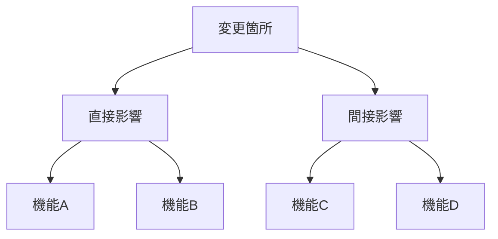

# 弊害検証計画

## 概要

| 項目 | 内容 |
|------|------|
| チケットID | {{TICKET_ID}} |
| タスク名 | {{TASK_NAME}} |
| 作成日 | {{CREATED_DATE}} |

---

## 1. 副作用分析

### 1.1 副作用が発生しやすい箇所

| 箇所 | 影響度 | 発生可能性 | 検証方法 | 優先度 |
|------|--------|------------|----------|--------|
| | 高/中/低 | 高/中/低 | | |

### 1.2 影響範囲マップ

---

## 2. 回帰テスト

### 2.1 実行すべき回帰テスト

| テストスイート | 対象機能 | 優先度 | 必須/推奨 |
|----------------|----------|--------|-----------|
| | | | |

### 2.2 回帰テストチェックリスト

- [ ] 既存機能Aの動作確認
- [ ] 既存機能Bの動作確認
- [ ] 既存機能Cの動作確認

---

## 3. パフォーマンス検証

### 3.1 検証項目

| 項目 | 目標値 | 許容値 | 測定方法 |
|------|--------|--------|----------|
| レスポンスタイム | ms | ms | |
| スループット | req/s | req/s | |
| メモリ使用量 | MB | MB | |
| CPU使用率 | % | % | |

### 3.2 負荷テストシナリオ

| シナリオ | 条件 | 期待結果 | 実行時間 |
|----------|------|----------|----------|
| 通常負荷 | | | |
| ピーク負荷 | | | |
| 持続負荷 | | | |

---

## 4. セキュリティ検証

### 4.1 検証項目

| 項目 | 確認内容 | 検証方法 | チェック |
|------|----------|----------|----------|
| 認証 | | | ⬜ |
| 認可 | | | ⬜ |
| 入力検証 | | | ⬜ |
| SQLインジェクション | | | ⬜ |
| XSS | | | ⬜ |
| CSRF | | | ⬜ |

### 4.2 脆弱性スキャン

| ツール | 対象 | 実行タイミング |
|--------|------|----------------|
| | | |

---

## 5. 互換性検証

### 5.1 後方互換性

| 項目 | 互換性 | 確認方法 | 備考 |
|------|--------|----------|------|
| API | ✅/⚠️/❌ | | |
| データ形式 | ✅/⚠️/❌ | | |
| 設定ファイル | ✅/⚠️/❌ | | |

### 5.2 クライアント互換性

| クライアント | バージョン | 対応状況 | 確認方法 |
|--------------|------------|----------|----------|
| | | | |

### 5.3 環境互換性

| 環境 | 対応状況 | 確認方法 |
|------|----------|----------|
| 開発環境 | | |
| ステージング | | |
| 本番環境 | | |

---

## 6. データ整合性検証

### 6.1 検証項目

| 項目 | 確認内容 | 検証クエリ/方法 |
|------|----------|-----------------|
| 外部キー整合性 | | |
| データ重複 | | |
| NULL値 | | |

### 6.2 マイグレーション検証

| ステップ | 検証内容 | ロールバック確認 |
|----------|----------|------------------|
| | | ⬜ |

---

## 7. 検証実行計画

### 7.1 実行順序

1. 回帰テスト
2. パフォーマンス検証
3. セキュリティ検証
4. 互換性検証
5. データ整合性検証

### 7.2 スケジュール

| フェーズ | 開始 | 終了 | 担当 |
|----------|------|------|------|
| | | | |

---

## 8. 結果レポートテンプレート

### 8.1 検証結果サマリー

| 検証項目 | 結果 | 発見事項 | 対応状況 |
|----------|------|----------|----------|
| 回帰テスト | ⬜ | | |
| パフォーマンス | ⬜ | | |
| セキュリティ | ⬜ | | |
| 互換性 | ⬜ | | |
| データ整合性 | ⬜ | | |

### 8.2 発見した問題

| No | 問題 | 重大度 | 対応方針 | 対応状況 |
|----|------|--------|----------|----------|
| | | | | |

---

## 変更履歴

| 日付 | バージョン | 変更内容 | 変更者 |
|------|------------|----------|--------|
| {{CREATED_DATE}} | 1.0 | 初版作成 | {{AUTHOR}} |
