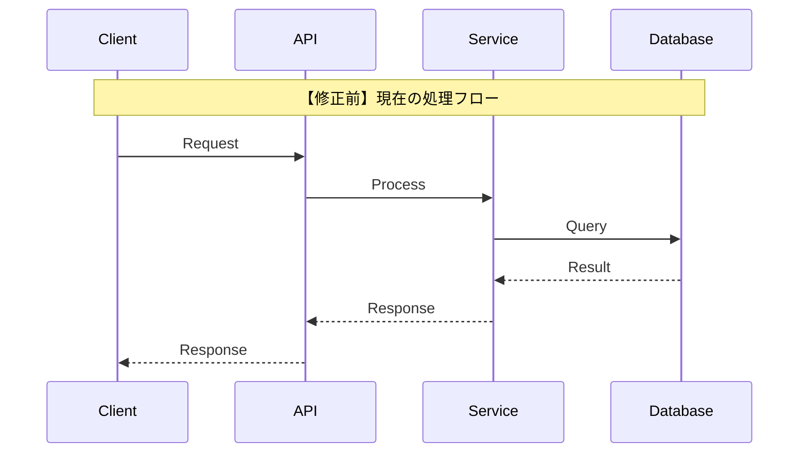
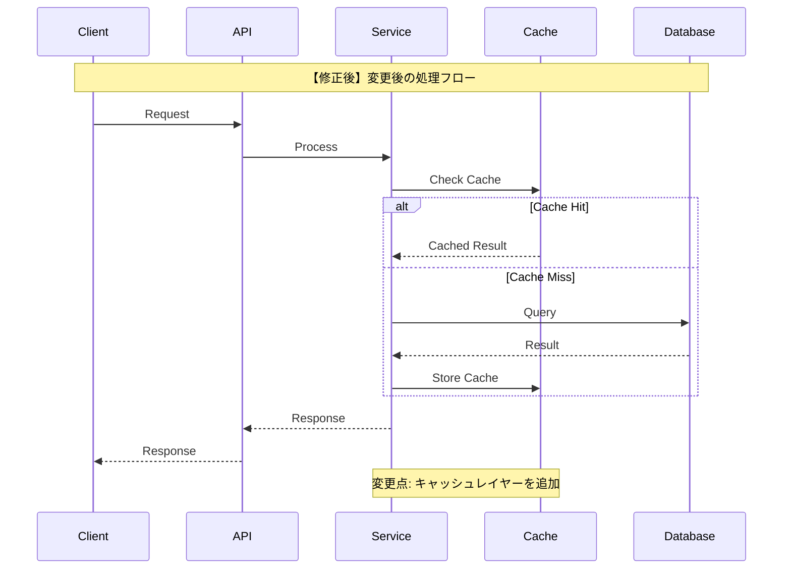

# ガイドライン（シーケンス図・テスト計画・弊害検証）

## シーケンス図のガイドライン

**重要**: 修正前と修正後を対比可能な形式で記載すること。

### 修正前シーケンス図



### 修正後シーケンス図



### 変更点サマリー

```markdown
## 変更点サマリー

| 項目        | 修正前 | 修正後    | 理由               |
| ----------- | ------ | --------- | ------------------ |
| キャッシュ  | なし   | Redis導入 | パフォーマンス改善 |
| API呼び出し | 同期   | 非同期    | 応答速度向上       |
```

## テスト計画のガイドライン

### 新規テストケース

```markdown
## 新規テストケース

### 単体テスト

| No   | テスト対象   | テスト内容               | 期待結果                     |
| ---- | ------------ | ------------------------ | ---------------------------- |
| UT-1 | CacheService | キャッシュヒット時の動作 | キャッシュ値を返す           |
| UT-2 | CacheService | キャッシュミス時の動作   | DBから取得してキャッシュ保存 |

### 結合テスト

| No   | テスト対象          | テスト内容             | 期待結果       |
| ---- | ------------------- | ---------------------- | -------------- |
| IT-1 | API->Service->Cache | エンドツーエンドフロー | 正常レスポンス |

### E2Eテスト

| No    | テストシナリオ | 手順                      | 期待結果     |
| ----- | -------------- | ------------------------- | ------------ |
| E2E-1 | ユーザーフロー | 1. ログイン 2. データ取得 | 画面表示成功 |
```

### 既存テスト修正

```markdown
## 既存テスト修正

| ファイル        | 修正内容   | 理由                 |
| --------------- | ---------- | -------------------- |
| service.test.ts | モック追加 | CacheService依存追加 |
```

## 弊害検証計画のガイドライン

### 副作用分析

```markdown
## 副作用が発生しやすい箇所

| 箇所         | 影響度 | 発生可能性 | 検証方法       |
| ------------ | ------ | ---------- | -------------- |
| 既存API      | 高     | 中         | 回帰テスト     |
| データ整合性 | 高     | 低         | 整合性チェック |
```

### 検証項目

```markdown
## 弊害検証項目

### パフォーマンス検証
- [ ] レスポンスタイム測定（目標: 200ms以下）
- [ ] スループット測定（目標: 1000req/s）
- [ ] メモリ使用量確認

### セキュリティ検証
- [ ] 認証・認可の動作確認
- [ ] 入力値検証の確認
- [ ] SQLインジェクション対策確認

### 互換性検証
- [ ] 後方互換性の確認
- [ ] クライアントバージョン互換性
- [ ] データマイグレーション確認
```
