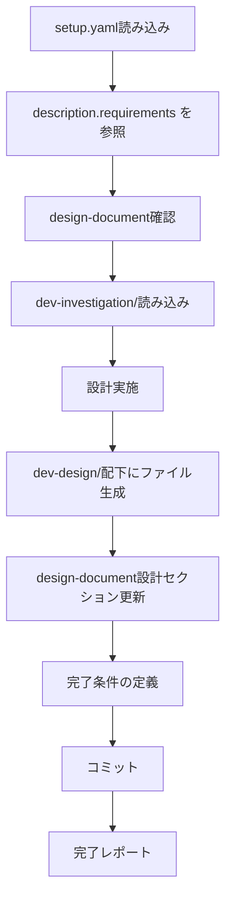
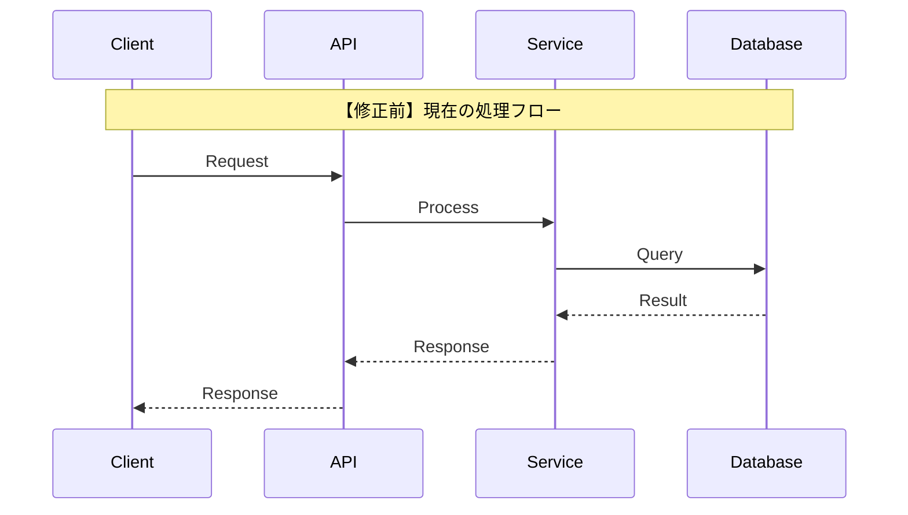
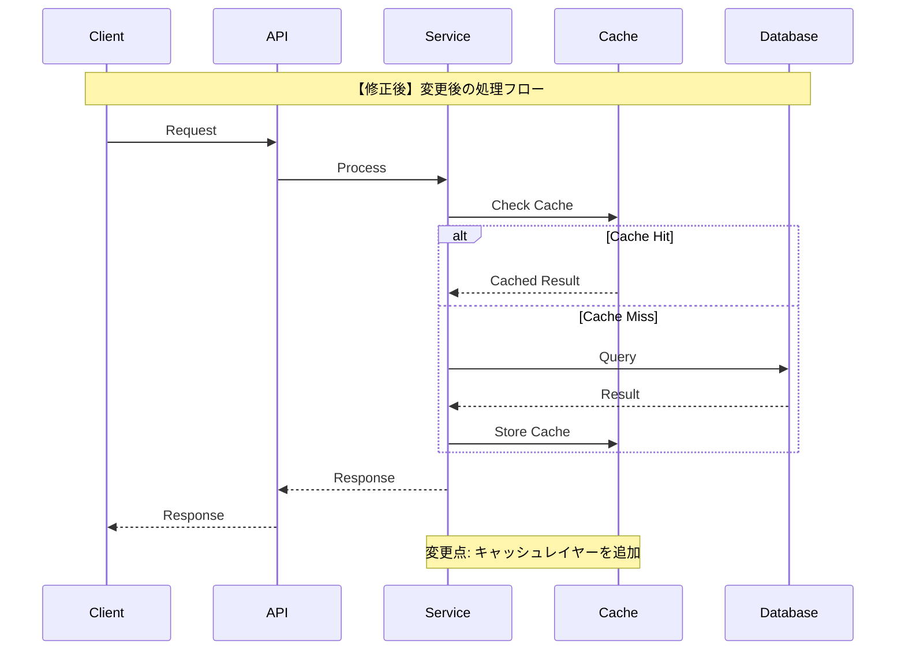

# 開発設計スキル

setup.yaml + design-document + dev-investigation/を入力として、調査結果を基に詳細設計を行い、design-documentの「設計」セクションを更新します。

> **SSOT**: setup.yaml の `description.requirements` を設計の要件として参照します。

## 概要

このスキルは以下を実現します：

1. **setup.yaml** からチケット情報・対象リポジトリを取得
2. **setup.yaml の description.requirements** を設計の要件（機能/非機能）として参照
3. **dev-investigation/** の調査結果を読み込み
4. **dev-design/** ディレクトリに詳細設計結果を出力
5. **design-document** の設計セクションを更新
6. **完了条件** を構造化して定義

## 入力ファイル

### 1. setup.yaml（必須）

```yaml
ticket_id: "PROJ-123"
task_name: "機能追加タスク"

# SSOT: このスキルは description.requirements を参照
description:
  overview: "概要..."
  purpose: "目的..."
  background: "背景..."
  requirements:                    # ← このスキルが参照
    functional:
      - "ユーザーが○○を実行できること"
      - "結果が△△形式で出力されること"
      - "エラー時に適切なメッセージが表示されること"
    non_functional:
      - "応答時間: 200ms以内"
      - "同時リクエスト: 100件/秒対応"
      - "後方互換性を維持"
  acceptance_criteria: [...]
  # ...

target_repositories:
  - name: "target-repo"
    url: "git@github.com:org/target-repo.git"
    base_branch: "main"
```

### 2. design-document: docs/{ticket_id}.md（必須）

init-work-branchスキルで生成された設計ドキュメント。

### 3. dev-investigation/（必須）

dev-investigationスキルで生成された調査結果：

```
{target_repository}/
└── dev-investigation/
    ├── 01_architecture.md
    ├── 02_data-structure.md
    ├── 03_dependencies.md
    ├── 04_existing-patterns.md
    ├── 05_integration-points.md
    └── 06_risks-and-constraints.md
```

## 処理フロー



## setup.yaml の description.requirements 活用

設計を開始する前に、`setup.yaml` の `description.requirements` を読み込み、設計の基準として活用します：

```yaml
# setup.yaml から取得
description:
  requirements:
    functional:
      - "ユーザーが○○を実行できること"
      - "結果が△△形式で出力されること"
    non_functional:
      - "応答時間: 200ms以内"
      - "同時リクエスト: 100件/秒対応"
```

**活用方法:**
- **機能要件** → インターフェース/API設計、データ構造設計の入力
- **非機能要件** → 実装方針決定、テスト計画の入力
- 設計が要件を満たしているかの検証基準として使用

## 設計実施項目

### 1. 実装方針決定（01_implementation-approach.md）

- 調査結果に基づいた最適なアプローチの選定
- 代替案の比較検討
- 採用理由の明確化
- 技術選定の根拠

### 2. インターフェース/API設計（02_interface-api-design.md）

- 公開API・エンドポイントの設計
- 関数シグネチャの定義
- リクエスト/レスポンス形式
- エラーハンドリング方式

### 3. データ構造設計（03_data-structure-design.md）

- エンティティ・モデルの設計
- スキーマ変更の定義
- 型定義・インターフェースの設計
- マイグレーション計画

### 4. 処理フロー設計（04_process-flow-design.md）

- シーケンス図（修正前/修正後の対比）
- 状態遷移図
- エラーフローの定義
- 非同期処理フロー

### 5. テスト計画（05_test-plan.md）

- 新規テストケースの洗い出し
- 既存テストの修正が必要なもの
- テスト方針（単体/結合/E2E）
- テストデータ設計

### 6. 弊害検証計画（06_side-effect-verification.md）

- 副作用が発生しやすい箇所の特定
- 弊害検証として実行すべきテスト
- パフォーマンス検証項目
- セキュリティ検証項目
- 互換性検証項目

## 出力ファイル構成

設計結果は対象リポジトリ直下の `dev-design/` ディレクトリに出力：

```
{target_repository}/
└── dev-design/
    ├── 01_implementation-approach.md    # 実装方針
    ├── 02_interface-api-design.md       # インターフェース/API設計
    ├── 03_data-structure-design.md      # データ構造設計
    ├── 04_process-flow-design.md        # 処理フロー設計
    ├── 05_test-plan.md                  # テスト計画
    └── 06_side-effect-verification.md   # 弊害検証計画
```

## シーケンス図のガイドライン

**重要**: 修正前と修正後を対比可能な形式で記載すること。

### 修正前シーケンス図



### 修正後シーケンス図



### 変更点サマリー

```markdown
## 変更点サマリー

| 項目 | 修正前 | 修正後 | 理由 |
|------|--------|--------|------|
| キャッシュ | なし | Redis導入 | パフォーマンス改善 |
| API呼び出し | 同期 | 非同期 | 応答速度向上 |
```

## テスト計画のガイドライン

### 新規テストケース

```markdown
## 新規テストケース

### 単体テスト

| No | テスト対象 | テスト内容 | 期待結果 |
|----|------------|------------|----------|
| UT-1 | CacheService | キャッシュヒット時の動作 | キャッシュ値を返す |
| UT-2 | CacheService | キャッシュミス時の動作 | DBから取得してキャッシュ保存 |

### 結合テスト

| No | テスト対象 | テスト内容 | 期待結果 |
|----|------------|------------|----------|
| IT-1 | API->Service->Cache | エンドツーエンドフロー | 正常レスポンス |

### E2Eテスト

| No | テストシナリオ | 手順 | 期待結果 |
|----|----------------|------|----------|
| E2E-1 | ユーザーフロー | 1. ログイン 2. データ取得 | 画面表示成功 |
```

### 既存テスト修正

```markdown
## 既存テスト修正

| ファイル | 修正内容 | 理由 |
|----------|----------|------|
| service.test.ts | モック追加 | CacheService依存追加 |
```

## 弊害検証計画のガイドライン

### 副作用分析

```markdown
## 副作用が発生しやすい箇所

| 箇所 | 影響度 | 発生可能性 | 検証方法 |
|------|--------|------------|----------|
| 既存API | 高 | 中 | 回帰テスト |
| データ整合性 | 高 | 低 | 整合性チェック |
```

### 検証項目

```markdown
## 弊害検証項目

### パフォーマンス検証
- [ ] レスポンスタイム測定（目標: 200ms以下）
- [ ] スループット測定（目標: 1000req/s）
- [ ] メモリ使用量確認

### セキュリティ検証
- [ ] 認証・認可の動作確認
- [ ] 入力値検証の確認
- [ ] SQLインジェクション対策確認

### 互換性検証
- [ ] 後方互換性の確認
- [ ] クライアントバージョン互換性
- [ ] データマイグレーション確認
```

## design-document更新内容

`docs/{ticket_id}.md` の「2. 設計」セクションを更新：

```markdown
## 2. 設計

### 2.1 設計方針

{実装方針の要約}

詳細は [dev-design/01_implementation-approach.md](../submodules/{target_repo}/dev-design/01_implementation-approach.md) を参照。

### 2.2 変更箇所

#### 追加ファイル

| ファイル | 目的 |
|----------|------|
| ... | ... |

#### 修正ファイル

| ファイル | 変更内容 |
|----------|----------|
| ... | ... |

#### 削除ファイル

| ファイル | 理由 |
|----------|------|
| ... | ... |

### 2.3 インターフェース設計

{API/インターフェースの要約}

詳細は [dev-design/02_interface-api-design.md](../submodules/{target_repo}/dev-design/02_interface-api-design.md) を参照。

### 2.4 データ構造

{データ構造の要約}

詳細は [dev-design/03_data-structure-design.md](../submodules/{target_repo}/dev-design/03_data-structure-design.md) を参照。
```

## 完了条件の定義

`docs/{ticket_id}.md` の「6.2 承認」セクションを以下の構造に更新：

```markdown
### 6.2 承認

#### 完了条件

##### 実装レビュー完了
- [ ] コード品質確認
  - [ ] コーディング規約準拠
  - [ ] 可読性・保守性確認
  - [ ] 重複コード排除確認
- [ ] 設計方針の遵守確認
  - [ ] 設計書との整合性確認
  - [ ] アーキテクチャ準拠確認
- [ ] セキュリティレビュー完了
  - [ ] 脆弱性チェック
  - [ ] 認証・認可確認
  - [ ] 入力値検証確認

##### テスト完了
- [ ] テスト計画に記載のテスト実行完了
  - [ ] 単体テスト完了
  - [ ] 結合テスト完了
  - [ ] E2Eテスト完了
- [ ] テストカバレッジ確認
  - [ ] 目標カバレッジ達成
  - [ ] 未カバー箇所の妥当性確認
- [ ] テスト結果レポート作成
  - [ ] テスト結果サマリー
  - [ ] 不具合一覧と対応状況

##### 弊害検証完了
- [ ] 弊害検証計画に記載のテスト実行完了
  - [ ] 回帰テスト完了
  - [ ] 副作用確認完了
- [ ] パフォーマンス検証確認
  - [ ] レスポンスタイム確認
  - [ ] スループット確認
  - [ ] リソース使用量確認
- [ ] 弊害検証結果レポート作成
  - [ ] 検証結果サマリー
  - [ ] 発見した問題と対応状況
```

## 実行手順

### 1. setup.yaml読み込み

```bash
YAML_PATH="${1:-setup.yaml}"
test -f "$YAML_PATH" || { echo "Error: $YAML_PATH not found"; exit 1; }
```

### 2. design-document確認

```bash
DOCS_DIR="${options.design_document_dir:-docs}"
DESIGN_DOC="$DOCS_DIR/${ticket_id}.md"
test -f "$DESIGN_DOC" || { echo "Error: $DESIGN_DOC not found"; exit 1; }
```

### 3. dev-investigation/確認

```bash
for repo in "${target_repositories[@]}"; do
    INVESTIGATION_DIR="submodules/${repo}/dev-investigation"
    test -d "$INVESTIGATION_DIR" || { echo "Error: $INVESTIGATION_DIR not found"; exit 1; }
done
```

### 4. 調査結果の読み込みと分析

dev-investigation/配下の各ファイルを読み込み、設計に必要な情報を抽出：

- アーキテクチャ情報
- データ構造情報
- 依存関係情報
- 既存パターン情報
- 統合ポイント情報
- リスク・制約情報

### 5. 設計の実施

各設計項目について、調査結果を基に詳細設計を実施：

1. 実装方針の決定
2. インターフェース/API設計
3. データ構造設計
4. 処理フロー設計（シーケンス図の修正前/修正後対比）
5. テスト計画策定
6. 弊害検証計画策定

### 6. dev-design/配下にファイル生成

```bash
for repo in "${target_repositories[@]}"; do
    DESIGN_DIR="submodules/${repo}/dev-design"
    mkdir -p "$DESIGN_DIR"
    
    # 各設計ファイルを生成
    # 01_implementation-approach.md
    # 02_interface-api-design.md
    # 03_data-structure-design.md
    # 04_process-flow-design.md
    # 05_test-plan.md
    # 06_side-effect-verification.md
done
```

### 7. design-document更新

`docs/{ticket_id}.md` の「2. 設計」セクションと「6.2 承認」セクションを更新。

### 8. コミット

```bash
# 対象サブモジュールでコミット
for repo in "${target_repositories[@]}"; do
    cd "submodules/${repo}"
    git add dev-design/
    git commit -m "docs: {ticket_id} 設計結果を追加"
    cd -
done

# 親リポジトリでコミット
git add .
git commit -m "docs: {ticket_id} 設計結果を追加

- dev-design/配下に詳細設計を出力
- design-documentの設計セクションを更新
- 完了条件を定義"
```

## 完了レポート

```markdown
## 設計完了 ✅

### 設計対象
- チケット: {ticket_id}
- タスク: {task_name}
- リポジトリ: {target_repositories}

### 生成されたファイル

#### design-document更新
- docs/{ticket_id}.md - 設計セクション・完了条件更新

#### 詳細設計結果
- submodules/{target_repo}/dev-design/01_implementation-approach.md
- submodules/{target_repo}/dev-design/02_interface-api-design.md
- submodules/{target_repo}/dev-design/03_data-structure-design.md
- submodules/{target_repo}/dev-design/04_process-flow-design.md
- submodules/{target_repo}/dev-design/05_test-plan.md
- submodules/{target_repo}/dev-design/06_side-effect-verification.md

### 設計サマリー
- 実装方針: {approach_summary}
- 変更ファイル数: {file_count}
- 新規テストケース数: {test_case_count}
- 弊害検証項目数: {verification_item_count}

### 次のステップ
1. 設計レビューを実施
2. タスク計画スキル（task-planning）でタスク分割を実施
3. 実行スキル（execution）で実装を開始
```

## エラーハンドリング

### setup.yamlが見つからない

```
エラー: setup.yamlが見つかりません
ファイル: {yaml_path}

init-work-branchスキルでセットアップを完了してください。
```

### design-documentが見つからない

```
エラー: design-documentが見つかりません
ファイル: docs/{ticket_id}.md

init-work-branchスキルでセットアップを完了してください。
```

### dev-investigation/が見つからない

```
エラー: 調査結果が見つかりません
ディレクトリ: submodules/{repo}/dev-investigation/

dev-investigationスキルで調査を完了してください。
```

## 注意事項

- 設計は `target_repositories` のみ対象
- dev-investigation/が存在しない場合はエラー終了
- 既存の `dev-design/` ディレクトリがある場合は上書き確認を行う
- シーケンス図は必ず修正前/修正後を対比させる
- **setup.yaml の description.requirements を設計の要件として参照**

## 参照ファイル

- 前提スキル: `init-work-branch` - 作業ブランチ初期化
- 前提スキル: `dev-investigation` - 開発タスク用詳細調査
- 後続スキル: `task-planning` - タスク計画
- 後続スキル: `execution` - 実行

## SSOT参照

| setup.yaml フィールド | 用途 |
|----------------------|------|
| `description.requirements.functional` | 機能要件 → API設計、データ構造設計の入力 |
| `description.requirements.non_functional` | 非機能要件 → 実装方針、テスト計画の入力 |

## 典型的なワークフロー

```
[setup.yaml読み込み] --> YAMLをパースしてバリデーション
        |
[design-document確認] --> docs/{ticket_id}.md の存在確認
        |
[dev-investigation/読み込み] --> 調査結果の読み込みと分析
        |
[設計実施] --> 実装方針・API・データ構造・処理フロー設計
        |
[dev-design/生成] --> 設計ファイルを生成
        |
[design-document更新] --> 設計セクション・完了条件を更新
        |
[コミット] --> 変更をコミット
        |
[完了レポート] --> 設計結果を表示
```
