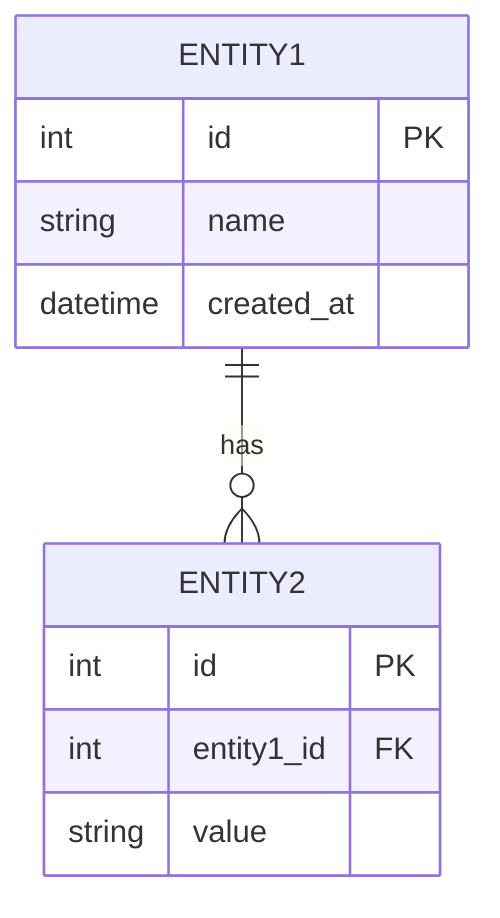
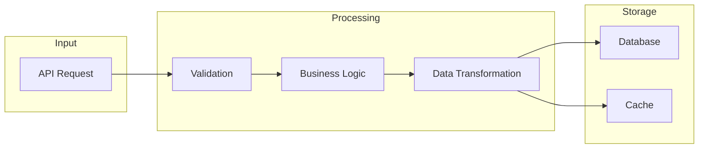

# データ構造設計

## 概要

| 項目 | 内容 |
|------|------|
| チケットID | {{TICKET_ID}} |
| タスク名 | {{TASK_NAME}} |
| 作成日 | {{CREATED_DATE}} |

---

## 1. エンティティ/モデル設計

### 1.1 新規エンティティ



### 1.2 エンティティ定義

| エンティティ名 | 説明 | テーブル名 |
|----------------|------|------------|
| | | |

---

## 2. スキーマ変更

### 2.1 新規テーブル

```sql
CREATE TABLE table_name (
    id INT PRIMARY KEY AUTO_INCREMENT,
    name VARCHAR(255) NOT NULL,
    created_at DATETIME DEFAULT CURRENT_TIMESTAMP
);
```

### 2.2 既存テーブル変更

| テーブル名 | 変更種別 | 変更内容 | 影響 |
|------------|----------|----------|------|
| | ADD COLUMN | | |
| | MODIFY COLUMN | | |
| | DROP COLUMN | | |

---

## 3. 型定義

### 3.1 新規型定義

```typescript
// 新規型定義
type NewType = {
  field1: string;
  field2: number;
  field3?: boolean;
};

// Enum定義
enum Status {
  PENDING = 'pending',
  ACTIVE = 'active',
  COMPLETED = 'completed',
}
```

### 3.2 既存型の変更

| 型名 | 変更前 | 変更後 | 理由 |
|------|--------|--------|------|
| | | | |

---

## 4. データフロー



---

## 5. マイグレーション計画

### 5.1 マイグレーションステップ

| ステップ | 内容 | ロールバック方法 | 実行順序 |
|----------|------|------------------|----------|
| 1 | | | |
| 2 | | | |

### 5.2 データ移行

| 対象 | 移行内容 | 方法 | 検証方法 |
|------|----------|------|----------|
| | | | |

---

## 6. インデックス設計

| テーブル | カラム | インデックス種別 | 目的 |
|----------|--------|------------------|------|
| | | PRIMARY | |
| | | UNIQUE | |
| | | INDEX | |

---

## 変更履歴

| 日付 | バージョン | 変更内容 | 変更者 |
|------|------------|----------|--------|
| {{CREATED_DATE}} | 1.0 | 初版作成 | {{AUTHOR}} |
