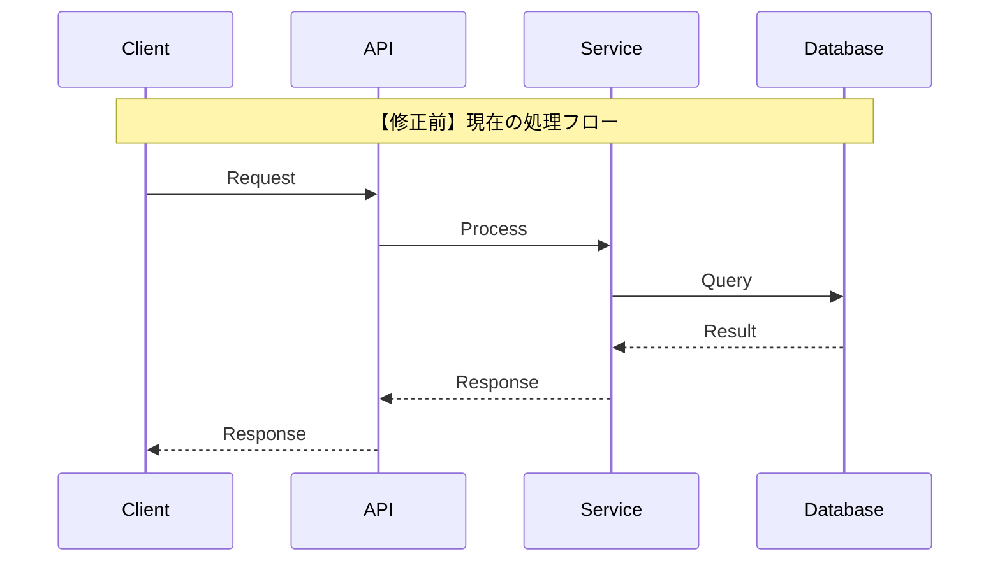
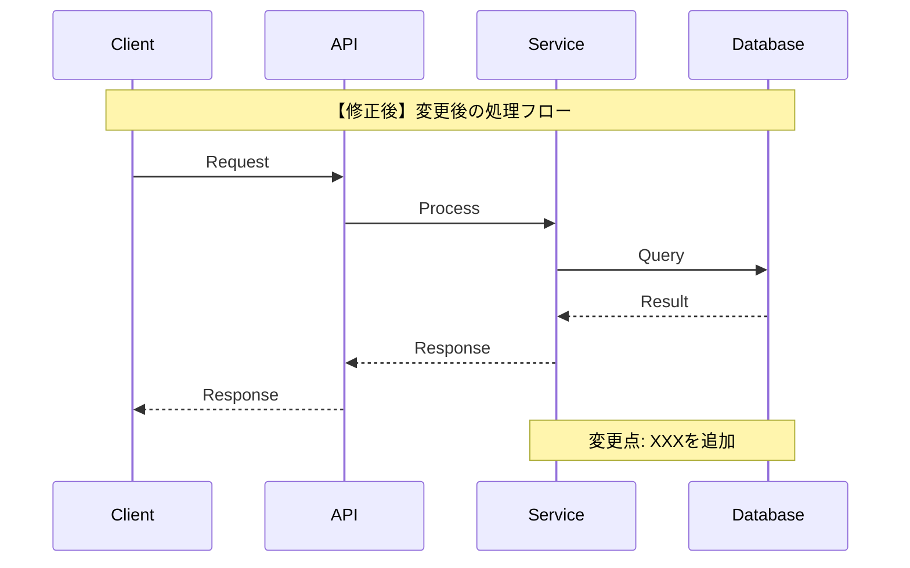
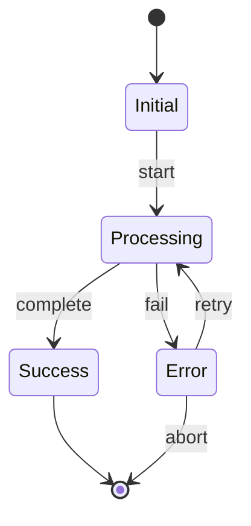
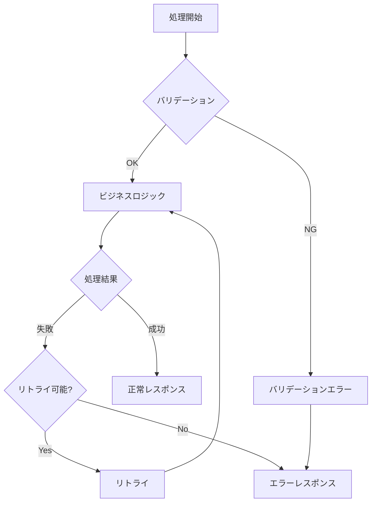
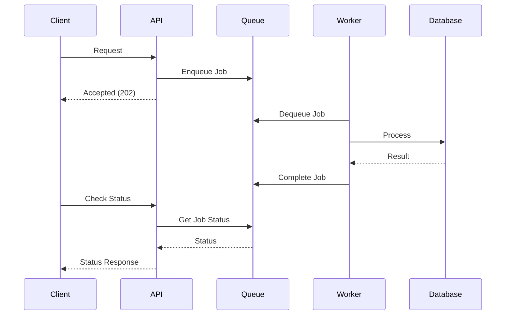
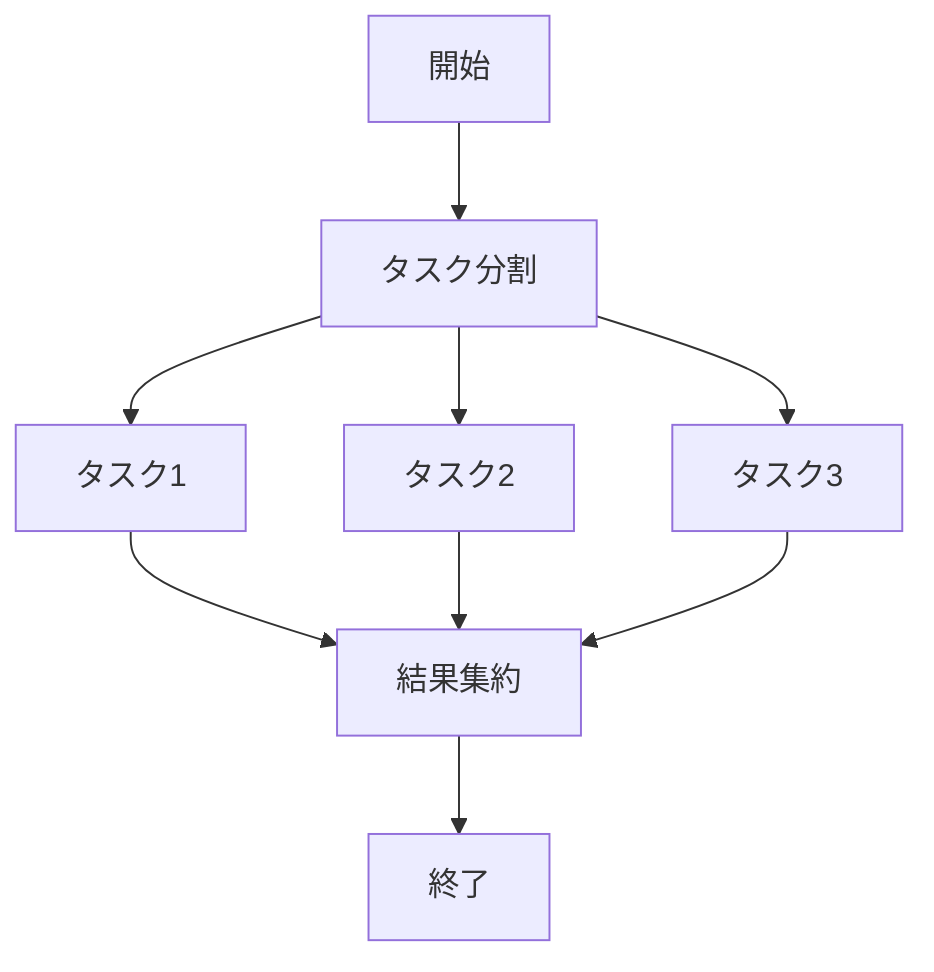

# 処理フロー設計

## 概要

| 項目 | 内容 |
|------|------|
| チケットID | {{TICKET_ID}} |
| タスク名 | {{TASK_NAME}} |
| 作成日 | {{CREATED_DATE}} |

---

## 1. シーケンス図（修正前/修正後対比）

### 1.1 修正前：現在の処理フロー

### 1.2 修正後：変更後の処理フロー

### 1.3 変更点サマリー

| 項目 | 修正前 | 修正後 | 理由 |
|------|--------|--------|------|
| | | | |

---

## 2. 状態遷移図

### 2.1 状態定義

| 状態 | 説明 | 遷移条件（IN） | 遷移条件（OUT） |
|------|------|----------------|-----------------|
| Initial | | | |
| Processing | | | |
| Success | | | |
| Error | | | |

---

## 3. エラーフロー

### 3.1 エラーハンドリングフロー

### 3.2 エラー種別と対応

| エラー種別 | 発生条件 | 対応方法 | リトライ |
|------------|----------|----------|----------|
| | | | |

---

## 4. 非同期処理フロー

### 4.1 非同期処理シーケンス

### 4.2 ジョブ定義

| ジョブ名 | 処理内容 | タイムアウト | リトライ回数 |
|----------|----------|--------------|--------------|
| | | | |

---

## 5. 並行処理

### 5.1 並行処理フロー

### 5.2 排他制御

| リソース | ロック種別 | タイムアウト | デッドロック対策 |
|----------|------------|--------------|------------------|
| | | | |

---

## 変更履歴

| 日付 | バージョン | 変更内容 | 変更者 |
|------|------------|----------|--------|
| {{CREATED_DATE}} | 1.0 | 初版作成 | {{AUTHOR}} |
