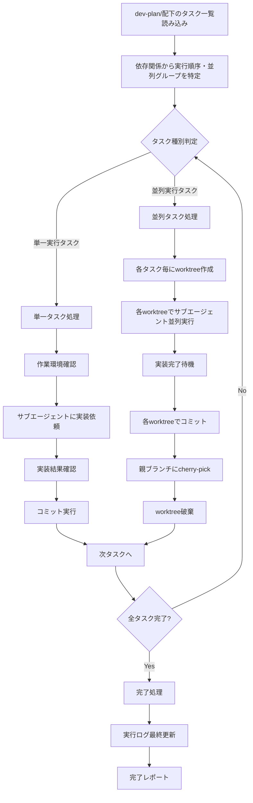

# 開発実装スキル（dev-implement）

dev-planで作成されたタスク計画に従い、サブエージェントへの実装依頼、worktree管理、コミット・cherry-pick統合を行います。

## 概要

このスキルは以下を実現します：

1. **dev-plan/配下のタスク定義読み込み**
2. **依存関係から実行順序・並列グループを特定**
3. **単一/並列タスクの判別と処理振り分け**
4. **Worktreeライフサイクル管理**（作成→使用→破棄）
5. **サブエージェントへの実装依頼と結果統合**
6. **コミット・cherry-pick実行**
7. **実行ログ記録**

## 入力ファイル

### 1. setup.yaml（必須）

```yaml
ticket_id: "PROJ-123"
task_name: "機能追加タスク"
description: "タスクの説明"
target_repositories:
  - name: "target-repo"
    url: "git@github.com:org/target-repo.git"
    base_branch: "main"
```

### 2. design-document: docs/{ticket_id}.md（必須）

init-work-branchスキルで生成された設計ドキュメント。

### 3. dev-plan/（必須）

dev-planスキルで生成されたタスク計画：

```
{target_repository}/
└── dev-plan/
    ├── task-list.md               # タスク一覧と依存関係
    ├── task01.md                  # task01用プロンプト
    ├── task02-01.md               # task02-01用プロンプト
    ├── task02-02.md               # task02-02用プロンプト
    ├── ...                        # 各タスク用プロンプト
    └── parent-agent-prompt.md     # 親エージェント統合管理プロンプト
```

## 出力ファイル

```
{target_repository}/
└── dev-implement/
    └── execution-log.md           # 実行ログ
```

---

## 処理フロー



---

## Worktree管理

詳細は [references/worktree-management-guide.md](references/worktree-management-guide.md) を参照。

### 単一実行タスク

- **作業環境**: 既存のブランチ（feature/{ticket_id}）で作業
- **worktree**: 不要
- **コミット**: 直接実行

### 並列実行タスク

- **ブランチ作成**: `feature/{ticket_id}-{task_id}`
- **worktree作成**: `/tmp/{ticket_id}-{task_id}/`
- **作業完了後**: cherry-pick → worktree破棄

---

## 実行手順

### 1. 前提条件確認

```bash
YAML_PATH="${1:-setup.yaml}"
test -f "$YAML_PATH" || { echo "Error: $YAML_PATH not found"; exit 1; }

# ticket_id取得
TICKET_ID=$(grep 'ticket_id:' "$YAML_PATH" | sed 's/.*: *"\?\([^"]*\)"\?/\1/')

# dev-plan/確認
for repo in "${target_repositories[@]}"; do
    PLAN_DIR="submodules/${repo}/dev-plan"
    test -d "$PLAN_DIR" || { echo "Error: $PLAN_DIR not found"; exit 1; }
done
```

### 2. タスク一覧読み込み

```bash
# task-list.md からタスク一覧を取得
TASK_LIST_PATH="submodules/${repo}/dev-plan/task-list.md"

# タスク識別子、前提条件、並列可否を抽出
# (実際の処理はLLMが行う)
```

### 3. 実行ログ初期化

```bash
IMPL_DIR="submodules/${repo}/dev-implement"
mkdir -p "$IMPL_DIR"

cat > "$IMPL_DIR/execution-log.md" << EOF
# 実装実行ログ

## 実行概要
- **開始時刻**: $(date '+%Y-%m-%d %H:%M:%S')
- **対象ブランチ**: feature/${TICKET_ID}
- **総タスク数**: (読み込み後に更新)

## タスク実行履歴

(実行時に更新)
EOF
```

### 4. 単一タスク実行

```bash
TASK_ID="task01"
REPO_ROOT=$(git rev-parse --show-toplevel)
WORK_DIR="submodules/${repo}"

# 1. 作業ディレクトリ確認
cd "$WORK_DIR"

# 2. サブエージェントに実装依頼
# - task0X.mdプロンプトを読み込み
# - 作業ディレクトリを指定
# - 実装結果を待機

# 3. 実装結果確認
# - テスト通過確認
# - リントチェック
# - 型チェック

# 4. コミット
git add -A
git commit -m "${TASK_ID}: タスク概要"

# 5. 実行ログ更新
cat >> "dev-implement/execution-log.md" << EOF

### ${TASK_ID}
- **ステータス**: 完了
- **実行時刻**: $(date '+%Y-%m-%d %H:%M')
- **成果物**: $(git rev-parse HEAD)
- **結果**: 成功
EOF
```

### 5. 並列タスク実行

詳細は [references/parallel-execution-guide.md](references/parallel-execution-guide.md) を参照。

```bash
TICKET_ID="PROJ-123"
PARALLEL_TASKS=("task02-01" "task02-02")
REPO_ROOT=$(git rev-parse --show-toplevel)

# 1. ベースコミット固定
BASE_COMMIT=$(git rev-parse HEAD)

# 2. 各タスク用worktree作成
for TASK_ID in "${PARALLEL_TASKS[@]}"; do
    BRANCH_NAME="feature/${TICKET_ID}-${TASK_ID}"
    WORKTREE_PATH="/tmp/${TICKET_ID}-${TASK_ID}"
    
    # ブランチ作成
    git branch "$BRANCH_NAME" "$BASE_COMMIT"
    
    # worktree作成
    git worktree add "$WORKTREE_PATH" "$BRANCH_NAME"
    
    echo "Created worktree: $WORKTREE_PATH"
done

# 3. 各worktreeでサブエージェント並列実行
# (background modeでサブエージェント起動)

# 4. 完了待機
# (各サブエージェントの完了を確認)

# 5. 各worktreeでコミット確認
for TASK_ID in "${PARALLEL_TASKS[@]}"; do
    cd "/tmp/${TICKET_ID}-${TASK_ID}"
    COMMIT_HASH=$(git rev-parse HEAD)
    echo "${TASK_ID} commit: $COMMIT_HASH"
done

# 6. 親ブランチでcherry-pick
cd "$REPO_ROOT"
git checkout "feature/${TICKET_ID}"

for TASK_ID in "${PARALLEL_TASKS[@]}"; do
    WORKTREE_PATH="/tmp/${TICKET_ID}-${TASK_ID}"
    cd "$WORKTREE_PATH"
    COMMIT_HASH=$(git rev-parse HEAD)
    
    cd "$REPO_ROOT"
    git cherry-pick "$COMMIT_HASH"
done

# 7. worktree破棄
for TASK_ID in "${PARALLEL_TASKS[@]}"; do
    BRANCH_NAME="feature/${TICKET_ID}-${TASK_ID}"
    WORKTREE_PATH="/tmp/${TICKET_ID}-${TASK_ID}"
    
    git worktree remove "$WORKTREE_PATH" --force
    git branch -D "$BRANCH_NAME"
done
```

---

## コミット管理

### コミットメッセージ形式

```
{task_id}: {タスク概要}

- {変更点1}
- {変更点2}
- {変更点3}
```

### コミット前確認

```bash
# 変更内容確認
git status
git diff --staged

# テスト通過確認
npm test  # または適切なテストコマンド

# リント・型チェック
npm run lint
npm run typecheck
```

### Cherry-pick実行

```bash
# コンフリクトなしの場合
git cherry-pick $COMMIT_HASH

# コンフリクト発生時
git cherry-pick $COMMIT_HASH
# コンフリクト解消後
git add .
git cherry-pick --continue
```

---

## サブエージェント依頼

### 依頼内容

各タスク毎に以下情報を含めて依頼：

1. **task0X.mdで定義されたプロンプト**
2. **作業ディレクトリ（worktreeパス）**
3. **前提条件タスクの成果物への参照**
4. **コミット対象となる成果物の説明**

### 依頼テンプレート

```markdown
## タスク実装依頼

以下のプロンプトに従って実装を行ってください。

### 作業ディレクトリ
/tmp/{ticket_id}-{task_id}/

### タスクプロンプト
[task0X.mdの内容をここに挿入]

### 前提条件
- 前提タスク: {prerequisite_tasks}
- 前提成果物: {artifact_paths}

### 完了時の確認
1. 全テスト通過
2. リントエラーなし
3. 型エラーなし
4. result.md作成
5. コミット実行
```

### 並列実行時の注意

- 各サブエージェントは独立したworktreeで作業
- 同じファイルを編集しないことを前提
- 完了通知を待って次フェーズへ進行

---

## エラーハンドリング

### サブエージェント実装失敗時

```markdown
## 実装失敗レポート

### タスク: {task_id}
- **失敗時刻**: {timestamp}
- **エラー内容**: {error_message}
- **ブロック対象**: {blocked_tasks}

### 対応オプション
1. 再実行（プロンプト修正）
2. ロールバック（worktree破棄）
3. 手動介入

### ロールバック手順
```bash
git worktree remove /tmp/{ticket_id}-{task_id} --force
git branch -D feature/{ticket_id}-{task_id}
```
```

### コミット失敗時

```markdown
## コミット失敗レポート

### タスク: {task_id}
- **失敗理由**: {reason}
- **変更ファイル**: {changed_files}

### 対応オプション
1. 内容確認・修正後に再コミット
2. 変更破棄（git reset）
3. 手動介入
```

### Cherry-pick コンフリクト時

```markdown
## Cherry-pick コンフリクトレポート

### タスク: {task_id}
- **コミット**: {commit_hash}
- **コンフリクトファイル**: {conflict_files}

### 対応手順
1. コンフリクト箇所の確認
```bash
git status
git diff
```

2. 手動解消
   - コンフリクトマーカーを編集
   - 正しい内容に統合

3. 解消後
```bash
git add {conflict_files}
git cherry-pick --continue
```

### 中止する場合
```bash
git cherry-pick --abort
```
```

---

## 実行追跡

### execution-log.md フォーマット

```markdown
# 実装実行ログ

## 実行概要
- **開始時刻**: YYYY-MM-DD HH:MM:SS
- **対象ブランチ**: feature/{ticket_id}
- **総タスク数**: N

## タスク実行履歴

### task01
- **ステータス**: 完了
- **実行時刻**: YYYY-MM-DD HH:MM
- **成果物**: [コミットハッシュ]
- **結果**: 成功

### task02-01 (並列)
- **ステータス**: 完了
- **Worktree**: /tmp/{ticket_id}-task02-01
- **作業環境**: feature/{ticket_id}-task02-01
- **Cherry-pick**: [コミットハッシュ]
- **結果**: 成功

### task02-02 (並列)
- **ステータス**: 完了
- **Worktree**: /tmp/{ticket_id}-task02-02
- **作業環境**: feature/{ticket_id}-task02-02
- **Cherry-pick**: [コミットハッシュ]
- **結果**: 成功

### task03
- **ステータス**: 完了
- **実行時刻**: YYYY-MM-DD HH:MM
- **成果物**: [コミットハッシュ]
- **結果**: 成功

## 完了サマリー
- **終了時刻**: YYYY-MM-DD HH:MM:SS
- **総所要時間**: Xh Ym
- **成功タスク**: N/N
- **失敗タスク**: 0
```

---

## 完了レポート

```markdown
## 実装完了 ✅

### 実装対象
- チケット: {ticket_id}
- タスク: {task_name}
- リポジトリ: {target_repositories}

### 実行結果
- **総タスク数**: {total_count}
- **成功タスク**: {success_count}
- **失敗タスク**: {failure_count}
- **総所要時間**: {duration}

### コミット履歴
| タスク | コミット | メッセージ |
|--------|----------|------------|
| task01 | abc1234 | task01: 基盤準備 |
| task02-01 | def5678 | task02-01: 機能A実装 |
| task02-02 | ghi9012 | task02-02: 機能B実装 |
| task03 | jkl3456 | task03: 統合テスト |

### 生成されたファイル
- dev-implement/execution-log.md

### 次のステップ
1. 実装内容のレビュー
2. design-documentの更新
3. PRの作成
```

---

## 注意事項

- **前提**: dev-planスキルでタスク計画が作成済みであること
- **worktree管理**: 並列タスクのみworktreeを使用
- **コミット順序**: 依存関係を尊重してcherry-pick
- **エラー時**: ロールバック・手動介入オプションを提示
- **品質**: 各タスク完了時にテスト・リント・型チェックを確認

---

## 参照ファイル

- 前提スキル: `dev-plan` - タスク計画作成
- 参照: [references/worktree-management-guide.md](references/worktree-management-guide.md) - Worktree管理ガイド
- 参照: [references/parallel-execution-guide.md](references/parallel-execution-guide.md) - 並列実行管理ガイド

---

## 典型的なワークフロー

```
[setup.yaml読み込み]
        ↓
[dev-plan/タスク一覧読み込み]
        ↓
[依存関係から実行順序特定]
        ↓
[実行ログ初期化]
        ↓
【Phase 1: 単一タスク】
  → task01実行
  → コミット
  → ログ更新
        ↓
【Phase 2: 並列タスク】
  → worktree作成（task02-01, task02-02）
  → サブエージェント並列実行
  → 完了待機
  → 各worktreeでコミット
  → cherry-pick
  → worktree破棄
  → ログ更新
        ↓
【Phase 3: 統合タスク】
  → task03実行
  → コミット
  → ログ更新
        ↓
[完了サマリー作成]
        ↓
[完了レポート出力]
```
