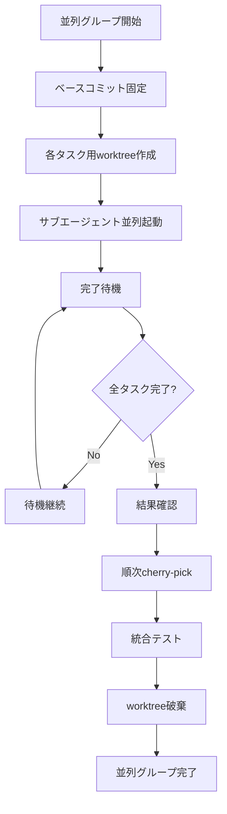

# 並列実行管理ガイド

複数タスクの並列実行とサブエージェント管理のガイド。

---

## 概要

並列実行は、依存関係のないタスクを同時に実行することで、全体の実装時間を短縮する手法です。

### 並列実行の条件

| 条件 | 説明 |
|------|------|
| 相互依存なし | タスク間に依存関係がない |
| ファイル競合なし | 同じファイルを編集しない |
| 共有リソースなし | 同じ状態を変更しない |

---

## 並列実行フロー



---

## 準備フェーズ

### 1. 並列グループの特定

task-list.mdから並列実行可能なタスクを特定：

```markdown
| タスク識別子 | 前提条件 | 並列可否 |
|--------------|----------|----------|
| task01 | なし | 不可 |
| task02-01 | task01 | 可 |      ← 並列グループ
| task02-02 | task01 | 可 |      ← 並列グループ
| task02-03 | task01 | 可 |      ← 並列グループ
| task03 | task02-* | 不可 |
```

### 2. ベースコミット固定

```bash
# task01完了後、並列グループ開始前
cd "$REPO_ROOT"
git checkout "feature/${TICKET_ID}"

BASE_COMMIT=$(git rev-parse HEAD)
echo "Base for parallel tasks: $BASE_COMMIT"
```

### 3. Worktree一括作成

```bash
TICKET_ID="PROJ-123"
PARALLEL_TASKS=("task02-01" "task02-02" "task02-03")

for TASK_ID in "${PARALLEL_TASKS[@]}"; do
    BRANCH_NAME="feature/${TICKET_ID}-${TASK_ID}"
    WORKTREE_PATH="/tmp/${TICKET_ID}-${TASK_ID}"
    
    git branch "$BRANCH_NAME" "$BASE_COMMIT"
    git worktree add "$WORKTREE_PATH" "$BRANCH_NAME"
done
```

---

## サブエージェント起動

### 起動パターン

並列タスクは `mode: "background"` でサブエージェントを起動し、完了を待機します。

```python
# 疑似コード: 並列サブエージェント起動
parallel_agents = []

for task_id in parallel_tasks:
    prompt = read_task_prompt(f"dev-plan/{task_id}.md")
    worktree_path = f"/tmp/{ticket_id}-{task_id}"
    
    agent = start_agent(
        agent_type="general-purpose",
        mode="background",
        prompt=f"""
以下のプロンプトに従って実装を行ってください。

## 作業ディレクトリ
{worktree_path}

## タスクプロンプト
{prompt}

## 完了時
1. 全テスト通過確認
2. コミット実行
3. result.md作成
        """
    )
    
    parallel_agents.append({
        "task_id": task_id,
        "agent_id": agent.id,
        "worktree": worktree_path
    })
```

### 依頼内容テンプレート

各サブエージェントへの依頼内容：

```markdown
## タスク実装依頼: {task_id}

### 作業ディレクトリ
/tmp/{ticket_id}-{task_id}/

重要: 必ず上記ディレクトリ内で作業を行ってください。

### タスクプロンプト
[task0X.mdの内容全文]

### 前提条件
- 前提タスク: task01（完了済み）
- ベースコミット: {base_commit}

### 並列実行の注意
- 他の並列タスク: task02-02, task02-03
- 競合ファイルなし
- 各タスクは独立して実行

### 完了時の確認
1. 全テスト通過
2. リントエラーなし
3. 型エラーなし
4. result.md作成
5. コミット実行（git add -A && git commit）

### コミットメッセージ形式
{task_id}: タスク概要

- 変更点1
- 変更点2
```

---

## 完了待機

### ポーリングパターン

```python
# 疑似コード: 完了待機
import time

MAX_WAIT_TIME = 3600  # 1時間
POLL_INTERVAL = 30    # 30秒

start_time = time.time()

while True:
    all_completed = True
    
    for agent_info in parallel_agents:
        status = check_agent_status(agent_info["agent_id"])
        
        if status == "running":
            all_completed = False
        elif status == "failed":
            handle_failure(agent_info)
            # 失敗時の処理
    
    if all_completed:
        break
    
    if time.time() - start_time > MAX_WAIT_TIME:
        handle_timeout(parallel_agents)
        break
    
    time.sleep(POLL_INTERVAL)
```

### read_agentツール使用

```python
# 各エージェントの結果確認
for agent_info in parallel_agents:
    result = read_agent(
        agent_id=agent_info["agent_id"],
        wait=True,
        timeout=300
    )
    
    if result.status == "completed":
        print(f"{agent_info['task_id']}: 完了")
    else:
        print(f"{agent_info['task_id']}: {result.status}")
```

---

## 結果確認

### 各worktreeの状態確認

```bash
TICKET_ID="PROJ-123"
PARALLEL_TASKS=("task02-01" "task02-02" "task02-03")

for TASK_ID in "${PARALLEL_TASKS[@]}"; do
    WORKTREE_PATH="/tmp/${TICKET_ID}-${TASK_ID}"
    
    echo "=== $TASK_ID ==="
    
    cd "$WORKTREE_PATH"
    
    # コミット確認
    echo "Last commit:"
    git log --oneline -1
    
    # 変更ファイル確認
    echo "Changed files:"
    git diff --name-only HEAD~1
    
    # result.md確認
    if [ -f "result.md" ]; then
        echo "result.md: 存在"
    else
        echo "result.md: なし"
    fi
    
    echo ""
done
```

### 成果物チェックリスト

各並列タスク完了後に確認：

- [ ] コミットが作成されている
- [ ] テストが通過している
- [ ] リントエラーがない
- [ ] 型エラーがない
- [ ] result.mdが作成されている
- [ ] 期待されるファイルが変更されている

---

## Cherry-pick統合

### 統合順序の決定

並列タスク間に優先順位がある場合、その順序でcherry-pick：

```bash
# 例: task02-01 → task02-02 → task02-03 の順
INTEGRATION_ORDER=("task02-01" "task02-02" "task02-03")
```

### 順次cherry-pick実行

```bash
TICKET_ID="PROJ-123"
INTEGRATION_ORDER=("task02-01" "task02-02" "task02-03")
REPO_ROOT=$(git rev-parse --show-toplevel)

cd "$REPO_ROOT"
git checkout "feature/${TICKET_ID}"

for TASK_ID in "${INTEGRATION_ORDER[@]}"; do
    WORKTREE_PATH="/tmp/${TICKET_ID}-${TASK_ID}"
    
    # コミットハッシュ取得
    cd "$WORKTREE_PATH"
    COMMIT_HASH=$(git rev-parse HEAD)
    
    # cherry-pick
    cd "$REPO_ROOT"
    echo "Cherry-picking $TASK_ID: $COMMIT_HASH"
    
    if git cherry-pick "$COMMIT_HASH"; then
        echo "Success: $TASK_ID"
    else
        echo "Conflict: $TASK_ID"
        # コンフリクト処理（後述）
        exit 1
    fi
done

echo "All parallel tasks integrated"
```

### コンフリクト発生時

```bash
# コンフリクト発生
$ git cherry-pick $COMMIT_HASH
error: could not apply abc1234...

# 状態確認
$ git status
both modified:   src/shared.ts

# オプション1: 手動解消
vim src/shared.ts  # コンフリクトマーカーを解消
git add src/shared.ts
git cherry-pick --continue

# オプション2: 中止して報告
git cherry-pick --abort
echo "Cherry-pick conflict in $TASK_ID. Manual intervention required."
```

---

## 統合テスト

### cherry-pick後の確認

```bash
cd "$REPO_ROOT"
git checkout "feature/${TICKET_ID}"

# ビルド確認
npm run build

# テスト実行
npm test

# リント
npm run lint

# 型チェック
npm run typecheck
```

### 失敗時の対応

```bash
# テスト失敗時のロールバック
git reset --hard HEAD~${PARALLEL_TASK_COUNT}

# 再実行または手動修正を検討
```

---

## クリーンアップ

### Worktree一括破棄

```bash
TICKET_ID="PROJ-123"
PARALLEL_TASKS=("task02-01" "task02-02" "task02-03")
REPO_ROOT=$(git rev-parse --show-toplevel)

cd "$REPO_ROOT"

for TASK_ID in "${PARALLEL_TASKS[@]}"; do
    WORKTREE_PATH="/tmp/${TICKET_ID}-${TASK_ID}"
    BRANCH_NAME="feature/${TICKET_ID}-${TASK_ID}"
    
    # worktree削除
    git worktree remove "$WORKTREE_PATH" --force 2>/dev/null || true
    
    # ブランチ削除
    git branch -D "$BRANCH_NAME" 2>/dev/null || true
    
    echo "Cleaned up: $TASK_ID"
done

# 確認
git worktree list
git branch -a | grep "feature/${TICKET_ID}-task"
```

---

## エラーハンドリング

### サブエージェント失敗時

```markdown
## 並列タスク失敗レポート

### 失敗タスク: {task_id}
- **エージェントID**: {agent_id}
- **Worktree**: {worktree_path}
- **エラー内容**: {error_message}

### 影響
- ブロックされるタスク: {blocked_tasks}
- 他の並列タスク: 継続可能

### 対応オプション
1. **再実行**: プロンプト修正後に再依頼
2. **スキップ**: このタスクをスキップして続行
3. **中止**: 並列グループ全体を中止

### 再実行手順
```bash
# worktreeリセット
cd /tmp/{ticket_id}-{task_id}
git reset --hard HEAD

# 再依頼（手動）
```
```

### タイムアウト時

```markdown
## 並列タスクタイムアウト

### タイムアウトタスク: {task_id}
- **経過時間**: {elapsed_time}
- **最大待機時間**: {max_wait_time}
- **最終状態**: {last_status}

### 対応オプション
1. **待機延長**: さらに待機
2. **強制終了**: エージェントを停止
3. **確認**: worktreeで状態確認
```

---

## 実行ログ記録

### 並列タスクのログ形式

```markdown
## 並列グループ: Phase 2

### 開始
- **開始時刻**: YYYY-MM-DD HH:MM:SS
- **ベースコミット**: abc1234
- **タスク数**: 3

### task02-01
- **ステータス**: 完了
- **Worktree**: /tmp/PROJ-123-task02-01
- **ブランチ**: feature/PROJ-123-task02-01
- **コミット**: def5678
- **Cherry-pick**: 成功
- **所要時間**: 15分

### task02-02
- **ステータス**: 完了
- **Worktree**: /tmp/PROJ-123-task02-02
- **ブランチ**: feature/PROJ-123-task02-02
- **コミット**: ghi9012
- **Cherry-pick**: 成功
- **所要時間**: 20分

### task02-03
- **ステータス**: 完了
- **Worktree**: /tmp/PROJ-123-task02-03
- **ブランチ**: feature/PROJ-123-task02-03
- **コミット**: jkl3456
- **Cherry-pick**: 成功
- **所要時間**: 18分

### 統合
- **Cherry-pick順序**: task02-01 → task02-02 → task02-03
- **コンフリクト**: なし
- **統合テスト**: 通過
- **最終コミット**: mno7890

### 完了
- **完了時刻**: YYYY-MM-DD HH:MM:SS
- **総所要時間**: 25分（並列実行により短縮）
```

---

## ベストプラクティス

### 1. 並列タスクの粒度

- 各タスクは30分〜2時間程度で完了する粒度
- 粒度が大きすぎると並列の恩恵が減少
- 粒度が小さすぎるとオーバーヘッドが増加

### 2. ファイル競合の事前確認

```bash
# 各タスクの対象ファイルを確認
# dev-plan/task0X.md の「対象ファイル」セクションを比較
# 重複がないことを確認
```

### 3. 依存関係の明確化

- 並列タスク間に隠れた依存がないか確認
- 共有モジュールへの変更は単一タスクで実施

### 4. 段階的な統合

- cherry-pick後に毎回テスト実行
- 問題発生時に原因特定が容易

### 5. ロールバック準備

```bash
# 統合前のコミットを記録
PRE_INTEGRATION_COMMIT=$(git rev-parse HEAD)

# 問題発生時
git reset --hard $PRE_INTEGRATION_COMMIT
```

---

## 関連ドキュメント

- [SKILL.md](../SKILL.md) - dev-implementスキル定義
- [worktree-management-guide.md](worktree-management-guide.md) - Worktree管理ガイド
