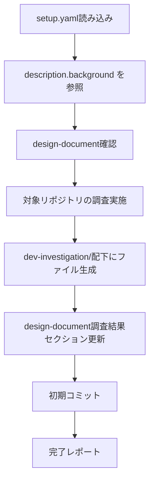
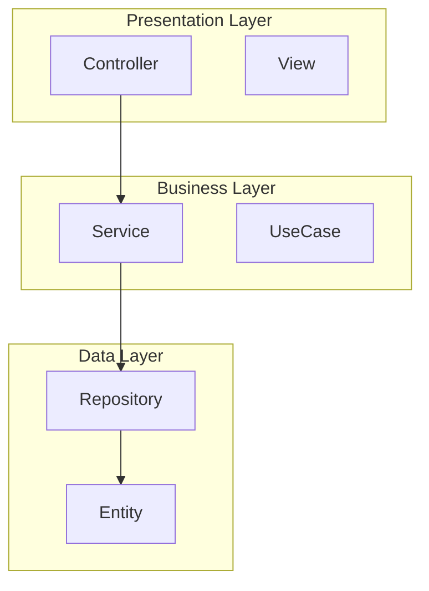
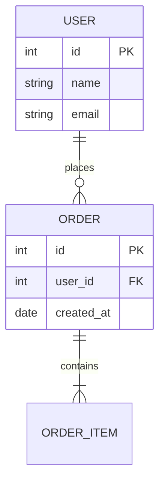
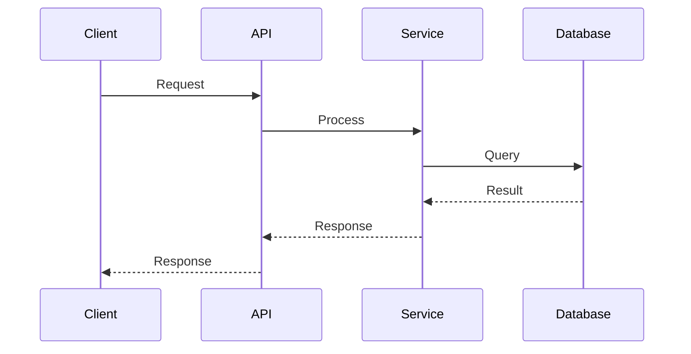
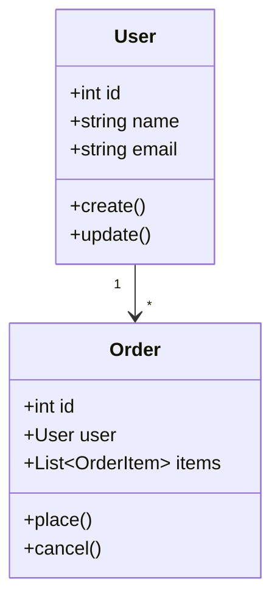
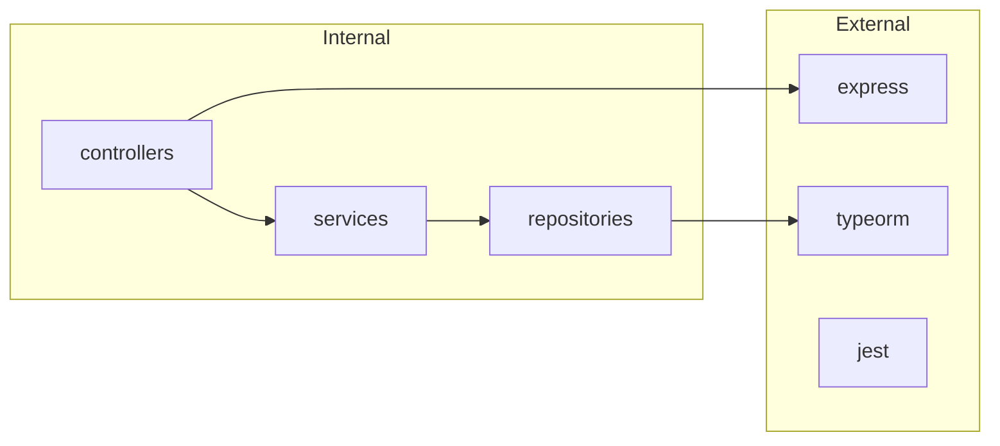

# 開発タスク用詳細調査スキル

setup.yamlとdesign-documentを入力として、対象リポジトリを体系的に調査し、詳細な調査結果をドキュメント化します。

> **SSOT**: setup.yaml の `description.background` を調査の背景情報として参照します。

## 概要

このスキルは以下を実現します：
1. **setup.yaml** から対象リポジトリ・チケット情報を取得
2. **setup.yaml の description.background** を調査の背景・コンテキストとして参照
3. **design-document** の調査結果セクションを要約で更新
4. **dev-investigation/** ディレクトリに詳細調査結果をファイル分割で出力（UML図含む）

## 入力ファイル

### 1. setup.yaml（必須）

```yaml
ticket_id: "PROJ-123"
task_name: "機能追加タスク"

# SSOT: このスキルは description.background を参照
description:
  overview: "概要..."
  purpose: "目的..."
  background: |                    # ← このスキルが参照
    現在の機能では以下の課題がある:
    - 課題1: ○○ができない
    - 課題2: △△に時間がかかる
  requirements:
    functional: [...]
    non_functional: [...]
  # ...

target_repositories:
  - name: "target-repo"
    url: "git@github.com:org/target-repo.git"
    base_branch: "main"
related_repositories:
  - name: "related-repo"
    url: "git@github.com:org/related-repo.git"
```

### 2. design-document: docs/{ticket_id}.md（必須）

init-work-branchスキルで生成された設計ドキュメント。

## 処理フロー



## setup.yaml の description.background 活用

調査を開始する前に、`setup.yaml` の `description.background` を読み込み、以下の情報として活用します：

```yaml
# setup.yaml から取得
description:
  background: |
    現在の機能では以下の課題がある:
    - 課題1: ○○ができない
    - 課題2: △△に時間がかかる
    
    これらの課題を解決するため、機能Aの実装が必要。
```

**活用方法:**
- 調査の焦点を明確にする（どの課題に関連するコードを重点的に調査するか）
- 既存の問題点との関連性を分析する
- 調査結果レポートに背景情報を含める

## 調査実施項目

### 1. アーキテクチャ調査
- プロジェクト全体の構成把握
- ディレクトリ構造・レイヤー構成
- コンポーネント図の作成（Mermaid）

### 2. データ構造調査
- エンティティ・スキーマ定義の把握
- ER図の作成（Mermaid）
- 型定義・インターフェースの整理

### 3. 依存関係調査
- 外部パッケージ依存関係
- 内部モジュール間依存関係
- 依存関係図の作成（Mermaid）

### 4. 既存パターン調査
- コーディング規約・スタイル
- 実装パターン・設計パターン
- テストパターン

### 5. 統合ポイント調査
- 他モジュール・サービスとの接点
- API連携・イベント連携
- シーケンス図の作成（Mermaid）

### 6. リスク・制約分析
- 潜在的な問題点の特定
- 技術的制約・要件制約
- 影響度・発生可能性の評価

## 出力ファイル構成

調査結果は対象リポジトリ直下の `dev-investigation/` ディレクトリに出力：

```
{target_repository}/
└── dev-investigation/
    ├── 01_architecture.md          # アーキテクチャ調査
    ├── 02_data-structure.md        # データ構造調査
    ├── 03_dependencies.md          # 依存関係調査
    ├── 04_existing-patterns.md     # 既存パターン調査
    ├── 05_integration-points.md    # 統合ポイント調査
    └── 06_risks-and-constraints.md # リスク・制約分析
```

各ファイルはテンプレート `references/template.md` に従って作成。

## 調査手法

### アーキテクチャ調査

```bash
# ディレクトリ構造の確認
find . -type d -maxdepth 3 | head -50

# 設定ファイルの確認
find . -name "*.config.*" -o -name "*.json" -o -name "*.yaml" -o -name "*.yml" | head -30

# エントリーポイントの確認
grep -r "main\|index\|app" --include="*.ts" --include="*.js" --include="*.py" -l | head -20
```

### データ構造調査

```bash
# 型定義・インターフェースの検索
grep -r "interface\|type\|class\|entity\|model\|schema" --include="*.ts" --include="*.py" -l | head -30

# ORM/DBスキーマの検索
find . -name "*entity*" -o -name "*model*" -o -name "*schema*" | head -20
```

### 依存関係調査

```bash
# パッケージ依存関係
cat package.json 2>/dev/null || cat pyproject.toml 2>/dev/null || cat requirements.txt 2>/dev/null

# インポート文の分析
grep -r "^import\|^from" --include="*.ts" --include="*.py" | head -50
```

### 既存パターン調査

```bash
# コーディングスタイル設定
cat .eslintrc* .prettierrc* .editorconfig pyproject.toml setup.cfg 2>/dev/null

# テストファイルの構成
find . -name "*.test.*" -o -name "*.spec.*" -o -name "test_*" | head -20
```

### 統合ポイント調査

```bash
# API定義・エンドポイント
grep -r "router\|endpoint\|@Get\|@Post\|api\|route" --include="*.ts" --include="*.py" -l | head -20

# イベント・メッセージング
grep -r "emit\|publish\|subscribe\|event\|listener" --include="*.ts" --include="*.py" -l | head -20
```

## design-document更新内容

`docs/{ticket_id}.md` の「1. 調査結果」セクションを更新：

```markdown
## 1. 調査結果

### 1.1 現状分析

{アーキテクチャ・データ構造・依存関係の要約}

詳細は [dev-investigation/](../submodules/{target_repo}/dev-investigation/) を参照。

### 1.2 関連コード・ファイル

| ファイル | 役割 | 備考 |
|----------|------|------|
| ... | ... | ... |

### 1.3 参考情報

- [アーキテクチャ調査](../submodules/{target_repo}/dev-investigation/01_architecture.md)
- [データ構造調査](../submodules/{target_repo}/dev-investigation/02_data-structure.md)
- [依存関係調査](../submodules/{target_repo}/dev-investigation/03_dependencies.md)
- [既存パターン調査](../submodules/{target_repo}/dev-investigation/04_existing-patterns.md)
- [統合ポイント調査](../submodules/{target_repo}/dev-investigation/05_integration-points.md)
- [リスク・制約分析](../submodules/{target_repo}/dev-investigation/06_risks-and-constraints.md)
```

## UML/図表ガイドライン

Mermaid形式を使用して以下の図を作成：

### コンポーネント図（アーキテクチャ）



### ER図（データ構造）



### シーケンス図（統合ポイント）



### クラス図（オブジェクト構成）



### 依存関係図



## 実行手順

### 1. setup.yaml読み込み

```bash
# setup.yamlの存在確認
YAML_PATH="${1:-setup.yaml}"
test -f "$YAML_PATH" || { echo "Error: $YAML_PATH not found"; exit 1; }
```

YAMLからの情報抽出：
- `ticket_id` - チケットID
- `task_name` - タスク名
- `target_repositories` - 調査対象リポジトリ一覧

### 2. design-document確認

```bash
DOCS_DIR="${options.design_document_dir:-docs}"
DESIGN_DOC="$DOCS_DIR/${ticket_id}.md"
test -f "$DESIGN_DOC" || { echo "Error: $DESIGN_DOC not found"; exit 1; }
```

### 3. 対象リポジトリの調査

各 `target_repository` に対して調査を実施：

```bash
for repo in "${target_repositories[@]}"; do
    REPO_PATH="submodules/${repo}"
    cd "$REPO_PATH"
    
    # dev-investigation ディレクトリ作成
    mkdir -p dev-investigation
    
    # 各調査を実施し、結果をファイルに出力
    # ... (調査処理)
    
    cd -
done
```

### 4. design-document更新

調査結果の要約を `docs/{ticket_id}.md` の「1. 調査結果」セクションに埋め込み。

### 5. コミット

```bash
# 親リポジトリでコミット
git add .
git commit -m "docs: {ticket_id} 調査結果を追加

- dev-investigation/配下に詳細調査結果を出力
- design-documentの調査結果セクションを更新"

# 対象サブモジュールでもコミット
for repo in "${target_repositories[@]}"; do
    cd "submodules/${repo}"
    git add dev-investigation/
    git commit -m "docs: {ticket_id} 調査結果を追加"
    cd -
done
```

## 完了レポート

```markdown
## 調査完了 ✅

### 調査対象
- チケット: {ticket_id}
- タスク: {task_name}
- リポジトリ: {target_repositories}

### 生成されたファイル

#### design-document更新
- docs/{ticket_id}.md - 調査結果セクション更新

#### 詳細調査結果
- submodules/{target_repo}/dev-investigation/01_architecture.md
- submodules/{target_repo}/dev-investigation/02_data-structure.md
- submodules/{target_repo}/dev-investigation/03_dependencies.md
- submodules/{target_repo}/dev-investigation/04_existing-patterns.md
- submodules/{target_repo}/dev-investigation/05_integration-points.md
- submodules/{target_repo}/dev-investigation/06_risks-and-constraints.md

### 次のステップ
1. 調査結果をレビュー
2. 設計スキル（design）を使用して詳細設計を開始
3. タスク計画スキル（task-planning）でタスク分割を実施
```

## エラーハンドリング

### setup.yamlが見つからない
```
エラー: setup.yamlが見つかりません
ファイル: {yaml_path}

init-work-branchスキルでセットアップを完了してください。
```

### design-documentが見つからない
```
エラー: design-documentが見つかりません
ファイル: docs/{ticket_id}.md

init-work-branchスキルでセットアップを完了してください。
```

### 対象リポジトリにアクセスできない
```
警告: リポジトリにアクセスできません
リポジトリ: submodules/{repo_name}

git submodule update --init を実行してください。
```

## 注意事項

- 調査対象は `target_repositories` のみ（`related_repositories` は参照用）
- 大規模リポジトリの場合、調査に時間がかかる可能性あり
- 既存の `dev-investigation/` ディレクトリがある場合は上書き確認を行う
- **setup.yaml の description.background を調査の背景情報として参照**

## 参照ファイル

- テンプレート: `references/template.md` - 各調査ファイル用テンプレート
- 関連スキル: `init-work-branch` - 作業ブランチ初期化
- 関連スキル: `investigation` - 汎用調査プロセス

## SSOT参照

| setup.yaml フィールド | 用途 |
|----------------------|------|
| `description.background` | 調査の背景情報・コンテキスト |
