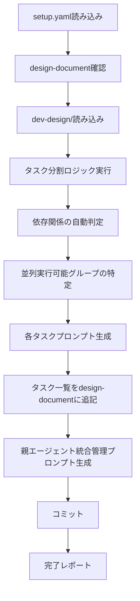
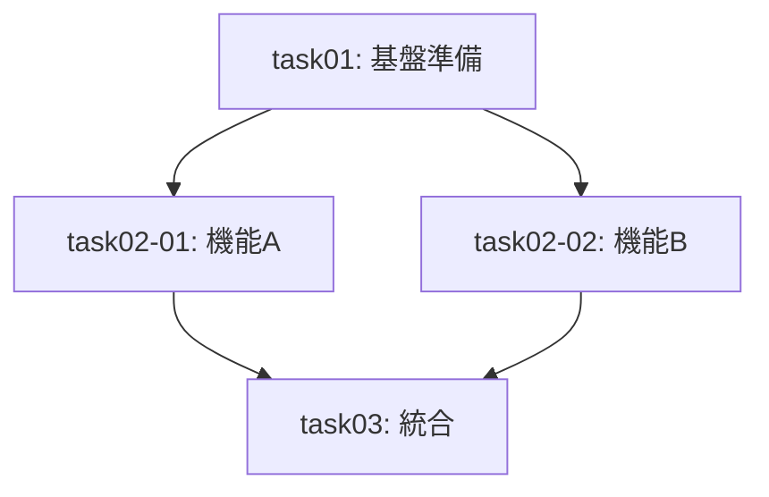

# 開発計画スキル（dev-plan）

setup.yaml + design-documentを入力として、実行可能なタスク計画を作成し、各タスク用プロンプトと親エージェント用統合管理プロンプトを生成します。

**重要**: このスキルは実装を行わず、計画とプロンプト生成のみを担当します。

## 概要

このスキルは以下を実現します：

1. **setup.yaml** からチケット情報・対象リポジトリを取得
2. **design-document** と **dev-design/** から設計内容を読み込み
3. **タスク分割** を実施（依存関係・並列実行可否を判定）
4. **各タスクプロンプト** を生成（TDD方針を組み込み）
5. **design-document** の「3. 実装計画」セクションを更新
6. **親エージェント用統合管理プロンプト** を生成

## 入力ファイル

### 1. setup.yaml（必須）

```yaml
ticket_id: "PROJ-123"
task_name: "機能追加タスク"
description: "タスクの説明"
target_repositories:
  - name: "target-repo"
    url: "git@github.com:org/target-repo.git"
    base_branch: "main"
```

### 2. design-document: docs/{ticket_id}.md（必須）

init-work-branchスキルで生成された設計ドキュメント。

### 3. dev-design/（必須）

dev-designスキルで生成された詳細設計：

```
{target_repository}/
└── dev-design/
    ├── 01_implementation-approach.md
    ├── 02_interface-api-design.md
    ├── 03_data-structure-design.md
    ├── 04_process-flow-design.md
    ├── 05_test-plan.md
    └── 06_side-effect-verification.md
```

## 出力ファイル構成

設計結果は対象リポジトリ直下の `dev-plan/` ディレクトリに出力：

```
{target_repository}/
└── dev-plan/
    ├── task-list.md               # タスク一覧と依存関係（design-document用に追記）
    ├── task01.md                  # task01用プロンプト
    ├── task02-01.md               # task02-01用プロンプト
    ├── task02-02.md               # task02-02用プロンプト
    ├── ...                        # 各タスク用プロンプト
    └── parent-agent-prompt.md     # 親エージェント統合管理プロンプト
```

## 処理フロー



---

## タスク分割ロジック

### 1. 設計内容からタスク識別子の生成

dev-design/の各設計ファイルから以下を抽出してタスク化：

| 設計ファイル | タスク化対象 |
|--------------|--------------|
| 01_implementation-approach.md | 基盤準備タスク |
| 02_interface-api-design.md | API/エンドポイント実装タスク |
| 03_data-structure-design.md | データモデル実装タスク |
| 04_process-flow-design.md | ロジック実装タスク |
| 05_test-plan.md | テスト実装タスク |
| 06_side-effect-verification.md | 弊害検証タスク |

### 2. タスク識別子の命名規則

```
単一実行:     task01, task02, task03
並列実行:     task02-01, task02-02, task02-03
ネスト:       task04-01-a, task04-01-b
```

### 3. 依存関係の自動判定

| 依存パターン | 判定基準 |
|--------------|----------|
| データモデル → API | APIがデータモデルを使用する場合 |
| 基盤 → 機能 | 機能が基盤を前提とする場合 |
| 実装 → テスト | テストが実装を前提とする場合 |
| 機能 → 統合 | 統合が複数機能を前提とする場合 |

### 4. 並列実行可能条件

- 相互に依存関係がない
- 同じファイルを編集しない
- 共有リソースを競合しない

---

## タスクプロンプト生成（task0X.md）

各タスクプロンプトには以下を含める：

**テンプレート**: [references/task-prompt-template.md](references/task-prompt-template.md)

### 必須項目

| 項目 | 説明 |
|------|------|
| タスク識別子 | `task01`, `task02-01` 等 |
| タスク名 | 簡潔な名称 |
| 前提条件タスク | 依存するタスクID |
| 並列実行可否 | 可/不可 |
| 推定所要時間 | 完了までの見積もり |
| 作業内容 | 設計項目から自動抽出 |
| 成果物の説明 | 期待される出力 |
| テスト方針（TDD） | RED-GREEN-REFACTOR |
| 完了条件 | 検証可能な基準 |
| 前提タスク成果物への参照 | 参照パス |

### TDD考慮事項の組み込み

各タスクプロンプトに以下を明記：

```markdown
## テスト方針（TDD: RED-GREEN-REFACTOR）

### RED: 失敗するテストケース
- どんなテストで失敗するか
- テストファイル: `tests/xxx.test.ts`
- テストケース例:
  ```typescript
  test('should handle X scenario', () => {
    // 実装前は失敗する
    expect(fn(input)).toBe(expected);
  });
  ```

### GREEN: 最小限の実装
- 何をテストで成功させるか
- 実装すべき最小限の機能
- 対象ファイル: `src/xxx.ts`

### REFACTOR: コード改善
- どう改善するか
- リファクタリング対象
- 品質向上ポイント
```

---

## design-document更新内容

`docs/{ticket_id}.md` の「3. 実装計画」セクションを更新：

```markdown
## 3. 実装計画

### 3.1 タスク分割

| タスク識別子 | タスク名 | 前提条件 | 並列可否 | 推定時間 | ステータス |
|--------------|----------|----------|----------|----------|------------|
| task01 | 基盤準備 | なし | 不可 | 1h | ⬜ 未着手 |
| task02-01 | 機能A実装 | task01 | 可 | 2h | ⬜ 未着手 |
| task02-02 | 機能B実装 | task01 | 可 | 2h | ⬜ 未着手 |
| task03 | 統合テスト | task02-01, task02-02 | 不可 | 1h | ⬜ 未着手 |

詳細は [dev-plan/task-list.md](../submodules/{target_repo}/dev-plan/task-list.md) を参照。

### 3.2 依存関係



### 3.3 見積もり

| タスク | 見積もり | 実績 |
|--------|----------|------|
| task01 | 1h | - |
| task02-01 | 2h | - |
| task02-02 | 2h | - |
| task03 | 1h | - |
| **合計** | **6h** | - |
```

---

## 親エージェント統合管理プロンプト

**テンプレート**: [references/parent-agent-template.md](references/parent-agent-template.md)

`parent-agent-prompt.md` には以下を含める：

### 必須項目

1. **全タスク一覧と依存関係グラフ**
2. **並列実行グループの特定**
3. **実行順序**
4. **ブロッカー管理方法**
5. **各タスクプロンプト（task0X.md）への参照**
6. **結果統合方法**
7. **worktree管理手順**
8. **cherry-pickフロー**

---

## 実行手順

### 1. setup.yaml読み込み

```bash
YAML_PATH="${1:-setup.yaml}"
test -f "$YAML_PATH" || { echo "Error: $YAML_PATH not found"; exit 1; }
```

### 2. design-document確認

```bash
DOCS_DIR="${options.design_document_dir:-docs}"
DESIGN_DOC="$DOCS_DIR/${ticket_id}.md"
test -f "$DESIGN_DOC" || { echo "Error: $DESIGN_DOC not found"; exit 1; }
```

### 3. dev-design/確認

```bash
for repo in "${target_repositories[@]}"; do
    DESIGN_DIR="submodules/${repo}/dev-design"
    test -d "$DESIGN_DIR" || { echo "Error: $DESIGN_DIR not found"; exit 1; }
done
```

### 4. 設計内容の分析

dev-design/配下の各ファイルを読み込み、タスク化対象を特定：

- 実装方針からタスク粒度を決定
- API設計からエンドポイント実装タスクを抽出
- データ構造設計からモデル実装タスクを抽出
- 処理フロー設計からロジック実装タスクを抽出
- テスト計画からテスト実装タスクを抽出

### 5. タスク分割の実施

1. タスク識別子の生成
2. 依存関係の判定
3. 並列実行グループの特定
4. 推定所要時間の算出

### 6. 各タスクプロンプト生成

各タスクについて `task0X.md` を生成：

- 設計内容を自動抽出
- TDD方針を組み込み
- 完了条件を明確化

### 7. タスク一覧をdesign-documentに追記

`docs/{ticket_id}.md` の「3. 実装計画」セクションを更新。

### 8. 親エージェント統合管理プロンプト生成

`parent-agent-prompt.md` を生成：

- 全タスク一覧
- 依存関係グラフ
- 実行順序
- worktree管理手順

### 9. コミット

```bash
# 対象サブモジュールでコミット
for repo in "${target_repositories[@]}"; do
    cd "submodules/${repo}"
    git add dev-plan/
    git commit -m "docs: {ticket_id} タスク計画を作成"
    cd -
done

# 親リポジトリでコミット
git add .
git commit -m "docs: {ticket_id} タスク計画を作成

- dev-plan/配下にタスクプロンプトを生成
- design-documentの実装計画セクションを更新
- 親エージェント統合管理プロンプトを生成"
```

---

## 完了レポート

```markdown
## 計画作成完了 ✅

### 計画対象
- チケット: {ticket_id}
- タスク: {task_name}
- リポジトリ: {target_repositories}

### 生成されたファイル

#### design-document更新
- docs/{ticket_id}.md - 実装計画セクション更新

#### タスク計画
- submodules/{target_repo}/dev-plan/task-list.md
- submodules/{target_repo}/dev-plan/task01.md
- submodules/{target_repo}/dev-plan/task02-01.md
- submodules/{target_repo}/dev-plan/task02-02.md
- ...
- submodules/{target_repo}/dev-plan/parent-agent-prompt.md

### 計画サマリー
- 総タスク数: {task_count}
- 並列実行グループ数: {parallel_group_count}
- 推定総時間: {total_hours}時間
- クリティカルパス: {critical_path}

### 次のステップ
1. 計画レビューを実施
2. executionスキルで実行を開始
3. 親エージェント（opus-parent-agent）に`parent-agent-prompt.md`を渡す
```

---

## エラーハンドリング

### setup.yamlが見つからない

```
エラー: setup.yamlが見つかりません
ファイル: {yaml_path}

init-work-branchスキルでセットアップを完了してください。
```

### design-documentが見つからない

```
エラー: design-documentが見つかりません
ファイル: docs/{ticket_id}.md

init-work-branchスキルでセットアップを完了してください。
```

### dev-design/が見つからない

```
エラー: 設計結果が見つかりません
ディレクトリ: submodules/{repo}/dev-design/

dev-designスキルで設計を完了してください。
```

---

## 注意事項

- **実装は行わない**: このスキルは計画とプロンプト生成のみ
- 設計内容から自動的にタスクを抽出
- TDD方針を全タスクプロンプトに組み込み
- 並列実行可能なタスクは明確にグループ化
- 既存の `dev-plan/` ディレクトリがある場合は上書き確認

---

## 参照ファイル

- 前提スキル: `init-work-branch` - 作業ブランチ初期化
- 前提スキル: `dev-investigation` - 開発タスク用詳細調査
- 前提スキル: `dev-design` - 設計
- 後続スキル: `execution` - 実行

## 参照テンプレート

- [references/task-prompt-template.md](references/task-prompt-template.md) - タスクプロンプトテンプレート
- [references/parent-agent-template.md](references/parent-agent-template.md) - 親エージェント用テンプレート

---

## 典型的なワークフロー

```
[setup.yaml読み込み]
        ↓
[design-document確認]
        ↓
[dev-design/読み込み]
        ↓
[タスク分割ロジック実行]
  → 設計内容からタスク識別子の生成
  → 依存関係の自動判定
  → 並列実行可能グループの特定
        ↓
[各タスクプロンプト生成（task0X.md）]
  → 設計内容を自動抽出
  → TDD方針を組み込み
        ↓
[タスク一覧をdesign-documentに追記]
        ↓
[親エージェント統合管理プロンプト生成]
        ↓
[コミット]
        ↓
[完了レポート]
```
