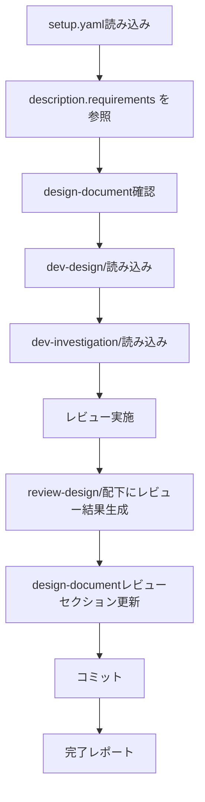

# 設計レビュースキル（review-design）

setup.yaml + design-document + dev-design/を入力として、設計結果の妥当性を体系的にレビューし、レビュー結果をドキュメント化します。

> **SSOT**: setup.yaml の `description.requirements` を設計の妥当性判断基準として参照します。

## 概要

このスキルは以下を実現します：

1. **setup.yaml** からチケット情報・対象リポジトリ・要件を取得
2. **setup.yaml の description.requirements** を設計の妥当性判断基準として参照
3. **design-document** と **dev-design/** から設計内容を読み込み
4. **dev-investigation/** から調査結果を読み込み（設計が調査結果に基づいているか検証）
5. **docs/{target_repo}/review-design/** ディレクトリにレビュー結果を出力
6. **design-document** のレビューセクションを更新

## 入力ファイル

### 1. setup.yaml（必須）

```yaml
ticket_id: "PROJ-123"
task_name: "機能追加タスク"

# SSOT: このスキルは description.requirements を参照
description:
  overview: "概要..."
  purpose: "目的..."
  background: "背景..."
  requirements:                    # ← このスキルが参照
    functional:
      - "ユーザーが○○を実行できること"
      - "結果が△△形式で出力されること"
      - "エラー時に適切なメッセージが表示されること"
    non_functional:
      - "応答時間: 200ms以内"
      - "同時リクエスト: 100件/秒対応"
      - "後方互換性を維持"
  acceptance_criteria: [...]

target_repositories:
  - name: "target-repo"
    url: "git@github.com:org/target-repo.git"
    base_branch: "main"
```

### 2. design-document: docs/{ticket_id}.md（必須）

init-work-branchスキルで生成され、dev-designスキルで設計セクションが更新された設計ドキュメント。

### 3. dev-design/（必須）

dev-designスキルで生成された詳細設計：

```
docs/
└── {target_repository}/
    └── dev-design/
        ├── 01_implementation-approach.md
        ├── 02_interface-api-design.md
        ├── 03_data-structure-design.md
        ├── 04_process-flow-design.md
        ├── 05_test-plan.md
        └── 06_side-effect-verification.md
```

### 4. dev-investigation/（参照）

dev-investigationスキルで生成された調査結果（設計が調査結果に基づいているかの検証に使用）：

```
docs/
└── {target_repository}/
    └── dev-investigation/
        ├── 01_architecture.md
        ├── 02_data-structure.md
        ├── 03_dependencies.md
        ├── 04_existing-patterns.md
        ├── 05_integration-points.md
        └── 06_risks-and-constraints.md
```

## 処理フロー



## setup.yaml の description.requirements 活用

レビューを実施する際に、`setup.yaml` の `description.requirements` を読み込み、設計の妥当性判断基準として活用します：

```yaml
# setup.yaml から取得
description:
  requirements:
    functional:
      - "ユーザーが○○を実行できること"
      - "結果が△△形式で出力されること"
    non_functional:
      - "応答時間: 200ms以内"
      - "同時リクエスト: 100件/秒対応"
```

**活用方法:**
- **機能要件** → インターフェース/API設計が全機能要件をカバーしているか検証
- **非機能要件** → 実装方針・アーキテクチャが非機能要件を満たせるか検証
- 各設計項目が要件に対して過不足ないかの検証基準として使用

## レビュー実施項目

### 1. 要件カバレッジレビュー（01_requirements-coverage.md）

- 機能要件と設計の対応表の作成
- 未カバーの要件がないかの確認
- 過剰設計（スコープ外の設計）がないかの確認
- 非機能要件の充足確認

### 2. 技術的妥当性レビュー（02_technical-validity.md）

- アーキテクチャパターンの選定が適切か
- 技術選定の妥当性
- 既存パターンとの整合性（dev-investigation結果との比較）
- スケーラビリティ・拡張性の考慮
- セキュリティ上の懸念点

### 3. 実装可能性レビュー（03_implementation-feasibility.md）

- 設計が十分に詳細で実装可能か
- 不明確な点・曖昧な記述がないか
- 工数見積もりの妥当性
- 技術的制約との矛盾がないか
- 依存関係の実現可能性

### 4. テスト可能性レビュー（04_testability.md）

- 各コンポーネントが独立してテスト可能な設計か
- テスト計画の網羅性
- テストデータ設計の妥当性
- 弊害検証計画の十分性

### 5. リスク・懸念事項（05_risks-and-concerns.md）

- 設計上のリスク特定
- 調査結果で指摘されたリスクへの対応確認
- パフォーマンスリスク
- セキュリティリスク
- 互換性リスク
- 依存関係リスク

### 6. レビューサマリー（06_review-summary.md）

- 総合判定（承認/条件付き承認/差し戻し）
- 指摘事項一覧（重大度別）
- 改善提案
- 次のステップ

## 出力ファイル構成

レビュー結果は `docs/{target_repository}/review-design/` に出力：

```
docs/
└── {target_repository}/
    └── review-design/
        ├── 01_requirements-coverage.md     # 要件カバレッジレビュー
        ├── 02_technical-validity.md        # 技術的妥当性レビュー
        ├── 03_implementation-feasibility.md # 実装可能性レビュー
        ├── 04_testability.md               # テスト可能性レビュー
        ├── 05_risks-and-concerns.md        # リスク・懸念事項
        └── 06_review-summary.md            # レビューサマリー
```

## レビュー判定基準

### 重大度レベル

| レベル | 説明 | 対応 |
|--------|------|------|
| 🔴 Critical | 設計を根本的に見直す必要がある | 差し戻し：dev-designの再実施が必要 |
| 🟠 Major | 重要な修正が必要 | 条件付き承認：修正後に再レビュー |
| 🟡 Minor | 改善が望ましい | 承認：実装フェーズで対応可能 |
| 🔵 Info | 情報・提案 | 承認：参考情報として記録 |

### 総合判定

| 判定 | 条件 | 次のステップ |
|------|------|-------------|
| ✅ 承認 | Critical/Majorの指摘なし | dev-planスキルへ進行 |
| ⚠️ 条件付き承認 | Majorの指摘あり、Criticalなし | 指摘事項を修正後、再レビュー |
| ❌ 差し戻し | Criticalの指摘あり | dev-designスキルの再実施 |

## design-document更新内容

`docs/{ticket_id}.md` に「2.5 設計レビュー」セクションを追加：

```markdown
### 2.5 設計レビュー

#### レビュー結果

- **総合判定**: {✅ 承認 / ⚠️ 条件付き承認 / ❌ 差し戻し}
- **レビュー日**: {date}

#### 指摘事項サマリー

| No | 重大度 | カテゴリ | 指摘内容 | 対応状況 |
|----|--------|----------|----------|----------|
| 1 | 🟠 Major | 要件カバレッジ | {指摘内容} | ⬜ 未対応 |
| 2 | 🟡 Minor | 技術的妥当性 | {指摘内容} | ⬜ 未対応 |

詳細は [review-design/](./{target_repo}/review-design/) を参照。
```

## 実行手順

### 1. setup.yaml読み込み

```bash
YAML_PATH="${1:-setup.yaml}"
test -f "$YAML_PATH" || { echo "Error: $YAML_PATH not found"; exit 1; }
```

### 2. design-document確認

```bash
DOCS_DIR="${options.design_document_dir:-docs}"
DESIGN_DOC="$DOCS_DIR/${ticket_id}.md"
test -f "$DESIGN_DOC" || { echo "Error: $DESIGN_DOC not found"; exit 1; }
```

### 3. dev-design/確認

```bash
for repo in "${target_repositories[@]}"; do
    DESIGN_DIR="docs/${repo}/dev-design"
    test -d "$DESIGN_DIR" || { echo "Error: $DESIGN_DIR not found"; exit 1; }
done
```

### 4. dev-investigation/確認

```bash
for repo in "${target_repositories[@]}"; do
    INVESTIGATION_DIR="docs/${repo}/dev-investigation"
    test -d "$INVESTIGATION_DIR" || { echo "Warning: $INVESTIGATION_DIR not found. 調査結果との整合性チェックをスキップします。"; }
done
```

### 5. レビューの実施

各設計ファイルについて、レビュー項目に従い検証を実施：

1. **要件カバレッジレビュー**: requirements vs 設計内容の対応確認
2. **技術的妥当性レビュー**: アーキテクチャ・技術選定の適切性
3. **実装可能性レビュー**: 設計の詳細度・明確さ
4. **テスト可能性レビュー**: テスト計画の網羅性
5. **リスク・懸念事項**: リスク分析と対応確認
6. **レビューサマリー**: 総合判定と指摘事項一覧

### 6. review-design/配下にファイル生成

```bash
for repo in "${target_repositories[@]}"; do
    REVIEW_DIR="docs/${repo}/review-design"
    mkdir -p "$REVIEW_DIR"

    # 各レビューファイルを生成
    # 01_requirements-coverage.md
    # 02_technical-validity.md
    # 03_implementation-feasibility.md
    # 04_testability.md
    # 05_risks-and-concerns.md
    # 06_review-summary.md
done
```

### 7. design-document更新

`docs/{ticket_id}.md` に「2.5 設計レビュー」セクションを追加。

### 8. コミット

```bash
# 親リポジトリでコミット（docs配下に出力）
git add docs/ setup.yaml
git commit -m "docs: {ticket_id} 設計レビュー結果を追加

- docs/{target_repo}/review-design/配下にレビュー結果を出力
- design-documentの設計レビューセクションを更新"
```

## 完了レポート

```markdown
## 設計レビュー完了 ✅

### レビュー対象
- チケット: {ticket_id}
- タスク: {task_name}
- リポジトリ: {target_repositories}

### 総合判定
- **判定**: {✅ 承認 / ⚠️ 条件付き承認 / ❌ 差し戻し}

### 指摘事項サマリー
- 🔴 Critical: {count}件
- 🟠 Major: {count}件
- 🟡 Minor: {count}件
- 🔵 Info: {count}件

### 生成されたファイル

#### design-document更新
- docs/{ticket_id}.md - 設計レビューセクション追加

#### レビュー結果
- docs/{target_repo}/review-design/01_requirements-coverage.md
- docs/{target_repo}/review-design/02_technical-validity.md
- docs/{target_repo}/review-design/03_implementation-feasibility.md
- docs/{target_repo}/review-design/04_testability.md
- docs/{target_repo}/review-design/05_risks-and-concerns.md
- docs/{target_repo}/review-design/06_review-summary.md

### 次のステップ
1. ✅ 承認の場合: dev-planスキルでタスク計画を作成
2. ⚠️ 条件付き承認の場合: 指摘事項を修正後、再レビュー
3. ❌ 差し戻しの場合: dev-designスキルで設計を再実施
```

## エラーハンドリング

### setup.yamlが見つからない

```
エラー: setup.yamlが見つかりません
ファイル: {yaml_path}

init-work-branchスキルでセットアップを完了してください。
```

### design-documentが見つからない

```
エラー: design-documentが見つかりません
ファイル: docs/{ticket_id}.md

init-work-branchスキルでセットアップを完了してください。
```

### dev-design/が見つからない

```
エラー: 設計結果が見つかりません
ディレクトリ: docs/{target_repo}/dev-design/

dev-designスキルで設計を完了してください。
```

## 注意事項

- レビューは `target_repositories` の設計のみ対象
- dev-design/が存在しない場合はエラー終了
- dev-investigation/が存在しない場合は警告を出し、調査結果との整合性チェックをスキップ
- 既存の `review-design/` ディレクトリがある場合は上書き確認を行う
- **setup.yaml の description.requirements を設計の妥当性判断基準として参照**
- レビューは客観的な基準に基づいて実施し、主観的な判断は避ける

## 参照ファイル

- 前提スキル: `init-work-branch` - 作業ブランチ初期化
- 前提スキル: `dev-investigation` - 開発タスク用詳細調査
- 前提スキル: `dev-design` - 設計
- 後続スキル: `dev-plan` - タスク計画
- 参照テンプレート: [references/review-template.md](references/review-template.md) - レビューテンプレート

## SSOT参照

| setup.yaml フィールド | 用途 |
|----------------------|------|
| `description.requirements.functional` | 機能要件カバレッジの検証基準 |
| `description.requirements.non_functional` | 非機能要件の充足確認基準 |

## 典型的なワークフロー

```
[setup.yaml読み込み] --> YAMLをパースしてバリデーション
        |
[design-document確認] --> docs/{ticket_id}.md の存在確認
        |
[dev-design/読み込み] --> 設計結果の読み込み
        |
[dev-investigation/読み込み] --> 調査結果の読み込み（任意）
        |
[レビュー実施] --> 要件カバレッジ・技術的妥当性・実装可能性・テスト可能性
        |
[review-design/生成] --> レビュー結果ファイルを生成
        |
[design-document更新] --> レビューセクションを更新
        |
[コミット] --> 変更をコミット
        |
[完了レポート] --> レビュー結果を表示
```
