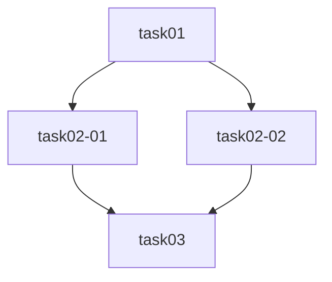

# {{REVIEW_TITLE}}

## 概要

| 項目 | 内容 |
|------|------|
| チケットID | {{TICKET_ID}} |
| タスク名 | {{TASK_NAME}} |
| レビュー日 | {{REVIEW_DATE}} |
| レビュー者 | {{REVIEWER}} |
| タスク計画参照 | [dev-plan/](../dev-plan/) |
| 設計結果参照 | [dev-design/](../dev-design/) |

---

## 1. タスク分割の妥当性

### 1.1 タスク粒度の評価

| タスクID | タスク名 | 推定時間 | 粒度判定 | コメント |
|----------|----------|----------|----------|----------|
| {{task_id}} | {{task_name}} | {{hours}} | ✅ 適切 / ⚠️ 大きすぎ / ⚠️ 小さすぎ | |

### 1.2 設計カバレッジ

| 設計項目 | 対応タスク | カバー状況 | 備考 |
|----------|------------|------------|------|
| {{設計項目}} | {{task_id}} | ✅ カバー / ❌ 未カバー | |

### 1.3 タスク重複チェック

| タスク1 | タスク2 | 重複内容 | 判定 |
|---------|---------|----------|------|
| {{task_id}} | {{task_id}} | {{内容}} | ✅ 重複なし / ⚠️ 重複あり |

---

## 2. 依存関係の正確性

### 2.1 依存関係グラフの検証

### 2.2 依存関係の評価

| 依存元 | 依存先 | 妥当性 | コメント |
|--------|--------|--------|----------|
| {{task_id}} | {{task_id}} | ✅ / ⚠️ / ❌ | |

### 2.3 循環依存チェック

- [ ] 循環依存がないことを確認

### 2.4 並列実行グループの評価

| グループ | タスク | 並列実行可否 | 判定 | コメント |
|----------|--------|-------------|------|----------|
| Group {{n}} | {{task_ids}} | 可/不可 | ✅ / ⚠️ / ❌ | |

---

## 3. 見積もりの妥当性

### 3.1 個別タスク見積もり

| タスクID | 計画見積もり | 妥当性判定 | 推奨見積もり | コメント |
|----------|-------------|------------|-------------|----------|
| {{task_id}} | {{hours}} | ✅ / ⚠️ / ❌ | {{hours}} | |

### 3.2 総見積もり

| 項目 | 値 | 判定 |
|------|-----|------|
| 総工数（直列） | {{hours}} | ✅ / ⚠️ / ❌ |
| 総工数（並列考慮） | {{hours}} | ✅ / ⚠️ / ❌ |
| バッファ | {{hours}} | ✅ / ⚠️ / ❌ |
| クリティカルパス | {{hours}} | ✅ / ⚠️ / ❌ |

---

## 4. TDD方針の適切性

### 4.1 TDD方針の評価

| タスクID | RED定義 | GREEN定義 | REFACTOR定義 | 判定 |
|----------|---------|-----------|-------------|------|
| {{task_id}} | ✅ / ❌ | ✅ / ❌ | ✅ / ❌ | ✅ / ⚠️ / ❌ |

### 4.2 テストケースの網羅性

| テスト種別 | カバレッジ | 判定 | コメント |
|------------|------------|------|----------|
| 単体テスト | {{coverage}} | ✅ / ⚠️ / ❌ | |
| 結合テスト | {{coverage}} | ✅ / ⚠️ / ❌ | |
| E2Eテスト | {{coverage}} | ✅ / ⚠️ / ❌ | |

---

## 5. 受入基準カバレッジ

### 5.1 受入基準の対応

| No | 受入基準 | 対応タスク | 検証方法 | カバー状況 |
|----|----------|------------|----------|------------|
| AC-1 | {{基準}} | {{task_ids}} | {{方法}} | ✅ カバー / ❌ 未カバー |

### 5.2 カバレッジサマリー

- 受入基準カバレッジ: {{covered}}/{{total}} ({{percentage}}%)

---

## 6. 指摘事項一覧

| No | 重大度 | カテゴリ | 指摘内容 | 対応方針 | 対応状況 |
|----|--------|----------|----------|----------|----------|
| 1 | 🔴/🟠/🟡/🔵 | {{カテゴリ}} | {{内容}} | {{方針}} | ⬜ 未対応 |

---

## 7. 総合判定

### 判定: {{✅ 承認 / ⚠️ 条件付き承認 / ❌ 差し戻し}}

### 判定理由

{{判定理由を記述}}

### 改善提案

1. {{提案1}}
2. {{提案2}}

### 次のステップ

- ✅ 承認の場合: dev-implementスキルで実装を開始
- ⚠️ 条件付き承認の場合: 指摘事項を修正後、再レビュー
- ❌ 差し戻しの場合: dev-planスキルでタスク計画を再作成

---

## 変更履歴

| 日付 | バージョン | 変更内容 | 変更者 |
|------|------------|----------|--------|
| {{REVIEW_DATE}} | 1.0 | 初版作成 | {{REVIEWER}} |
