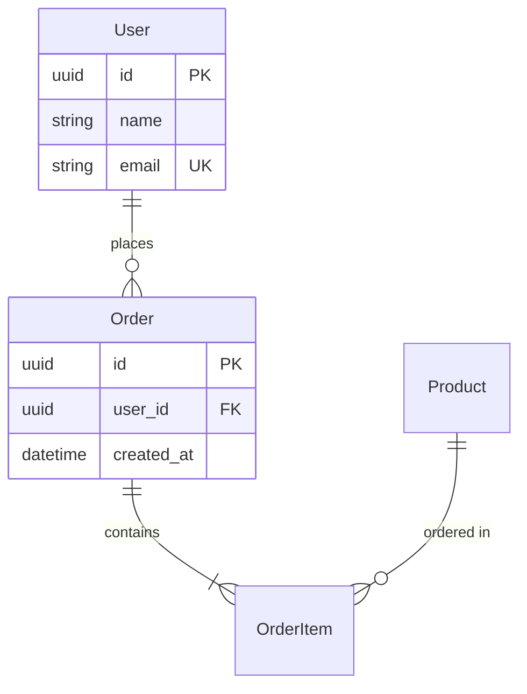
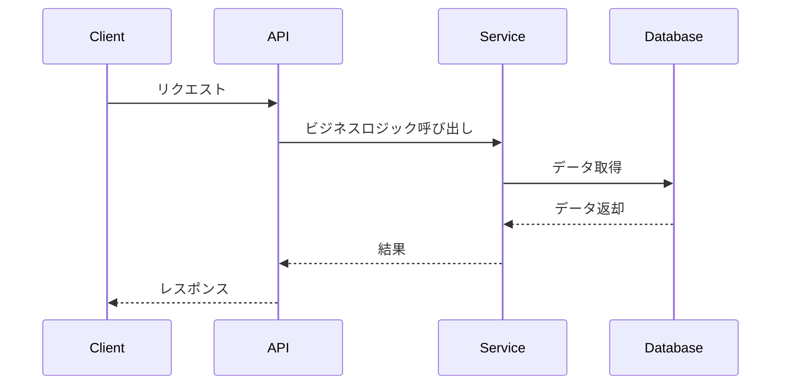
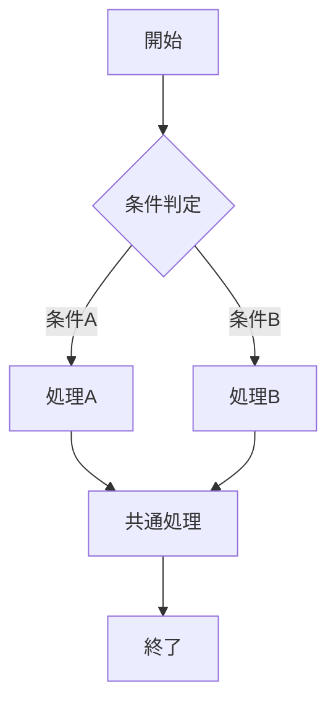
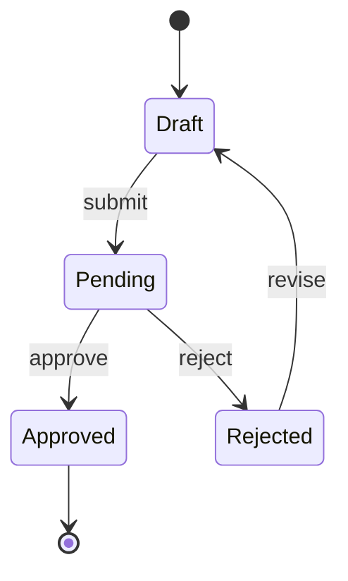

# 設計スキル（Design Skill）

ソリューションのアーキテクチャを決定し、実装可能な設計書を作成します。

## 前提条件

設計プロセスを開始する前に、以下を確認する：

- 調査プロセスの成果物（`investigation-report.md`等）が存在すること
- 要件と制約が明確になっていること
- 技術スタックが決定していること

調査が未完了の場合は、先に調査プロセスを実行すること。

---

## 設計プロセス

設計は以下のステップで進行する：

1. 調査結果の確認と要件整理
2. 実装方針の決定
3. インターフェース・APIの設計
4. データ構造の設計
5. 処理フローの設計
6. テスト戦略の立案
7. 設計書の作成

---

## ステップ1: 調査結果の確認

調査レポートから以下を抽出・整理する：

| 項目 | 確認内容 |
|------|----------|
| 機能要件 | 実現すべき機能の一覧 |
| 非機能要件 | パフォーマンス、セキュリティ等 |
| 技術的制約 | 既存システムとの整合性、使用可能な技術 |
| リスク | 調査で特定されたリスクと対策 |

---

## ステップ2: 実装方針の決定

### アーキテクチャパターンの選択

要件に基づき適切なパターンを選択する：

```
要件分析:
├─ 単純なCRUD操作 → シンプルなレイヤードアーキテクチャ
├─ 複雑なビジネスロジック → ドメイン駆動設計（DDD）
├─ マイクロサービス → サービス分割 + API Gateway
├─ イベント駆動 → Event Sourcing / CQRS
└─ リアルタイム処理 → Pub/Sub パターン
```

### 実装方針の文書化

```markdown
## 実装方針

### 採用するアーキテクチャ
[選択したパターンと理由]

### 主要な設計判断
1. [判断1]: [理由]
2. [判断2]: [理由]

### 技術選定
- 言語: [選定理由]
- フレームワーク: [選定理由]
- データストア: [選定理由]

### 制約事項
- [制約1]
- [制約2]
```

---

## ステップ3: インターフェース・API設計

### API設計の原則

| 原則 | 説明 |
|------|------|
| 一貫性 | 命名規則、レスポンス形式を統一 |
| シンプルさ | 必要最小限のエンドポイント |
| 拡張性 | 将来の変更に対応可能 |
| ドキュメント化 | 自己文書化を意識 |

### REST API設計テンプレート

```markdown
## API: [エンドポイント名]

### エンドポイント
`[METHOD] /api/v1/[resource]`

### リクエスト
- Headers: `Content-Type: application/json`
- Body:
  ```json
  {
    "field1": "type",
    "field2": "type"
  }
  ```

### レスポンス
- Success (200):
  ```json
  {
    "data": {},
    "meta": {}
  }
  ```
- Error (4xx/5xx):
  ```json
  {
    "error": {
      "code": "ERROR_CODE",
      "message": "説明"
    }
  }
  ```
```

### 内部インターフェース設計

```markdown
## インターフェース: [名前]

### 目的
[このインターフェースが解決する問題]

### 定義
```typescript
interface [Name] {
  method1(param: Type): ReturnType;
  method2(param: Type): ReturnType;
}
```

### 実装者
- [実装クラス1]
- [実装クラス2]

### 使用者
- [使用コンポーネント1]
```

---

## ステップ4: データ構造設計

### エンティティ定義

```markdown
## エンティティ: [名前]

### 属性
| 属性名 | 型 | 必須 | 説明 |
|--------|-----|------|------|
| id | UUID | ✓ | 一意識別子 |
| name | string | ✓ | 名前 |
| created_at | datetime | ✓ | 作成日時 |

### 関連
- [関連エンティティ1]: 1対多
- [関連エンティティ2]: 多対多

### 制約
- [制約1]
- [制約2]
```

### ER図（Mermaid形式）



---

## ステップ5: 処理フロー設計

### シーケンス図（Mermaid形式）



### フローチャート（Mermaid形式）



### 状態遷移図（該当する場合）



---

## ステップ6: テスト戦略立案

### テストレベルと方針

| レベル | 対象 | ツール | カバレッジ目標 |
|--------|------|--------|----------------|
| ユニット | 関数・メソッド | [テストフレームワーク] | 80%以上 |
| 結合 | コンポーネント間 | [ツール] | 主要パス |
| E2E | ユーザージャーニー | [ツール] | クリティカルパス |

### テスト計画

```markdown
## テスト計画

### 単体テスト
- [コンポーネント1]: [テスト観点]
- [コンポーネント2]: [テスト観点]

### 結合テスト
- [シナリオ1]: [テスト内容]
- [シナリオ2]: [テスト内容]

### E2Eテスト
- [ユーザーストーリー1]: [テスト手順]
- [ユーザーストーリー2]: [テスト手順]

### 非機能テスト
- パフォーマンス: [基準]
- セキュリティ: [チェック項目]
```

---

## 成果物

設計プロセスでは以下の成果物を作成する：

| ファイル名 | 内容 | 必須 |
|------------|------|------|
| `design-document.md` | 設計書（全体） | ✓ |
| `interface-spec.md` | インターフェース仕様 | API/IF設計時 |
| `data-structure.md` | データ構造定義 | データ設計時 |
| `flow-diagram.md` | 処理フロー図 | 複雑なフロー時 |

### 設計書テンプレート

詳細なテンプレートは [references/design-templates.md](references/design-templates.md) を参照。

---

## 設計レビューチェックリスト

設計完了時に以下を確認する：

```markdown
## 設計レビューチェックリスト

### 要件との整合性
- [ ] 全ての機能要件が設計に反映されている
- [ ] 非機能要件（性能、セキュリティ等）が考慮されている

### 技術的妥当性
- [ ] 選択したアーキテクチャは要件に適切
- [ ] 技術的制約との矛盾がない
- [ ] スケーラビリティが考慮されている

### 実装可能性
- [ ] 設計が十分に詳細で実装可能
- [ ] 不明確な点が残っていない
- [ ] 実装者が理解できる文書になっている

### テスト可能性
- [ ] 各コンポーネントがテスト可能な設計
- [ ] テスト戦略が明確
```

---

## 参考資料

- [references/design-templates.md](references/design-templates.md) - 設計書テンプレート集
