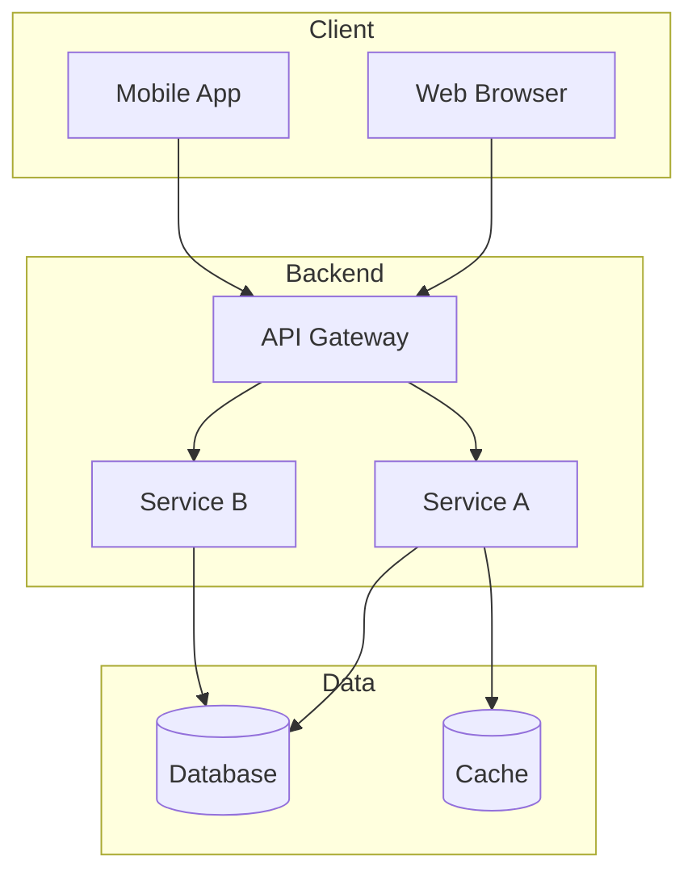
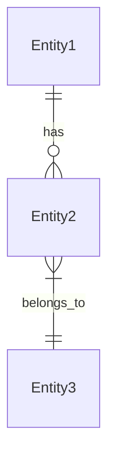
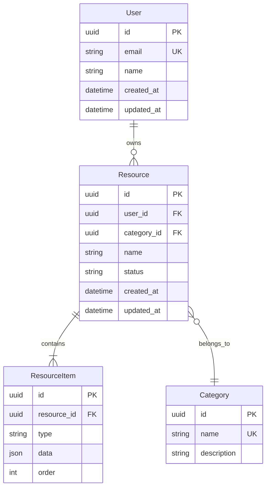
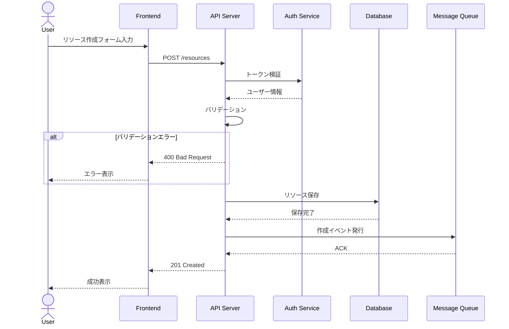
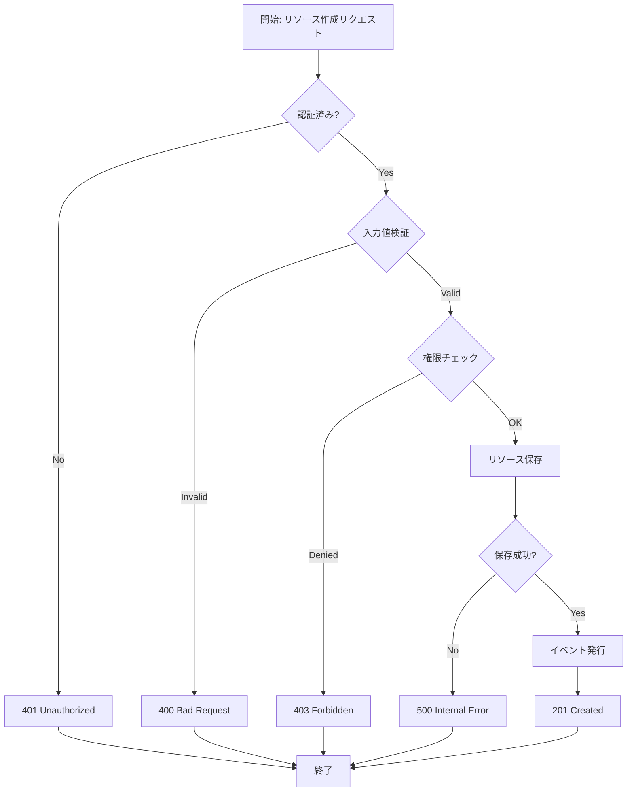
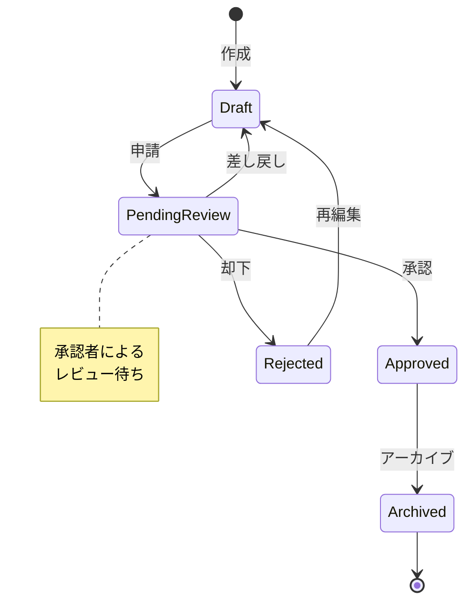
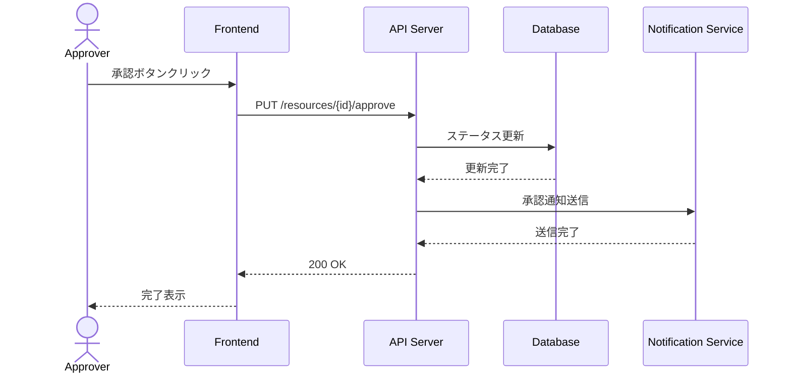

# 設計書テンプレート集

設計プロセスで作成する各成果物のテンプレートを提供します。

---

## 目次

1. [design-document.md - 設計書](#design-documentmd---設計書)
2. [interface-spec.md - インターフェース仕様書](#interface-specmd---インターフェース仕様書)
3. [data-structure.md - データ構造定義書](#data-structuremd---データ構造定義書)
4. [flow-diagram.md - 処理フロー図](#flow-diagrammd---処理フロー図)

---

## design-document.md - 設計書

メインの設計書。全ての設計判断と構成を記載する。

```markdown
# [機能/システム名] 設計書

## 1. 概要

### 1.1 目的
[この設計書の目的と対象範囲]

### 1.2 関連ドキュメント
- 調査レポート: [リンク]
- 要件定義書: [リンク]

### 1.3 用語定義
| 用語 | 定義 |
|------|------|
| [用語1] | [定義] |
| [用語2] | [定義] |

---

## 2. 実装方針

### 2.1 アーキテクチャ概要
[選択したアーキテクチャパターンとその理由]

### 2.2 システム構成図



### 2.3 主要な設計判断

| 判断事項 | 決定内容 | 理由 |
|----------|----------|------|
| [判断1] | [決定] | [理由] |
| [判断2] | [決定] | [理由] |

### 2.4 技術スタック

| レイヤー | 技術 | バージョン | 選定理由 |
|----------|------|------------|----------|
| 言語 | [言語] | [ver] | [理由] |
| フレームワーク | [FW] | [ver] | [理由] |
| データベース | [DB] | [ver] | [理由] |
| インフラ | [インフラ] | - | [理由] |

---

## 3. コンポーネント設計

### 3.1 コンポーネント一覧

| コンポーネント | 責務 | 依存先 |
|----------------|------|--------|
| [Component1] | [責務] | [依存] |
| [Component2] | [責務] | [依存] |

### 3.2 コンポーネント詳細

#### [Component1]

**責務**: [責務の説明]

**インターフェース**:
```typescript
interface Component1 {
  method1(param: ParamType): ReturnType;
  method2(param: ParamType): Promise<ReturnType>;
}
```

**依存関係**:
- [依存コンポーネント1]
- [依存コンポーネント2]

---

## 4. インターフェース設計

詳細は [interface-spec.md](interface-spec.md) を参照。

### 4.1 外部API概要

| エンドポイント | メソッド | 概要 |
|----------------|----------|------|
| `/api/v1/resource` | GET | リソース一覧取得 |
| `/api/v1/resource` | POST | リソース作成 |
| `/api/v1/resource/{id}` | GET | リソース詳細取得 |

---

## 5. データ設計

詳細は [data-structure.md](data-structure.md) を参照。

### 5.1 ER図



---

## 6. 処理フロー

詳細は [flow-diagram.md](flow-diagram.md) を参照。

### 6.1 主要フロー概要

| フロー名 | 概要 | 関連コンポーネント |
|----------|------|-------------------|
| [フロー1] | [概要] | [コンポーネント] |
| [フロー2] | [概要] | [コンポーネント] |

---

## 7. 非機能要件への対応

### 7.1 パフォーマンス

| 指標 | 目標値 | 対策 |
|------|--------|------|
| レスポンス時間 | [値] | [対策] |
| スループット | [値] | [対策] |

### 7.2 セキュリティ

| 脅威 | 対策 |
|------|------|
| [脅威1] | [対策] |
| [脅威2] | [対策] |

### 7.3 可用性

| 要件 | 実現方法 |
|------|----------|
| [要件1] | [方法] |

---

## 8. テスト戦略

### 8.1 テストレベル

| レベル | 対象 | ツール | カバレッジ目標 |
|--------|------|--------|----------------|
| 単体 | [対象] | [ツール] | [目標] |
| 結合 | [対象] | [ツール] | [目標] |
| E2E | [対象] | [ツール] | [目標] |

### 8.2 テストシナリオ

1. [シナリオ1]
2. [シナリオ2]

---

## 9. 実装計画

### 9.1 フェーズ分け

| フェーズ | 内容 | 依存 |
|----------|------|------|
| Phase 1 | [内容] | - |
| Phase 2 | [内容] | Phase 1 |

### 9.2 リスクと対策

| リスク | 影響度 | 対策 |
|--------|--------|------|
| [リスク1] | 高/中/低 | [対策] |

---

## 10. 付録

### 10.1 参考資料
- [資料1]
- [資料2]

### 10.2 変更履歴

| 日付 | 版 | 変更内容 | 作成者 |
|------|-----|----------|--------|
| [日付] | 1.0 | 初版作成 | [名前] |
```

---

## interface-spec.md - インターフェース仕様書

API・インターフェースの詳細仕様を記載する。

```markdown
# インターフェース仕様書

## 1. 概要

このドキュメントは [システム名] のインターフェース仕様を定義する。

---

## 2. 共通仕様

### 2.1 ベースURL
```
https://api.example.com/v1
```

### 2.2 認証
- 方式: Bearer Token
- ヘッダー: `Authorization: Bearer {token}`

### 2.3 共通リクエストヘッダー

| ヘッダー | 必須 | 値 |
|----------|------|-----|
| Content-Type | ○ | application/json |
| Authorization | ○ | Bearer {token} |
| X-Request-Id | - | リクエスト追跡ID |

### 2.4 共通レスポンス形式

**成功時**:
```json
{
  "data": {},
  "meta": {
    "timestamp": "2024-01-01T00:00:00Z"
  }
}
```

**エラー時**:
```json
{
  "error": {
    "code": "ERROR_CODE",
    "message": "エラーメッセージ",
    "details": []
  }
}
```

### 2.5 エラーコード一覧

| コード | HTTPステータス | 説明 |
|--------|----------------|------|
| INVALID_REQUEST | 400 | リクエスト形式エラー |
| UNAUTHORIZED | 401 | 認証エラー |
| FORBIDDEN | 403 | 権限エラー |
| NOT_FOUND | 404 | リソース未存在 |
| INTERNAL_ERROR | 500 | 内部エラー |

---

## 3. エンドポイント一覧

| パス | メソッド | 概要 |
|------|----------|------|
| /resources | GET | リソース一覧取得 |
| /resources | POST | リソース作成 |
| /resources/{id} | GET | リソース詳細取得 |
| /resources/{id} | PUT | リソース更新 |
| /resources/{id} | DELETE | リソース削除 |

---

## 4. エンドポイント詳細

### 4.1 リソース一覧取得

**エンドポイント**: `GET /resources`

**概要**: リソースの一覧を取得する

**クエリパラメータ**:

| パラメータ | 型 | 必須 | デフォルト | 説明 |
|------------|-----|------|------------|------|
| page | integer | - | 1 | ページ番号 |
| limit | integer | - | 20 | 取得件数（最大100） |
| sort | string | - | created_at | ソートフィールド |
| order | string | - | desc | ソート順（asc/desc） |

**レスポンス（200 OK）**:
```json
{
  "data": [
    {
      "id": "uuid",
      "name": "string",
      "created_at": "datetime"
    }
  ],
  "meta": {
    "total": 100,
    "page": 1,
    "limit": 20
  }
}
```

---

### 4.2 リソース作成

**エンドポイント**: `POST /resources`

**概要**: 新規リソースを作成する

**リクエストボディ**:
```json
{
  "name": "string (必須, 1-100文字)",
  "description": "string (任意, 最大1000文字)",
  "config": {
    "option1": "boolean",
    "option2": "string"
  }
}
```

**レスポンス（201 Created）**:
```json
{
  "data": {
    "id": "uuid",
    "name": "string",
    "description": "string",
    "config": {},
    "created_at": "datetime"
  }
}
```

---

## 5. 内部インターフェース

### 5.1 [インターフェース名]

**目的**: [目的の説明]

**定義**:
```typescript
interface IResourceService {
  /**
   * リソースを取得する
   * @param id リソースID
   * @returns リソース、存在しない場合はnull
   */
  findById(id: string): Promise<Resource | null>;
  
  /**
   * リソースを作成する
   * @param input 作成パラメータ
   * @returns 作成されたリソース
   * @throws ValidationError 入力値が不正な場合
   */
  create(input: CreateResourceInput): Promise<Resource>;
}
```

**実装クラス**:
- `ResourceService`

**使用箇所**:
- `ResourceController`
- `BatchProcessor`
```

---

## data-structure.md - データ構造定義書

エンティティ、値オブジェクト、データベーススキーマを定義する。

```markdown
# データ構造定義書

## 1. 概要

このドキュメントは [システム名] のデータ構造を定義する。

---

## 2. ER図



---

## 3. エンティティ定義

### 3.1 User

ユーザー情報を管理するエンティティ。

**属性**:

| 属性名 | 型 | 必須 | デフォルト | 説明 |
|--------|-----|------|------------|------|
| id | UUID | ✓ | auto | 一意識別子 |
| email | string(255) | ✓ | - | メールアドレス（一意） |
| name | string(100) | ✓ | - | 表示名 |
| created_at | datetime | ✓ | now() | 作成日時 |
| updated_at | datetime | ✓ | now() | 更新日時 |

**制約**:
- email は一意であること
- email は有効なメールアドレス形式であること

**インデックス**:
- `idx_user_email` (email) - UNIQUE

---

### 3.2 Resource

リソースを管理するエンティティ。

**属性**:

| 属性名 | 型 | 必須 | デフォルト | 説明 |
|--------|-----|------|------------|------|
| id | UUID | ✓ | auto | 一意識別子 |
| user_id | UUID | ✓ | - | 所有ユーザーID |
| category_id | UUID | - | null | カテゴリID |
| name | string(200) | ✓ | - | リソース名 |
| status | enum | ✓ | 'draft' | ステータス |
| created_at | datetime | ✓ | now() | 作成日時 |
| updated_at | datetime | ✓ | now() | 更新日時 |

**ステータス値**:
- `draft`: 下書き
- `active`: 有効
- `archived`: アーカイブ済み

**関連**:
- User (多対1): 所有者
- Category (多対1): 分類
- ResourceItem (1対多): 構成要素

**インデックス**:
- `idx_resource_user_id` (user_id)
- `idx_resource_status` (status)

---

## 4. 値オブジェクト

### 4.1 Email

メールアドレスを表す値オブジェクト。

```typescript
class Email {
  private readonly value: string;
  
  constructor(value: string) {
    if (!this.isValid(value)) {
      throw new InvalidEmailError(value);
    }
    this.value = value.toLowerCase();
  }
  
  private isValid(value: string): boolean {
    return /^[^\s@]+@[^\s@]+\.[^\s@]+$/.test(value);
  }
  
  toString(): string {
    return this.value;
  }
}
```

---

## 5. マイグレーション

### 5.1 初期スキーマ

```sql
-- Users table
CREATE TABLE users (
    id UUID PRIMARY KEY DEFAULT gen_random_uuid(),
    email VARCHAR(255) NOT NULL UNIQUE,
    name VARCHAR(100) NOT NULL,
    created_at TIMESTAMP WITH TIME ZONE DEFAULT NOW(),
    updated_at TIMESTAMP WITH TIME ZONE DEFAULT NOW()
);

CREATE INDEX idx_user_email ON users(email);

-- Resources table
CREATE TABLE resources (
    id UUID PRIMARY KEY DEFAULT gen_random_uuid(),
    user_id UUID NOT NULL REFERENCES users(id),
    category_id UUID REFERENCES categories(id),
    name VARCHAR(200) NOT NULL,
    status VARCHAR(20) NOT NULL DEFAULT 'draft',
    created_at TIMESTAMP WITH TIME ZONE DEFAULT NOW(),
    updated_at TIMESTAMP WITH TIME ZONE DEFAULT NOW()
);

CREATE INDEX idx_resource_user_id ON resources(user_id);
CREATE INDEX idx_resource_status ON resources(status);
```
```

---

## flow-diagram.md - 処理フロー図

主要な処理フローを図と説明で記載する。

```markdown
# 処理フロー図

## 1. 概要

このドキュメントは [システム名] の主要な処理フローを定義する。

---

## 2. フロー一覧

| フロー名 | 概要 | 複雑度 |
|----------|------|--------|
| リソース作成 | 新規リソースを作成する | 中 |
| リソース承認 | リソースを承認する | 高 |

---

## 3. リソース作成フロー

### 3.1 概要
ユーザーが新規リソースを作成する際のフロー。

### 3.2 シーケンス図



### 3.3 フローチャート



### 3.4 処理詳細

| ステップ | 処理 | 入力 | 出力 | 異常系 |
|----------|------|------|------|--------|
| 1 | 認証確認 | JWT Token | User | 401 |
| 2 | バリデーション | Request Body | - | 400 |
| 3 | 権限確認 | User, Resource | - | 403 |
| 4 | DB保存 | Resource | Resource ID | 500 |
| 5 | イベント発行 | Resource | - | (非同期) |

---

## 4. リソース承認フロー

### 4.1 概要
リソースのステータスを承認済みに変更するフロー。

### 4.2 状態遷移図



### 4.3 シーケンス図



---

## 5. エラーハンドリング

### 5.1 リトライ戦略

| 処理 | リトライ回数 | 間隔 | 対象エラー |
|------|-------------|------|------------|
| DB操作 | 3 | 指数バックオフ | 一時的エラー |
| 外部API | 3 | 1s, 2s, 4s | 5xx, Timeout |
| メッセージ送信 | 5 | 固定1s | 接続エラー |

### 5.2 フォールバック

| 処理 | フォールバック動作 |
|------|-------------------|
| 通知送信失敗 | Dead Letter Queueに格納 |
| キャッシュ取得失敗 | DBから直接取得 |
```
