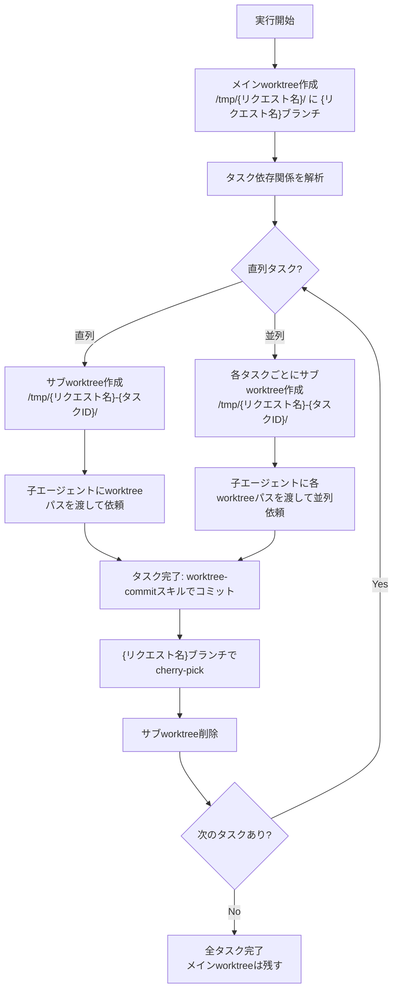

# Execution（実行プロセス）

計画に基づいてタスクを子エージェントに依頼し、git worktreeを活用して並列実行を管理するワークフローガイド。

## 前提条件

実行開始前に以下を確認:

1. **計画成果物の存在**: `task-plan.md`（タスク一覧・依存関係）
2. **出力先ディレクトリ**: `${REQUEST_DIR}/04_実行/` が作成済み
3. **実行履歴ファイル**: `${REQUEST_DIR}/実行履歴.md` が初期化済み
4. **gitリポジトリ**: 作業対象がgitリポジトリであること
5. **クリーンな状態**: 未コミットの変更がないこと（`git status`で確認）

計画がない場合 → planningスキルを先に実行

## 全体フロー図



## 実行フロー

```
1. 計画書（task-plan.md）を読み込み
   ↓
2. メインworktreeを初期化（/tmp/{リクエスト名}/ に {リクエスト名}ブランチ）
   ↓
3. タスク依存関係を解析 → 並列グループを特定
   ↓
4. サブworktreeを作成（/tmp/{リクエスト名}-{タスクID}/）
   ↓
5. タスクを子エージェントに依頼（worktreeパスを含む）
   ↓
6. 完了待機 → worktree-commitスキルでコミット
   ↓
7. メインworktreeでcherry-pick
   ↓
8. サブworktreeを削除
   ↓
9. 実行履歴を更新
   ↓
10. 次の実行可能タスクを特定 → ステップ4へ戻る
   ↓
11. 全タスク完了 → 最終レポート作成（メインworktreeは残す）
```

## Worktree管理

### 初期化：メインworktreeの作成

実行開始時に一度だけ実行:

```bash
# リポジトリのルートディレクトリを取得
REPO_ROOT=$(git rev-parse --show-toplevel)
REQUEST_NAME="リクエスト名"  # 実際のリクエスト名に置換

# 現在のブランチからリクエスト名ブランチを作成
cd $REPO_ROOT
git branch $REQUEST_NAME HEAD 2>/dev/null || echo "ブランチ ${REQUEST_NAME} は既に存在します"

# メインworktreeの作成
git worktree add /tmp/$REQUEST_NAME $REQUEST_NAME
echo "メインworktree作成: /tmp/$REQUEST_NAME"
```

### タスク実行前：サブworktreeの作成

各タスク実行前に実行:

```bash
REQUEST_NAME="リクエスト名"
TASK_ID="task01"  # 実際のタスクIDに置換

# サブブランチ作成（メインworktreeのHEADから分岐）
cd /tmp/$REQUEST_NAME
git branch ${REQUEST_NAME}-${TASK_ID} HEAD

# サブworktreeの作成（リポジトリルートから実行）
cd $REPO_ROOT
git worktree add /tmp/${REQUEST_NAME}-${TASK_ID} ${REQUEST_NAME}-${TASK_ID}
echo "サブworktree作成: /tmp/${REQUEST_NAME}-${TASK_ID}"
```

### worktree一覧の確認

```bash
git worktree list
```

## ブランチ管理

### 命名規則

| 種類 | ブランチ名 | worktreeパス | 用途 |
|------|------------|--------------|------|
| メイン | `{リクエスト名}` | `/tmp/{リクエスト名}/` | 全タスクの成果を集約 |
| サブ | `{リクエスト名}-{タスクID}` | `/tmp/{リクエスト名}-{タスクID}/` | 個別タスクの作業用 |

### cherry-pickフロー

タスク完了後、サブブランチの変更をメインブランチに取り込む:

```bash
REQUEST_NAME="リクエスト名"
TASK_ID="task01"

# 1. サブworktreeでのコミットハッシュを取得
cd /tmp/${REQUEST_NAME}-${TASK_ID}
COMMIT_HASH=$(git rev-parse HEAD)
echo "コミットハッシュ: $COMMIT_HASH"

# 2. メインworktreeに移動してcherry-pick
cd /tmp/$REQUEST_NAME
git cherry-pick $COMMIT_HASH

# 3. 成功確認
git log --oneline -1
```

## タスク依頼の手順

### Step 1: サブworktreeの作成

```bash
REQUEST_NAME="リクエスト名"
TASK_ID="task01"
REPO_ROOT=$(git rev-parse --show-toplevel)

# サブブランチとworktreeを作成
cd /tmp/$REQUEST_NAME
git branch ${REQUEST_NAME}-${TASK_ID} HEAD

cd $REPO_ROOT
git worktree add /tmp/${REQUEST_NAME}-${TASK_ID} ${REQUEST_NAME}-${TASK_ID}
```

### Step 2: 出力先ディレクトリの事前作成

```bash
# 各タスクの出力先を事前作成
mkdir -p "${REQUEST_DIR}/04_実行/task01"
mkdir -p "${REQUEST_DIR}/04_実行/task02-01"
mkdir -p "${REQUEST_DIR}/04_実行/task02-02"
```

### Step 3: 子エージェントへの依頼

依頼プロンプトに必ず含める情報:

| 項目 | 説明 |
|------|------|
| 作業ディレクトリ（worktree） | サブworktreeの絶対パス |
| ブランチ | タスク用ブランチ名 |
| タスク識別子 | `task01`, `task02-01` 等 |
| 成果物出力先 | 絶対パスで指定（必須） |
| 前提タスク成果物 | 参照すべき成果物のパス |
| 具体的な作業内容 | 計画書から抽出 |

**依頼テンプレート**:

```markdown
## 作業環境
- **作業ディレクトリ（worktree）**: /tmp/{リクエスト名}-{タスクID}/
- **ブランチ**: {リクエスト名}-{タスクID}
- **重要**: 必ず上記の作業ディレクトリ内で作業を行ってください

## 作業情報
- タスク識別子: {task-id}
- 成果物出力先: {EXECUTION_DIR}/{task-id}/（絶対パス）
- 前提成果物: {前提タスクの出力先パス}

## 期待される成果物
- `result.md` - タスク実行結果レポート（必須）
- {その他タスク固有の成果物}

## 実行内容
1. 前提条件タスクの結果を確認
2. {具体的なタスク内容}を実装
3. コード品質チェック（lint, test等）
4. 変更内容をドキュメント化

## コミット（必須）
作業完了後、worktree-commitスキルに従ってコミットを実行してください:
- worktreeパス: /tmp/{リクエスト名}-{タスクID}/
- 全変更を `git add -A` でステージング
- 日本語でコミットメッセージを生成
- `git commit` を実行
```

### Step 4: タスク完了後の処理

```bash
REQUEST_NAME="リクエスト名"
TASK_ID="task01"
REPO_ROOT=$(git rev-parse --show-toplevel)

# 1. コミットハッシュ取得
cd /tmp/${REQUEST_NAME}-${TASK_ID}
COMMIT_HASH=$(git rev-parse HEAD)

# 2. メインworktreeでcherry-pick
cd /tmp/$REQUEST_NAME
git cherry-pick $COMMIT_HASH

# 3. サブworktreeの削除
cd $REPO_ROOT
git worktree remove /tmp/${REQUEST_NAME}-${TASK_ID} --force
git branch -D ${REQUEST_NAME}-${TASK_ID}

echo "タスク ${TASK_ID} 完了: cherry-pick済み、worktree削除済み"
```

### Step 5: 結果の確認と記録

タスク完了時、実行履歴ファイルを更新:

```markdown
### {task-id}: {タスク名}
- **ステータス**: ✓ 完了
- **完了時刻**: {timestamp}
- **worktree**: /tmp/{リクエスト名}-{タスクID}/（削除済み）
- **ブランチ**: {リクエスト名}-{タスクID}（削除済み）
- **コミット**: {commit-hash}（cherry-pick済み）
- **成果物出力先**: {path}
- **生成された成果物**: {ファイル一覧}
- **結果概要**: {サマリー}
```

## 並列実行管理

### タスク識別子の形式

| パターン | 例 | 意味 |
|----------|-----|------|
| 単一実行 | `task01`, `task02` | 順次実行タスク |
| 並列実行 | `task02-01`, `task02-02` | 同一グループの並列タスク |
| ネスト | `task04-01-a` | サブタスク |

### 並列タスクのworktree管理

並列タスクの場合、全タスクは同じベース（メインworktreeのHEAD）から分岐:

```bash
REQUEST_NAME="リクエスト名"
REPO_ROOT=$(git rev-parse --show-toplevel)

# 全ての並列タスクは同じベースから分岐
cd /tmp/$REQUEST_NAME
BASE_COMMIT=$(git rev-parse HEAD)
echo "ベースコミット: $BASE_COMMIT"

# 並列タスクそれぞれにサブworktreeを作成
cd $REPO_ROOT
for TASK_ID in task02-01 task02-02; do
    git branch ${REQUEST_NAME}-${TASK_ID} $BASE_COMMIT
    git worktree add /tmp/${REQUEST_NAME}-${TASK_ID} ${REQUEST_NAME}-${TASK_ID}
    echo "並列worktree作成: /tmp/${REQUEST_NAME}-${TASK_ID}"
done
```

### 並列タスク完了後のcherry-pick

並列タスク全完了後、順番にcherry-pick:

```bash
REQUEST_NAME="リクエスト名"
REPO_ROOT=$(git rev-parse --show-toplevel)

# 順番にcherry-pick（コンフリクトに注意）
cd /tmp/$REQUEST_NAME
for TASK_ID in task02-01 task02-02; do
    cd /tmp/${REQUEST_NAME}-${TASK_ID}
    COMMIT_HASH=$(git rev-parse HEAD)
    
    cd /tmp/$REQUEST_NAME
    echo "cherry-pick: ${TASK_ID} (${COMMIT_HASH})"
    git cherry-pick $COMMIT_HASH
    
    # コンフリクト発生時は後述の「コンフリクト対応」セクションを参照
done

# サブworktreeの一括削除
cd $REPO_ROOT
for TASK_ID in task02-01 task02-02; do
    git worktree remove /tmp/${REQUEST_NAME}-${TASK_ID} --force
    git branch -D ${REQUEST_NAME}-${TASK_ID}
done
echo "並列タスク完了: 全worktree削除済み"
```

### 管理ルール

1. **依存関係マップ**: 計画書から抽出し、前提タスク完了を確認
2. **並列グループ化**: 同時実行可能なタスク群を特定
3. **共通ベース**: 並列タスクは必ず同じコミットから分岐
4. **順次cherry-pick**: 並列タスク完了後、一つずつcherry-pick
5. **進行状況監視**: 実行履歴ファイルを継続更新
6. **ブロッカー管理**: 依存タスク未完了時は待機

## コンフリクト対応

### cherry-pick時のコンフリクト

コンフリクトが発生した場合の対応手順:

```bash
# コンフリクト発生時の表示例
# CONFLICT (content): Merge conflict in src/file.ts
# error: could not apply abc1234... タスクの変更

# オプション1: 手動で解消
git status  # コンフリクトファイルを確認
# ファイルを編集してコンフリクトを解消
git add <resolved-files>
git cherry-pick --continue

# オプション2: cherry-pickを中止
git cherry-pick --abort
echo "警告: cherry-pickを中止しました。手動での対応が必要です。"
```

### コンフリクト防止のベストプラクティス

1. **ファイル分割**: 並列タスクは異なるファイルを編集するよう計画
2. **小さなコミット**: タスクを小さく分割してコンフリクト範囲を限定
3. **依存関係の明確化**: 同一ファイルを編集するタスクは直列化

## クリーンアップ

### タスク完了後のworktree削除（自動）

各タスク完了時に自動実行される:

```bash
cd $REPO_ROOT
git worktree remove /tmp/${REQUEST_NAME}-${TASK_ID} --force
git branch -D ${REQUEST_NAME}-${TASK_ID}
```

### 全タスク完了後

メインworktreeは残す（ユーザーが確認・プッシュできるように）:

```bash
# メインworktreeの確認
cd /tmp/$REQUEST_NAME
git log --oneline -10  # 成果を確認

# ユーザーによる手動プッシュ
git push origin $REQUEST_NAME

# 必要に応じてユーザーがクリーンアップ
cd $REPO_ROOT
git worktree remove /tmp/$REQUEST_NAME
git branch -d $REQUEST_NAME  # または -D で強制削除
```

### worktree一覧の確認とクリーンアップ

```bash
# 現在のworktree一覧
git worktree list

# 不要なworktreeを削除
git worktree prune  # 存在しないworktreeの参照を削除
```

## 期待される成果物

各タスク完了時に `result.md` を作成。含める内容:

- 実装完了状況
- 変更ファイル一覧
- テスト結果
- 品質チェック結果
- コミットハッシュ
- 次タスクへの依存情報

## 問題発生時の対応

| 状況 | 対応 |
|------|------|
| タスク失敗 | 原因を記録、サブworktreeを削除、再依頼または代替案を検討 |
| ブロッカー発生 | 実行履歴に記録、依存タスクの完了を待機 |
| 品質チェック失敗 | 修正依頼を発行、完了後に再チェック |
| cherry-pickコンフリクト | 手動解消またはabort、実行履歴に記録 |
| worktree作成失敗 | 既存worktreeを確認、必要に応じてprune実行 |

## リファレンス

詳細な依頼テンプレートと実行履歴の形式は [references/templates.md](references/templates.md) を参照。
