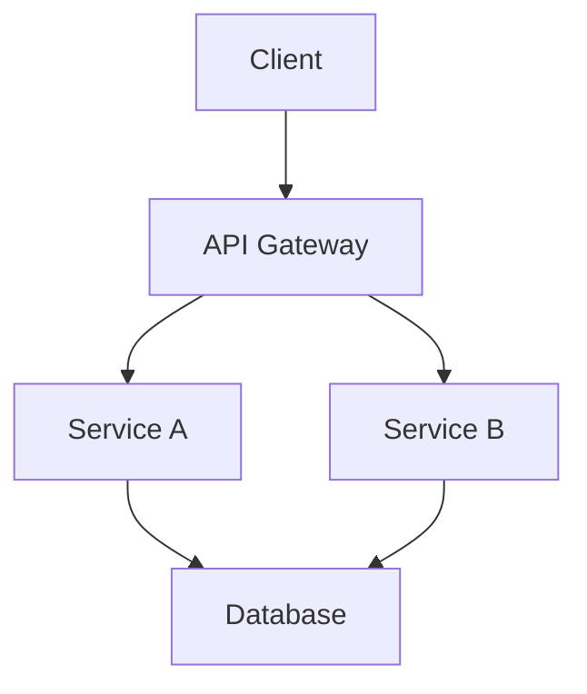

# Investigation（調査プロセス）

コードベースや要件を体系的に調査し、変更を行う前に必要な情報を収集するためのガイド。

## 調査開始時のチェック

調査を開始する前に、以下のファイルが存在する場合は**必ず最初に読み込む**：

1. `README.md` - プロジェクト概要、セットアップ手順
2. `AGENTS.md` - エージェント向けの指示・ガイドライン
3. `CLAUDE.md` - Claude向けの追加コンテキスト

## 調査ワークフロー

調査は以下のステップで実施する：

1. **プロジェクト概要の把握** → README.md, AGENTS.md, CLAUDE.mdの確認
2. **リポジトリ構造の確認** → ディレクトリ構成の把握
3. **関連ファイルの特定** → 調査対象に関連するファイルを探索
4. **既存パターンの調査** → 実装方法・コーディング規約の確認
5. **依存関係の確認** → パッケージ・モジュール間の関係を把握
6. **リスク分析** → 変更による影響・潜在的問題の特定
7. **調査レポート作成** → 発見事項のドキュメント化

## 調査手法

### リポジトリ構造の確認

```bash
# ディレクトリ構造を表示（2階層まで）
find . -maxdepth 2 -type d | head -50

# または tree コマンド（利用可能な場合）
tree -L 2 -d
```

### 関連ファイルの特定

```bash
# 特定のキーワードを含むファイルを検索
grep -r "キーワード" --include="*.ts" --include="*.js"

# ファイル名パターンで検索
find . -name "*.config.*" -o -name "*.json"
```

### 依存関係の確認

| プロジェクトタイプ | 確認ファイル |
|---|---|
| Node.js | `package.json`, `package-lock.json` |
| Python | `pyproject.toml`, `requirements.txt`, `setup.py` |
| .NET | `*.csproj`, `*.sln` |
| Go | `go.mod`, `go.sum` |

### 既存パターンの調査

- 同様の機能がどのように実装されているか確認
- テストの書き方・構成を確認
- エラーハンドリングのパターンを確認
- 命名規則・コーディングスタイルを確認

## 成果物

調査完了後、以下のドキュメントを作成する：

### investigation-report.md（必須）

調査結果をまとめたメインレポート。テンプレートは `references/investigation-report-template.md` を参照。

含める内容：
- 構造概要
- 関連ファイル一覧
- 既存パターン
- 依存関係
- 図表（mermaid形式推奨）

### risk-analysis.md（該当する場合）

リスク分析が必要な場合に作成。テンプレートは `references/risk-analysis-template.md` を参照。

含める内容：
- 特定されたリスク
- 影響度・発生可能性
- 緩和策

## 図表ガイドライン

図表はmermaid形式を推奨。用途に応じて以下を使い分ける：

| 図の種類 | 用途 |
|---|---|
| アーキテクチャ図 | システム全体の構成を可視化 |
| シーケンス図 | 処理フローの時系列表現 |
| クラス図 | クラス間の関係性 |
| 状態遷移図 | 状態変化のモデリング |
| ER図 | データモデルの構造 |

### mermaid例

```markdown
## アーキテクチャ概要


```

## リソース

- `references/investigation-report-template.md` - 調査レポートのテンプレート
- `references/risk-analysis-template.md` - リスク分析のテンプレート
