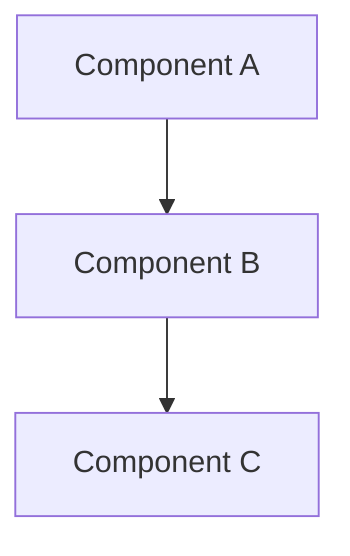
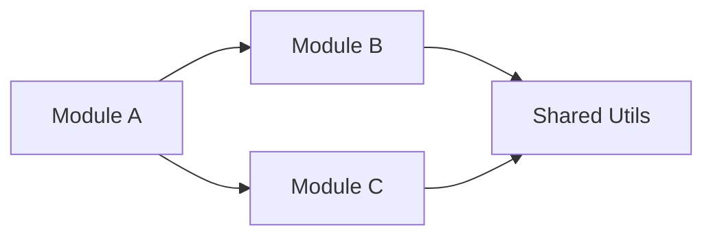

# 調査レポートテンプレート

調査結果をまとめる際のテンプレート。

---

# 調査レポート: {調査対象}

## サマリー

{1-2文で調査結果の要約}

## 調査範囲

- **対象**: {調査対象の概要}
- **目的**: {調査の目的}
- **実施日**: {調査日}

## プロジェクト構造

```
project-root/
├── src/          # {説明}
├── tests/        # {説明}
├── docs/         # {説明}
└── ...
```

## 関連ファイル一覧

| ファイルパス | 役割 | 重要度 |
|---|---|---|
| `path/to/file.ts` | {ファイルの役割} | 高/中/低 |

## アーキテクチャ概要



## 既存パターン

### コーディングスタイル

- {発見したパターン1}
- {発見したパターン2}

### テストパターン

- {テストの書き方}
- {テストファイルの配置}

## 依存関係

### 外部依存

| パッケージ | バージョン | 用途 |
|---|---|---|
| package-name | ^1.0.0 | {用途} |

### 内部依存



## リスク・注意点

| リスク | 影響度 | 対策 |
|---|---|---|
| {リスク内容} | 高/中/低 | {対策} |

## 推奨事項

1. {推奨事項1}
2. {推奨事項2}

## 次のステップ

- [ ] {アクション1}
- [ ] {アクション2}
