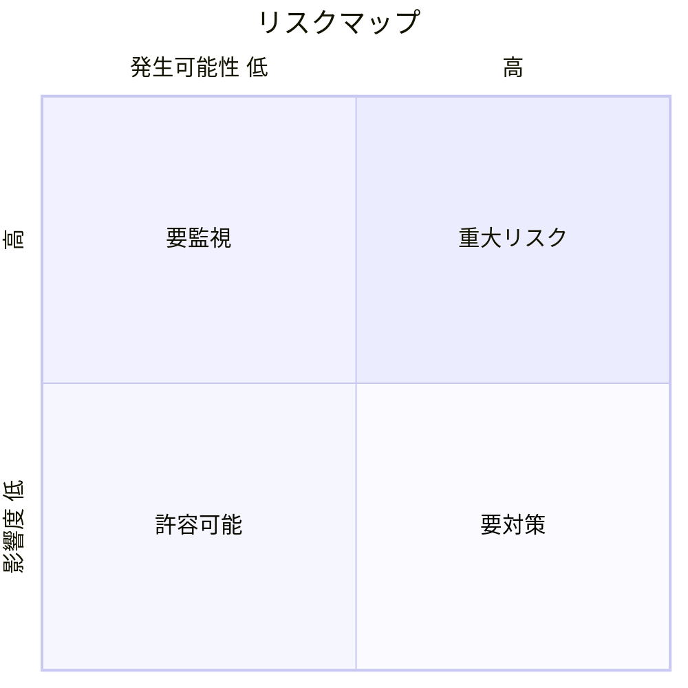
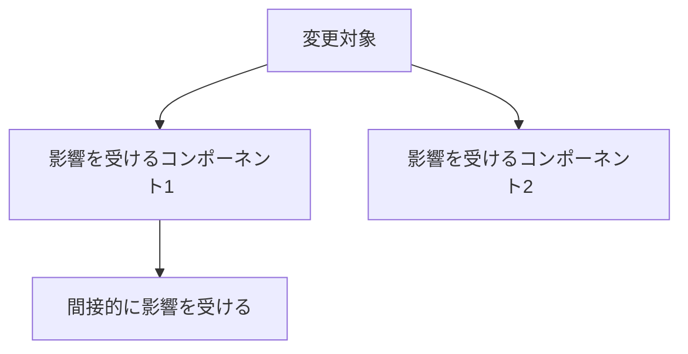

# リスク分析テンプレート

変更によるリスクを分析する際のテンプレート。

---

# リスク分析: {対象の変更・機能}

## 概要

{変更内容の概要と、なぜリスク分析が必要かの説明}

## リスクマトリクス

## 特定されたリスク

### リスク1: {リスク名}

| 項目 | 内容 |
|---|---|
| 説明 | {リスクの詳細説明} |
| 発生可能性 | 高/中/低 |
| 影響度 | 高/中/低 |
| 影響範囲 | {影響を受けるコンポーネント} |
| トリガー | {リスクが顕在化する条件} |

**緩和策:**
1. {緩和策1}
2. {緩和策2}

**検知方法:**
- {リスクを早期発見する方法}

### リスク2: {リスク名}

| 項目 | 内容 |
|---|---|
| 説明 | {リスクの詳細説明} |
| 発生可能性 | 高/中/低 |
| 影響度 | 高/中/低 |
| 影響範囲 | {影響を受けるコンポーネント} |
| トリガー | {リスクが顕在化する条件} |

**緩和策:**
1. {緩和策1}
2. {緩和策2}

## 影響分析

### 技術的影響

| 影響領域 | 影響内容 | 重要度 |
|---|---|---|
| パフォーマンス | {影響} | 高/中/低 |
| セキュリティ | {影響} | 高/中/低 |
| 保守性 | {影響} | 高/中/低 |
| 互換性 | {影響} | 高/中/低 |

### 依存コンポーネントへの影響

## リスク対応計画

| リスク | 対応戦略 | 担当 | 期限 |
|---|---|---|---|
| リスク1 | 回避/軽減/転嫁/受容 | - | - |
| リスク2 | 回避/軽減/転嫁/受容 | - | - |

### 対応戦略の説明

- **回避**: リスクを発生させない方法を選択
- **軽減**: 発生可能性または影響度を下げる
- **転嫁**: リスクを他者に移転（保険、外注など）
- **受容**: リスクをそのまま受け入れる

## テスト計画

リスク軽減のためのテスト項目：

- [ ] {テスト項目1}
- [ ] {テスト項目2}
- [ ] {テスト項目3}

## まとめ

| カテゴリ | 件数 |
|---|---|
| 重大リスク | {数} |
| 要対策リスク | {数} |
| 許容可能リスク | {数} |

**総合評価**: {変更の実施可否と推奨事項}
