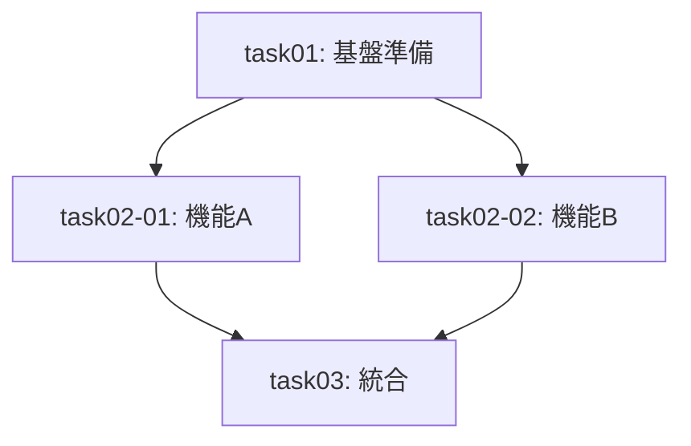

# タスク計画スキル（Task Planning Skill）

設計ドキュメントから実行可能なタスク計画書を作成する。

## 前提条件

- 設計プロセスの成果物（`design-document.md`等）が存在すること
- プロジェクトの技術スタック・制約が明確であること

## 成果物

| ファイル | 内容 |
|----------|------|
| `task-plan.md` | タスク計画書（メイン成果物） |
| `dependency-graph.md` | 依存関係図（mermaid形式） |
| `parallel-groups.md` | 並列実行グループ定義 |

**テンプレート**: [references/templates.md](references/templates.md)

---

## 計画プロセス

### Step 1: 設計ドキュメントの分析

設計ドキュメントから以下を抽出：

- 実装すべき機能・コンポーネント
- 技術的依存関係（ライブラリ、DB、API等）
- 品質要件（テスト、レビュー等）

### Step 2: タスク分割

**粒度**: 1-2時間程度で完了できる単位

**分割基準**:
- 1タスク = 1つの明確な目的
- 検証可能な完了条件を持つ
- 可能な限り独立性を保つ

### Step 3: タスク識別子の付与

```
単一実行:     task01, task02, task03
並列実行:     task02-01, task02-02, task02-03
ネスト:       task04-01-a, task04-01-b
```

### Step 4: 依存関係の整理

各タスクの前提条件タスクを特定し、mermaid形式で図示。



### Step 5: 並列実行グループの特定

**並列実行可能な条件**:
- 相互に依存関係がない
- 同じリソースを競合しない
- 共有状態を変更しない

グループ例:
```
Group 1: task01（単独実行）
Group 2: task02-01, task02-02（並列実行）
Group 3: task03（単独実行）
```

### Step 6: 優先順序の決定

| 優先度 | 基準 |
|--------|------|
| 高 | クリティカルパス上 / 他をブロック |
| 中 | 機能実現に必要 / 通常フロー |
| 低 | 改善・最適化 / 後回し可能 |

### Step 7: 品質チェックポイントの設定

計画にチェックポイントを設置：

| タイミング | チェック内容 |
|------------|--------------|
| 各タスク完了時 | 完了条件の確認 |
| 並列グループ完了時 | 統合前の整合性確認 |
| フェーズ終了時 | 次フェーズへの準備状況確認 |

---

## タスク記述項目

各タスクに以下を明記：

| 項目 | 説明 | 例 |
|------|------|-----|
| タスク識別子 | 一意のID | `task02-01` |
| 名前 | 簡潔なタスク名 | ユーザー認証API実装 |
| 前提条件タスク | 依存するタスクID | `task01` |
| 並列実行可否 | 同時実行可能か | 可（task02-02と並列） |
| 推定所要時間 | 完了までの見積もり | 1.5時間 |
| 完了条件 | 検証可能な基準 | APIエンドポイント動作確認 |

---

## 出力例

タスク計画書の構成例:

```markdown
# タスク計画書

## 概要
- 設計書: design-document.md
- 計画作成日: YYYY-MM-DD
- 総タスク数: N件
- 推定総時間: X時間

## タスク一覧

### task01: 基盤準備
- 前提条件: なし
- 並列実行: 不可
- 推定時間: 1時間
- 完了条件: 開発環境セットアップ完了

### task02-01: 機能A実装
- 前提条件: task01
- 並列実行: 可（task02-02と並列）
- 推定時間: 2時間
- 完了条件: 機能Aの単体テスト通過

## チェックポイント
- CP1: task01完了後 - 環境確認
- CP2: task02グループ完了後 - 統合前レビュー
```

**詳細テンプレート**: [references/templates.md](references/templates.md)
