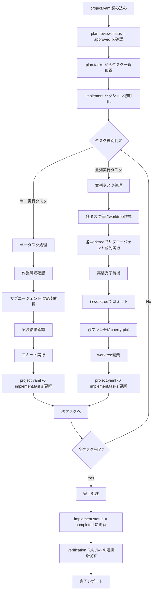

# 開発実装スキル（implement）

planで作成されたタスク計画に従い、サブエージェントへの実装依頼、worktree管理、コミット・cherry-pick統合を行います。

> **SSOT**: `project.yaml` を唯一の情報源として使用します。タスク一覧は `plan.tasks` から取得し、各タスク完了時に `implement` セクションを更新してコミットします。

## 概要

> **品質ガイドライン**: このスキルは `test-driven-development` と `verification-before-completion` スキルの原則に従います。

このスキルは以下を実現します：

1. **project.yaml** からプロジェクトコンテキストを取得
2. **plan.tasks** からタスク一覧と依存関係を読み込み
3. **plan.artifacts** から各タスクプロンプトを読み込み
4. **依存関係から実行順序・並列グループを特定**
5. **単一/並列タスクの判別と処理振り分け**
6. **Worktreeライフサイクル管理**（作成→使用→破棄）
7. **サブエージェントへの実装依頼と結果統合**
8. **各タスク完了時に project.yaml の implement セクションを更新**
9. **全タスク完了後に verification スキルへの連携を促す**

## 入力ファイル

### 1. project.yaml（必須・SSOT）

planスキルが更新済みのプロジェクトコンテキストファイル。

```yaml
meta:
  version: "1.0"
  ticket_id: "PROJ-123"
  task_name: "ユーザー認証機能の追加"
  target_repo: "main-application"
  branch: "feature/PROJ-123"
  # ...

plan:
  status: completed
  total_tasks: 5
  tasks:                     # ← このスキルが参照
    - { id: "task01", title: "JWT ライブラリ導入", status: pending }
    - { id: "task02", title: "認証ミドルウェア実装", status: pending }
    - { id: "task03", title: "Redis セッションストア", status: pending }
    - { id: "task04", title: "リフレッシュトークン API", status: pending }
    - { id: "task05", title: "統合テスト", status: pending }
  review:
    status: approved         # ← 必須：レビュー承認済みであること
  artifacts: "docs/{repo}/plan/"   # ← タスクプロンプトの場所
```

### 2. plan成果物（必須）

`project.yaml` の `plan.artifacts` で指定されたディレクトリ：

```
docs/
└── {target_repository}/
    └── plan/
        ├── task-list.md               # タスク一覧と依存関係
        ├── task01.md                  # task01用プロンプト
        ├── task02-01.md               # task02-01用プロンプト
        ├── task02-02.md               # task02-02用プロンプト
        ├── ...                        # 各タスク用プロンプト
        └── parent-agent-prompt.md     # 親エージェント統合管理プロンプト
```

## 出力

### 1. project.yaml の implement セクション更新（必須）

```yaml
implement:
  status: in_progress         # in_progress | completed
  started_at: "2025-02-11T14:30:00+09:00"
  completed_tasks: 3
  total_tasks: 5
  tasks:                      # plan.tasks のステータスを更新
    - { id: "task01", status: completed, commit: "a1b2c3d" }
    - { id: "task02", status: completed, commit: "e4f5g6h" }
    - { id: "task03", status: in_progress }
    - { id: "task04", status: pending }
    - { id: "task05", status: pending }
  artifacts: "docs/{repo}/implement/"
```

### 2. ドキュメント成果物

```
docs/
└── {target_repository}/
    └── implement/
        └── execution-log.md           # 実行ログ
```

---

## 処理フロー



---

## Worktree管理

詳細は [references/worktree-management-guide.md](references/worktree-management-guide.md) を参照。

### 単一実行タスク

- **作業環境**: 既存のブランチ（feature/{ticket_id}）で作業
- **worktree**: 不要
- **コミット**: 直接実行

### 並列実行タスク

- **ブランチ作成**: `feature/{ticket_id}-{task_id}`
- **worktree作成**: `/tmp/{ticket_id}-{task_id}/`
- **作業完了後**: cherry-pick → worktree破棄

---

## 実行手順

### 1. project.yaml読み込みと前提条件確認

```bash
YAML_PATH="${1:-project.yaml}"
test -f "$YAML_PATH" || { echo "Error: $YAML_PATH not found"; exit 1; }

# メタ情報取得
TICKET_ID=$(yq '.meta.ticket_id' "$YAML_PATH")
TARGET_REPO=$(yq '.meta.target_repo' "$YAML_PATH")

# plan レビュー承認確認
PLAN_REVIEW_STATUS=$(yq '.plan.review.status' "$YAML_PATH")
test "$PLAN_REVIEW_STATUS" = "approved" || { echo "Error: plan review not approved"; exit 1; }

# plan成果物ディレクトリ確認
PLAN_ARTIFACTS=$(yq '.plan.artifacts' "$YAML_PATH")
PLAN_DIR="${PLAN_ARTIFACTS//\{repo\}/$TARGET_REPO}"
test -d "$PLAN_DIR" || { echo "Error: $PLAN_DIR not found"; exit 1; }
```

### 2. タスク一覧読み込み

```bash
# project.yaml の plan.tasks からタスク一覧を取得
TASKS=$(yq '.plan.tasks' "$YAML_PATH")
TOTAL_TASKS=$(yq '.plan.total_tasks' "$YAML_PATH")

# task-list.md から依存関係・並列可否を取得
TASK_LIST_PATH="${PLAN_DIR}/task-list.md"
```

### 3. implement セクション初期化

```bash
# implement セクションを初期化
yq -i '.implement.status = "in_progress"' "$YAML_PATH"
yq -i ".implement.started_at = \"$(date -Iseconds)\"" "$YAML_PATH"
yq -i '.implement.completed_tasks = 0' "$YAML_PATH"
yq -i ".implement.total_tasks = $TOTAL_TASKS" "$YAML_PATH"
yq -i '.implement.tasks = []' "$YAML_PATH"

# plan.tasks をコピーして初期状態を設定
yq -i '.implement.tasks = .plan.tasks' "$YAML_PATH"
yq -i ".implement.artifacts = \"docs/${TARGET_REPO}/implement/\"" "$YAML_PATH"

# meta.updated_at を更新
yq -i ".meta.updated_at = \"$(date -Iseconds)\"" "$YAML_PATH"

# コミット
git add project.yaml
git commit -m "docs: ${TICKET_ID} 実装を開始"
```

### 4. 実行ログ初期化

```bash
IMPL_DIR="docs/${TARGET_REPO}/implement"
mkdir -p "$IMPL_DIR"

cat > "$IMPL_DIR/execution-log.md" << EOF
# 実装実行ログ

## 実行概要
- **開始時刻**: $(date '+%Y-%m-%d %H:%M:%S')
- **対象ブランチ**: feature/${TICKET_ID}
- **総タスク数**: ${TOTAL_TASKS}

## タスク実行履歴

(実行時に更新)
EOF
```

### 5. 単一タスク実行

```bash
TASK_ID="task01"
REPO_ROOT=$(git rev-parse --show-toplevel)
WORK_DIR="submodules/${TARGET_REPO}"
IMPL_LOG_PATH="${REPO_ROOT}/docs/${TARGET_REPO}/implement/execution-log.md"

# 1. 作業ディレクトリ確認
cd "$WORK_DIR"

# 2. サブエージェントに実装依頼
# - task0X.mdプロンプトを読み込み
# - 作業ディレクトリを指定
# - 実装結果を待機

# 3. 実装結果確認
# - テスト通過確認
# - リントチェック
# - 型チェック

# 4. コミット
git add -A
git commit -m "${TASK_ID}: タスク概要"
COMMIT_HASH=$(git rev-parse HEAD)

# 5. 実行ログ更新
cat >> "$IMPL_LOG_PATH" << EOF

### ${TASK_ID}
- **ステータス**: 完了
- **実行時刻**: $(date '+%Y-%m-%d %H:%M')
- **成果物**: ${COMMIT_HASH}
- **結果**: 成功
EOF

# 6. project.yaml の implement.tasks を更新
cd "$REPO_ROOT"
TASK_INDEX=$(yq ".implement.tasks | to_entries | .[] | select(.value.id == \"${TASK_ID}\") | .key" project.yaml)
yq -i ".implement.tasks[${TASK_INDEX}].status = \"completed\"" project.yaml
yq -i ".implement.tasks[${TASK_INDEX}].commit = \"${COMMIT_HASH:0:7}\"" project.yaml

# completed_tasks をインクリメント
COMPLETED=$(yq '.implement.completed_tasks' project.yaml)
yq -i ".implement.completed_tasks = $((COMPLETED + 1))" project.yaml
yq -i ".meta.updated_at = \"$(date -Iseconds)\"" project.yaml

# コミット
git add project.yaml docs/
git commit -m "docs: ${TASK_ID} 完了を記録"
```

### 6. 並列タスク実行

詳細は [references/parallel-execution-guide.md](references/parallel-execution-guide.md) を参照。

```bash
PARALLEL_TASKS=("task02-01" "task02-02")
REPO_ROOT=$(git rev-parse --show-toplevel)

# 1. ベースコミット固定
BASE_COMMIT=$(git rev-parse HEAD)

# 2. 各タスク用worktree作成
for TASK_ID in "${PARALLEL_TASKS[@]}"; do
    BRANCH_NAME="feature/${TICKET_ID}-${TASK_ID}"
    WORKTREE_PATH="/tmp/${TICKET_ID}-${TASK_ID}"
    
    # ブランチ作成
    git branch "$BRANCH_NAME" "$BASE_COMMIT"
    
    # worktree作成
    git worktree add "$WORKTREE_PATH" "$BRANCH_NAME"
    
    # タスクステータスを in_progress に更新
    TASK_INDEX=$(yq ".implement.tasks | to_entries | .[] | select(.value.id == \"${TASK_ID}\") | .key" project.yaml)
    yq -i ".implement.tasks[${TASK_INDEX}].status = \"in_progress\"" project.yaml
    
    echo "Created worktree: $WORKTREE_PATH"
done

# 3. 各worktreeでサブエージェント並列実行
# (background modeでサブエージェント起動)

# 4. 完了待機
# (各サブエージェントの完了を確認)

# 5. 各worktreeでコミット確認
declare -A COMMIT_HASHES
for TASK_ID in "${PARALLEL_TASKS[@]}"; do
    cd "/tmp/${TICKET_ID}-${TASK_ID}"
    COMMIT_HASHES[$TASK_ID]=$(git rev-parse HEAD)
    echo "${TASK_ID} commit: ${COMMIT_HASHES[$TASK_ID]}"
done

# 6. 親ブランチでcherry-pick
cd "$REPO_ROOT"
git checkout "feature/${TICKET_ID}"

for TASK_ID in "${PARALLEL_TASKS[@]}"; do
    git cherry-pick "${COMMIT_HASHES[$TASK_ID]}"
done

# 7. worktree破棄
for TASK_ID in "${PARALLEL_TASKS[@]}"; do
    BRANCH_NAME="feature/${TICKET_ID}-${TASK_ID}"
    WORKTREE_PATH="/tmp/${TICKET_ID}-${TASK_ID}"
    
    git worktree remove "$WORKTREE_PATH" --force
    git branch -D "$BRANCH_NAME"
done

# 8. project.yaml の implement.tasks を更新
for TASK_ID in "${PARALLEL_TASKS[@]}"; do
    TASK_INDEX=$(yq ".implement.tasks | to_entries | .[] | select(.value.id == \"${TASK_ID}\") | .key" project.yaml)
    yq -i ".implement.tasks[${TASK_INDEX}].status = \"completed\"" project.yaml
    yq -i ".implement.tasks[${TASK_INDEX}].commit = \"${COMMIT_HASHES[$TASK_ID]:0:7}\"" project.yaml
done

# completed_tasks を更新
COMPLETED=$(yq '.implement.completed_tasks' project.yaml)
yq -i ".implement.completed_tasks = $((COMPLETED + ${#PARALLEL_TASKS[@]}))" project.yaml
yq -i ".meta.updated_at = \"$(date -Iseconds)\"" project.yaml

# コミット
git add project.yaml docs/
git commit -m "docs: 並列タスク完了を記録 (${PARALLEL_TASKS[*]})"
```

### 7. 全タスク完了時の処理

```bash
# 全タスク完了確認
COMPLETED=$(yq '.implement.completed_tasks' project.yaml)
TOTAL=$(yq '.implement.total_tasks' project.yaml)

if [ "$COMPLETED" -eq "$TOTAL" ]; then
    # implement セクションを完了に更新
    yq -i '.implement.status = "completed"' project.yaml
    yq -i ".implement.completed_at = \"$(date -Iseconds)\"" project.yaml
    yq -i ".meta.updated_at = \"$(date -Iseconds)\"" project.yaml
    
    # コミット
    git add project.yaml
    git commit -m "docs: ${TICKET_ID} 全タスク実装完了"
    
    echo "=== 全タスク完了 ==="
    echo "次のステップ: verification スキルで検証を実行してください"
fi
```

---

## コミット管理

### コミットメッセージ形式

```
{task_id}: {タスク概要}

- {変更点1}
- {変更点2}
- {変更点3}
```

### コミット前確認

```bash
# 変更内容確認
git status
git diff --staged

# テスト通過確認
npm test  # または適切なテストコマンド

# リント・型チェック
npm run lint
npm run typecheck
```

### Cherry-pick実行

```bash
# コンフリクトなしの場合
git cherry-pick $COMMIT_HASH

# コンフリクト発生時
git cherry-pick $COMMIT_HASH
# コンフリクト解消後
git add .
git cherry-pick --continue
```

---

## サブエージェント依頼

### 依頼内容

各タスク毎に以下情報を含めて依頼：

1. **task0X.mdで定義されたプロンプト**
2. **作業ディレクトリ（worktreeパス）**
3. **前提条件タスクの成果物への参照**
4. **コミット対象となる成果物の説明**

### 依頼テンプレート

```markdown
## タスク実装依頼

以下のプロンプトに従って実装を行ってください。

### 作業ディレクトリ
/tmp/{ticket_id}-{task_id}/

### タスクプロンプト
[task0X.mdの内容をここに挿入]

### 前提条件
- 前提タスク: {prerequisite_tasks}
- 前提成果物: {artifact_paths}

### 完了時の確認
1. 全テスト通過
2. リントエラーなし
3. 型エラーなし
4. result.md作成
5. コミット実行
```

### 並列実行時の注意

- 各サブエージェントは独立したworktreeで作業
- 同じファイルを編集しないことを前提
- 完了通知を待って次フェーズへ進行

---

## エラーハンドリング

### サブエージェント実装失敗時

```markdown
## 実装失敗レポート

### タスク: {task_id}
- **失敗時刻**: {timestamp}
- **エラー内容**: {error_message}
- **ブロック対象**: {blocked_tasks}

### 対応オプション
1. 再実行（プロンプト修正）
2. ロールバック（worktree破棄）
3. 手動介入

### ロールバック手順
```bash
git worktree remove /tmp/{ticket_id}-{task_id} --force
git branch -D feature/{ticket_id}-{task_id}
```
```

### コミット失敗時

```markdown
## コミット失敗レポート

### タスク: {task_id}
- **失敗理由**: {reason}
- **変更ファイル**: {changed_files}

### 対応オプション
1. 内容確認・修正後に再コミット
2. 変更破棄（git reset）
3. 手動介入
```

### Cherry-pick コンフリクト時

```markdown
## Cherry-pick コンフリクトレポート

### タスク: {task_id}
- **コミット**: {commit_hash}
- **コンフリクトファイル**: {conflict_files}

### 対応手順
1. コンフリクト箇所の確認
```bash
git status
git diff
```

2. 手動解消
   - コンフリクトマーカーを編集
   - 正しい内容に統合

3. 解消後
```bash
git add {conflict_files}
git cherry-pick --continue
```

### 中止する場合
```bash
git cherry-pick --abort
```
```

---

## 実行追跡

### execution-log.md フォーマット

```markdown
# 実装実行ログ

## 実行概要
- **開始時刻**: YYYY-MM-DD HH:MM:SS
- **対象ブランチ**: feature/{ticket_id}
- **総タスク数**: N

## タスク実行履歴

### task01
- **ステータス**: 完了
- **実行時刻**: YYYY-MM-DD HH:MM
- **成果物**: [コミットハッシュ]
- **結果**: 成功

### task02-01 (並列)
- **ステータス**: 完了
- **Worktree**: /tmp/{ticket_id}-task02-01
- **作業環境**: feature/{ticket_id}-task02-01
- **Cherry-pick**: [コミットハッシュ]
- **結果**: 成功

### task02-02 (並列)
- **ステータス**: 完了
- **Worktree**: /tmp/{ticket_id}-task02-02
- **作業環境**: feature/{ticket_id}-task02-02
- **Cherry-pick**: [コミットハッシュ]
- **結果**: 成功

### task03
- **ステータス**: 完了
- **実行時刻**: YYYY-MM-DD HH:MM
- **成果物**: [コミットハッシュ]
- **結果**: 成功

## 完了サマリー
- **終了時刻**: YYYY-MM-DD HH:MM:SS
- **総所要時間**: Xh Ym
- **成功タスク**: N/N
- **失敗タスク**: 0
```

---

## 完了レポート

```markdown
## 実装完了 ✅

### 実装対象
- チケット: {ticket_id}
- タスク: {task_name}
- リポジトリ: {target_repo}

### project.yaml 更新内容
- implement.status: completed
- implement.completed_at: {timestamp}
- implement.completed_tasks: {total_tasks}
- implement.tasks: [全タスク completed]

### 実行結果
- **総タスク数**: {total_count}
- **成功タスク**: {success_count}
- **失敗タスク**: {failure_count}
- **総所要時間**: {duration}

### コミット履歴
| タスク    | コミット | メッセージ           |
| --------- | -------- | -------------------- |
| task01    | abc1234  | task01: 基盤準備     |
| task02-01 | def5678  | task02-01: 機能A実装 |
| task02-02 | ghi9012  | task02-02: 機能B実装 |
| task03    | jkl3456  | task03: 統合テスト   |

### 生成されたファイル
- docs/{target_repo}/implement/execution-log.md

### 次のステップ
1. **verification** スキルで検証を実行
2. project.yaml の verification セクションが更新される
3. **code-review** スキルでコードレビュー
```

---

## 注意事項

- **前提**: planスキルでタスク計画が作成済み、かつレビュー承認済みであること
- **worktree管理**: 並列タスクのみworktreeを使用
- **コミット順序**: 依存関係を尊重してcherry-pick
- **エラー時**: ロールバック・手動介入オプションを提示
- **品質**: 各タスク完了時にテスト・リント・型チェックを確認
- **project.yaml更新**: 各タスク完了時に implement.tasks を更新してコミット
- **verification連携**: 全タスク完了後は verification スキルで検証を実行
- **テスト戦略の遵守**: `brainstorming.test_strategy` で定義されたテスト範囲（単体/結合/E2E）を実装に反映する。E2Eテストがスコープに含まれる場合は、E2Eテスト用のタスクが plan に含まれていることを確認し、実行する

---

## サブエージェント2段階レビュー

各タスク実装完了時に、サブエージェントの成果物を以下の2段階でレビュー：

### Stage 1: 仕様準拠確認
- task0X.md のプロンプト要件を全て満たしているか
- 完了条件が全てクリアされているか
- design-document の設計に従っているか

### Stage 2: コード品質確認
- `test-driven-development` スキルの原則に従っているか（テストが先に書かれているか）
- `verification-before-completion` スキルの基準を満たしているか（証拠ベースの完了主張）
- リント・型チェック・テストが全てパスしているか
- **タスクプロンプトで定義されたテスト（単体テスト、結合テスト、E2Eテスト）が全て実行され、通過しているか**
- **テストが未実行のままタスクを完了にしてはならない**

### 並列化判断ガイドライン

以下の条件を全て満たす場合、並列実行を検討：
- 3つ以上の独立タスクが同一フェーズに存在
- タスク間でファイル編集の衝突がない
- 各タスクが独立したテストファイルを持つ

詳細な判断フローチャートとリスクスコアリングは [README.md#並列化判断](../../README.md#並列化判断) を参照。

---

## 参照ファイル

- 前提スキル: `plan` - タスク計画作成
- 品質スキル: `test-driven-development` - TDDサイクル
- 品質スキル: `verification-before-completion` - 完了前検証
- 後続スキル: `verification` - 検証（テスト・ビルド・リント確認）
- 後続スキル: `finishing-branch` - ブランチ完了管理
- 参照: [references/worktree-management-guide.md](references/worktree-management-guide.md) - Worktree管理ガイド
- 参照: [references/parallel-execution-guide.md](references/parallel-execution-guide.md) - 並列実行管理ガイド

---

## 典型的なワークフロー

```
[project.yaml読み込み]
        ↓
[plan.review.status = approved を確認]
        ↓
[plan.tasks からタスク一覧取得]
        ↓
[implement セクション初期化]
        ↓
[実行ログ初期化]
        ↓
【Phase 1: 単一タスク】
  → task01実行
  → コミット
  → project.yaml の implement.tasks 更新
        ↓
【Phase 2: 並列タスク】
  → worktree作成（task02-01, task02-02）
  → サブエージェント並列実行
  → 完了待機
  → 各worktreeでコミット
  → cherry-pick
  → worktree破棄
  → project.yaml の implement.tasks 更新
        ↓
【Phase 3: 統合タスク】
  → task03実行
  → コミット
  → project.yaml の implement.tasks 更新
        ↓
[implement.status = completed に更新]
        ↓
[verification スキルへの連携を促す]
        ↓
[完了レポート出力]
```

---

## SSOT参照

| project.yaml フィールド      | 用途                                           |
| ---------------------------- | ---------------------------------------------- |
| `plan.tasks`                 | タスク一覧と初期ステータスの取得               |
| `plan.review.status`         | 計画レビュー承認の確認（approved であること）  |
| `plan.artifacts`             | タスクプロンプトの場所                         |

### implement セクションの出力フィールド

| フィールド        | 説明                                              |
| ----------------- | ------------------------------------------------- |
| `status`          | `in_progress` → `completed`                       |
| `started_at`      | 開始時刻（ISO 8601 形式）                         |
| `completed_at`    | 完了時刻（全タスク完了時に設定）                  |
| `completed_tasks` | 完了タスク数                                      |
| `total_tasks`     | 総タスク数                                        |
| `tasks`           | タスク一覧（id, status, commit）                  |
| `artifacts`       | `docs/{repo}/implement/`                          |
