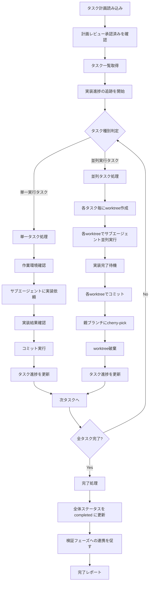

# 開発実装スキル（implement）

タスク計画に従い、サブエージェントへの実装依頼、worktree管理、コミット・cherry-pick統合を行います。

## 概要

> **品質ガイドライン**: このスキルは `test-driven-development` と `verification-before-completion` スキルの原則に従います。

このスキルは以下を実現します：

1. **タスク計画**からプロジェクトコンテキストを取得
2. **タスク一覧**と依存関係を読み込み
3. **各タスクプロンプト**を読み込み
4. **依存関係から実行順序・並列グループを特定**
5. **単一/並列タスクの判別と処理振り分け**
6. **Worktreeライフサイクル管理**（作成→使用→破棄）
7. **サブエージェントへの実装依頼と結果統合**
8. **各タスク完了時に実装進捗を記録**
9. **全タスク完了後に検証フェーズへの連携を促す**

## 入力

### 1. タスク計画（必須）

タスク一覧・依存関係・レビュー状態を含むタスク計画。以下の情報が必要：

- **チケットID**: 作業対象のチケット識別子
- **対象リポジトリ**: 実装対象のリポジトリ名
- **ブランチ名**: 作業ブランチ名（例: `feature/{ticket_id}`）
- **タスク一覧**: 各タスクのID・タイトル・ステータス・依存関係
- **レビュー状態**: 計画がレビュー承認済みであること

タスク一覧の例：

```
- task01: JWT ライブラリ導入（pending）
- task02: 認証ミドルウェア実装（pending、task01に依存）
- task03: Redis セッションストア（pending）
- task04: リフレッシュトークン API（pending、task02に依存）
- task05: 統合テスト（pending、task01〜04に依存）
```

### 2. タスクプロンプト（必須）

各タスクに対応する実装指示ファイル：

```
plan/
├── task-list.md               # タスク一覧と依存関係
├── task01.md                  # task01用プロンプト
├── task02-01.md               # task02-01用プロンプト
├── task02-02.md               # task02-02用プロンプト
├── ...                        # 各タスク用プロンプト
└── parent-agent-prompt.md     # 親エージェント統合管理プロンプト
```

## 出力

### 1. 実装進捗の記録（必須）

各タスクの実装状態を追跡する。以下の情報を管理：

- **全体ステータス**: `in_progress` → `completed`
- **開始・完了時刻**
- **完了タスク数 / 総タスク数**
- **各タスクのステータスとコミットハッシュ**

### 2. ドキュメント成果物

```
implement/
└── execution-log.md           # 実行ログ
```

---

## 処理フロー


```mermaid
flowchart TD
    A[タスク計画読み込み] --> B[計画レビュー承認済みを確認]
    B --> C[タスク一覧取得]
    C --> D[実装進捗の追跡を開始]
    D --> E{タスク種別判定}
    
    E -->|単一実行タスク| F[単一タスク処理]
    F --> F1[作業環境確認]
    F1 --> F2[サブエージェントに実装依頼]
    F2 --> F3[実装結果確認]
    F3 --> F4[コミット実行]
    F4 --> F5[タスク進捗を更新]
    F5 --> G[次タスクへ]
    
    E -->|並列実行タスク| H[並列タスク処理]
    H --> H1[各タスク毎にworktree作成]
    H1 --> H2[各worktreeでサブエージェント並列実行]
    H2 --> H3[実装完了待機]
    H3 --> H4[各worktreeでコミット]
    H4 --> H5[親ブランチにcherry-pick]
    H5 --> H6[worktree破棄]
    H6 --> H7[タスク進捗を更新]
    H7 --> G
    
    G --> I{全タスク完了?}
    I -->|No| E
    I -->|Yes| J[完了処理]
    J --> K[全体ステータスを completed に更新]
    K --> L[検証フェーズへの連携を促す]
    L --> M[完了レポート]
```

---

## Worktree管理

詳細は [references/worktree-management-guide.md](references/worktree-management-guide.md) を参照。

### 単一実行タスク

- **作業環境**: 既存のブランチ（feature/{ticket_id}）で作業
- **worktree**: 不要
- **コミット**: 直接実行

### 並列実行タスク

- **ブランチ作成**: `feature/{ticket_id}-{task_id}`
- **worktree作成**: `{repo_root}/.worktrees/{ticket_id}-{task_id}/`
- **作業完了後**: cherry-pick → worktree破棄

---

## 実行手順

### 1. タスク計画読み込みと前提条件確認

```bash
# 必要な情報を確認
# - TICKET_ID: チケットID
# - TARGET_REPO: 対象リポジトリ名
# - PLAN_DIR: タスクプロンプトが格納されたディレクトリ

# 計画レビュー承認済みであることを確認
# （承認されていない場合はエラー）

# タスクプロンプトディレクトリの存在確認
test -d "$PLAN_DIR" || { echo "Error: $PLAN_DIR not found"; exit 1; }
```

### 2. タスク一覧読み込み

```bash
# タスク計画からタスク一覧を取得
# - 各タスクのID・タイトル・ステータス・依存関係
# - task-list.md から依存関係・並列可否を取得
TASK_LIST_PATH="${PLAN_DIR}/task-list.md"
```

### 3. 実装進捗の追跡を開始

```bash
# 実装の進捗追跡を開始
# - ステータス: in_progress
# - 開始時刻を記録
# - タスク一覧の初期状態を設定

# コミット
git add -A
git commit -m "docs: ${TICKET_ID} 実装を開始"
```

### 4. 実行ログ初期化

```bash
IMPL_DIR="implement"
mkdir -p "$IMPL_DIR"

cat > "$IMPL_DIR/execution-log.md" << EOF
# 実装実行ログ

## 実行概要
- **開始時刻**: $(date '+%Y-%m-%d %H:%M:%S')
- **対象ブランチ**: feature/${TICKET_ID}
- **総タスク数**: ${TOTAL_TASKS}

## タスク実行履歴

(実行時に更新)
EOF
```

### 5. 単一タスク実行

```bash
TASK_ID="task01"
REPO_ROOT=$(git rev-parse --show-toplevel)
WORK_DIR="${TARGET_REPO}"
IMPL_LOG_PATH="${REPO_ROOT}/implement/execution-log.md"

# 1. 作業ディレクトリ確認
cd "$WORK_DIR"

# 2. サブエージェントに実装依頼
# - task0X.mdプロンプトを読み込み
# - 作業ディレクトリを指定
# - 実装結果を待機

# 3. 実装結果確認
# - テスト通過確認
# - リントチェック
# - 型チェック

# 4. コミット
git add -A
git commit -m "${TASK_ID}: タスク概要"
COMMIT_HASH=$(git rev-parse HEAD)

# 5. 実行ログ更新
cat >> "$IMPL_LOG_PATH" << EOF

### ${TASK_ID}
- **ステータス**: 完了
- **実行時刻**: $(date '+%Y-%m-%d %H:%M')
- **成果物**: ${COMMIT_HASH}
- **結果**: 成功
EOF

# 6. タスク進捗を更新（完了タスク数をインクリメント）
cd "$REPO_ROOT"

# コミット
git add -A
git commit -m "docs: ${TASK_ID} 完了を記録"
```

### 6. 並列タスク実行

詳細は [references/parallel-execution-guide.md](references/parallel-execution-guide.md) を参照。

```bash
PARALLEL_TASKS=("task02-01" "task02-02")
REPO_ROOT=$(git rev-parse --show-toplevel)

# 1. ベースコミット固定
BASE_COMMIT=$(git rev-parse HEAD)

# 2. 各タスク用worktree作成
for TASK_ID in "${PARALLEL_TASKS[@]}"; do
    BRANCH_NAME="feature/${TICKET_ID}-${TASK_ID}"
    WORKTREE_PATH="${REPO_ROOT}/.worktrees/${TICKET_ID}-${TASK_ID}"
    
    # ブランチ作成
    git branch "$BRANCH_NAME" "$BASE_COMMIT"
    
    # worktree作成
    git worktree add "$WORKTREE_PATH" "$BRANCH_NAME"
    
    echo "Created worktree: $WORKTREE_PATH"
done

# 3. 各worktreeでサブエージェント並列実行
# (background modeでサブエージェント起動)

# 4. 完了待機
# (各サブエージェントの完了を確認)

# 5. 各worktreeでコミット確認
declare -A COMMIT_HASHES
for TASK_ID in "${PARALLEL_TASKS[@]}"; do
    cd "${REPO_ROOT}/.worktrees/${TICKET_ID}-${TASK_ID}"
    COMMIT_HASHES[$TASK_ID]=$(git rev-parse HEAD)
    echo "${TASK_ID} commit: ${COMMIT_HASHES[$TASK_ID]}"
done

# 6. 親ブランチでcherry-pick
cd "$REPO_ROOT"
git checkout "feature/${TICKET_ID}"

for TASK_ID in "${PARALLEL_TASKS[@]}"; do
    git cherry-pick "${COMMIT_HASHES[$TASK_ID]}"
done

# 7. worktree破棄
for TASK_ID in "${PARALLEL_TASKS[@]}"; do
    BRANCH_NAME="feature/${TICKET_ID}-${TASK_ID}"
    WORKTREE_PATH="${REPO_ROOT}/.worktrees/${TICKET_ID}-${TASK_ID}"
    
    git worktree remove "$WORKTREE_PATH" --force
    git branch -D "$BRANCH_NAME"
done

# 8. タスク進捗を更新（完了タスク数をインクリメント）

# コミット
git add -A
git commit -m "docs: 並列タスク完了を記録 (${PARALLEL_TASKS[*]})"
```

### 7. 全タスク完了時の処理

```bash
# 全タスク完了確認
if [ "$COMPLETED_TASKS" -eq "$TOTAL_TASKS" ]; then
    # 全体ステータスを completed に更新
    # 完了時刻を記録
    
    # コミット
    git add -A
    git commit -m "docs: ${TICKET_ID} 全タスク実装完了"
    
    echo "=== 全タスク完了 ==="
    echo "次のステップ: 検証フェーズで検証を実行してください"
fi
```

---

## コミット管理

### コミットメッセージ形式

```
{task_id}: {タスク概要}

- {変更点1}
- {変更点2}
- {変更点3}
```

### コミット前確認

```bash
# 変更内容確認
git status
git diff --staged

# テスト通過確認
npm test  # または適切なテストコマンド

# リント・型チェック
npm run lint
npm run typecheck
```

### Cherry-pick実行

```bash
# コンフリクトなしの場合
git cherry-pick $COMMIT_HASH

# コンフリクト発生時
git cherry-pick $COMMIT_HASH
# コンフリクト解消後
git add .
git cherry-pick --continue
```

---

## サブエージェント依頼

### 依頼内容

各タスク毎に以下情報を含めて依頼：

1. **task0X.mdで定義されたプロンプト**
2. **作業ディレクトリ（worktreeパス）**
3. **前提条件タスクの成果物への参照**
4. **コミット対象となる成果物の説明**

### 依頼テンプレート

```markdown
## タスク実装依頼

以下のプロンプトに従って実装を行ってください。

### 作業ディレクトリ
{worktree_path}

### タスクプロンプト
[task0X.mdの内容をここに挿入]

### 前提条件
- 前提タスク: {prerequisite_tasks}
- 前提成果物: {artifact_paths}

### 完了時の確認
1. 全テスト通過
2. リントエラーなし
3. 型エラーなし
4. result.md作成
5. コミット実行
```

### 並列実行時の注意

- 各サブエージェントは独立したworktreeで作業
- 同じファイルを編集しないことを前提
- 完了通知を待って次フェーズへ進行

---

## エラーハンドリング

### サブエージェント実装失敗時

```markdown
## 実装失敗レポート

### タスク: {task_id}
- **失敗時刻**: {timestamp}
- **エラー内容**: {error_message}
- **ブロック対象**: {blocked_tasks}

### 対応オプション
1. 再実行（プロンプト修正）
2. ロールバック（worktree破棄）
3. 手動介入

### ロールバック手順
```bash
git worktree remove {worktree_path} --force
git branch -D feature/{ticket_id}-{task_id}
```
```

### コミット失敗時

```markdown
## コミット失敗レポート

### タスク: {task_id}
- **失敗理由**: {reason}
- **変更ファイル**: {changed_files}

### 対応オプション
1. 内容確認・修正後に再コミット
2. 変更破棄（git reset）
3. 手動介入
```

### Cherry-pick コンフリクト時

```markdown
## Cherry-pick コンフリクトレポート

### タスク: {task_id}
- **コミット**: {commit_hash}
- **コンフリクトファイル**: {conflict_files}

### 対応手順
1. コンフリクト箇所の確認
```bash
git status
git diff
```

2. 手動解消
   - コンフリクトマーカーを編集
   - 正しい内容に統合

3. 解消後
```bash
git add {conflict_files}
git cherry-pick --continue
```

### 中止する場合
```bash
git cherry-pick --abort
```
```

---

## 実行追跡

### execution-log.md フォーマット

```markdown
# 実装実行ログ

## 実行概要
- **開始時刻**: YYYY-MM-DD HH:MM:SS
- **対象ブランチ**: feature/{ticket_id}
- **総タスク数**: N

## タスク実行履歴

### task01
- **ステータス**: 完了
- **実行時刻**: YYYY-MM-DD HH:MM
- **成果物**: [コミットハッシュ]
- **結果**: 成功

### task02-01 (並列)
- **ステータス**: 完了
- **Worktree**: {worktree_path}/task02-01
- **作業環境**: feature/{ticket_id}-task02-01
- **Cherry-pick**: [コミットハッシュ]
- **結果**: 成功

### task02-02 (並列)
- **ステータス**: 完了
- **Worktree**: {worktree_path}/task02-02
- **作業環境**: feature/{ticket_id}-task02-02
- **Cherry-pick**: [コミットハッシュ]
- **結果**: 成功

### task03
- **ステータス**: 完了
- **実行時刻**: YYYY-MM-DD HH:MM
- **成果物**: [コミットハッシュ]
- **結果**: 成功

## 完了サマリー
- **終了時刻**: YYYY-MM-DD HH:MM:SS
- **総所要時間**: Xh Ym
- **成功タスク**: N/N
- **失敗タスク**: 0
```

---

## 完了レポート

```markdown
## 実装完了 ✅

### 実装対象
- チケット: {ticket_id}
- タスク: {task_name}
- リポジトリ: {target_repo}

### 実装進捗
- ステータス: completed
- 完了時刻: {timestamp}
- 完了タスク数: {total_tasks}
- 全タスク completed

### 実行結果
- **総タスク数**: {total_count}
- **成功タスク**: {success_count}
- **失敗タスク**: {failure_count}
- **総所要時間**: {duration}

### コミット履歴
| タスク    | コミット | メッセージ           |
| --------- | -------- | -------------------- |
| task01    | abc1234  | task01: 基盤準備     |
| task02-01 | def5678  | task02-01: 機能A実装 |
| task02-02 | ghi9012  | task02-02: 機能B実装 |
| task03    | jkl3456  | task03: 統合テスト   |

### 生成されたファイル
- implement/execution-log.md

### 次のステップ
1. 検証フェーズでテスト・ビルド・リントを実行
2. コードレビューを実施
```

---

## 注意事項

- **前提**: タスク計画が作成済み、かつレビュー承認済みであること
- **worktree管理**: 並列タスクのみworktreeを使用
- **コミット順序**: 依存関係を尊重してcherry-pick
- **エラー時**: ロールバック・手動介入オプションを提示
- **品質**: 各タスク完了時にテスト・リント・型チェックを確認
- **進捗記録**: 各タスク完了時に実装進捗を更新してコミット
- **検証連携**: 全タスク完了後は検証フェーズでテスト・ビルド・リントを実行
- **テスト戦略の遵守**: テスト計画で定義されたテスト範囲（単体/結合/E2E）を実装に反映する。E2Eテストがスコープに含まれる場合は、E2Eテスト用のタスクが計画に含まれていることを確認し、実行する

---

## サブエージェント2段階レビュー

各タスク実装完了時に、サブエージェントの成果物を以下の2段階でレビュー：

### Stage 1: 仕様準拠確認
- task0X.md のプロンプト要件を全て満たしているか
- 完了条件が全てクリアされているか
- 設計ドキュメントの設計に従っているか

### Stage 2: コード品質確認
- `test-driven-development` スキルの原則に従っているか（テストが先に書かれているか）
- `verification-before-completion` スキルの基準を満たしているか（証拠ベースの完了主張）
- リント・型チェック・テストが全てパスしているか
- **タスクプロンプトで定義されたテスト（単体テスト、結合テスト、E2Eテスト）が全て実行され、通過しているか**
- **テストが未実行のままタスクを完了にしてはならない**

### 並列化判断ガイドライン

以下の条件を全て満たす場合、並列実行を検討：
- 3つ以上の独立タスクが同一フェーズに存在
- タスク間でファイル編集の衝突がない
- 各タスクが独立したテストファイルを持つ

詳細な判断フローチャートとリスクスコアリングは [README.md#並列化判断](../../README.md#並列化判断) を参照。

---

## 参照ファイル

- 品質原則: `test-driven-development` - TDDサイクル
- 品質原則: `verification-before-completion` - 完了前検証
- 参照: [references/worktree-management-guide.md](references/worktree-management-guide.md) - Worktree管理ガイド
- 参照: [references/parallel-execution-guide.md](references/parallel-execution-guide.md) - 並列実行管理ガイド

---

## 典型的なワークフロー

```
[タスク計画読み込み]
        ↓
[計画レビュー承認済みを確認]
        ↓
[タスク一覧取得]
        ↓
[実装進捗の追跡を開始]
        ↓
[実行ログ初期化]
        ↓
【Phase 1: 単一タスク】
  → task01実行
  → コミット
  → タスク進捗を更新
        ↓
【Phase 2: 並列タスク】
  → worktree作成（task02-01, task02-02）
  → サブエージェント並列実行
  → 完了待機
  → 各worktreeでコミット
  → cherry-pick
  → worktree破棄
  → タスク進捗を更新
        ↓
【Phase 3: 統合タスク】
  → task03実行
  → コミット
  → タスク進捗を更新
        ↓
[全体ステータスを completed に更新]
        ↓
[検証フェーズへの連携を促す]
        ↓
[完了レポート出力]
```

---

## 入力・出力リファレンス

### 必要な入力情報

| 項目                   | 用途                                           |
| ---------------------- | ---------------------------------------------- |
| タスク一覧             | 各タスクのID・タイトル・ステータス・依存関係   |
| 計画レビュー状態       | 計画レビュー承認の確認（承認済みであること）   |
| タスクプロンプト       | 各タスクの実装指示ファイルの場所               |

### 追跡する出力情報

| 項目              | 説明                                              |
| ----------------- | ------------------------------------------------- |
| 全体ステータス    | `in_progress` → `completed`                       |
| 開始時刻          | 開始時刻（ISO 8601 形式）                         |
| 完了時刻          | 完了時刻（全タスク完了時に設定）                  |
| 完了タスク数      | 完了タスク数                                      |
| 総タスク数        | 総タスク数                                        |
| タスク一覧        | タスク一覧（id, status, commit）                  |
