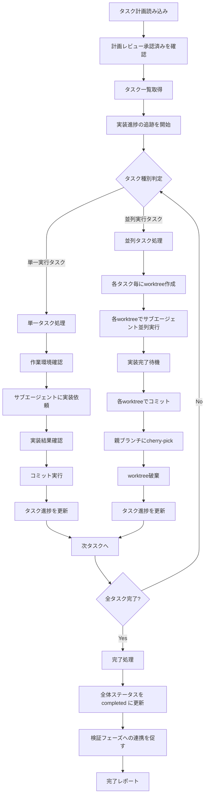

# 実行手順詳細

SKILL.md の実行手順セクションの詳細版。

## 処理フロー



---

## 1. タスク計画読み込みと前提条件確認

```bash
# 必要な情報を確認
# - TICKET_ID: チケットID
# - TARGET_REPO: 対象リポジトリ名
# - PLAN_DIR: タスクプロンプトが格納されたディレクトリ

# 計画レビュー承認済みであることを確認
# （承認されていない場合はエラー）

# タスクプロンプトディレクトリの存在確認
test -d "$PLAN_DIR" || { echo "Error: $PLAN_DIR not found"; exit 1; }
```

## 2. タスク一覧読み込み

```bash
# タスク計画からタスク一覧を取得
# - 各タスクのID・タイトル・ステータス・依存関係
# - task-list.md から依存関係・並列可否を取得
TASK_LIST_PATH="${PLAN_DIR}/task-list.md"
```

## 3. 実装進捗の追跡を開始

```bash
# 実装の進捗追跡を開始
# - ステータス: in_progress
# - 開始時刻を記録
# - タスク一覧の初期状態を設定

# コミット
git add -A
git commit -m "docs: ${TICKET_ID} 実装を開始"
```

## 4. 実行ログ初期化

```bash
IMPL_DIR="implement"
mkdir -p "$IMPL_DIR"

cat > "$IMPL_DIR/execution-log.md" << EOF
# 実装実行ログ

## 実行概要
- **開始時刻**: $(date '+%Y-%m-%d %H:%M:%S')
- **対象ブランチ**: feature/${TICKET_ID}
- **総タスク数**: ${TOTAL_TASKS}

## タスク実行履歴

(実行時に更新)
EOF
```

## 5. 単一タスク実行

```bash
TASK_ID="task01"
REPO_ROOT=$(git rev-parse --show-toplevel)
WORK_DIR="${TARGET_REPO}"
IMPL_LOG_PATH="${REPO_ROOT}/implement/execution-log.md"

# 1. 作業ディレクトリ確認
cd "$WORK_DIR"

# 2. サブエージェントに実装依頼
# - task0X.mdプロンプトを読み込み
# - 作業ディレクトリを指定
# - 実装結果を待機

# 3. 実装結果確認
# - テスト通過確認
# - リントチェック
# - 型チェック

# 4. コミット
git add -A
git commit -m "${TASK_ID}: タスク概要"
COMMIT_HASH=$(git rev-parse HEAD)

# 5. 実行ログ更新
cat >> "$IMPL_LOG_PATH" << EOF

### ${TASK_ID}
- **ステータス**: 完了
- **実行時刻**: $(date '+%Y-%m-%d %H:%M')
- **成果物**: ${COMMIT_HASH}
- **結果**: 成功
EOF

# 6. タスク進捗を更新（完了タスク数をインクリメント）
cd "$REPO_ROOT"

# コミット
git add -A
git commit -m "docs: ${TASK_ID} 完了を記録"
```

## 6. 並列タスク実行

📖 並列実行の詳細は [parallel-execution-guide.md](parallel-execution-guide.md) を参照。

```bash
PARALLEL_TASKS=("task02-01" "task02-02")
REPO_ROOT=$(git rev-parse --show-toplevel)

# 1. ベースコミット固定
BASE_COMMIT=$(git rev-parse HEAD)

# 2. 各タスク用worktree作成
for TASK_ID in "${PARALLEL_TASKS[@]}"; do
    BRANCH_NAME="feature/${TICKET_ID}-${TASK_ID}"
    WORKTREE_PATH="${REPO_ROOT}/.worktrees/${TICKET_ID}-${TASK_ID}"
    
    # ブランチ作成
    git branch "$BRANCH_NAME" "$BASE_COMMIT"
    
    # worktree作成
    git worktree add "$WORKTREE_PATH" "$BRANCH_NAME"
    
    echo "Created worktree: $WORKTREE_PATH"
done

# 3. 各worktreeでサブエージェント並列実行
# (background modeでサブエージェント起動)

# 4. 完了待機
# (各サブエージェントの完了を確認)

# 5. 各worktreeでコミット確認
declare -A COMMIT_HASHES
for TASK_ID in "${PARALLEL_TASKS[@]}"; do
    cd "${REPO_ROOT}/.worktrees/${TICKET_ID}-${TASK_ID}"
    COMMIT_HASHES[$TASK_ID]=$(git rev-parse HEAD)
    echo "${TASK_ID} commit: ${COMMIT_HASHES[$TASK_ID]}"
done

# 6. 親ブランチでcherry-pick
cd "$REPO_ROOT"
git checkout "feature/${TICKET_ID}"

for TASK_ID in "${PARALLEL_TASKS[@]}"; do
    git cherry-pick "${COMMIT_HASHES[$TASK_ID]}"
done

# 7. worktree破棄
for TASK_ID in "${PARALLEL_TASKS[@]}"; do
    BRANCH_NAME="feature/${TICKET_ID}-${TASK_ID}"
    WORKTREE_PATH="${REPO_ROOT}/.worktrees/${TICKET_ID}-${TASK_ID}"
    
    git worktree remove "$WORKTREE_PATH" --force
    git branch -D "$BRANCH_NAME"
done

# 8. タスク進捗を更新（完了タスク数をインクリメント）

# コミット
git add -A
git commit -m "docs: 並列タスク完了を記録 (${PARALLEL_TASKS[*]})"
```

## 7. 全タスク完了時の処理

```bash
# 全タスク完了確認
if [ "$COMPLETED_TASKS" -eq "$TOTAL_TASKS" ]; then
    # 全体ステータスを completed に更新
    # 完了時刻を記録
    
    # コミット
    git add -A
    git commit -m "docs: ${TICKET_ID} 全タスク実装完了"
    
    echo "=== 全タスク完了 ==="
    echo "次のステップ: 検証フェーズで検証を実行してください"
fi
```

---

## コミット管理

### コミットメッセージ形式

```
{task_id}: {タスク概要}

- {変更点1}
- {変更点2}
- {変更点3}
```

### コミット前確認

```bash
# 変更内容確認
git status
git diff --staged

# テスト通過確認
npm test  # または適切なテストコマンド

# リント・型チェック
npm run lint
npm run typecheck
```

### Cherry-pick実行

```bash
# コンフリクトなしの場合
git cherry-pick $COMMIT_HASH

# コンフリクト発生時
git cherry-pick $COMMIT_HASH
# コンフリクト解消後
git add .
git cherry-pick --continue
```
