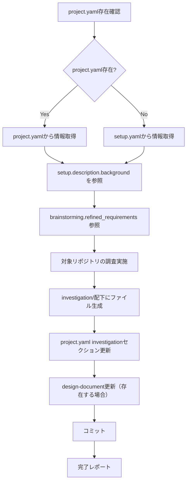
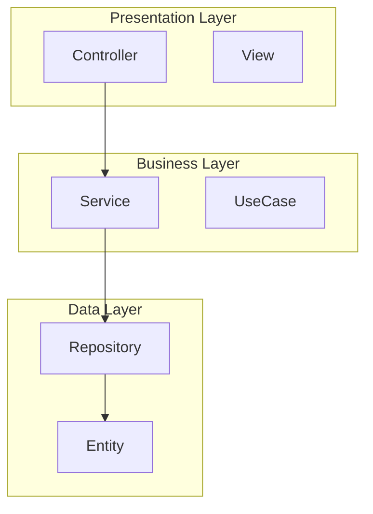
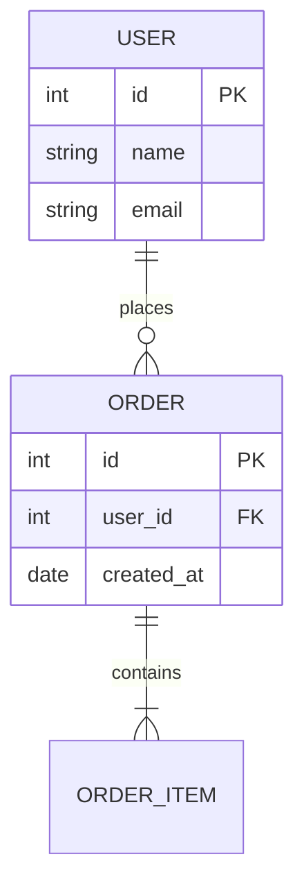
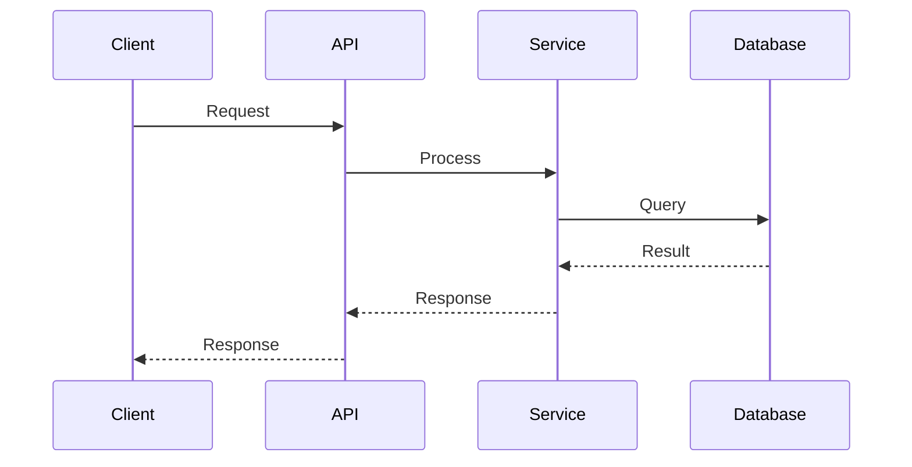
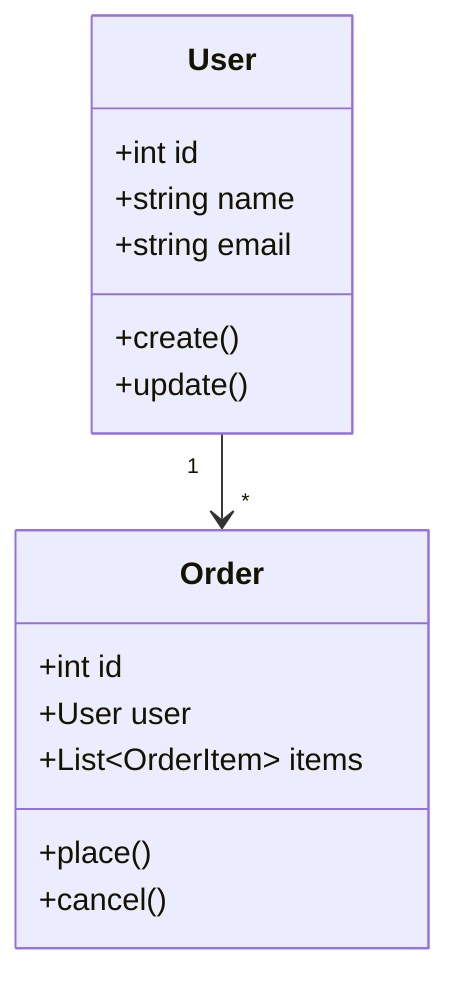
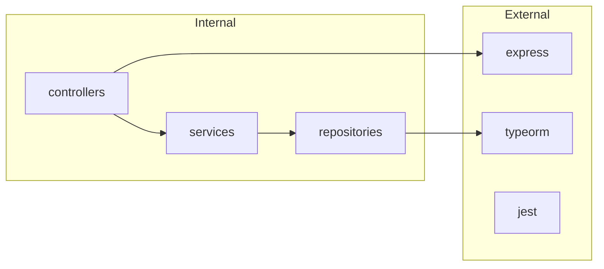

# 開発タスク用詳細調査スキル

project.yaml（または setup.yaml）を入力として、対象リポジトリを体系的に調査し、詳細な調査結果をドキュメント化します。

> **SSOT**: project.yaml を全プロセスの Single Source of Truth として使用します。
> - 調査の背景情報: `setup.description.background`
> - 調査結果の出力: `investigation` セクション

## 概要

このスキルは以下を実現します：
1. **project.yaml** から対象リポジトリ・チケット情報を取得（`meta` + `setup` セクション）
2. **project.yaml の setup.description.background** を調査の背景・コンテキストとして参照
3. **docs/{target_repo}/investigation/** ディレクトリに詳細調査結果をファイル分割で出力（UML図含む）
4. **project.yaml の investigation セクション** を更新してコミット

## 入力ファイル

### 1. project.yaml（推奨・SSOT）

`brainstorming` スキルで生成されたプロジェクトコンテキストファイル。

```yaml
# project.yaml から参照するセクション
meta:
  ticket_id: "PROJ-123"
  task_name: "機能追加タスク"
  target_repo: "target-repo"
  branch: "feature/PROJ-123"

setup:
  description:
    overview: "概要..."
    purpose: "目的..."
    background: |                    # ← このスキルが参照
      現在の機能では以下の課題がある:
      - 課題1: ○○ができない
      - 課題2: △△に時間がかかる
    requirements:
      functional: [...]
      non_functional: [...]
  target_repositories:
    - name: "target-repo"
      url: "git@github.com:org/target-repo.git"
      base_branch: "main"
  related_repositories:
    - name: "related-repo"
      url: "git@github.com:org/related-repo.git"

# brainstorming の結果（参照可能）
brainstorming:
  status: completed
  refined_requirements: [...]        # 深掘りされた要件も参照
```

### 2. setup.yaml（fallback）

project.yaml が存在しない場合のみ使用。

```yaml
ticket_id: "PROJ-123"
task_name: "機能追加タスク"

description:
  overview: "概要..."
  purpose: "目的..."
  background: |
    現在の機能では以下の課題がある:
    - 課題1: ○○ができない
    - 課題2: △△に時間がかかる
  requirements:
    functional: [...]
    non_functional: [...]

target_repositories:
  - name: "target-repo"
    url: "git@github.com:org/target-repo.git"
    base_branch: "main"
```

### 3. design-document: docs/{ticket_id}.md（任意）

init-work-branchスキルで生成された設計ドキュメント。存在する場合は調査結果セクションも更新。

## 処理フロー



## project.yaml からの情報取得

### 背景情報の参照

`project.yaml` の `setup.description.background` を調査のコンテキストとして活用します：

```yaml
# project.yaml から取得
setup:
  description:
    background: |
      現在の機能では以下の課題がある:
      - 課題1: ○○ができない
      - 課題2: △△に時間がかかる
      
      これらの課題を解決するため、機能Aの実装が必要。
```

### brainstorming 結果の参照

`brainstorming` セクションが完了している場合、深掘りされた要件も参照します：

```yaml
# project.yaml から取得
brainstorming:
  status: completed
  refined_requirements:
    - "リフレッシュトークンによる自動更新"
    - "OAuth2.0 プロバイダ連携"
  decisions:
    - question: "認証方式は？"
      decision: "JWTベース"
```

**活用方法:**
- 調査の焦点を明確にする（どの課題に関連するコードを重点的に調査するか）
- brainstorming で決定された方針に関連する既存実装を重点的に調査
- 既存の問題点との関連性を分析する
- 調査結果レポートに背景情報を含める

## 調査実施項目

### 1. アーキテクチャ調査
- プロジェクト全体の構成把握
- ディレクトリ構造・レイヤー構成
- コンポーネント図の作成（Mermaid）

### 2. データ構造調査
- エンティティ・スキーマ定義の把握
- ER図の作成（Mermaid）
- 型定義・インターフェースの整理

### 3. 依存関係調査
- 外部パッケージ依存関係
- 内部モジュール間依存関係
- 依存関係図の作成（Mermaid）

### 4. 既存パターン調査
- コーディング規約・スタイル
- 実装パターン・設計パターン
- テストパターン

### 5. 統合ポイント調査
- 他モジュール・サービスとの接点
- API連携・イベント連携
- シーケンス図の作成（Mermaid）

### 6. リスク・制約分析
- 潜在的な問題点の特定
- 技術的制約・要件制約
- 影響度・発生可能性の評価

## 出力ファイル構成

調査結果は `docs/{target_repository}/investigation/` に出力：

```
docs/
└── {target_repository}/
    └── investigation/
        ├── 01_architecture.md          # アーキテクチャ調査
        ├── 02_data-structure.md        # データ構造調査
        ├── 03_dependencies.md          # 依存関係調査
    ├── 04_existing-patterns.md     # 既存パターン調査
    ├── 05_integration-points.md    # 統合ポイント調査
    └── 06_risks-and-constraints.md # リスク・制約分析
```

各ファイルはテンプレート `references/template.md` に従って作成。

## 調査手法

### アーキテクチャ調査

```bash
# ディレクトリ構造の確認
find . -type d -maxdepth 3 | head -50

# 設定ファイルの確認
find . -name "*.config.*" -o -name "*.json" -o -name "*.yaml" -o -name "*.yml" | head -30

# エントリーポイントの確認
grep -r "main\|index\|app" --include="*.ts" --include="*.js" --include="*.py" -l | head -20
```

### データ構造調査

```bash
# 型定義・インターフェースの検索
grep -r "interface\|type\|class\|entity\|model\|schema" --include="*.ts" --include="*.py" -l | head -30

# ORM/DBスキーマの検索
find . -name "*entity*" -o -name "*model*" -o -name "*schema*" | head -20
```

### 依存関係調査

```bash
# パッケージ依存関係
cat package.json 2>/dev/null || cat pyproject.toml 2>/dev/null || cat requirements.txt 2>/dev/null

# インポート文の分析
grep -r "^import\|^from" --include="*.ts" --include="*.py" | head -50
```

### 既存パターン調査

```bash
# コーディングスタイル設定
cat .eslintrc* .prettierrc* .editorconfig pyproject.toml setup.cfg 2>/dev/null

# テストファイルの構成
find . -name "*.test.*" -o -name "*.spec.*" -o -name "test_*" | head -20
```

### 統合ポイント調査

```bash
# API定義・エンドポイント
grep -r "router\|endpoint\|@Get\|@Post\|api\|route" --include="*.ts" --include="*.py" -l | head -20

# イベント・メッセージング
grep -r "emit\|publish\|subscribe\|event\|listener" --include="*.ts" --include="*.py" -l | head -20
```

## design-document更新内容

`docs/{ticket_id}.md` の「1. 調査結果」セクションを更新：

```markdown
## 1. 調査結果

### 1.1 現状分析

{アーキテクチャ・データ構造・依存関係の要約}

詳細は [investigation/](./{target_repo}/investigation/) を参照。

### 1.2 関連コード・ファイル

| ファイル | 役割 | 備考 |
| -------- | ---- | ---- |
| ...      | ...  | ...  |

### 1.3 参考情報

- [アーキテクチャ調査](./{target_repo}/investigation/01_architecture.md)
- [データ構造調査](./{target_repo}/investigation/02_data-structure.md)
- [依存関係調査](./{target_repo}/investigation/03_dependencies.md)
- [既存パターン調査](./{target_repo}/investigation/04_existing-patterns.md)
- [統合ポイント調査](./{target_repo}/investigation/05_integration-points.md)
- [リスク・制約分析](./{target_repo}/investigation/06_risks-and-constraints.md)
```

## UML/図表ガイドライン

Mermaid形式を使用して以下の図を作成：

### コンポーネント図（アーキテクチャ）



### ER図（データ構造）



### シーケンス図（統合ポイント）



### クラス図（オブジェクト構成）



### 依存関係図



## 実行手順

### 1. project.yaml / setup.yaml 読み込み

```bash
# project.yaml を優先、なければ setup.yaml を使用
if [ -f "project.yaml" ]; then
    CONFIG_FILE="project.yaml"
    echo "project.yaml を使用"
else
    CONFIG_FILE="${1:-setup.yaml}"
    test -f "$CONFIG_FILE" || { echo "Error: $CONFIG_FILE not found"; exit 1; }
    echo "setup.yaml を使用（project.yaml なし）"
fi
```

**project.yaml からの情報抽出:**
- `meta.ticket_id` - チケットID
- `meta.task_name` - タスク名
- `meta.target_repo` - 主要調査対象リポジトリ
- `setup.target_repositories` - 調査対象リポジトリ一覧
- `setup.description.background` - 調査の背景情報
- `brainstorming.refined_requirements` - 深掘りされた要件（存在する場合）

### 2. design-document確認（任意）

```bash
DOCS_DIR="${options.design_document_dir:-docs}"
DESIGN_DOC="$DOCS_DIR/${ticket_id}.md"
if [ -f "$DESIGN_DOC" ]; then
    echo "design-document を発見: $DESIGN_DOC"
fi
```

### 3. 対象リポジトリの調査

各 `target_repository` に対して調査を実施：

```bash
for repo in "${target_repositories[@]}"; do
    REPO_PATH="submodules/${repo}"
    OUTPUT_DIR="docs/${repo}/investigation"
    cd "$REPO_PATH"
    
    # investigation ディレクトリ作成（出力先はdocs配下）
    mkdir -p "../${OUTPUT_DIR}"
    
    # 各調査を実施し、結果をファイルに出力
    # ... (調査処理)
    
    cd -
done
```

### 4. project.yaml の investigation セクション更新

調査結果の要約を project.yaml に追記：

```yaml
# project.yaml に追記
investigation:
  status: completed
  completed_at: "2025-02-11T12:00:00+09:00"
  summary: |
    {アーキテクチャ・データ構造・依存関係の要約（3行以内）}
  key_findings:
    - "{重要な発見1}"
    - "{重要な発見2}"
    - "{重要な発見3}"
  risks:
    - "{特定されたリスク}"
  artifacts: "docs/{target_repo}/investigation/"
```

### 5. design-document更新（存在する場合）

調査結果の要約を `docs/{ticket_id}.md` の「1. 調査結果」セクションにも埋め込み。

### 6. コミット

```bash
# project.yaml と調査結果をコミット
git add project.yaml docs/
git commit -m "docs: investigation 完了

- project.yaml の investigation セクションを更新
- docs/{target_repo}/investigation/ に詳細調査結果を出力"
```

## 完了レポート

```markdown
## 調査完了 ✅

### 調査対象
- チケット: {ticket_id}
- タスク: {task_name}
- リポジトリ: {target_repositories}

### project.yaml 更新内容

\`\`\`yaml
investigation:
  status: completed
  started_at: "{開始時に記録した時刻}"
  completed_at: "{timestamp}"
  summary: |
    {調査結果の要約}
  key_findings:
    - "{発見1}"
    - "{発見2}"
  risks:
    - "{リスク}"
  artifacts: "docs/{target_repo}/investigation/"
\`\`\`

### 生成されたファイル

#### 詳細調査結果
- docs/{target_repo}/investigation/01_architecture.md
- docs/{target_repo}/investigation/02_data-structure.md
- docs/{target_repo}/investigation/03_dependencies.md
- docs/{target_repo}/investigation/04_existing-patterns.md
- docs/{target_repo}/investigation/05_integration-points.md
- docs/{target_repo}/investigation/06_risks-and-constraints.md

### 次のステップ
1. 調査結果をレビュー
2. 設計スキル（design）を使用して詳細設計を開始
3. タスク計画スキル（plan）でタスク分割を実施
```

## エラーハンドリング

### project.yaml も setup.yaml も見つからない
```
エラー: project.yaml も setup.yaml も見つかりません

brainstorming スキルで project.yaml を生成するか、
init-work-branch スキルで setup.yaml を作成してください。
```

### design-documentが見つからない
```
警告: design-documentが見つかりません
ファイル: docs/{ticket_id}.md

design-document の更新はスキップします。
project.yaml の investigation セクションは更新されます。
```

### 対象リポジトリにアクセスできない
```
警告: リポジトリにアクセスできません
リポジトリ: submodules/{repo_name}

git submodule update --init を実行してください。
```

## 注意事項

- 調査対象は `target_repositories` のみ（`related_repositories` は参照用）
- 大規模リポジトリの場合、調査に時間がかかる可能性あり
- 既存の `investigation/` ディレクトリがある場合は上書き確認を行う
- **project.yaml を SSOT として使用し、investigation セクションを更新**
- brainstorming が完了している場合、`refined_requirements` も参照

## 参照ファイル

- テンプレート: `references/template.md` - 各調査ファイル用テンプレート
- 前提スキル: `brainstorming` - 要件深掘り（project.yaml を生成）
- 前提スキル: `init-work-branch` - 作業ブランチ初期化
- 後続スキル: `design` - 詳細設計

## SSOT参照

| project.yaml フィールド              | 用途                         |
| ------------------------------------ | ---------------------------- |
| `meta.ticket_id`                     | チケットID                   |
| `meta.task_name`                     | タスク名                     |
| `meta.target_repo`                   | 主要調査対象リポジトリ       |
| `setup.description.background`       | 調査の背景情報・コンテキスト |
| `setup.target_repositories`          | 調査対象リポジトリ一覧       |
| `brainstorming.refined_requirements` | 深掘りされた要件（参照）     |

## 出力（project.yaml への書き込み）

| investigation フィールド | 説明                                    |
| ------------------------ | --------------------------------------- |
| `status`                 | `pending` / `in_progress` / `completed` |
| `completed_at`           | 完了日時（ISO 8601形式）                |
| `summary`                | 調査結果の要約（3行以内）               |
| `key_findings`           | 重要な発見（5件以内）                   |
| `risks`                  | 特定されたリスク（3件以内）             |
| `artifacts`              | 詳細調査ドキュメントのパス              |
