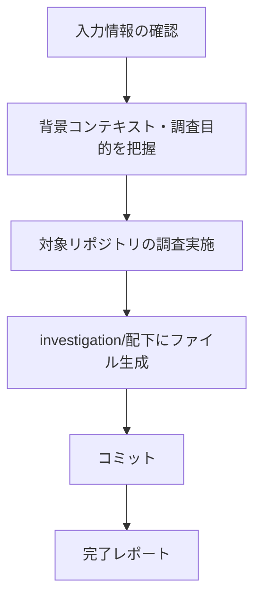

# 開発タスク用詳細調査スキル

対象リポジトリを体系的に調査し、詳細な調査結果をドキュメント化します。

## 概要

1. **背景コンテキスト・調査目的・対象リポジトリパス** を入力として受け取る
2. **docs/{target_repo}/investigation/** に詳細調査結果をファイル分割で出力（UML図含む）
3. 調査結果の要約レポートを作成

## 入力

| 入力項目 | 説明 | 必須 |
| -------- | ---- | ---- |
| 対象リポジトリパス | 調査するリポジトリのディレクトリパス | ✅ |
| 対象リポジトリ名 | 出力ディレクトリ名に使用する識別名 | ✅ |
| 背景コンテキスト | タスクの背景情報・課題・目的 | ✅ |
| 調査目的 | 何を明らかにしたいか（調査の焦点） | ✅ |
| 要件一覧 | 機能要件・非機能要件のリスト | 任意 |
| 決定済み方針 | 既に決定されたアーキテクチャ方針等 | 任意 |

入力は調査の焦点決定・決定済み方針の既存実装調査・問題点分析・レポート作成に活用する。

## 処理フロー

```mermaid
flowchart TD
    A[入力情報の確認] --> B[背景コンテキスト・調査目的を把握]
    B --> C[対象リポジトリの調査実施]
    C --> D[investigation/配下にファイル生成]
    D --> E[コミット]
    E --> F[完了レポート]
```

📖 詳細は references/execution-guide.md を参照

## 調査実施項目（6カテゴリ）

| # | カテゴリ | 主な調査内容 | 推奨図表 |
|---|----------|-------------|----------|
| 1 | アーキテクチャ | 構成把握・ディレクトリ構造・レイヤー構成 | コンポーネント図 |
| 2 | データ構造 | エンティティ・スキーマ・型定義 | ER図・クラス図 |
| 3 | 依存関係 | 外部/内部パッケージ依存 | 依存関係図 |
| 4 | 既存パターン | コーディング規約・実装/テストパターン | コードサンプル |
| 5 | 統合ポイント | API連携・イベント連携・外部サービス | シーケンス図 |
| 6 | リスク・制約 | 問題点特定・技術制約・影響度評価 | リスクマトリックス |

📖 調査コマンド詳細は references/investigation-methods.md を参照
📖 UML図サンプルは references/uml-specifications.md を参照

## 出力ファイル構成

`docs/{target_repository}/investigation/` に出力：

| ファイル | 内容 |
|----------|------|
| 01_architecture.md | アーキテクチャ調査 |
| 02_data-structure.md | データ構造調査 |
| 03_dependencies.md | 依存関係調査 |
| 04_existing-patterns.md | 既存パターン調査 |
| 05_integration-points.md | 統合ポイント調査 |
| 06_risks-and-constraints.md | リスク・制約分析 |

各ファイルは `references/template.md` に従って作成。

## 注意事項

- 大規模リポジトリの場合、調査に時間がかかる可能性あり
- 既存の `investigation/` ディレクトリがある場合は上書き確認を行う
- 調査の焦点は入力の背景コンテキスト・調査目的に基づいて決定する

## 参照ファイル

| ファイル | 内容 |
|----------|------|
| `references/template.md` | 各調査ファイル用テンプレート |
| `references/investigation-methods.md` | 調査コマンド・手法リファレンス |
| `references/uml-specifications.md` | UML/図表サンプル集 |
| `references/execution-guide.md` | 実行手順・完了レポート・エラーハンドリング |

後続スキル: `design` - 詳細設計
