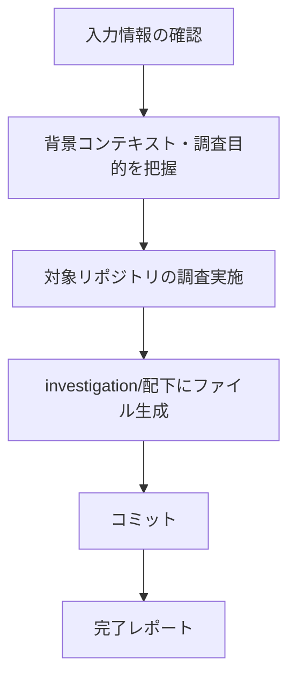
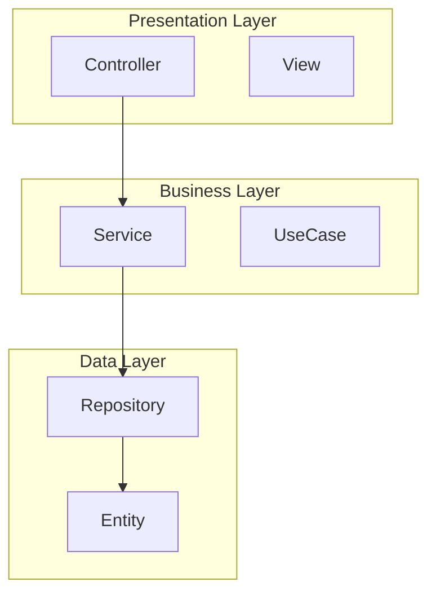
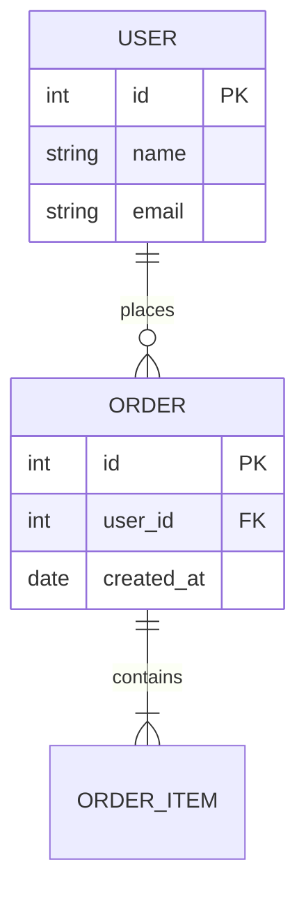
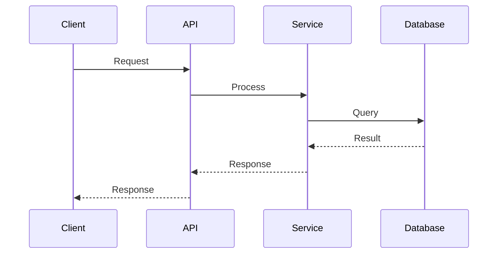
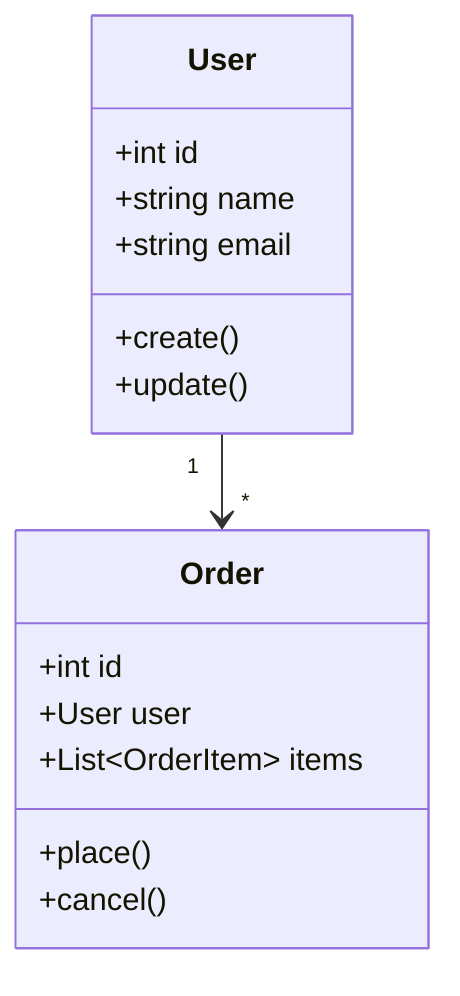
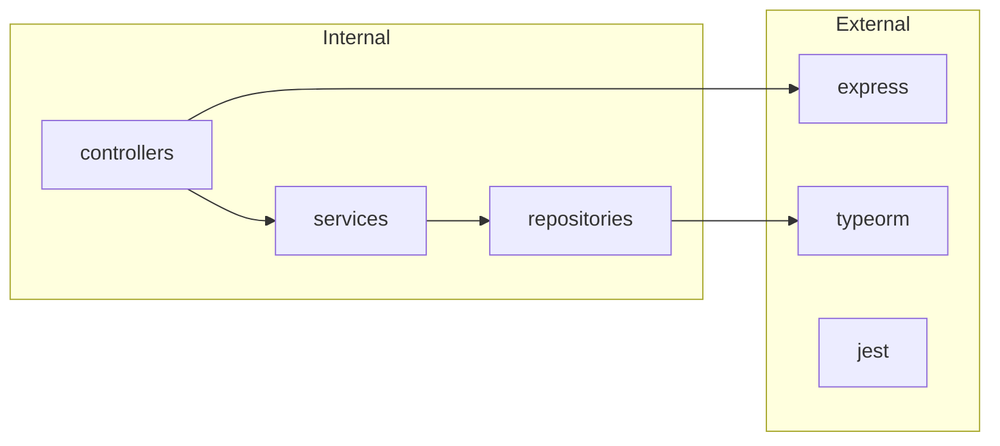

# 開発タスク用詳細調査スキル

対象リポジトリを体系的に調査し、詳細な調査結果をドキュメント化します。

## 概要

このスキルは以下を実現します：
1. **背景コンテキスト・調査目的・対象リポジトリパス** を入力として受け取る
2. **docs/{target_repo}/investigation/** ディレクトリに詳細調査結果をファイル分割で出力（UML図含む）
3. 調査結果の要約レポートを作成

## 入力

このスキルは以下の情報を必要とします（呼び出し元から提供される）：

| 入力項目 | 説明 | 必須 |
| -------- | ---- | ---- |
| 対象リポジトリパス | 調査するリポジトリのディレクトリパス | ✅ |
| 対象リポジトリ名 | 出力ディレクトリ名に使用する識別名 | ✅ |
| 背景コンテキスト | タスクの背景情報・課題・目的 | ✅ |
| 調査目的 | 何を明らかにしたいか（調査の焦点） | ✅ |
| 要件一覧 | 機能要件・非機能要件のリスト | 任意 |
| 決定済み方針 | 既に決定されたアーキテクチャ方針等 | 任意 |

**入力の活用方法:**
- 調査の焦点を明確にする（どの課題に関連するコードを重点的に調査するか）
- 決定済み方針に関連する既存実装を重点的に調査
- 既存の問題点との関連性を分析する
- 調査結果レポートに背景情報を含める

## 処理フロー


```mermaid
flowchart TD
    A[入力情報の確認] --> B[背景コンテキスト・調査目的を把握]
    B --> C[対象リポジトリの調査実施]
    C --> D[investigation/配下にファイル生成]
    D --> E[コミット]
    E --> F[完了レポート]
```

## 調査実施項目

### 1. アーキテクチャ調査
- プロジェクト全体の構成把握
- ディレクトリ構造・レイヤー構成
- コンポーネント図の作成（Mermaid）

### 2. データ構造調査
- エンティティ・スキーマ定義の把握
- ER図の作成（Mermaid）
- 型定義・インターフェースの整理

### 3. 依存関係調査
- 外部パッケージ依存関係
- 内部モジュール間依存関係
- 依存関係図の作成（Mermaid）

### 4. 既存パターン調査
- コーディング規約・スタイル
- 実装パターン・設計パターン
- テストパターン

### 5. 統合ポイント調査
- 他モジュール・サービスとの接点
- API連携・イベント連携
- シーケンス図の作成（Mermaid）

### 6. リスク・制約分析
- 潜在的な問題点の特定
- 技術的制約・要件制約
- 影響度・発生可能性の評価

## 出力ファイル構成

調査結果は `docs/{target_repository}/investigation/` に出力：

```
docs/
└── {target_repository}/
    └── investigation/
        ├── 01_architecture.md          # アーキテクチャ調査
        ├── 02_data-structure.md        # データ構造調査
        ├── 03_dependencies.md          # 依存関係調査
    ├── 04_existing-patterns.md     # 既存パターン調査
    ├── 05_integration-points.md    # 統合ポイント調査
    └── 06_risks-and-constraints.md # リスク・制約分析
```

各ファイルはテンプレート `references/template.md` に従って作成。

## 調査手法

### アーキテクチャ調査

```bash
# ディレクトリ構造の確認
find . -type d -maxdepth 3 | head -50

# 設定ファイルの確認
find . -name "*.config.*" -o -name "*.json" -o -name "*.yaml" -o -name "*.yml" | head -30

# エントリーポイントの確認
grep -r "main\|index\|app" --include="*.ts" --include="*.js" --include="*.py" -l | head -20
```

### データ構造調査

```bash
# 型定義・インターフェースの検索
grep -r "interface\|type\|class\|entity\|model\|schema" --include="*.ts" --include="*.py" -l | head -30

# ORM/DBスキーマの検索
find . -name "*entity*" -o -name "*model*" -o -name "*schema*" | head -20
```

### 依存関係調査

```bash
# パッケージ依存関係
cat package.json 2>/dev/null || cat pyproject.toml 2>/dev/null || cat requirements.txt 2>/dev/null

# インポート文の分析
grep -r "^import\|^from" --include="*.ts" --include="*.py" | head -50
```

### 既存パターン調査

```bash
# コーディングスタイル設定
cat .eslintrc* .prettierrc* .editorconfig pyproject.toml setup.cfg 2>/dev/null

# テストファイルの構成
find . -name "*.test.*" -o -name "*.spec.*" -o -name "test_*" | head -20
```

### 統合ポイント調査

```bash
# API定義・エンドポイント
grep -r "router\|endpoint\|@Get\|@Post\|api\|route" --include="*.ts" --include="*.py" -l | head -20

# イベント・メッセージング
grep -r "emit\|publish\|subscribe\|event\|listener" --include="*.ts" --include="*.py" -l | head -20
```

## UML/図表ガイドライン

Mermaid形式を使用して以下の図を作成：

### コンポーネント図（アーキテクチャ）


```mermaid
graph TD
    subgraph Presentation Layer
        A[Controller]
        B[View]
    end
    subgraph Business Layer
        C[Service]
        D[UseCase]
    end
    subgraph Data Layer
        E[Repository]
        F[Entity]
    end
    A --> C
    C --> E
    E --> F
```

### ER図（データ構造）


```mermaid
erDiagram
    USER ||--o{ ORDER : places
    USER {
        int id PK
        string name
        string email
    }
    ORDER ||--|{ ORDER_ITEM : contains
    ORDER {
        int id PK
        int user_id FK
        date created_at
    }
```

### シーケンス図（統合ポイント）


```mermaid
sequenceDiagram
    participant C as Client
    participant A as API
    participant S as Service
    participant D as Database
    
    C->>A: Request
    A->>S: Process
    S->>D: Query
    D-->>S: Result
    S-->>A: Response
    A-->>C: Response
```

### クラス図（オブジェクト構成）


```mermaid
classDiagram
    class User {
        +int id
        +string name
        +string email
        +create()
        +update()
    }
    class Order {
        +int id
        +User user
        +List~OrderItem~ items
        +place()
        +cancel()
    }
    User "1" --> "*" Order
```

### 依存関係図


```mermaid
graph LR
    subgraph External
        E1[express]
        E2[typeorm]
        E3[jest]
    end
    subgraph Internal
        I1[controllers]
        I2[services]
        I3[repositories]
    end
    I1 --> I2
    I2 --> I3
    I1 --> E1
    I3 --> E2
```

## 実行手順

### 1. 入力情報の確認

呼び出し元から以下の情報を受け取り、調査の方針を決定します：

- **対象リポジトリパス**: 調査するリポジトリのディレクトリ
- **対象リポジトリ名**: 出力先ディレクトリ名（`docs/{name}/investigation/`）
- **背景コンテキスト**: なぜこの調査が必要か
- **調査目的**: 何を明らかにしたいか

### 2. 対象リポジトリの調査

対象リポジトリに対して調査を実施：

```bash
REPO_PATH="{対象リポジトリパス}"
TARGET_REPO="{対象リポジトリ名}"
OUTPUT_DIR="docs/${TARGET_REPO}/investigation"

cd "$REPO_PATH"

# investigation ディレクトリ作成
mkdir -p "$OUTPUT_DIR"

# 各調査を実施し、結果をファイルに出力
# ... (調査処理)
```

### 3. コミット

```bash
git add docs/
git commit -m "docs: investigation 完了

- docs/{target_repo}/investigation/ に詳細調査結果を出力"
```

## 完了レポート

```markdown
## 調査完了 ✅

### 調査対象
- リポジトリ: {target_repo}
- 調査目的: {調査目的の要約}

### 調査結果サマリ

- **要約**: {調査結果の要約}
- **重要な発見**:
  - {発見1}
  - {発見2}
- **リスク**:
  - {リスク}
- **成果物**: docs/{target_repo}/investigation/

### 生成されたファイル

#### 詳細調査結果
- docs/{target_repo}/investigation/01_architecture.md
- docs/{target_repo}/investigation/02_data-structure.md
- docs/{target_repo}/investigation/03_dependencies.md
- docs/{target_repo}/investigation/04_existing-patterns.md
- docs/{target_repo}/investigation/05_integration-points.md
- docs/{target_repo}/investigation/06_risks-and-constraints.md

### 次のステップ
1. 調査結果をレビュー
2. 設計スキル（design）を使用して詳細設計を開始
3. タスク計画スキル（plan）でタスク分割を実施
```

## エラーハンドリング

### 対象リポジトリが指定されていない
```
エラー: 対象リポジトリパスが指定されていません

呼び出し元から対象リポジトリパスと調査目的を提供してください。
```

### 対象リポジトリにアクセスできない
```
警告: リポジトリにアクセスできません
リポジトリ: {repo_path}

リポジトリのパスが正しいか確認してください。
```

## 注意事項

- 大規模リポジトリの場合、調査に時間がかかる可能性あり
- 既存の `investigation/` ディレクトリがある場合は上書き確認を行う
- 調査の焦点は入力で与えられた背景コンテキスト・調査目的に基づいて決定する

## 参照ファイル

- テンプレート: `references/template.md` - 各調査ファイル用テンプレート
- 後続スキル: `design` - 詳細設計
