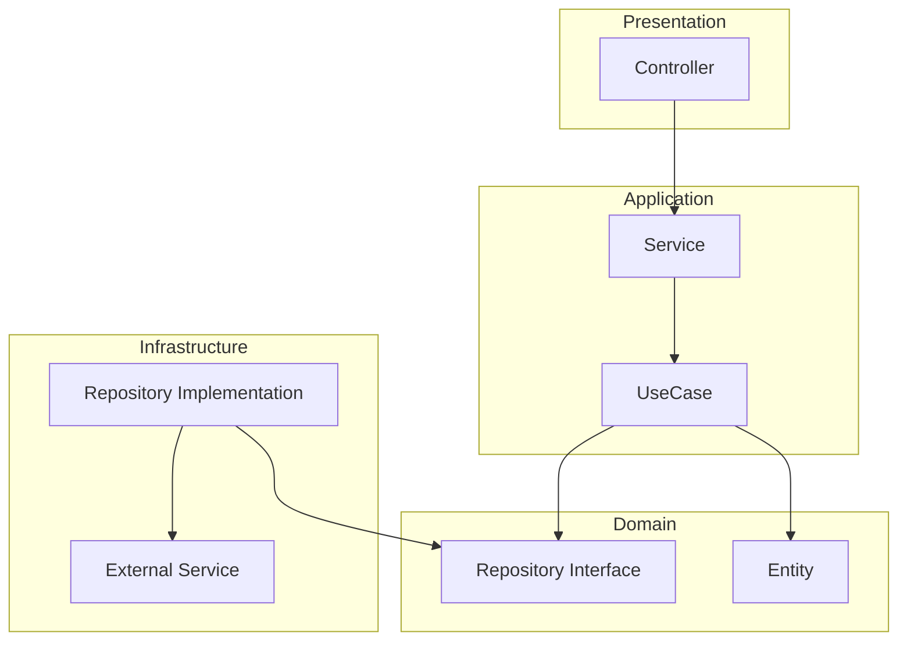
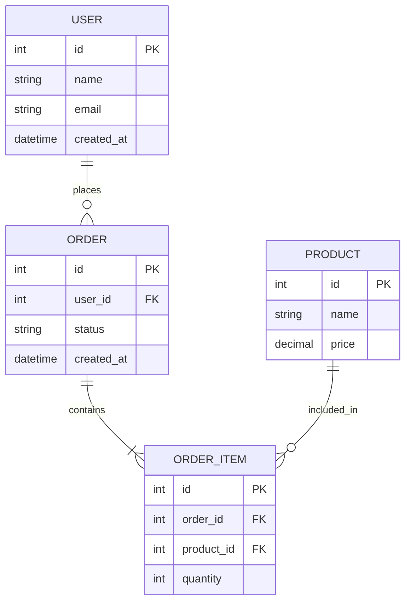
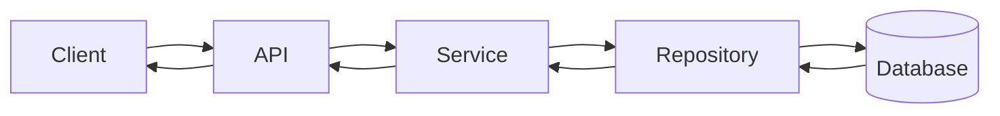
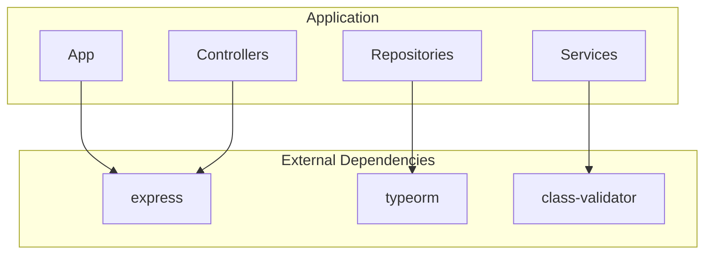
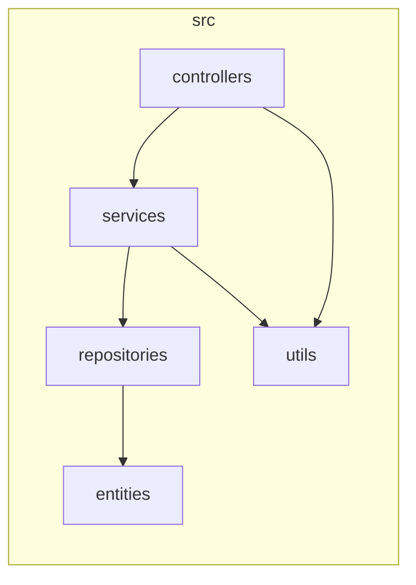
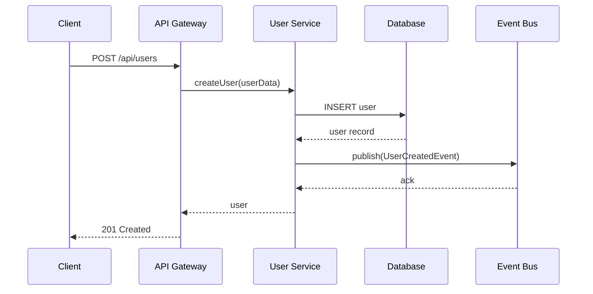
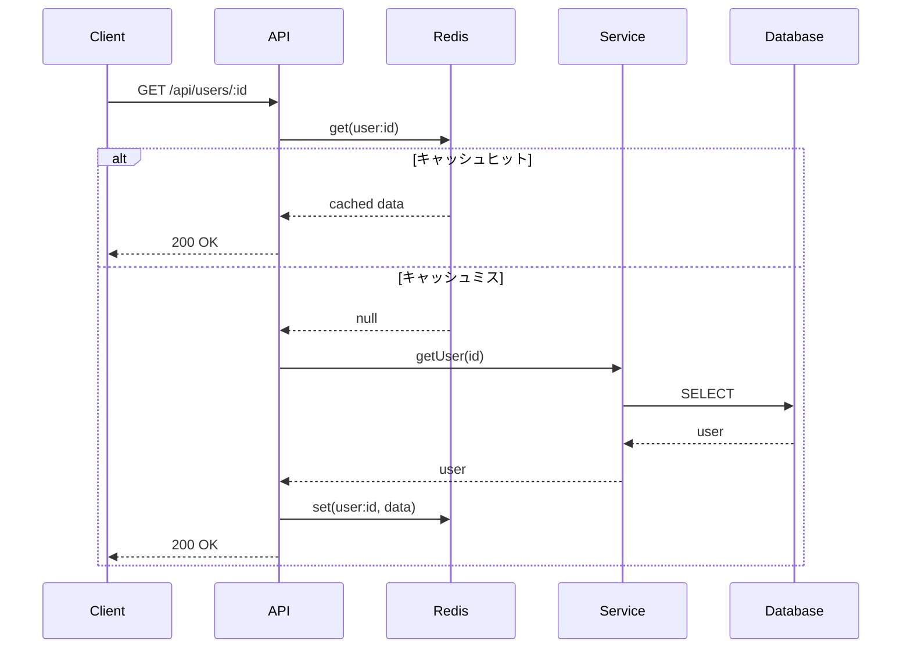
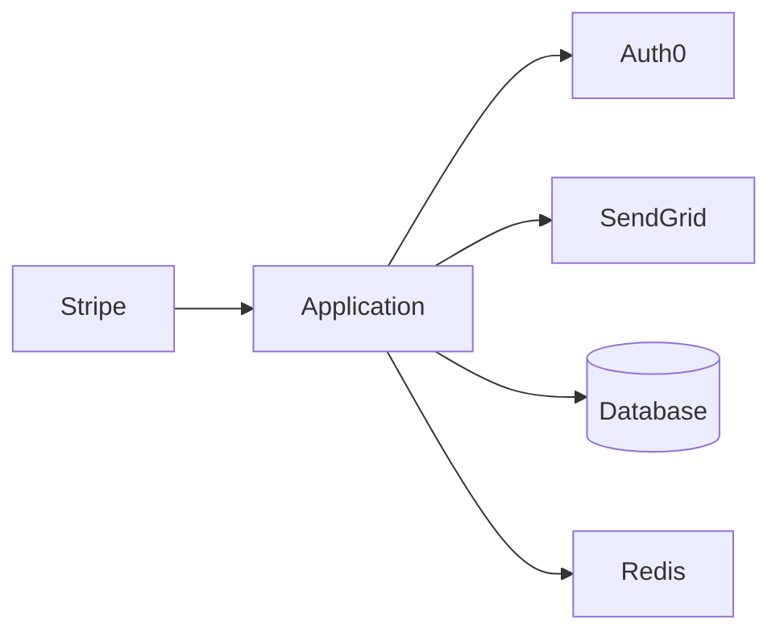
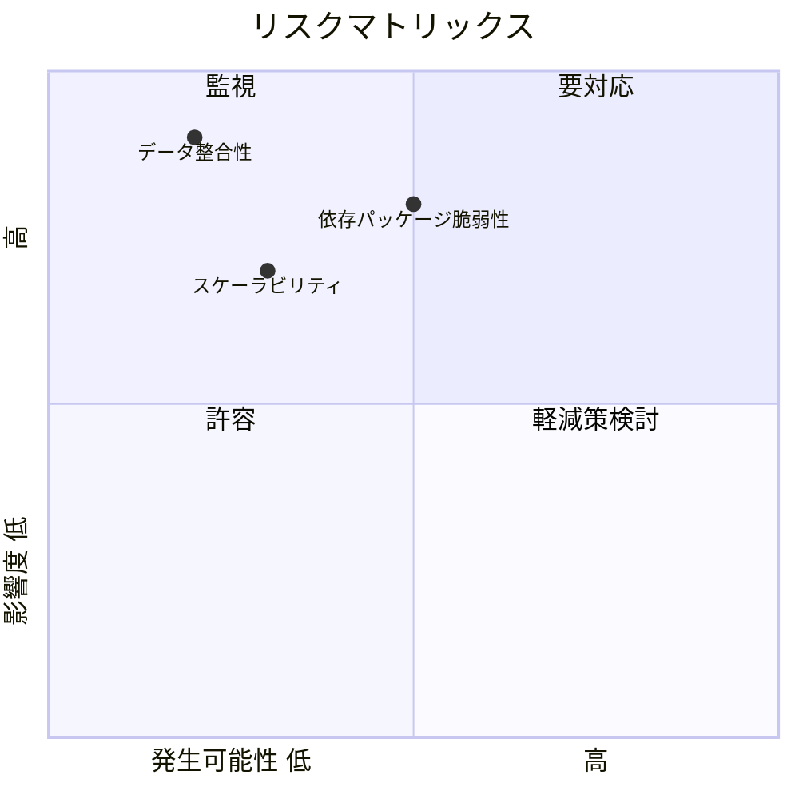
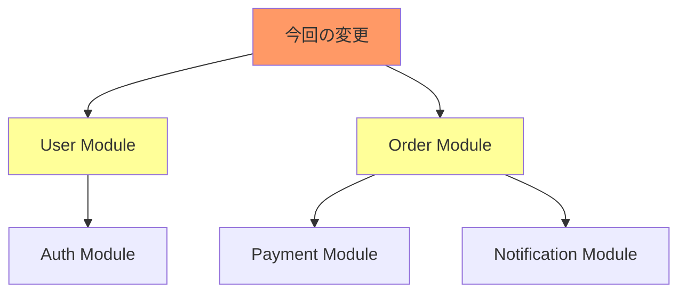

# 調査結果テンプレート

各調査ファイル（01〜06）を作成する際のテンプレート。

---

## 01_architecture.md テンプレート

```markdown
# アーキテクチャ調査

## 概要

{プロジェクト全体のアーキテクチャ概要を1-2文で記載}

## ディレクトリ構造

```
project-root/
├── src/              # {説明}
│   ├── controllers/  # {説明}
│   ├── services/     # {説明}
│   ├── repositories/ # {説明}
│   └── entities/     # {説明}
├── tests/            # {説明}
├── config/           # {説明}
└── ...
```

## アーキテクチャパターン

{採用されているアーキテクチャパターン（MVC, Clean Architecture, DDD等）}

## コンポーネント図



## レイヤー構成

| レイヤー | 責務 | 主要コンポーネント |
|----------|------|-------------------|
| Presentation | リクエスト処理、レスポンス生成 | Controller, View |
| Application | ビジネスロジック実行 | Service, UseCase |
| Domain | ドメインモデル、ビジネスルール | Entity, ValueObject |
| Infrastructure | 外部システム連携、永続化 | Repository, Gateway |

## 主要ファイル

| ファイルパス | 役割 |
|--------------|------|
| `src/index.ts` | エントリーポイント |
| `src/app.ts` | アプリケーション設定 |
| ... | ... |

## 備考

{特記事項、注意点}
```

---

## 02_data-structure.md テンプレート

```markdown
# データ構造調査

## 概要

{データ構造全体の概要を1-2文で記載}

## ER図



## エンティティ一覧

| エンティティ | 説明 | 主要属性 |
|--------------|------|----------|
| User | ユーザー情報 | id, name, email |
| Order | 注文情報 | id, user_id, status |
| ... | ... | ... |

## 型定義・インターフェース

### 主要インターフェース

```typescript
interface User {
  id: number;
  name: string;
  email: string;
  createdAt: Date;
}

interface Order {
  id: number;
  userId: number;
  status: OrderStatus;
  items: OrderItem[];
}
```

### 列挙型・定数

```typescript
enum OrderStatus {
  PENDING = 'pending',
  CONFIRMED = 'confirmed',
  SHIPPED = 'shipped',
  DELIVERED = 'delivered'
}
```

## スキーマ定義ファイル

| ファイルパス | 内容 |
|--------------|------|
| `src/entities/user.entity.ts` | Userエンティティ定義 |
| `src/types/order.ts` | Order型定義 |
| ... | ... |

## データフロー



## 備考

{特記事項、マイグレーション情報、注意点}
```

---

## 03_dependencies.md テンプレート

```markdown
# 依存関係調査

## 概要

{依存関係の概要を1-2文で記載}

## 外部依存関係

### 本番依存（dependencies）

| パッケージ | バージョン | 用途 |
|------------|------------|------|
| express | ^4.18.0 | Webフレームワーク |
| typeorm | ^0.3.0 | ORM |
| ... | ... | ... |

### 開発依存（devDependencies）

| パッケージ | バージョン | 用途 |
|------------|------------|------|
| typescript | ^5.0.0 | TypeScriptコンパイラ |
| jest | ^29.0.0 | テストフレームワーク |
| ... | ... | ... |

## 依存関係図



## 内部モジュール依存関係



### モジュール間依存

| モジュール | 依存先 | 依存理由 |
|------------|--------|----------|
| controllers | services | ビジネスロジック呼び出し |
| services | repositories | データアクセス |
| services | utils | 共通ユーティリティ |

## 循環依存の有無

{循環依存が検出された場合は記載}

- [ ] 循環依存なし
- [ ] 循環依存あり（詳細: ...）

## バージョン制約・注意点

| 項目 | 制約内容 |
|------|----------|
| Node.js | >= 18.0.0 |
| npm | >= 9.0.0 |
| ... | ... |

## 備考

{特記事項、アップデート推奨パッケージ等}
```

---

## 04_existing-patterns.md テンプレート

```markdown
# 既存パターン調査

## 概要

{コーディング規約・パターンの概要を1-2文で記載}

## コーディングスタイル

### 設定ファイル

| ファイル | 内容 |
|----------|------|
| `.eslintrc.js` | ESLint設定 |
| `.prettierrc` | Prettier設定 |
| `tsconfig.json` | TypeScript設定 |

### 命名規則

| 対象 | 規則 | 例 |
|------|------|-----|
| ファイル名 | kebab-case | `user-service.ts` |
| クラス名 | PascalCase | `UserService` |
| 関数名 | camelCase | `getUserById` |
| 定数 | UPPER_SNAKE_CASE | `MAX_RETRY_COUNT` |

## 実装パターン

### コントローラーパターン

```typescript
@Controller('users')
export class UserController {
  constructor(private readonly userService: UserService) {}

  @Get(':id')
  async getUser(@Param('id') id: string): Promise<User> {
    return this.userService.findById(id);
  }
}
```

### サービスパターン

```typescript
@Injectable()
export class UserService {
  constructor(private readonly userRepository: UserRepository) {}

  async findById(id: string): Promise<User> {
    const user = await this.userRepository.findOne(id);
    if (!user) {
      throw new NotFoundException('User not found');
    }
    return user;
  }
}
```

### リポジトリパターン

```typescript
@Injectable()
export class UserRepository {
  constructor(@InjectRepository(User) private repo: Repository<User>) {}

  async findOne(id: string): Promise<User | null> {
    return this.repo.findOne({ where: { id } });
  }
}
```

## テストパターン

### テストファイル配置

```
src/
├── services/
│   ├── user.service.ts
│   └── user.service.spec.ts  # 同一ディレクトリ
tests/
└── e2e/
    └── user.e2e-spec.ts       # E2Eテスト
```

### 単体テストパターン

```typescript
describe('UserService', () => {
  let service: UserService;
  let mockRepository: jest.Mocked<UserRepository>;

  beforeEach(async () => {
    mockRepository = {
      findOne: jest.fn(),
    } as any;
    service = new UserService(mockRepository);
  });

  describe('findById', () => {
    it('should return user when found', async () => {
      const expected = { id: '1', name: 'Test' };
      mockRepository.findOne.mockResolvedValue(expected);

      const result = await service.findById('1');

      expect(result).toEqual(expected);
    });
  });
});
```

## エラーハンドリングパターン

```typescript
// カスタム例外クラス
export class BusinessException extends Error {
  constructor(
    message: string,
    public readonly code: string,
    public readonly status: number = 400
  ) {
    super(message);
  }
}

// 使用例
throw new BusinessException('Invalid operation', 'ERR_INVALID_OP');
```

## ロギングパターン

```typescript
// 構造化ロギング
this.logger.info('User created', {
  userId: user.id,
  action: 'create',
  timestamp: new Date().toISOString()
});
```

## 備考

{特記事項、推奨事項}
```

---

## 05_integration-points.md テンプレート

```markdown
# 統合ポイント調査

## 概要

{統合ポイントの概要を1-2文で記載}

## API エンドポイント一覧

| メソッド | パス | 説明 |
|----------|------|------|
| GET | /api/users | ユーザー一覧取得 |
| GET | /api/users/:id | ユーザー詳細取得 |
| POST | /api/users | ユーザー作成 |
| PUT | /api/users/:id | ユーザー更新 |
| DELETE | /api/users/:id | ユーザー削除 |

## シーケンス図

### ユーザー作成フロー



### データ取得フロー



## 外部サービス連携

| サービス | 連携方式 | 用途 |
|----------|----------|------|
| Auth0 | REST API | 認証・認可 |
| SendGrid | REST API | メール送信 |
| Stripe | Webhook | 決済処理 |

### 外部サービス連携図



## イベント/メッセージング

### 発行イベント

| イベント名 | トリガー | ペイロード |
|------------|----------|------------|
| UserCreated | ユーザー作成時 | { userId, email, name } |
| OrderPlaced | 注文確定時 | { orderId, userId, items } |

### 購読イベント

| イベント名 | ハンドラー | 処理内容 |
|------------|------------|----------|
| PaymentCompleted | OrderService | 注文ステータス更新 |
| InventoryUpdated | ProductService | 在庫数反映 |

## データベース接続

| データベース | 用途 | 接続情報 |
|--------------|------|----------|
| PostgreSQL | メインDB | `DATABASE_URL` |
| Redis | キャッシュ | `REDIS_URL` |
| Elasticsearch | 検索 | `ELASTIC_URL` |

## 統合ポイント一覧

| 統合ポイント | モジュール | 連携先 | 連携方式 |
|--------------|------------|--------|----------|
| ユーザー認証 | AuthModule | Auth0 | OAuth2.0 |
| 決済処理 | PaymentModule | Stripe | Webhook |
| 通知送信 | NotificationModule | SendGrid | REST API |

## 備考

{特記事項、SLA、タイムアウト設定等}
```

---

## 06_risks-and-constraints.md テンプレート

```markdown
# リスク・制約分析

## 概要

{リスク・制約の概要を1-2文で記載}

## 技術的リスク

| リスク | 影響度 | 発生可能性 | 対策 |
|--------|--------|------------|------|
| 依存パッケージの脆弱性 | 高 | 中 | 定期的なアップデート、Dependabot有効化 |
| スケーラビリティ限界 | 高 | 低 | 水平スケーリング設計の維持 |
| データ整合性の破損 | 高 | 低 | トランザクション管理の徹底 |

### リスクマトリックス



## ビジネスリスク

| リスク | 影響度 | 発生可能性 | 対策 |
|--------|--------|------------|------|
| 後方互換性の破壊 | 高 | 中 | バージョニング戦略の徹底 |
| パフォーマンス劣化 | 中 | 中 | パフォーマンステストの実施 |

## 技術的制約

| 制約 | 詳細 | 影響範囲 |
|------|------|----------|
| Node.js 18+ 必須 | ESM対応のため | ビルド・実行環境 |
| PostgreSQL 14+ | JSONB機能使用 | データベース環境 |
| メモリ上限 512MB | コンテナ制約 | 処理設計 |

## 設計上の制約

| 制約 | 理由 | 対応方針 |
|------|------|----------|
| REST API のみ | 既存クライアント互換性 | GraphQL移行は将来検討 |
| 同期処理 | シンプル性維持 | 必要に応じて非同期化 |

## セキュリティ考慮事項

| 項目 | 現状 | 推奨 |
|------|------|------|
| 認証 | JWT | 実装済み |
| 認可 | RBAC | 実装済み |
| 入力検証 | class-validator | 実装済み |
| SQLインジェクション対策 | ORM使用 | 対策済み |
| XSS対策 | HTMLエスケープ | 要確認 |

## パフォーマンス考慮事項

| 項目 | 現状値 | 目標値 | 備考 |
|------|--------|--------|------|
| レスポンス時間 | 200ms | 100ms以下 | P95 |
| スループット | 1000 req/s | 2000 req/s | ピーク時 |
| DB接続数 | 10 | 20 | コネクションプール |

## 影響度・依存関係



## 緩和策一覧

| リスク/制約 | 緩和策 | 優先度 |
|-------------|--------|--------|
| 依存パッケージ脆弱性 | 週次セキュリティスキャン | 高 |
| 後方互換性破壊 | API バージョニング導入 | 高 |
| パフォーマンス劣化 | 負荷テスト自動化 | 中 |

## ロールバック計画

| フェーズ | ロールバック方法 | 所要時間 |
|----------|------------------|----------|
| デプロイ前 | ブランチ切り戻し | 5分 |
| デプロイ後 | コンテナイメージ切り戻し | 10分 |
| DB変更後 | マイグレーションロールバック | 30分 |

## 備考

{特記事項、追加調査が必要な項目}
```

---

## 使用方法

各テンプレートを参考に、調査結果に応じてセクションを追加・削除・編集してください。

### 必須要素

- **概要**: 各ファイルの冒頭に1-2文の要約
- **図表**: 可能な限りMermaid形式で視覚化
- **一覧表**: 関連情報は表形式で整理
- **備考**: 特記事項、注意点を記載

### 図表ガイドライン

| 調査ファイル | 推奨図表 |
|--------------|----------|
| 01_architecture | コンポーネント図、レイヤー図 |
| 02_data-structure | ER図、クラス図 |
| 03_dependencies | 依存関係図 |
| 04_existing-patterns | コードサンプル（コードブロック） |
| 05_integration-points | シーケンス図、連携図 |
| 06_risks-and-constraints | リスクマトリックス、影響度図 |
