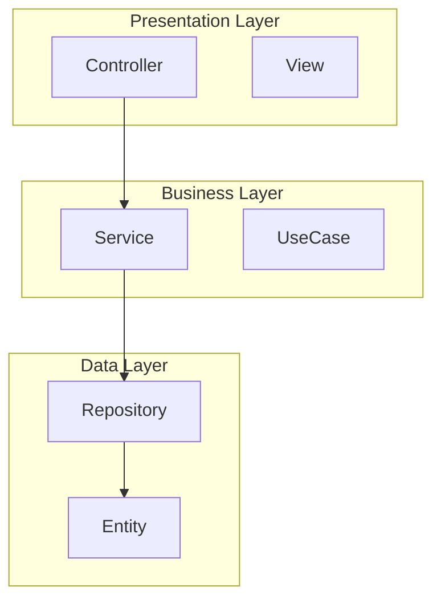
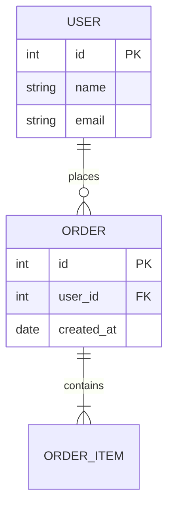
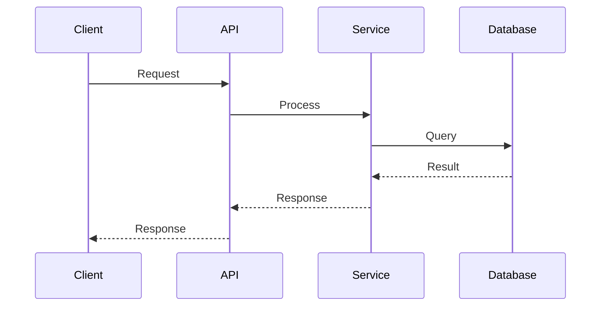
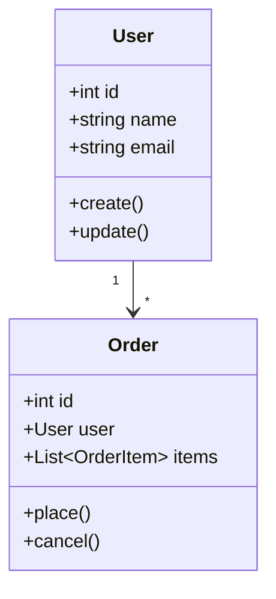
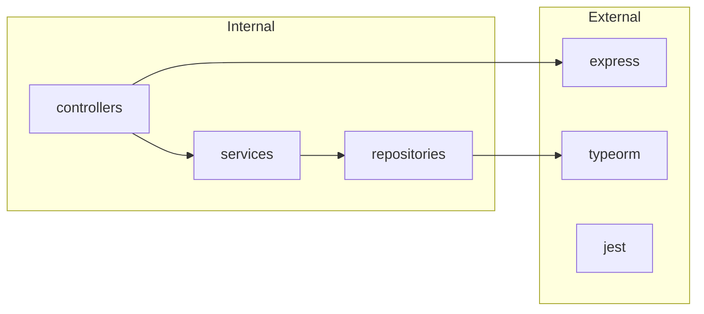

# UML/図表ガイドライン

Mermaid形式を使用して作成する図のサンプル集。

---

## コンポーネント図（アーキテクチャ）

## ER図（データ構造）

## シーケンス図（統合ポイント）

## クラス図（オブジェクト構成）

## 依存関係図

## 推奨図表マッピング

| 調査ファイル | 推奨図表 |
|--------------|----------|
| 01_architecture | コンポーネント図、レイヤー図 |
| 02_data-structure | ER図、クラス図 |
| 03_dependencies | 依存関係図 |
| 04_existing-patterns | コードサンプル（コードブロック） |
| 05_integration-points | シーケンス図、連携図 |
| 06_risks-and-constraints | リスクマトリックス、影響度図 |
