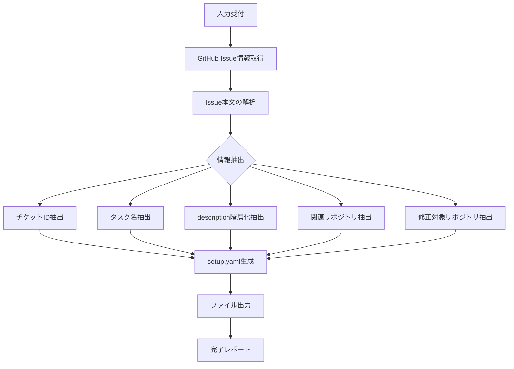

# GitHub Issue to Setup YAML スキル

GitHub issueの情報を解析し、開発セットアップ用のYAMLファイルを自動生成します。

> **SSOT対応**: 生成される setup.yaml の description は階層化フォーマットで、design-document や各スキルの Single Source of Truth となります。

## 概要

このスキルは以下を実現します：
1. **GitHub issue情報の取得** - MCP経由またはAPI経由でissue情報を取得
2. **情報の自動抽出** - タイトル、本文、ラベルから必要な情報を抽出
3. **階層化された setup.yaml の生成** - 新フォーマットに対応したYAMLファイルを生成

## 入力

以下のいずれかの形式で入力を受け付ける：

### 形式1: Issue URL
```
https://github.com/{owner}/{repo}/issues/{issue_number}
```

### 形式2: 3つの引数
- `owner`: リポジトリオーナー
- `repo`: リポジトリ名
- `issue_number`: Issue番号

## 処理フロー



## 情報抽出ルール（階層化対応）

### 1. 必須情報

| フィールド | 抽出元 | 説明 |
|------------|--------|------|
| `ticket_id` | issue番号 | `#123` → `123` |
| `task_name` | issueタイトル | そのまま使用 |

### 2. description 階層化抽出

Issue本文から以下のセクションを自動検出して階層化：

| description フィールド | 検出キーワード |
|------------------------|----------------|
| `overview` | `## 概要`, `## Overview`, `## Summary` |
| `purpose` | `## 目的`, `## Purpose`, `## Goal` |
| `background` | `## 背景`, `## Background`, `## Context` |
| `requirements.functional` | `## 機能要件`, `## Functional`, `## 要件` |
| `requirements.non_functional` | `## 非機能要件`, `## Non-functional` |
| `acceptance_criteria` | `## 受け入れ条件`, `## Acceptance`, `## AC`, `## 完了条件` |
| `scope` | `## スコープ`, `## Scope`, `## 対象範囲` |
| `out_of_scope` | `## スコープ外`, `## Out of scope`, `## 対象外` |
| `notes` | `## 備考`, `## Notes`, `## 補足` |

### 3. オプション情報

| フィールド | 抽出元 | 説明 |
|------------|--------|------|
| `related_repositories` | 本文・ラベル | リポジトリリンク・参照を検出 |
| `target_repositories` | 本文・親リポジトリ | 修正対象を特定 |

詳細は `references/extraction-patterns.md` を参照。

## 実行手順

### 1. Issue情報の取得

GitHub MCP Serverを使用してissue情報を取得：

```typescript
// MCP経由でissue情報を取得
const issue = await github.getIssue({
  owner: "owner",
  repo: "repo",
  issue_number: 123
});

// ラベル情報も取得
const labels = await github.getIssueLabels({
  owner: "owner",
  repo: "repo", 
  issue_number: 123
});
```

または、GitHub CLIを使用：

```bash
# Issue情報の取得
gh issue view {issue_number} --repo {owner}/{repo} --json title,body,labels,url
```

### 2. Issue本文の解析（階層化抽出）

**キーワード検出パターン:**

```javascript
// セクション検出パターン
const sectionPatterns = {
  overview: [
    /^##\s*(概要|Overview|Summary)/im,
    /^###\s*(概要|Overview|Summary)/im,
  ],
  purpose: [
    /^##\s*(目的|Purpose|Goal|Goals)/im,
  ],
  background: [
    /^##\s*(背景|Background|Context|経緯)/im,
  ],
  requirements: [
    /^##\s*(要件|Requirements)/im,
    /^##\s*(機能要件|Functional)/im,
  ],
  acceptance_criteria: [
    /^##\s*(受け入れ条件|Acceptance|AC|完了条件|Done when)/im,
  ],
  scope: [
    /^##\s*(スコープ|Scope|対象範囲|範囲)/im,
  ],
  out_of_scope: [
    /^##\s*(スコープ外|Out of scope|対象外|除外)/im,
  ],
  notes: [
    /^##\s*(備考|Notes|補足|その他|参考)/im,
  ],
};

// リスト項目の検出
const listItemPattern = /^[-*]\s+(.+)$/gm;
```

### 3. 構造化されていないissueへのフォールバック処理

Issue本文がセクション分けされていない場合の処理：

```javascript
// フォールバック: 全文を overview として使用
if (!extractedSections.overview && !extractedSections.purpose) {
  extractedSections.overview = issueBody;
  extractedSections.fallback_used = true;
}

// タイトルから purpose を推測
if (!extractedSections.purpose) {
  extractedSections.purpose = `${issueTitle} を実現する`;
}

// リスト形式の項目を requirements/acceptance_criteria として推測
const listItems = issueBody.match(listItemPattern);
if (listItems && listItems.length > 0) {
  // チェックボックス形式は acceptance_criteria
  const checkboxItems = listItems.filter(item => /^\s*[-*]\s*\[[ x]\]/.test(item));
  if (checkboxItems.length > 0) {
    extractedSections.acceptance_criteria = checkboxItems.map(
      item => item.replace(/^\s*[-*]\s*\[[ x]\]\s*/, '')
    );
  }
}
```

### 4. setup.yaml生成（階層化フォーマット）

```yaml
# =============================================================================
# 開発セットアップ設定ファイル（SSOT: Single Source of Truth）
# =============================================================================
# 自動生成元: https://github.com/{owner}/{repo}/issues/{issue_number}
# 生成日時: {timestamp}
# =============================================================================

task_name: "{task_name}"
ticket_id: "{ticket_id}"

# =============================================================================
# 説明（階層化フォーマット）
# =============================================================================
description:
  # 概要
  overview: |
{overview}

  # 目的
  purpose: |
{purpose}

  # 背景
  # investigation スキルが参照
  background: |
{background}

  # 要件
  # design スキルが参照
  requirements:
    functional:
{functional_requirements}
    non_functional:
{non_functional_requirements}

  # 受け入れ条件
  # plan スキルが参照
  acceptance_criteria:
{acceptance_criteria}

  # スコープ
  scope:
{scope}

  # スコープ外
  out_of_scope:
{out_of_scope}

  # 補足
  notes: |
{notes}

# =============================================================================
# リポジトリ設定
# =============================================================================

# 関連リポジトリ（※自動抽出結果 - 必要に応じて編集）
related_repositories:
{related_repositories_yaml}

# 修正対象リポジトリ（※自動抽出結果 - 必要に応じて編集）
target_repositories:
{target_repositories_yaml}

# オプション設定
options:
  create_design_document: true
  design_document_dir: "docs"
  submodules_dir: "submodules"
```

### 5. ファイル出力

```bash
# 出力先の決定
OUTPUT_FILE="setup-{ticket_id}.yaml"

# ファイルが既に存在する場合は確認
if [ -f "$OUTPUT_FILE" ]; then
    echo "警告: $OUTPUT_FILE は既に存在します"
    echo "上書きしますか？ [y/N]"
fi

# ファイル出力
cat > "$OUTPUT_FILE" << 'EOF'
{generated_yaml_content}
EOF

echo "setup.yaml を生成しました: $OUTPUT_FILE"
```

## 出力ファイル

### 配置場所

カレントディレクトリに以下の名前で出力：

```
./setup-{ticket_id}.yaml
```

例: Issue #123 の場合 → `setup-123.yaml`

### 出力形式（新フォーマット例）

```yaml
# =============================================================================
# 開発セットアップ設定ファイル（SSOT: Single Source of Truth）
# =============================================================================
# 自動生成元: https://github.com/org/repo/issues/123
# 生成日時: 2024-01-15T10:30:00Z
# =============================================================================

task_name: "ユーザー認証機能の改善"
ticket_id: "123"

description:
  overview: |
    ユーザー認証機能を改善し、セキュリティを強化する。
  
  purpose: |
    - セキュリティの向上
    - ユーザー体験の改善
    - 業界標準への準拠
  
  background: |
    現在の認証システムでは以下の課題がある:
    - 二要素認証が未対応
    - セッションタイムアウトの設定が固定
  
  requirements:
    functional:
      - "二要素認証の導入"
      - "セッション管理の改善"
      - "パスワードポリシーの強化"
    non_functional:
      - "認証レスポンス: 500ms以内"
      - "可用性: 99.9%"
  
  acceptance_criteria:
    - "二要素認証が有効化できること"
    - "既存ユーザーの認証が維持されること"
    - "セキュリティテストをパスすること"
  
  scope:
    - "認証API"
    - "セッション管理"
  
  out_of_scope:
    - "UI変更"
    - "OAuth連携"
  
  notes: |
    参考: https://github.com/org/security-guidelines

related_repositories:
  - name: "auth-library"
    url: "https://github.com/org/auth-library"

target_repositories:
  - name: "backend-api"
    url: "https://github.com/org/backend-api"

options:
  create_design_document: true
  design_document_dir: "docs"
  submodules_dir: "submodules"
```

## 完了レポート

```markdown
## setup.yaml 生成完了 ✅

### 入力情報
- Issue: {owner}/{repo}#{issue_number}
- URL: https://github.com/{owner}/{repo}/issues/{issue_number}

### 抽出された情報（SSOT階層化対応）

| description フィールド | 抽出状況 |
|------------------------|----------|
| overview | ✅ 抽出成功 |
| purpose | ✅ 抽出成功 |
| background | ⚠️ フォールバック使用 |
| requirements.functional | ✅ 抽出成功（3件） |
| requirements.non_functional | ⚠️ 未検出（手動入力推奨） |
| acceptance_criteria | ✅ 抽出成功（3件） |
| scope | ✅ 抽出成功 |
| out_of_scope | ⚠️ 未検出（手動入力推奨） |
| notes | ✅ 抽出成功 |

### 生成されたファイル
- `setup-{ticket_id}.yaml`

### 警告・注意事項
{warnings}

### 次のステップ
1. 生成された `setup-{ticket_id}.yaml` を確認・編集
2. 特に `⚠️` マークの項目を補完
3. `target_repositories` が正しいか確認
4. `init-work-branch` スキルで開発環境を初期化
```

## エラーハンドリング

### Issue Not Found

```
エラー: Issueが見つかりません
Issue: {owner}/{repo}#{issue_number}

確認事項:
- Issue番号が正しいか確認してください
- リポジトリ名が正しいか確認してください
- プライベートリポジトリの場合、アクセス権限を確認してください
```

### アクセス権限エラー

```
エラー: リポジトリへのアクセス権限がありません
リポジトリ: {owner}/{repo}

確認事項:
- GitHubの認証情報を確認してください
- リポジトリへのアクセス権限を確認してください
```

### 必須情報抽出失敗

```
警告: 一部の情報を自動抽出できませんでした

抽出できなかった項目:
- {missing_field1}: {reason}
- {missing_field2}: {reason}

フォールバック処理を適用しました。
生成されたYAMLを手動で補完してください。
```

### URL解析エラー

```
エラー: Issue URLの形式が正しくありません
入力: {input_url}

正しい形式:
- https://github.com/{owner}/{repo}/issues/{number}
```

## バリデーション

生成されたYAMLに対して以下を検証：

1. **必須フィールドの存在確認**
   - `ticket_id` が存在すること
   - `task_name` が存在すること
   - `target_repositories` に少なくとも1つのエントリがあること

2. **階層化フォーマットの検証**
   - `description` がオブジェクト形式であること
   - `description.overview` が存在すること

3. **警告の出力**
   - `related_repositories` が空の場合
   - `description` のフィールドが不完全な場合
   - フォールバック処理が使用された場合
   - 自動抽出に不確実性がある場合

詳細は `references/validation-rules.md` を参照。

## 注意事項

- 自動抽出された情報は確認・修正が必要な場合があります
- プライベートリポジトリの場合は適切な認証が必要です
- Issue本文の形式によっては抽出精度が低下する場合があります
- **フォールバック処理が使用された場合は必ず手動で補完してください**
- 生成されたYAMLは手動編集を想定したスケルトンです

## 参照ファイル

- `references/extraction-patterns.md` - 情報抽出パターン定義
- `references/validation-rules.md` - バリデーションルール
- `/setup-template.yaml` - setup.yamlテンプレート（プロジェクトルート）

## 関連スキル

- `init-work-branch` - 作業ブランチ初期化（このスキルで生成したYAMLを入力として使用）
- `investigation` - 開発タスク用詳細調査（setup.yaml の description.background を参照）
- `design` - 設計（setup.yaml の description.requirements を参照）
- `plan` - タスク計画（setup.yaml の description.acceptance_criteria を参照）
