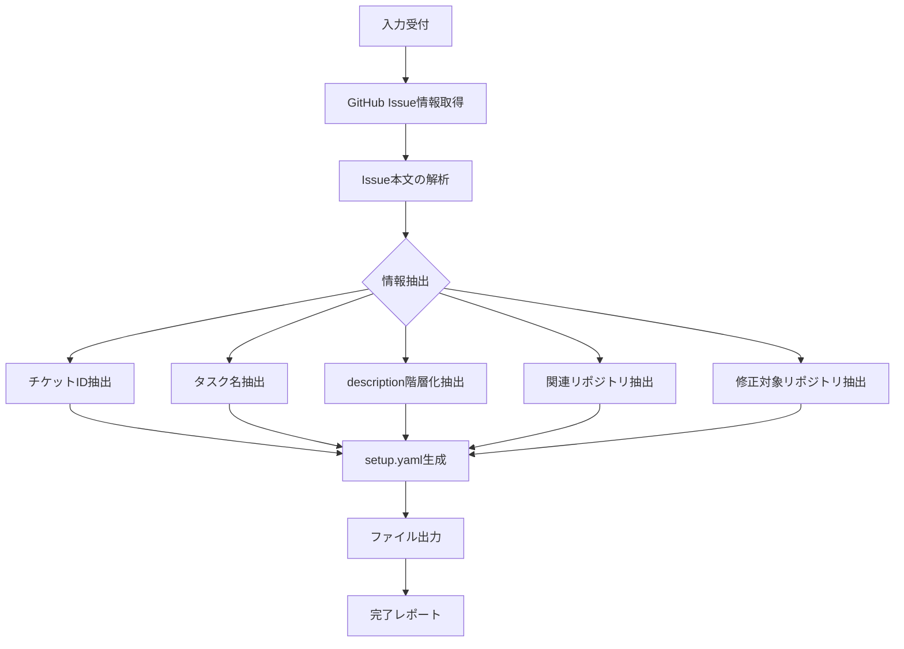

# 実行手順詳細

GitHub issueから情報を取得し、setup.yamlを生成するまでの詳細手順です。

## 処理フロー



## 1. Issue情報の取得

GitHub MCP Serverを使用してissue情報を取得：

```typescript
// MCP経由でissue情報を取得
const issue = await github.getIssue({
  owner: "owner",
  repo: "repo",
  issue_number: 123
});

// ラベル情報も取得
const labels = await github.getIssueLabels({
  owner: "owner",
  repo: "repo", 
  issue_number: 123
});
```

または、GitHub CLIを使用：

```bash
# Issue情報の取得
gh issue view {issue_number} --repo {owner}/{repo} --json title,body,labels,url
```

## 2. Issue本文の解析（階層化抽出）

**キーワード検出パターン:**

```javascript
// セクション検出パターン
const sectionPatterns = {
  overview: [
    /^##\s*(概要|Overview|Summary)/im,
    /^###\s*(概要|Overview|Summary)/im,
  ],
  purpose: [
    /^##\s*(目的|Purpose|Goal|Goals)/im,
  ],
  background: [
    /^##\s*(背景|Background|Context|経緯)/im,
  ],
  requirements: [
    /^##\s*(要件|Requirements)/im,
    /^##\s*(機能要件|Functional)/im,
  ],
  acceptance_criteria: [
    /^##\s*(受け入れ条件|Acceptance|AC|完了条件|Done when)/im,
  ],
  scope: [
    /^##\s*(スコープ|Scope|対象範囲|範囲)/im,
  ],
  out_of_scope: [
    /^##\s*(スコープ外|Out of scope|対象外|除外)/im,
  ],
  notes: [
    /^##\s*(備考|Notes|補足|その他|参考)/im,
  ],
};

// リスト項目の検出
const listItemPattern = /^[-*]\s+(.+)$/gm;
```

## 3. 構造化されていないissueへのフォールバック処理

Issue本文がセクション分けされていない場合の処理：

```javascript
// フォールバック: 全文を overview として使用
if (!extractedSections.overview && !extractedSections.purpose) {
  extractedSections.overview = issueBody;
  extractedSections.fallback_used = true;
}

// タイトルから purpose を推測
if (!extractedSections.purpose) {
  extractedSections.purpose = `${issueTitle} を実現する`;
}

// リスト形式の項目を requirements/acceptance_criteria として推測
const listItems = issueBody.match(listItemPattern);
if (listItems && listItems.length > 0) {
  // チェックボックス形式は acceptance_criteria
  const checkboxItems = listItems.filter(item => /^\s*[-*]\s*\[[ x]\]/.test(item));
  if (checkboxItems.length > 0) {
    extractedSections.acceptance_criteria = checkboxItems.map(
      item => item.replace(/^\s*[-*]\s*\[[ x]\]\s*/, '')
    );
  }
}
```

## 4. ファイル出力

```bash
# 出力先の決定
OUTPUT_FILE="setup-{ticket_id}.yaml"

# ファイルが既に存在する場合は確認
if [ -f "$OUTPUT_FILE" ]; then
    echo "警告: $OUTPUT_FILE は既に存在します"
    echo "上書きしますか？ [y/N]"
fi

# ファイル出力
cat > "$OUTPUT_FILE" << 'EOF'
{generated_yaml_content}
EOF

echo "setup.yaml を生成しました: $OUTPUT_FILE"
```
