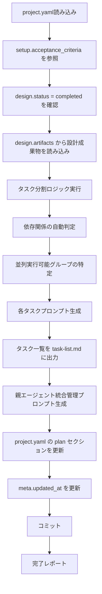
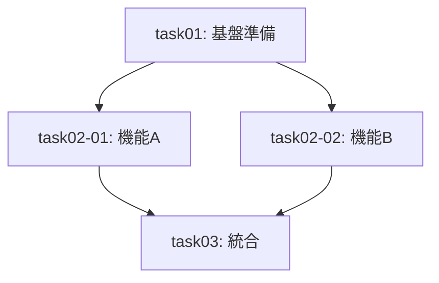

# 開発計画スキル（plan）

project.yaml + design成果物を入力として、実行可能なタスク計画を作成し、各タスク用プロンプトと親エージェント用統合管理プロンプトを生成します。

> **SSOT**: `project.yaml` を唯一の情報源として使用します。設計結果は `design.artifacts` パスから、完了条件は `setup.acceptance_criteria` から参照します。

**重要**: このスキルは実装を行わず、計画とプロンプト生成のみを担当します。完了時に `project.yaml` の `plan` セクションを更新してコミットします。

## 概要

> **TDD方針**: タスクプロンプト生成時は `test-driven-development` スキルを参照してください。

このスキルは以下を実現します：

1. **project.yaml** からプロジェクトコンテキストを取得
2. **setup.acceptance_criteria** を完了条件の基準として参照
3. **design.artifacts** パスから設計成果物を読み込み
4. **タスク分割** を実施（依存関係・並列実行可否を判定）
5. **各タスクプロンプト** を生成（TDD方針を組み込み）
6. **project.yaml** の `plan` セクションを更新
7. **親エージェント用統合管理プロンプト** を生成
8. **コミット**

## 入力ファイル

### 1. project.yaml（必須・SSOT）

brainstorming スキルが生成したプロジェクトコンテキストファイル。

```yaml
meta:
  version: "1.0"
  ticket_id: "PROJ-123"
  task_name: "ユーザー認証機能の追加"
  target_repo: "main-application"
  branch: "feature/PROJ-123"
  created_at: "2025-02-11T10:00:00+09:00"
  updated_at: "2025-02-11T13:00:00+09:00"

setup:
  description:
    # ... 省略 ...
    acceptance_criteria:        # ← このスキルが参照
      - "単体テストが全てパスすること"
      - "結合テストが全てパスすること"
      - "既存機能の回帰テストがパスすること"
      - "ドキュメントが更新されていること"
    # ...

design:
  status: completed
  summary: "JWT + Redis 構成の認証基盤を設計"
  artifacts: "docs/{repo}/design/"   # ← このスキルが参照
  # ...
```

### 2. design成果物（必須）

`project.yaml` の `design.artifacts` で指定されたディレクトリ：

```
docs/
└── {target_repository}/
    └── design/
        ├── 01_implementation-approach.md
        ├── 02_interface-api-design.md
        ├── 03_data-structure-design.md
        ├── 04_process-flow-design.md
        ├── 05_test-plan.md
        └── 06_side-effect-verification.md
```

## 出力ファイル構成

### 1. project.yaml の plan セクション更新（必須）

```yaml
plan:
  status: completed
  completed_at: "2025-02-11T14:00:00+09:00"
  summary: "5タスクに分割。依存関係を整理し、並列実行可能なグループを特定"
  total_tasks: 5
  tasks:
    - { id: "task01", title: "JWT ライブラリ導入", status: pending }
    - { id: "task02", title: "認証ミドルウェア実装", status: pending }
    - { id: "task03", title: "Redis セッションストア", status: pending }
    - { id: "task04", title: "リフレッシュトークン API", status: pending }
    - { id: "task05", title: "統合テスト", status: pending }
  review:
    status: pending              # pending | approved | revision_required
    round: 0
  artifacts: "docs/{repo}/plan/"
```

### 2. ドキュメント成果物

`docs/{target_repository}/plan/` に出力：

```
docs/
└── {target_repository}/
    └── plan/
        ├── task-list.md               # タスク一覧と依存関係
        ├── task01.md                  # task01用プロンプト
        ├── task02-01.md               # task02-01用プロンプト
        ├── task02-02.md               # task02-02用プロンプト
        ├── ...                        # 各タスク用プロンプト
        └── parent-agent-prompt.md     # 親エージェント統合管理プロンプト
```

## 処理フロー



## setup.acceptance_criteria の活用

タスク計画を作成する際に、`project.yaml` の `setup.description.acceptance_criteria` を読み込み、完了条件の基準として活用します：

```yaml
# project.yaml から取得
setup:
  description:
    acceptance_criteria:
      - "単体テストが全てパスすること"
      - "結合テストが全てパスすること"
      - "既存機能の回帰テストがパスすること"
      - "ドキュメントが更新されていること"
```

**活用方法:**
- **タスクの完了条件**: 各タスクプロンプトに acceptance_criteria を反映
- **テストタスクの生成**: acceptance_criteria からテスト関連タスクを自動生成
- **弊害検証タスク**: 「既存機能の回帰テストがパスすること」から弊害検証タスクを生成
- **親エージェント用プロンプト**: 全体の完了条件として明記

---

## タスク分割ロジック

### 1. 設計内容からタスク識別子の生成

design/の各設計ファイルから以下を抽出してタスク化：

| 設計ファイル                   | タスク化対象                 |
| ------------------------------ | ---------------------------- |
| 01_implementation-approach.md  | 基盤準備タスク               |
| 02_interface-api-design.md     | API/エンドポイント実装タスク |
| 03_data-structure-design.md    | データモデル実装タスク       |
| 04_process-flow-design.md      | ロジック実装タスク           |
| 05_test-plan.md                | テスト実装タスク             |
| 06_side-effect-verification.md | 弊害検証タスク               |

### 2. タスク識別子の命名規則

```
単一実行:     task01, task02, task03
並列実行:     task02-01, task02-02, task02-03
ネスト:       task04-01-a, task04-01-b
```

### 3. 依存関係の自動判定

| 依存パターン       | 判定基準                        |
| ------------------ | ------------------------------- |
| データモデル → API | APIがデータモデルを使用する場合 |
| 基盤 → 機能        | 機能が基盤を前提とする場合      |
| 実装 → テスト      | テストが実装を前提とする場合    |
| 機能 → 統合        | 統合が複数機能を前提とする場合  |

### 4. 並列実行可能条件

- 相互に依存関係がない
- 同じファイルを編集しない
- 共有リソースを競合しない

---

## タスクプロンプト生成（task0X.md）

各タスクプロンプトには以下を含める：

**テンプレート**: [references/task-prompt-template.md](references/task-prompt-template.md)

### 必須項目

| 項目                     | 説明                     |
| ------------------------ | ------------------------ |
| タスク識別子             | `task01`, `task02-01` 等 |
| タスク名                 | 簡潔な名称               |
| 前提条件タスク           | 依存するタスクID         |
| 並列実行可否             | 可/不可                  |
| 推定所要時間             | 完了までの見積もり       |
| 作業内容                 | 設計項目から自動抽出     |
| 成果物の説明             | 期待される出力           |
| テスト方針（TDD）        | RED-GREEN-REFACTOR       |
| 完了条件                 | 検証可能な基準           |
| 前提タスク成果物への参照 | 参照パス                 |

### TDD考慮事項の組み込み

各タスクプロンプトに以下を明記：

```markdown
## テスト方針（TDD: RED-GREEN-REFACTOR）

### RED: 失敗するテストケース
- どんなテストで失敗するか
- テストファイル: `tests/xxx.test.ts`
- テストケース例:
  ```typescript
  test('should handle X scenario', () => {
    // 実装前は失敗する
    expect(fn(input)).toBe(expected);
  });
  ```

### GREEN: 最小限の実装
- 何をテストで成功させるか
- 実装すべき最小限の機能
- 対象ファイル: `src/xxx.ts`

### REFACTOR: コード改善
- どう改善するか
- リファクタリング対象
- 品質向上ポイント
```

---

## project.yaml の plan セクション更新内容

タスク計画完了時に `project.yaml` の `plan` セクションを以下のように更新：

```yaml
plan:
  status: completed                           # pending → completed
  completed_at: "2025-02-11T14:00:00+09:00"   # ISO 8601 形式
  summary: "5タスクに分割。依存関係を整理し、並列実行可能なグループを特定"
  total_tasks: 5
  tasks:
    - { id: "task01", title: "基盤準備", status: pending }
    - { id: "task02-01", title: "機能A実装", status: pending }
    - { id: "task02-02", title: "機能B実装", status: pending }
    - { id: "task03", title: "統合テスト", status: pending }
  review:
    status: pending                           # レビュー前は pending
    round: 0
  artifacts: "docs/{repo}/plan/"
```

**重要**: `meta.updated_at` も同時に更新すること。

### task-list.md の内容

`docs/{target_repo}/plan/task-list.md` には以下を含める：

| タスク識別子 | タスク名   | 前提条件             | 並列可否 | 推定時間 |
| ------------ | ---------- | -------------------- | -------- | -------- |
| task01       | 基盤準備   | なし                 | 不可     | 1h       |
| task02-01    | 機能A実装  | task01               | 可       | 2h       |
| task02-02    | 機能B実装  | task01               | 可       | 2h       |
| task03       | 統合テスト | task02-01, task02-02 | 不可     | 1h       |



---

## 親エージェント統合管理プロンプト

**テンプレート**: [references/parent-agent-template.md](references/parent-agent-template.md)

`parent-agent-prompt.md` には以下を含める：

### 必須項目

1. **全タスク一覧と依存関係グラフ**
2. **並列実行グループの特定**
3. **実行順序**
4. **ブロッカー管理方法**
5. **各タスクプロンプト（task0X.md）への参照**
6. **結果統合方法**
7. **worktree管理手順**
8. **cherry-pickフロー**

---

## 実行手順

### 1. project.yaml読み込み

```bash
YAML_PATH="${1:-project.yaml}"
test -f "$YAML_PATH" || { echo "Error: $YAML_PATH not found"; exit 1; }

# メタ情報取得
TICKET_ID=$(yq '.meta.ticket_id' "$YAML_PATH")
TARGET_REPO=$(yq '.meta.target_repo' "$YAML_PATH")
```

### 2. 前提条件確認

```bash
# design セクションの確認
DESIGN_STATUS=$(yq '.design.status' "$YAML_PATH")
test "$DESIGN_STATUS" = "completed" || { echo "Error: design not completed"; exit 1; }

# design成果物ディレクトリ確認
DESIGN_ARTIFACTS=$(yq '.design.artifacts' "$YAML_PATH")
DESIGN_DIR="${DESIGN_ARTIFACTS//\{repo\}/$TARGET_REPO}"
test -d "$DESIGN_DIR" || { echo "Error: $DESIGN_DIR not found"; exit 1; }
```

### 3. 設計内容の分析

### 3. 設計内容の分析

design/配下の各ファイルを読み込み、タスク化対象を特定：

- 実装方針からタスク粒度を決定
- API設計からエンドポイント実装タスクを抽出
- データ構造設計からモデル実装タスクを抽出
- 処理フロー設計からロジック実装タスクを抽出
- テスト計画からテスト実装タスクを抽出

### 4. タスク分割の実施

1. タスク識別子の生成
2. 依存関係の判定
3. 並列実行グループの特定
4. 推定所要時間の算出

### 5. 各タスクプロンプト生成

各タスクについて `task0X.md` を生成：

- 設計内容を自動抽出
- TDD方針を組み込み
- 完了条件を明確化

### 6. タスク一覧を task-list.md に出力

`docs/{target_repo}/plan/task-list.md` にタスク一覧と依存関係を出力。

### 7. 親エージェント統合管理プロンプト生成

`parent-agent-prompt.md` を生成：

- 全タスク一覧
- 依存関係グラフ
- 実行順序
- worktree管理手順

### 8. project.yaml 更新

```bash
# plan セクションを更新
yq -i '.plan.status = "completed"' "$YAML_PATH"
yq -i ".plan.completed_at = \"$(date -Iseconds)\"" "$YAML_PATH"
yq -i '.plan.summary = "Nタスクに分割..."' "$YAML_PATH"
yq -i '.plan.total_tasks = N' "$YAML_PATH"
yq -i '.plan.tasks = [...]' "$YAML_PATH"
yq -i '.plan.review.status = "pending"' "$YAML_PATH"
yq -i '.plan.review.round = 0' "$YAML_PATH"
yq -i ".plan.artifacts = \"docs/${TARGET_REPO}/plan/\"" "$YAML_PATH"

# meta.updated_at を更新
yq -i ".meta.updated_at = \"$(date -Iseconds)\"" "$YAML_PATH"
```

### 9. コミット

```bash
# 親リポジトリでコミット
git add project.yaml docs/
git commit -m "docs: ${TICKET_ID} タスク計画を作成

- project.yaml の plan セクションを更新
- docs/${TARGET_REPO}/plan/配下にタスクプロンプトを生成
- 親エージェント統合管理プロンプトを生成"
```

---

## 完了レポート

```markdown
## 計画作成完了 ✅

### 計画対象
- チケット: {ticket_id}
- タスク: {task_name}
- リポジトリ: {target_repo}

### project.yaml 更新内容
- plan.status: completed
- plan.completed_at: {timestamp}
- plan.total_tasks: {task_count}
- plan.tasks: [タスク一覧]
- plan.artifacts: docs/{target_repo}/plan/

### 生成されたファイル

#### タスク計画
- docs/{target_repo}/plan/task-list.md
- docs/{target_repo}/plan/task01.md
- docs/{target_repo}/plan/task02-01.md
- docs/{target_repo}/plan/task02-02.md
- ...
- docs/{target_repo}/plan/parent-agent-prompt.md

### 計画サマリー
- 総タスク数: {task_count}
- 並列実行グループ数: {parallel_group_count}
- 推定総時間: {total_hours}時間
- クリティカルパス: {critical_path}

### 次のステップ
1. review-plan スキルで計画レビューを実施
2. implement スキルで実装を開始
3. 親エージェント（opus-parent-agent）に `parent-agent-prompt.md` を渡す
```

---

## エラーハンドリング

### project.yamlが見つからない

```
エラー: project.yamlが見つかりません
ファイル: {yaml_path}

brainstormingスキルでプロジェクトを初期化してください。
```

### designが未完了

```
エラー: 設計が完了していません
project.yaml の design.status: {status}

designスキルで設計を完了してください。
```

### design成果物が見つからない

```
エラー: 設計結果が見つかりません
ディレクトリ: {design_artifacts_path}

designスキルで設計を完了してください。
```

---

## 注意事項

- **実装は行わない**: このスキルは計画とプロンプト生成のみ
- 設計内容から自動的にタスクを抽出
- TDD方針を全タスクプロンプトに組み込み
- 並列実行可能なタスクは明確にグループ化
- 既存の `plan/` ディレクトリがある場合は上書き確認
- **project.yaml の setup.description.acceptance_criteria を完了条件の基準として参照**
- **完了時に project.yaml の plan セクションを更新し、コミットする**

## Bite-Sized Task 粒度ガイドライン

タスクは可能な限り小さく分割してください：

| 粒度   | 推奨度     | 例                                        |
| ------ | ---------- | ----------------------------------------- |
| ~5分   | ✅ 最適     | 「1つのバリデーション関数を実装＋テスト」 |
| ~15分  | ✅ 良い     | 「APIエンドポイント1つを実装＋テスト」    |
| ~30分  | ⚠️ 許容     | 「CRUDの一括実装＋テスト」                |
| 1時間+ | ❌ 分割必要 | 「全機能の実装」                          |

**原則:**
- 各タスクは1つの明確な完了条件を持つ
- テスト＋実装を1セットとする（TDDサイクル1回分）
- 「このタスクで何が変わるか」を1文で説明できる粒度

---

## 参照ファイル

- 前提スキル: `init-work-branch` - 作業ブランチ初期化
- 前提スキル: `investigation` - 開発タスク用詳細調査
- 前提スキル: `design` - 設計
- 後続スキル: `implement` - 実装
- 品質スキル: `test-driven-development` - TDDサイクル（タスクプロンプト生成時に参照）

## 参照テンプレート

- [references/task-prompt-template.md](references/task-prompt-template.md) - タスクプロンプトテンプレート
- [references/parent-agent-template.md](references/parent-agent-template.md) - 親エージェント用テンプレート

## SSOT参照

| project.yaml フィールド                    | 用途                                                       |
| ------------------------------------------ | ---------------------------------------------------------- |
| `setup.description.acceptance_criteria`    | タスク完了条件の基準、テストタスク生成、弊害検証タスク生成 |
| `design.status`                            | 設計完了の確認（completed であること）                     |
| `design.artifacts`                         | 設計成果物の参照先                                         |

### plan セクションの出力フィールド

| フィールド      | 説明                                   |
| --------------- | -------------------------------------- |
| `status`        | `completed` に設定                     |
| `completed_at`  | ISO 8601 形式のタイムスタンプ          |
| `summary`       | 計画の要約（1-2文）                    |
| `total_tasks`   | 総タスク数                             |
| `tasks`         | タスク一覧（id, title, status: pending） |
| `review.status` | `pending`（レビュー前）                |
| `review.round`  | `0`（初回）                            |
| `artifacts`     | `docs/{repo}/plan/`                    |

---

## 典型的なワークフロー

```
[project.yaml読み込み]
        ↓
[design.status = completed を確認]
        ↓
[design.artifacts から設計成果物を読み込み]
        ↓
[タスク分割ロジック実行]
  → 設計内容からタスク識別子の生成
  → 依存関係の自動判定
  → 並列実行可能グループの特定
        ↓
[各タスクプロンプト生成（task0X.md）]
  → 設計内容を自動抽出
  → TDD方針を組み込み
        ↓
[タスク一覧を task-list.md に出力]
        ↓
[親エージェント統合管理プロンプト生成]
        ↓
[project.yaml の plan セクションを更新]
        ↓
[コミット]
        ↓
[完了レポート]
```
