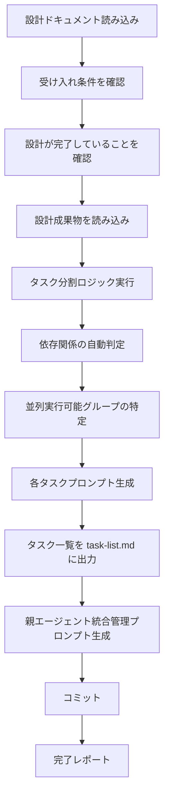
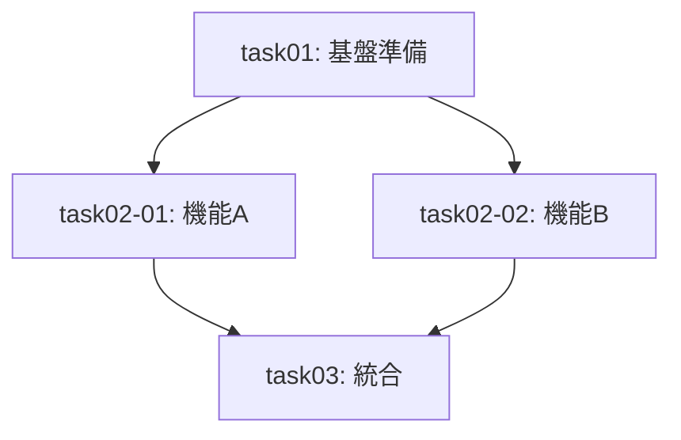

# 開発計画スキル（plan）

設計ドキュメント・受け入れ条件・テスト戦略を入力として、実行可能なタスク計画を作成し、各タスク用プロンプトと親エージェント用統合管理プロンプトを生成します。

> **再計画時**: 前回のレビューで差し戻しや条件付き承認があった場合、未対応の指摘を優先的に対応してください。

**重要**: このスキルは実装を行わず、計画とプロンプト生成のみを担当します。完了時に計画成果物を `docs/{target}/plan/` に出力してコミットします。

## 概要

> **TDD方針**: タスクプロンプト生成時は `test-driven-development` スキルを参照してください。

このスキルは以下を実現します：

1. **設計ドキュメント**を読み込み、プロジェクトコンテキストを取得
2. **受け入れ条件**を完了条件の基準として参照
3. **テスト戦略**からテスト範囲（単体/結合/E2E）を確認
4. **タスク分割**を実施（依存関係・並列実行可否を判定）
5. **各タスクプロンプト**を生成（TDD方針を組み込み）
6. **親エージェント用統合管理プロンプト**を生成
7. **タスク計画を `docs/{target}/plan/` に出力**
8. **コミット**

## 入力

### 1. 設計ドキュメント（必須）

設計フェーズで作成されたドキュメント群。以下のような構成を想定：

```
docs/
└── {target}/
    └── design/
        ├── 01_implementation-approach.md
        ├── 02_interface-api-design.md
        ├── 03_data-structure-design.md
        ├── 04_process-flow-design.md
        ├── 05_test-plan.md
        └── 06_side-effect-verification.md
```

### 2. 受け入れ条件（必須）

プロジェクトの完了を判定する基準。例：

- 単体テストが全てパスすること
- 結合テストが全てパスすること
- 既存機能の回帰テストがパスすること
- ドキュメントが更新されていること

### 3. テスト戦略（推奨）

テスト範囲（単体/結合/E2E）やテスト方針の情報。E2Eテストがスコープに含まれる場合は E2Eテスト用タスクを必ず生成する。

## 出力ファイル構成

`docs/{target}/plan/` に出力：

```
docs/
└── {target}/
    └── plan/
        ├── task-list.md               # タスク一覧と依存関係
        ├── task01.md                  # task01用プロンプト
        ├── task02-01.md               # task02-01用プロンプト
        ├── task02-02.md               # task02-02用プロンプト
        ├── ...                        # 各タスク用プロンプト
        └── parent-agent-prompt.md     # 親エージェント統合管理プロンプト
```

## 処理フロー


```mermaid
flowchart TD
    A[設計ドキュメント読み込み] --> B[受け入れ条件を確認]
    B --> C[設計が完了していることを確認]
    C --> D[設計成果物を読み込み]
    D --> E[タスク分割ロジック実行]
    E --> F[依存関係の自動判定]
    F --> G[並列実行可能グループの特定]
    G --> H[各タスクプロンプト生成]
    H --> I[タスク一覧を task-list.md に出力]
    I --> J[親エージェント統合管理プロンプト生成]
    J --> K[コミット]
    K --> L[完了レポート]
```

## 受け入れ条件の活用

タスク計画を作成する際に、受け入れ条件を読み込み、完了条件の基準として活用します。

**活用方法:**
- **タスクの完了条件**: 各タスクプロンプトに受け入れ条件を反映
- **テストタスクの生成**: 受け入れ条件からテスト関連タスクを自動生成
- **弊害検証タスク**: 「既存機能の回帰テストがパスすること」等の条件から弊害検証タスクを生成
- **親エージェント用プロンプト**: 全体の完了条件として明記

---

## タスク分割ロジック

### 1. 設計内容からタスク識別子の生成

design/の各設計ファイルから以下を抽出してタスク化：

| 設計ファイル                   | タスク化対象                 |
| ------------------------------ | ---------------------------- |
| 01_implementation-approach.md  | 基盤準備タスク               |
| 02_interface-api-design.md     | API/エンドポイント実装タスク |
| 03_data-structure-design.md    | データモデル実装タスク       |
| 04_process-flow-design.md      | ロジック実装タスク           |
| 05_test-plan.md                | テスト実装タスク             |
| 06_side-effect-verification.md | 弊害検証タスク               |

### 2. タスク識別子の命名規則

```
単一実行:     task01, task02, task03
並列実行:     task02-01, task02-02, task02-03
ネスト:       task04-01-a, task04-01-b
```

### 3. 依存関係の自動判定

| 依存パターン       | 判定基準                        |
| ------------------ | ------------------------------- |
| データモデル → API | APIがデータモデルを使用する場合 |
| 基盤 → 機能        | 機能が基盤を前提とする場合      |
| 実装 → テスト      | テストが実装を前提とする場合    |
| 機能 → 統合        | 統合が複数機能を前提とする場合  |

### 4. 並列実行可能条件

- 相互に依存関係がない
- 同じファイルを編集しない
- 共有リソースを競合しない

---

## タスクプロンプト生成（task0X.md）

各タスクプロンプトには以下を含める：

**テンプレート**: [references/task-prompt-template.md](references/task-prompt-template.md)

### 必須項目

| 項目                     | 説明                     |
| ------------------------ | ------------------------ |
| タスク識別子             | `task01`, `task02-01` 等 |
| タスク名                 | 簡潔な名称               |
| 前提条件タスク           | 依存するタスクID         |
| 並列実行可否             | 可/不可                  |
| 推定所要時間             | 完了までの見積もり       |
| 作業内容                 | 設計項目から自動抽出     |
| 成果物の説明             | 期待される出力           |
| テスト方針（TDD）        | RED-GREEN-REFACTOR       |
| 完了条件                 | 検証可能な基準           |
| 前提タスク成果物への参照 | 参照パス                 |

### TDD考慮事項の組み込み

各タスクプロンプトに以下を明記：

```markdown
## テスト方針（TDD: RED-GREEN-REFACTOR）

### RED: 失敗するテストケース
- どんなテストで失敗するか
- テストファイル: `tests/xxx.test.ts`
- テストケース例:
  ```typescript
  test('should handle X scenario', () => {
    // 実装前は失敗する
    expect(fn(input)).toBe(expected);
  });
  ```

### GREEN: 最小限の実装
- 何をテストで成功させるか
- 実装すべき最小限の機能
- 対象ファイル: `src/xxx.ts`

### REFACTOR: コード改善
- どう改善するか
- リファクタリング対象
- 品質向上ポイント
```

---

## タスク計画の出力内容

タスク計画完了時に以下の情報を `docs/{target}/plan/task-list.md` に記録：

- **ステータス**: completed
- **完了日時**: ISO 8601 形式のタイムスタンプ
- **サマリー**: 計画の要約（1-2文）
- **総タスク数**: N
- **タスク一覧**: 各タスクの id, title, status(pending)
- **成果物パス**: `docs/{target}/plan/`

**重要**: 上記の情報は `task-list.md` の冒頭にメタデータとして記載すること。

### task-list.md の内容

`docs/{target}/plan/task-list.md` には以下を含める：

| タスク識別子 | タスク名   | 前提条件             | 並列可否 | 推定時間 |
| ------------ | ---------- | -------------------- | -------- | -------- |
| task01       | 基盤準備   | なし                 | 不可     | 1h       |
| task02-01    | 機能A実装  | task01               | 可       | 2h       |
| task02-02    | 機能B実装  | task01               | 可       | 2h       |
| task03       | 統合テスト | task02-01, task02-02 | 不可     | 1h       |


```mermaid
graph TD
    task01[task01: 基盤準備] --> task02-01[task02-01: 機能A]
    task01 --> task02-02[task02-02: 機能B]
    task02-01 --> task03[task03: 統合]
    task02-02 --> task03
```

---

## 親エージェント統合管理プロンプト

**テンプレート**: [references/parent-agent-template.md](references/parent-agent-template.md)

`parent-agent-prompt.md` には以下を含める：

### 必須項目

1. **全タスク一覧と依存関係グラフ**
2. **並列実行グループの特定**
3. **実行順序**
4. **ブロッカー管理方法**
5. **各タスクプロンプト（task0X.md）への参照**
6. **結果統合方法**
7. **worktree管理手順**
8. **cherry-pickフロー**

---

## 実行手順

### 1. 入力の確認

- 設計ドキュメントが存在し、設計が完了していることを確認
- 受け入れ条件が定義されていることを確認
- テスト戦略が提供されていれば読み込む

### 2. 設計内容の分析

design/配下の各ファイルを読み込み、タスク化対象を特定：

- 実装方針からタスク粒度を決定
- API設計からエンドポイント実装タスクを抽出
- データ構造設計からモデル実装タスクを抽出
- 処理フロー設計からロジック実装タスクを抽出
- テスト計画からテスト実装タスクを抽出
- **テスト戦略を参照し、E2Eテストがスコープに含まれる場合は E2Eテスト用タスクを必ず生成する**

### 3. タスク分割の実施

1. タスク識別子の生成
2. 依存関係の判定
3. 並列実行グループの特定
4. 推定所要時間の算出

### 4. 各タスクプロンプト生成

各タスクについて `task0X.md` を生成：

- 設計内容を自動抽出
- TDD方針を組み込み
- 完了条件を明確化

### 5. タスク一覧を task-list.md に出力

`docs/{target}/plan/task-list.md` にタスク一覧と依存関係を出力。

### 6. 親エージェント統合管理プロンプト生成

`parent-agent-prompt.md` を生成：

- 全タスク一覧
- 依存関係グラフ
- 実行順序
- worktree管理手順

### 7. コミット

```bash
git add docs/
git commit -m "docs: タスク計画を作成

- docs/{target}/plan/配下にタスクプロンプトを生成
- 親エージェント統合管理プロンプトを生成"
```

---

## 完了レポート

```markdown
## 計画作成完了 ✅

### 計画対象
- タスク: {task_name}
- 対象: {target}

### 生成されたファイル

#### タスク計画
- docs/{target}/plan/task-list.md
- docs/{target}/plan/task01.md
- docs/{target}/plan/task02-01.md
- docs/{target}/plan/task02-02.md
- ...
- docs/{target}/plan/parent-agent-prompt.md

### 計画サマリー
- 総タスク数: {task_count}
- 並列実行グループ数: {parallel_group_count}
- 推定総時間: {total_hours}時間
- クリティカルパス: {critical_path}

### 次のステップ
1. 計画レビューを実施
2. 実装を開始
3. 親エージェントに `parent-agent-prompt.md` を渡す
```

---

## エラーハンドリング

### 設計ドキュメントが見つからない

```
エラー: 設計ドキュメントが見つかりません
ディレクトリ: {design_dir}

設計を完了してから計画を作成してください。
```

### 設計が未完了

```
エラー: 設計が完了していません

設計を完了してから計画を作成してください。
```

### 受け入れ条件が未定義

```
エラー: 受け入れ条件が定義されていません

受け入れ条件を定義してから計画を作成してください。
```

---

## 注意事項

- **実装は行わない**: このスキルは計画とプロンプト生成のみ
- 設計内容から自動的にタスクを抽出
- TDD方針を全タスクプロンプトに組み込み
- 並列実行可能なタスクは明確にグループ化
- 既存の `plan/` ディレクトリがある場合は上書き確認
- **受け入れ条件を完了条件の基準として参照**
- **完了時に計画成果物を `docs/{target}/plan/` に出力し、コミットする**

## Bite-Sized Task 粒度ガイドライン

タスクは可能な限り小さく分割してください：

| 粒度   | 推奨度     | 例                                        |
| ------ | ---------- | ----------------------------------------- |
| ~5分   | ✅ 最適     | 「1つのバリデーション関数を実装＋テスト」 |
| ~15分  | ✅ 良い     | 「APIエンドポイント1つを実装＋テスト」    |
| ~30分  | ⚠️ 許容     | 「CRUDの一括実装＋テスト」                |
| 1時間+ | ❌ 分割必要 | 「全機能の実装」                          |

**原則:**
- 各タスクは1つの明確な完了条件を持つ
- テスト＋実装を1セットとする（TDDサイクル1回分）
- 「このタスクで何が変わるか」を1文で説明できる粒度

---

## 参照ファイル

- 前提: 設計ドキュメント（`docs/{target}/design/`）
- 後続: 実装フェーズ
- 品質: `test-driven-development` スキル（TDDサイクル、タスクプロンプト生成時に参照）

## 参照テンプレート

- [references/task-prompt-template.md](references/task-prompt-template.md) - タスクプロンプトテンプレート
- [references/parent-agent-template.md](references/parent-agent-template.md) - 親エージェント用テンプレート

---

## 典型的なワークフロー

```
[設計ドキュメント・受け入れ条件・テスト戦略を読み込み]
        ↓
[設計が完了していることを確認]
        ↓
[設計成果物を読み込み]
        ↓
[タスク分割ロジック実行]
  → 設計内容からタスク識別子の生成
  → 依存関係の自動判定
  → 並列実行可能グループの特定
        ↓
[各タスクプロンプト生成（task0X.md）]
  → 設計内容を自動抽出
  → TDD方針を組み込み
        ↓
[タスク一覧を task-list.md に出力]
        ↓
[親エージェント統合管理プロンプト生成]
        ↓
[コミット]
        ↓
[完了レポート]
```
