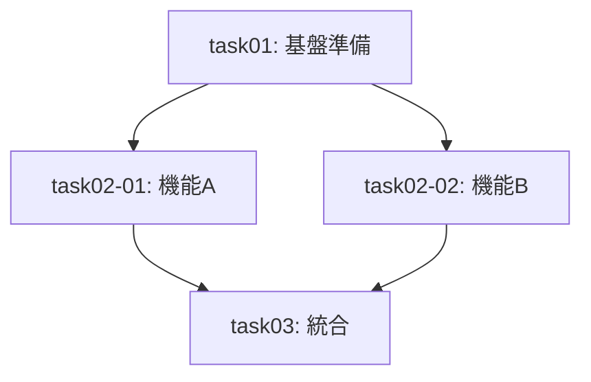

# 出力フォーマット

planスキルが生成する各成果物の詳細フォーマット。

---

## 出力ファイル構成

`docs/{target}/plan/` に出力：

```
docs/
└── {target}/
    └── plan/
        ├── task-list.md               # タスク一覧と依存関係
        ├── task01.md                  # task01用プロンプト
        ├── task02-01.md               # task02-01用プロンプト
        ├── task02-02.md               # task02-02用プロンプト
        ├── ...                        # 各タスク用プロンプト
        └── parent-agent-prompt.md     # 親エージェント統合管理プロンプト
```

---

## task-list.md の内容

`docs/{target}/plan/task-list.md` には以下を含める：

**冒頭メタデータ（必須）:**
- **ステータス**: completed
- **完了日時**: ISO 8601 形式のタイムスタンプ
- **サマリー**: 計画の要約（1-2文）
- **総タスク数**: N
- **タスク一覧**: 各タスクの id, title, status(pending)
- **成果物パス**: `docs/{target}/plan/`

**タスク一覧テーブル:**

| タスク識別子 | タスク名   | 前提条件             | 並列可否 | 推定時間 |
| ------------ | ---------- | -------------------- | -------- | -------- |
| task01       | 基盤準備   | なし                 | 不可     | 1h       |
| task02-01    | 機能A実装  | task01               | 可       | 2h       |
| task02-02    | 機能B実装  | task01               | 可       | 2h       |
| task03       | 統合テスト | task02-01, task02-02 | 不可     | 1h       |

**依存関係グラフ（Mermaid）:**



---

## タスクプロンプト（task0X.md）の必須項目

各タスクプロンプトには以下を含める：

📖 テンプレート: [task-prompt-template.md](task-prompt-template.md)

| 項目                     | 説明                     |
| ------------------------ | ------------------------ |
| タスク識別子             | `task01`, `task02-01` 等 |
| タスク名                 | 簡潔な名称               |
| 前提条件タスク           | 依存するタスクID         |
| 並列実行可否             | 可/不可                  |
| 推定所要時間             | 完了までの見積もり       |
| 作業内容                 | 設計項目から自動抽出     |
| 成果物の説明             | 期待される出力           |
| テスト方針（TDD）        | RED-GREEN-REFACTOR       |
| 完了条件                 | 検証可能な基準           |
| 前提タスク成果物への参照 | 参照パス                 |

### TDD考慮事項の組み込み

各タスクプロンプトに以下を明記：

```markdown
## テスト方針（TDD: RED-GREEN-REFACTOR）

### RED: 失敗するテストケース
- どんなテストで失敗するか
- テストファイル: `tests/xxx.test.ts`
- テストケース例:
  ```typescript
  test('should handle X scenario', () => {
    expect(fn(input)).toBe(expected);
  });
  ```

### GREEN: 最小限の実装
- 何をテストで成功させるか
- 実装すべき最小限の機能
- 対象ファイル: `src/xxx.ts`

### REFACTOR: コード改善
- どう改善するか
- リファクタリング対象
- 品質向上ポイント
```

---

## 親エージェント統合管理プロンプト（parent-agent-prompt.md）

📖 テンプレート: [parent-agent-template.md](parent-agent-template.md)

### 必須項目

1. **全タスク一覧と依存関係グラフ**
2. **並列実行グループの特定**
3. **実行順序**
4. **ブロッカー管理方法**
5. **各タスクプロンプト（task0X.md）への参照**
6. **結果統合方法**
7. **worktree管理手順**
8. **cherry-pickフロー**

---

## 受け入れ条件の活用

タスク計画を作成する際に、受け入れ条件を読み込み、完了条件の基準として活用：

- **タスクの完了条件**: 各タスクプロンプトに受け入れ条件を反映
- **テストタスクの生成**: 受け入れ条件からテスト関連タスクを自動生成
- **弊害検証タスク**: 「既存機能の回帰テストがパスすること」等の条件から弊害検証タスクを生成
- **親エージェント用プロンプト**: 全体の完了条件として明記
