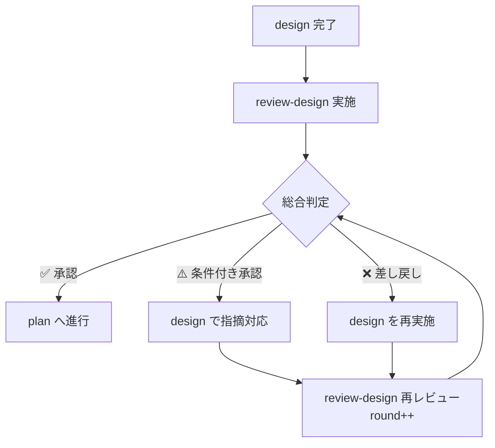
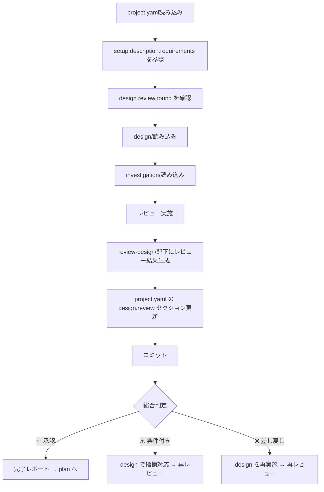

# 設計レビュースキル（review-design）

project.yaml + design/ を入力として、設計結果の妥当性を体系的にレビューし、レビュー結果をドキュメント化します。

> **SSOT**: `project.yaml` を全プロセスの Single Source of Truth として使用します。
> - 設計要件の参照: `setup.description.requirements`
> - 調査結果の参照: `investigation` セクション
> - レビュー結果の出力: `design.review` セクション

## 概要

このスキルは以下を実現します：

1. **project.yaml** からチケット情報・対象リポジトリ・要件を取得
2. **project.yaml の setup.description.requirements** を設計の妥当性判断基準として参照
3. **design/** から設計内容を読み込み
4. **investigation/** から調査結果を読み込み（設計が調査結果に基づいているか検証）
5. **docs/{target_repo}/review-design/** ディレクトリにレビュー結果を出力
6. **project.yaml の design.review セクション** を更新してコミット

## 再帰的レビューループ



指摘がなくなるまで design ⇄ review-design を再帰的に繰り返します。
各ラウンドの指摘内容は `project.yaml` の `design.review` セクションで追跡されます。

## 入力ファイル

### 1. project.yaml（必須・SSOT）

```yaml
# project.yaml から参照するセクション
setup:
  ticket_id: "PROJ-123"
  description:
    requirements:                  # ← このスキルが参照（妥当性判断基準）
      functional:
        - "ユーザーが○○を実行できること"
      non_functional:
        - "応答時間: 200ms以内"
  target_repositories:
    - name: "target-repo"

design:
  status: completed
  review:                          # ← このスキルが更新
    round: 1
    status: pending
```

### 2. design/（必須）

designスキルで生成された詳細設計ドキュメント。

### 3. investigation/（参照）

investigationスキルで生成された調査結果（設計が調査結果に基づいているかの検証に使用）。

## 処理フロー



## project.yaml の setup.description.requirements 活用

レビューを実施する際に、`project.yaml` の `setup.description.requirements` を読み込み、設計の妥当性判断基準として活用します。

**活用方法:**
- **機能要件** → インターフェース/API設計が全機能要件をカバーしているか検証
- **非機能要件** → 実装方針・アーキテクチャが非機能要件を満たせるか検証
- 各設計項目が要件に対して過不足ないかの検証基準として使用

**再レビュー時（round > 1）:**
- 前ラウンドの `design.review.issues` から `status: open` の指摘を優先確認
- 対応済み指摘の `status` を `resolved` に更新、`resolved_in_round` を記録

## レビュー実施項目

### 1. 要件カバレッジレビュー（01_requirements-coverage.md）

- 機能要件と設計の対応表の作成
- 未カバーの要件がないかの確認
- 過剰設計（スコープ外の設計）がないかの確認
- 非機能要件の充足確認

### 2. 技術的妥当性レビュー（02_technical-validity.md）

- アーキテクチャパターンの選定が適切か
- 技術選定の妥当性
- 既存パターンとの整合性（investigation結果との比較）
- スケーラビリティ・拡張性の考慮
- セキュリティ上の懸念点

### 3. 実装可能性レビュー（03_implementation-feasibility.md）

- 設計が十分に詳細で実装可能か
- 不明確な点・曖昧な記述がないか
- 工数見積もりの妥当性
- 技術的制約との矛盾がないか
- 依存関係の実現可能性

### 4. テスト可能性レビュー（04_testability.md）

- 各コンポーネントが独立してテスト可能な設計か
- テスト計画の網羅性
- テストデータ設計の妥当性
- 弊害検証計画の十分性

### 5. リスク・懸念事項（05_risks-and-concerns.md）

- 設計上のリスク特定
- 調査結果で指摘されたリスクへの対応確認
- パフォーマンスリスク
- セキュリティリスク
- 互換性リスク
- 依存関係リスク

### 6. レビューサマリー（06_review-summary.md）

- 総合判定（承認/条件付き承認/差し戻し）
- 指摘事項一覧（重大度別）
- 改善提案
- 次のステップ

## 出力ファイル構成

レビュー結果は `docs/{target_repository}/review-design/` に出力：

```
docs/
└── {target_repository}/
    └── review-design/
        ├── 01_requirements-coverage.md     # 要件カバレッジレビュー
        ├── 02_technical-validity.md        # 技術的妥当性レビュー
        ├── 03_implementation-feasibility.md # 実装可能性レビュー
        ├── 04_testability.md               # テスト可能性レビュー
        ├── 05_risks-and-concerns.md        # リスク・懸念事項
        └── 06_review-summary.md            # レビューサマリー
```

## レビュー判定基準

### 重大度レベル

| レベル     | 説明                           | 対応                             |
| ---------- | ------------------------------ | -------------------------------- |
| 🔴 Critical | 設計を根本的に見直す必要がある | 差し戻し：designの再実施が必要   |
| 🟠 Major    | 重要な修正が必要               | 条件付き承認：修正後に再レビュー |
| 🟡 Minor    | 改善が望ましい                 | 承認：実装フェーズで対応可能     |
| 🔵 Info     | 情報・提案                     | 承認：参考情報として記録         |

### 総合判定

| 判定           | 条件                          | 次のステップ                 |
| -------------- | ----------------------------- | ---------------------------- |
| ✅ 承認         | Critical/Majorの指摘なし      | planスキルへ進行             |
| ⚠️ 条件付き承認 | Majorの指摘あり、Criticalなし | 指摘事項を修正後、再レビュー |
| ❌ 差し戻し     | Criticalの指摘あり            | designスキルの再実施         |

## project.yaml 更新内容

`project.yaml` の `design.review` セクションを更新：

```yaml
design:
  status: completed
  review:
    round: 1                        # ラウンド番号（再レビュー時にインクリメント）
    status: approved                # approved / conditional / rejected
    latest_verdict: "承認"          # 日本語判定テキスト
    completed_at: "2025-01-15T10:30:00+09:00"
    summary: "Critical/Major指摘なし。Minor 2件は実装フェーズで対応可能。"
    issues:
      - id: DR-001
        severity: major             # critical / major / minor / info
        category: "要件カバレッジ"
        description: "非機能要件の応答時間に関する設計が不足"
        status: resolved            # open / resolved / deferred
        resolved_in_round: 2
      - id: DR-002
        severity: minor
        category: "テスト可能性"
        description: "モックの注入方法が未定義"
        status: open
    artifacts:
      - "docs/{target_repo}/review-design/06_review-summary.md"
```

### ラウンド管理ルール

- **初回レビュー**: `round: 1` で開始
- **再レビュー**: 前ラウンドの `round` をインクリメント
- **issues**: 全ラウンドの指摘を累積保持（`resolved_in_round` で解決ラウンドを追跡）
- **status 遷移**: `pending` → `rejected` / `conditional` / `approved`

## 実行手順

### 1. project.yaml読み込み

```bash
test -f "project.yaml" || { echo "Error: project.yaml not found"; exit 1; }
```

`project.yaml` から情報を yq で取得:

```bash
# メタ情報
TICKET_ID=$(yq '.meta.ticket_id' project.yaml)
TARGET_REPO=$(yq '.meta.target_repo' project.yaml)

# 要件（妥当性判断基準）
yq '.setup.description.requirements.functional' project.yaml
yq '.setup.description.requirements.non_functional' project.yaml

# 再レビューの場合: 前回のラウンドと指摘を取得
CURRENT_ROUND=$(yq '.design.review.round // 0' project.yaml)
yq '.design.review.issues[] | select(.status == "open")' project.yaml
```

### 2. design/確認

```bash
for repo in "${target_repositories[@]}"; do
    DESIGN_DIR="docs/${repo}/design"
    test -d "$DESIGN_DIR" || { echo "Error: $DESIGN_DIR not found"; exit 1; }
done
```

### 3. investigation/確認

```bash
for repo in "${target_repositories[@]}"; do
    INVESTIGATION_DIR="docs/${repo}/investigation"
    test -d "$INVESTIGATION_DIR" || { echo "Warning: $INVESTIGATION_DIR not found. 調査結果との整合性チェックをスキップします。"; }
done
```

### 4. レビューの実施

各設計ファイルについて、レビュー項目に従い検証を実施：

1. **要件カバレッジレビュー**: requirements vs 設計内容の対応確認
2. **技術的妥当性レビュー**: アーキテクチャ・技術選定の適切性
3. **実装可能性レビュー**: 設計の詳細度・明確さ
4. **テスト可能性レビュー**: テスト計画の網羅性
5. **リスク・懸念事項**: リスク分析と対応確認
6. **レビューサマリー**: 総合判定と指摘事項一覧

**再レビュー時（round > 1）の追加手順:**
- 前ラウンドの `design.review.issues` で `status: open` の指摘を優先確認
- 対応された指摘は `status: resolved`、`resolved_in_round: {current_round}` に更新
- 新規指摘は新しい `id` で追加

### 5. review-design/配下にファイル生成

```bash
for repo in "${target_repositories[@]}"; do
    REVIEW_DIR="docs/${repo}/review-design"
    mkdir -p "$REVIEW_DIR"
done
```

### 6. project.yaml 更新

```bash
# design.review セクションの更新（yq 使用）
yq -i ".design.review.round = $((CURRENT_ROUND + 1))" project.yaml
yq -i '.design.review.status = "approved"' project.yaml  # approved / conditional / rejected
yq -i '.design.review.latest_verdict = "承認"' project.yaml
yq -i ".design.review.completed_at = \"$(date -Iseconds)\"" project.yaml
yq -i '.design.review.summary = "Critical/Major指摘なし。"' project.yaml

# 指摘事項の追加（存在する場合）
yq -i '.design.review.issues += [{"id": "DR-001", "severity": "minor", "status": "open", "description": "指摘内容"}]' project.yaml

# 指摘の解決更新（再レビュー時）
yq -i '(.design.review.issues[] | select(.id == "DR-001")).status = "resolved"' project.yaml
yq -i "(.design.review.issues[] | select(.id == \"DR-001\")).resolved_in_round = $((CURRENT_ROUND + 1))" project.yaml

# 成果物パス
yq -i ".design.review.artifacts = [\"docs/${TARGET_REPO}/review-design/06_review-summary.md\"]" project.yaml

# meta.updated_at を更新
yq -i ".meta.updated_at = \"$(date -Iseconds)\"" project.yaml
```

### 7. コミット

```bash
git add docs/ project.yaml
git commit -m "docs: {ticket_id} 設計レビュー結果を追加 (round {round})

- docs/{target_repo}/review-design/配下にレビュー結果を出力
- project.yaml の design.review セクションを更新"
```

## 完了レポート

```markdown
## 設計レビュー完了 ✅

### レビュー対象
- チケット: {ticket_id}
- タスク: {task_name}
- リポジトリ: {target_repositories}

### 総合判定
- **判定**: {✅ 承認 / ⚠️ 条件付き承認 / ❌ 差し戻し}

### 指摘事項サマリー
- 🔴 Critical: {count}件
- 🟠 Major: {count}件
- 🟡 Minor: {count}件
- 🔵 Info: {count}件

### 生成されたファイル

#### design-document更新
- docs/{ticket_id}.md - 設計レビューセクション追加

#### レビュー結果
- docs/{target_repo}/review-design/01_requirements-coverage.md
- docs/{target_repo}/review-design/02_technical-validity.md
- docs/{target_repo}/review-design/03_implementation-feasibility.md
- docs/{target_repo}/review-design/04_testability.md
- docs/{target_repo}/review-design/05_risks-and-concerns.md
- docs/{target_repo}/review-design/06_review-summary.md

### 次のステップ
1. ✅ 承認の場合: planスキルでタスク計画を作成
2. ⚠️ 条件付き承認の場合: 指摘事項を修正後、再レビュー
3. ❌ 差し戻しの場合: designスキルで設計を再実施
```

## エラーハンドリング

### setup.yamlが見つからない

```
エラー: setup.yamlが見つかりません
ファイル: {yaml_path}

init-work-branchスキルでセットアップを完了してください。
```

### design-documentが見つからない

```
エラー: design-documentが見つかりません
ファイル: docs/{ticket_id}.md

init-work-branchスキルでセットアップを完了してください。
```

### design/が見つからない

```
エラー: 設計結果が見つかりません
ディレクトリ: docs/{target_repo}/design/

designスキルで設計を完了してください。
```

## 注意事項

- レビューは `target_repositories` の設計のみ対象
- design/が存在しない場合はエラー終了
- investigation/が存在しない場合は警告を出し、調査結果との整合性チェックをスキップ
- 既存の `review-design/` ディレクトリがある場合は上書き（再レビュー時）
- **project.yaml の setup.description.requirements を設計の妥当性判断基準として参照**
- レビューは客観的な基準に基づいて実施し、主観的な判断は避ける
- **再帰ループ**: 差し戻し/条件付き承認 → design で指摘対応 → review-design 再レビューを繰り返す

## 参照ファイル

- 前提スキル: `init-work-branch` - 作業ブランチ初期化
- 前提スキル: `investigation` - 開発タスク用詳細調査
- 前提スキル: `design` - 設計（差し戻し時に再実施）
- 後続スキル: `plan` - タスク計画（承認後に進行）
- 関連スキル: `code-review` — コードレビュー

## SSOT参照

| project.yaml フィールド                         | 用途                         |
| ----------------------------------------------- | ---------------------------- |
| `setup.description.requirements.functional`     | 機能要件カバレッジの検証基準 |
| `setup.description.requirements.non_functional` | 非機能要件の充足確認基準     |
| `design.review` (出力)                          | レビュー結果・指摘の追跡     |

## 典型的なワークフロー

```
[project.yaml読み込み] --> パースしてバリデーション
        |
[design.review確認] --> 再レビューの場合、前回指摘を読み込み
        |
[design/読み込み] --> 設計結果の読み込み
        |
[investigation/読み込み] --> 調査結果の読み込み（任意）
        |
[レビュー実施] --> 要件カバレッジ・技術的妥当性・実装可能性・テスト可能性
        |
[review-design/生成] --> レビュー結果ファイルを生成
        |
[project.yaml更新] --> design.review セクションを更新
        |
[コミット] --> 変更をコミット
        |
[判定分岐] --> ✅承認→plan / ⚠️条件付き→design再修正 / ❌差し戻し→design再実施
```
