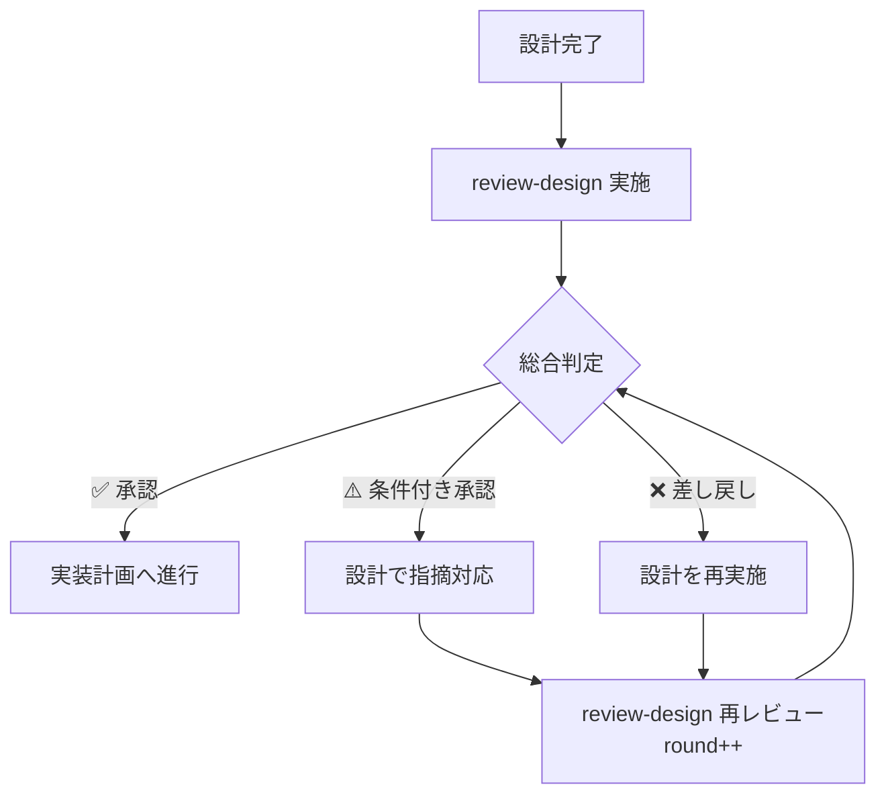
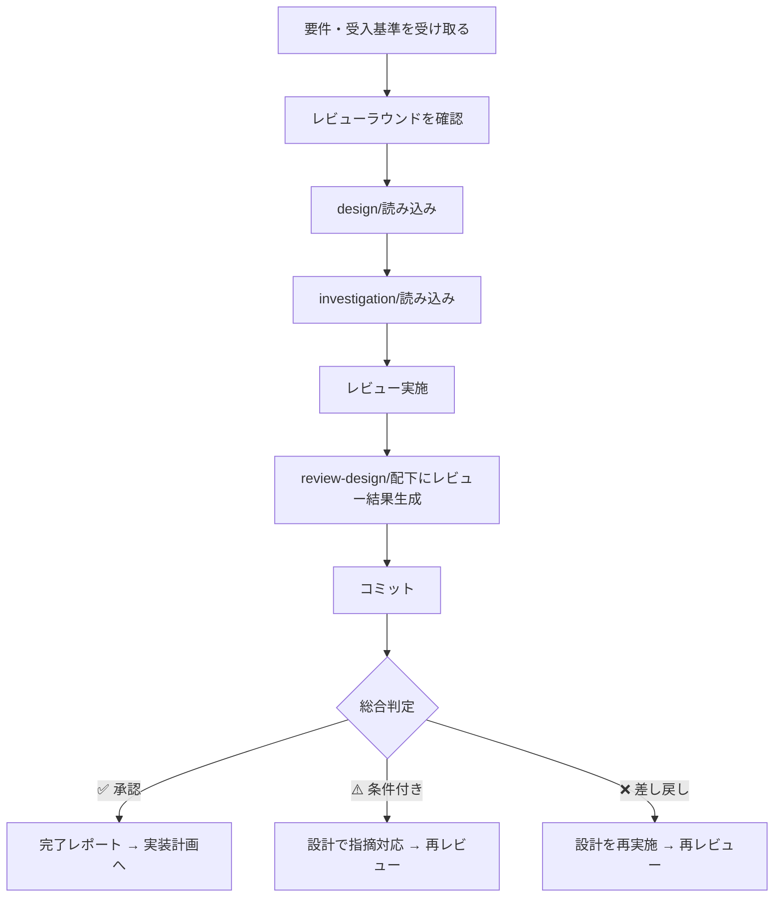

# 設計レビュースキル（review-design）

設計ドキュメント・要件・調査結果を入力として、設計結果の妥当性を体系的にレビューし、レビュー結果をドキュメント化します。

> [!CAUTION]
> **レビュー品質方針（ゼロトレランス）**
> - レビュアーは **不具合を出さないことに命が懸かっている** つもりで、些細な問題も見逃さず指摘すること
> - **Minor を含む全ての指摘は修正必須** — 「後で対応」「実装フェーズで対応」は許容しない
> - 軽微に見える設計上の問題も、実装フェーズでの品質劣化の入口となるため必ず指摘する
> - 可能な限り品質向上に努め、「問題ない」と判断する前に本当に問題がないか再度確認する

## 概要

このスキルは以下を実現します：

1. **要件・受入基準**を設計の妥当性判断基準として受け取る
2. **設計ドキュメント**（design/）から設計内容を読み込み
3. **調査結果**（investigation/）から調査結果を読み込み（設計が調査結果に基づいているか検証）
4. **docs/{target}/review-design/** ディレクトリにレビュー結果を出力
5. レビュー結果をコミット

## 再帰的レビューループ


```mermaid
flowchart TD
    A[設計完了] --> B[review-design 実施]
    B --> C{総合判定}
    C -->|✅ 承認| D[実装計画へ進行]
    C -->|⚠️ 条件付き承認| E[設計で指摘対応]
    C -->|❌ 差し戻し| F[設計を再実施]
    E --> G[review-design 再レビュー\nround++]
    F --> G
    G --> C
```

指摘がなくなるまで 設計 ⇄ review-design を再帰的に繰り返します。
各ラウンドの指摘内容はレビューサマリーで追跡されます。

## 入力

### 1. 要件・受入基準（必須）

レビューの妥当性判断基準となる情報。以下を呼び出し元から受け取ります：

- **機能要件**: システムが満たすべき機能の一覧
- **非機能要件**: パフォーマンス、セキュリティ等の品質要件
- **受入基準**: タスク完了の判定基準

### 2. design/（必須）

設計スキル等で生成された詳細設計ドキュメント。

### 3. investigation/（参照）

調査スキル等で生成された調査結果（設計が調査結果に基づいているかの検証に使用）。

## 処理フロー


```mermaid
flowchart TD
    A[要件・受入基準を受け取る] --> B[レビューラウンドを確認]
    B --> C[design/読み込み]
    C --> D[investigation/読み込み]
    D --> E[レビュー実施]
    E --> F[review-design/配下にレビュー結果生成]
    F --> G[コミット]
    G --> H{総合判定}
    H -->|✅ 承認| I[完了レポート → 実装計画へ]
    H -->|⚠️ 条件付き| J[設計で指摘対応 → 再レビュー]
    H -->|❌ 差し戻し| K[設計を再実施 → 再レビュー]
```

## 要件の活用方法

レビューを実施する際に、受け取った要件・受入基準を設計の妥当性判断基準として活用します。

**活用方法:**
- **機能要件** → インターフェース/API設計が全機能要件をカバーしているか検証
- **非機能要件** → 実装方針・アーキテクチャが非機能要件を満たせるか検証
- 各設計項目が要件に対して過不足ないかの検証基準として使用

**再レビュー時（round > 1）:**
- 前ラウンドの指摘で未解決（open）のものを優先確認
- 対応済み指摘のステータスを resolved に更新し、解決ラウンドを記録

## レビュー実施項目

### 1. 要件カバレッジレビュー（01_requirements-coverage.md）

- 機能要件と設計の対応表の作成
- 未カバーの要件がないかの確認
- 過剰設計（スコープ外の設計）がないかの確認
- 非機能要件の充足確認

### 2. 技術的妥当性レビュー（02_technical-validity.md）

- アーキテクチャパターンの選定が適切か
- 技術選定の妥当性
- 既存パターンとの整合性（調査結果との比較）
- スケーラビリティ・拡張性の考慮
- セキュリティ上の懸念点

### 3. 実装可能性レビュー（03_implementation-feasibility.md）

- 設計が十分に詳細で実装可能か
- 不明確な点・曖昧な記述がないか
- 工数見積もりの妥当性
- 技術的制約との矛盾がないか
- 依存関係の実現可能性

### 4. テスト可能性レビュー（04_testability.md）

- 各コンポーネントが独立してテスト可能な設計か
- テスト計画の網羅性
- テストデータ設計の妥当性
- 弊害検証計画の十分性

### 5. リスク・懸念事項（05_risks-and-concerns.md）

- 設計上のリスク特定
- 調査結果で指摘されたリスクへの対応確認
- パフォーマンスリスク
- セキュリティリスク
- 互換性リスク
- 依存関係リスク

### 6. レビューサマリー（06_review-summary.md）

- 総合判定（承認/条件付き承認/差し戻し）
- 指摘事項一覧（重大度別）
- 改善提案
- 次のステップ

## 出力ファイル構成

レビュー結果は `docs/{target}/review-design/` に出力：

```
docs/
└── {target}/
    └── review-design/
        ├── 01_requirements-coverage.md     # 要件カバレッジレビュー
        ├── 02_technical-validity.md        # 技術的妥当性レビュー
        ├── 03_implementation-feasibility.md # 実装可能性レビュー
        ├── 04_testability.md               # テスト可能性レビュー
        ├── 05_risks-and-concerns.md        # リスク・懸念事項
        └── 06_review-summary.md            # レビューサマリー
```

## レビュー判定基準

### 重大度レベル

| レベル     | 説明                           | 対応                                                   |
| ---------- | ------------------------------ | ------------------------------------------------------ |
| 🔴 Critical | 設計を根本的に見直す必要がある | 差し戻し：設計の再実施が必要                           |
| 🟠 Major    | 重要な修正が必要               | 条件付き承認：修正後に再レビュー                       |
| 🟡 Minor    | 改善が必要                     | 条件付き承認：次のフェーズに進む前に修正が必要         |
| 🔵 Info     | 情報・提案                     | 承認：ただし改善提案として記録し、可能な限り対応を推奨 |

### 総合判定

| 判定           | 条件                              | 次のステップ               |
| -------------- | --------------------------------- | -------------------------- |
| ✅ 承認         | Critical/Major/Minorの指摘なし    | 実装計画へ進行             |
| ⚠️ 条件付き承認 | Minor以上の指摘あり、Criticalなし | 指摘事項を修正後、再レビュー |
| ❌ 差し戻し     | Criticalの指摘あり                | 設計の再実施               |

## レビュー結果フォーマット

レビュー結果はレビューサマリー（06_review-summary.md）に以下の形式で記録：

```yaml
review:
  round: 1                        # ラウンド番号（再レビュー時にインクリメント）
  status: approved                # approved / conditional / rejected
  verdict: "承認"                 # 日本語判定テキスト
  completed_at: "2025-01-15T10:30:00+09:00"
  summary: "全指摘解決済み。Critical/Major/Minor指摘なし。"
  issues:
    - id: DR-001
      severity: major             # critical / major / minor / info
      category: "要件カバレッジ"
      description: "非機能要件の応答時間に関する設計が不足"
      status: resolved            # open / resolved / deferred
      resolved_in_round: 2
    - id: DR-002
      severity: minor
      category: "テスト可能性"
      description: "モックの注入方法が未定義"
      status: open
```

### ラウンド管理ルール

- **初回レビュー**: `round: 1` で開始
- **再レビュー**: 前ラウンドの `round` をインクリメント
- **issues**: 全ラウンドの指摘を累積保持（`resolved_in_round` で解決ラウンドを追跡）
- **status 遷移**: `pending` → `rejected` / `conditional` / `approved`

## 実行手順

### 1. 入力情報の確認

レビューに必要な以下の情報を確認します：

- **要件・受入基準**: 機能要件、非機能要件、受入基準
- **対象リポジトリ**: レビュー対象となるリポジトリ名
- **レビューラウンド**: 初回か再レビューか（再レビューの場合は前回の指摘を確認）

### 2. design/ 確認

```bash
DESIGN_DIR="docs/${TARGET}/design"
test -d "$DESIGN_DIR" || { echo "Error: $DESIGN_DIR not found"; exit 1; }
```

### 3. investigation/ 確認

```bash
INVESTIGATION_DIR="docs/${TARGET}/investigation"
test -d "$INVESTIGATION_DIR" || { echo "Warning: $INVESTIGATION_DIR not found. 調査結果との整合性チェックをスキップします。"; }
```

### 4. レビューの実施

各設計ファイルについて、レビュー項目に従い検証を実施：

1. **要件カバレッジレビュー**: 要件 vs 設計内容の対応確認
2. **技術的妥当性レビュー**: アーキテクチャ・技術選定の適切性
3. **実装可能性レビュー**: 設計の詳細度・明確さ
4. **テスト可能性レビュー**: テスト計画の網羅性
5. **リスク・懸念事項**: リスク分析と対応確認
6. **レビューサマリー**: 総合判定と指摘事項一覧

**再レビュー時（round > 1）の追加手順:**
- 前ラウンドの未解決（open）指摘を優先確認
- 対応された指摘は `status: resolved`、`resolved_in_round: {current_round}` に更新
- 新規指摘は新しい `id` で追加

### 5. review-design/ 配下にファイル生成

```bash
REVIEW_DIR="docs/${TARGET}/review-design"
mkdir -p "$REVIEW_DIR"
```

### 6. コミット

```bash
git add docs/
git commit -m "docs: 設計レビュー結果を追加 (round {round})

- docs/{target}/review-design/ 配下にレビュー結果を出力"
```

## 完了レポート

```markdown
## 設計レビュー完了 ✅

### レビュー対象
- タスク: {task_name}
- リポジトリ: {target}

### 総合判定
- **判定**: {✅ 承認 / ⚠️ 条件付き承認 / ❌ 差し戻し}

### 指摘事項サマリー
- 🔴 Critical: {count}件
- 🟠 Major: {count}件
- 🟡 Minor: {count}件
- 🔵 Info: {count}件

### 生成されたファイル
- docs/{target}/review-design/01_requirements-coverage.md
- docs/{target}/review-design/02_technical-validity.md
- docs/{target}/review-design/03_implementation-feasibility.md
- docs/{target}/review-design/04_testability.md
- docs/{target}/review-design/05_risks-and-concerns.md
- docs/{target}/review-design/06_review-summary.md

### 次のステップ
1. ✅ 承認の場合: 実装計画を作成
2. ⚠️ 条件付き承認の場合: 指摘事項を修正後、再レビュー
3. ❌ 差し戻しの場合: 設計を再実施
```

## エラーハンドリング

### design/ が見つからない

```
エラー: 設計結果が見つかりません
ディレクトリ: docs/{target}/design/

設計を完了してからレビューを実行してください。
```

### 要件が提供されていない

```
エラー: レビューの判断基準となる要件が提供されていません

レビューを実行するには、機能要件・非機能要件・受入基準を提供してください。
```

## 注意事項

- design/ が存在しない場合はエラー終了
- investigation/ が存在しない場合は警告を出し、調査結果との整合性チェックをスキップ
- 既存の `review-design/` ディレクトリがある場合は上書き（再レビュー時）
- **受け取った要件・受入基準を設計の妥当性判断基準として使用**
- レビューは客観的な基準に基づいて実施し、主観的な判断は避ける
- **再帰ループ**: 差し戻し/条件付き承認 → 設計で指摘対応 → review-design 再レビューを繰り返す

## 典型的なワークフロー

```
[要件・受入基準を受け取る] --> 妥当性判断基準の確認
        |
[レビューラウンド確認] --> 再レビューの場合、前回指摘を読み込み
        |
[design/読み込み] --> 設計結果の読み込み
        |
[investigation/読み込み] --> 調査結果の読み込み（任意）
        |
[レビュー実施] --> 要件カバレッジ・技術的妥当性・実装可能性・テスト可能性
        |
[review-design/生成] --> レビュー結果ファイルを生成
        |
[コミット] --> 変更をコミット
        |
[判定分岐] --> ✅承認→実装計画 / ⚠️条件付き→設計修正 / ❌差し戻し→設計再実施
```
