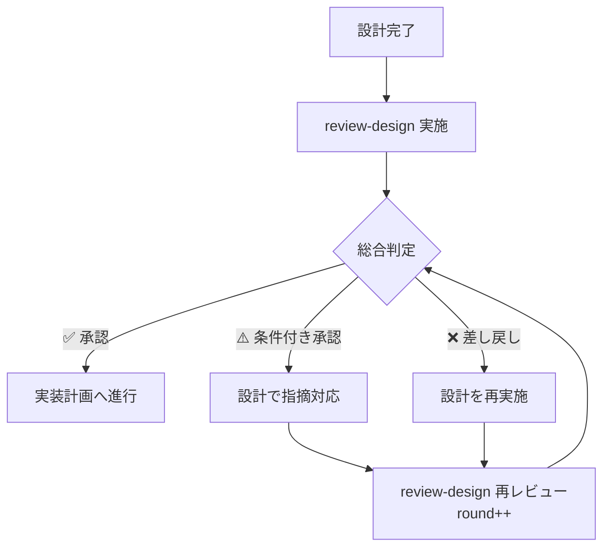

# 再レビュー手順

## 再帰的レビューループ



指摘がなくなるまで 設計 ⇄ review-design を再帰的に繰り返す。
各ラウンドの指摘内容はレビューサマリーで追跡される。

## 再レビュー時（round > 1）の追加手順

1. 前ラウンドの未解決（open）指摘を優先確認
2. 対応された指摘は `status: resolved`、`resolved_in_round: {current_round}` に更新
3. 新規指摘は新しい `id` で追加

## ラウンド管理ルール

- **初回レビュー**: `round: 1` で開始
- **再レビュー**: 前ラウンドの `round` をインクリメント
- **issues**: 全ラウンドの指摘を累積保持（`resolved_in_round` で解決ラウンドを追跡）
- **status 遷移**: `pending` → `rejected` / `conditional` / `approved`

## レビュー結果フォーマット

レビュー結果はレビューサマリー（06_review-summary.md）に以下の形式で記録：

```yaml
review:
  round: 1                        # ラウンド番号（再レビュー時にインクリメント）
  status: approved                # approved / conditional / rejected
  verdict: "承認"                 # 日本語判定テキスト
  completed_at: "2025-01-15T10:30:00+09:00"
  summary: "全指摘解決済み。Critical/Major/Minor指摘なし。"
  issues:
    - id: DR-001
      severity: major             # critical / major / minor / info
      category: "要件カバレッジ"
      description: "非機能要件の応答時間に関する設計が不足"
      status: resolved            # open / resolved / deferred
      resolved_in_round: 2
    - id: DR-002
      severity: minor
      category: "テスト可能性"
      description: "モックの注入方法が未定義"
      status: open
```
