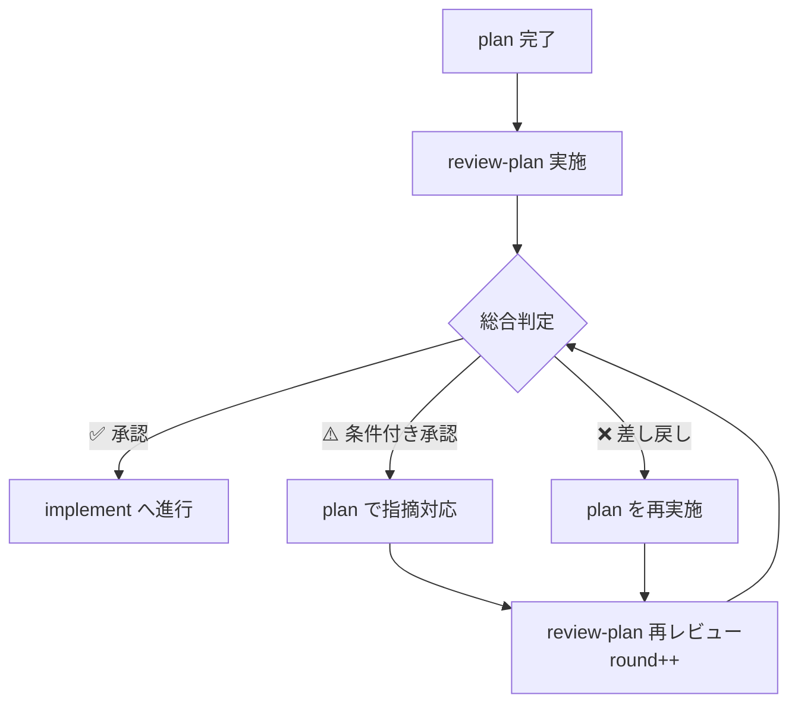
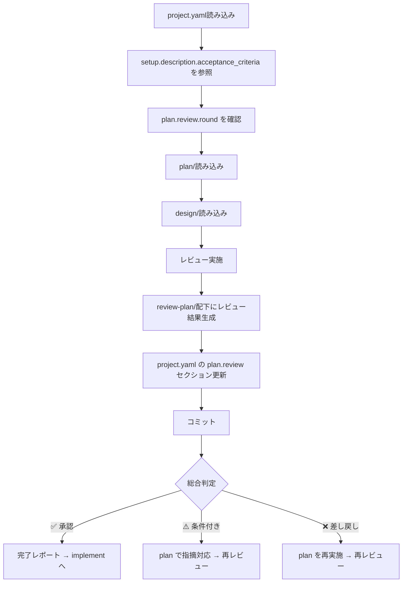

# 計画レビュースキル（review-plan）

project.yaml + plan/ + design/ を入力として、タスク計画の妥当性を体系的にレビューし、レビュー結果をドキュメント化します。

> **SSOT**: `project.yaml` を全プロセスの Single Source of Truth として使用します。
> - 受入基準の参照: `setup.description.acceptance_criteria`
> - 設計結果の参照: `design` セクション
> - レビュー結果の出力: `plan.review` セクション

> [!CAUTION]
> **レビュー品質方針（ゼロトレランス）**
> - レビュアーは **不具合を出さないことに命が懸かっている** つもりで、些細な問題も見逃さず指摘すること
> - **Minor を含む全ての指摘は修正必須** — 「後で対応」「実装フェーズで調整」は許容しない
> - 軽微に見える計画上の問題も、実装フェーズでの品質劣化の入口となるため必ず指摘する
> - 可能な限り品質向上に努め、「問題ない」と判断する前に本当に問題がないか再度確認する

## 概要

このスキルは以下を実現します：

1. **project.yaml** からチケット情報・対象リポジトリ・受入基準を取得
2. **project.yaml の setup.description.acceptance_criteria** を計画の妥当性判断基準として参照
3. **plan/** からタスク計画を読み込み
4. **design/** から設計内容を読み込み（計画が設計に基づいているか検証）
5. **docs/{target_repo}/review-plan/** ディレクトリにレビュー結果を出力
6. **project.yaml の plan.review セクション** を更新してコミット

## 再帰的レビューループ



指摘がなくなるまで plan ⇄ review-plan を再帰的に繰り返します。

## 入力ファイル

### 1. project.yaml（必須・SSOT）

```yaml
setup:
  ticket_id: "PROJ-123"
  description:
    acceptance_criteria:           # ← このスキルが参照（妥当性判断基準）
      - "単体テストが全てパスすること"
      - "結合テストが全てパスすること"
  target_repositories:
    - name: "target-repo"

plan:
  status: completed
  review:                          # ← このスキルが更新
    round: 1
    status: pending
```

### 2. plan/（必須）

planスキルで生成されたタスク計画。

### 3. design/（参照）

designスキルで生成された詳細設計（計画が設計に基づいているかの検証に使用）。

## 処理フロー



## project.yaml の setup.description.acceptance_criteria 活用

レビューを実施する際に、`project.yaml` の `setup.description.acceptance_criteria` を読み込み、計画の妥当性判断基準として活用します。

**活用方法:**
- **受入基準の網羅性**: タスク計画が全ての受入基準を満たすよう構成されているか検証
- **テストタスクの十分性**: 受入基準のテスト要件に対応するタスクが存在するか確認
- **完了条件の整合性**: 各タスクの完了条件が受入基準と整合しているか検証

**再レビュー時（round > 1）:**
- 前ラウンドの `plan.review.issues` から `status: open` の指摘を優先確認
- 対応済み指摘の `status` を `resolved` に更新、`resolved_in_round` を記録

## レビュー実施項目

### 1. タスク分割の妥当性レビュー（01_task-decomposition.md）

- タスク粒度の適切性（1-2時間で完了可能か）
- 各タスクが明確な目的を持っているか
- 設計内容の全てがタスク化されているか
- 漏れている作業がないか
- タスク間の重複がないか

### 2. 依存関係の正確性レビュー（02_dependency-accuracy.md）

- 依存関係が正確に定義されているか
- 循環依存がないか
- 暗黙の依存関係が見落とされていないか
- 並列実行グループの適切性
- クリティカルパスの妥当性

### 3. 見積もりの妥当性レビュー（03_estimation-validity.md）

- 各タスクの工数見積もりが現実的か
- 総工数の妥当性
- バッファの考慮
- リスクに対する余裕
- 並列実行による時間短縮の見積もり

### 4. TDD方針の適切性レビュー（04_tdd-approach.md）

- RED-GREEN-REFACTORの方針が適切に定義されているか
- テストケースの網羅性
- テストファイルの配置が適切か
- テスト対象と実装対象の対応関係が明確か

### 5. 受入基準カバレッジレビュー（05_acceptance-coverage.md）

- 全ての受入基準がタスク計画でカバーされているか
- 受入基準とタスクの対応表
- 検証方法の明確性
- 弊害検証タスクの十分性

### 6. レビューサマリー（06_review-summary.md）

- 総合判定（承認/条件付き承認/差し戻し）
- 指摘事項一覧（重大度別）
- 改善提案
- 次のステップ

## 出力ファイル構成

レビュー結果は `docs/{target_repository}/review-plan/` に出力：

```
docs/
└── {target_repository}/
    └── review-plan/
        ├── 01_task-decomposition.md        # タスク分割の妥当性レビュー
        ├── 02_dependency-accuracy.md       # 依存関係の正確性レビュー
        ├── 03_estimation-validity.md       # 見積もりの妥当性レビュー
        ├── 04_tdd-approach.md              # TDD方針の適切性レビュー
        ├── 05_acceptance-coverage.md       # 受入基準カバレッジレビュー
        └── 06_review-summary.md            # レビューサマリー
```

## レビュー判定基準

### 重大度レベル

| レベル     | 説明                           | 対応                                                   |
| ---------- | ------------------------------ | ------------------------------------------------------ |
| 🔴 Critical | 計画を根本的に見直す必要がある | 差し戻し：planの再実施が必要                           |
| 🟠 Major    | 重要な修正が必要               | 条件付き承認：修正後に再レビュー                       |
| 🟡 Minor    | 改善が必要                     | 条件付き承認：次のフェーズに進む前に修正が必要         |
| 🔵 Info     | 情報・提案                     | 承認：ただし改善提案として記録し、可能な限り対応を推奨 |

### 総合判定

| 判定           | 条件                              | 次のステップ                 |
| -------------- | --------------------------------- | ---------------------------- |
| ✅ 承認         | Critical/Major/Minorの指摘なし    | implementスキルへ進行        |
| ⚠️ 条件付き承認 | Minor以上の指摘あり、Criticalなし | 指摘事項を修正後、再レビュー |
| ❌ 差し戻し     | Criticalの指摘あり                | planスキルの再実施           |

## project.yaml 更新内容

`project.yaml` の `plan.review` セクションを更新：

```yaml
plan:
  status: completed
  review:
    round: 1
    status: approved                # approved / conditional / rejected
    latest_verdict: "承認"
    completed_at: "2025-01-15T10:30:00+09:00"
    summary: "全指摘解決済み。Critical/Major/Minor指摘なし。"
    issues:
      - id: PR-001
        severity: minor
        category: "見積もり"
        description: "task03の工数見積もりが過少"
        status: open
    artifacts:
      - "docs/{target_repo}/review-plan/06_review-summary.md"
```

### ラウンド管理ルール

- **初回レビュー**: `round: 1` で開始
- **再レビュー**: 前ラウンドの `round` をインクリメント
- **issues**: 全ラウンドの指摘を累積保持（`resolved_in_round` で解決ラウンドを追跡）
- **status 遷移**: `pending` → `rejected` / `conditional` / `approved`

## 実行手順

### 1. project.yaml読み込み

```bash
test -f "project.yaml" || { echo "Error: project.yaml not found"; exit 1; }
```

`project.yaml` から情報を yq で取得:

```bash
# メタ情報
TICKET_ID=$(yq '.meta.ticket_id' project.yaml)
TARGET_REPO=$(yq '.meta.target_repo' project.yaml)

# 受入基準（妥当性判断基準）
yq '.setup.description.acceptance_criteria' project.yaml

# 再レビューの場合: 前回のラウンドと指摘を取得
CURRENT_ROUND=$(yq '.plan.review.round // 0' project.yaml)
yq '.plan.review.issues[] | select(.status == "open")' project.yaml
```

### 2. plan/確認・レビュー実施・出力

前セクション「レビュー実施項目」に従い検証を実施し、`docs/{target_repo}/review-plan/` に出力。

### 3. project.yaml 更新

```bash
# plan.review セクションの更新（yq 使用）
yq -i ".plan.review.round = $((CURRENT_ROUND + 1))" project.yaml
yq -i '.plan.review.status = "approved"' project.yaml  # approved / conditional / rejected
yq -i '.plan.review.latest_verdict = "承認"' project.yaml
yq -i ".plan.review.completed_at = \"$(date -Iseconds)\"" project.yaml
yq -i '.plan.review.summary = "全指摘解決済み。Critical/Major/Minor指摘なし。"' project.yaml

# 指摘事項の追加（存在する場合）
yq -i '.plan.review.issues += [{"id": "PR-001", "severity": "minor", "status": "open", "description": "指摘内容"}]' project.yaml

# 指摘の解決更新（再レビュー時）
yq -i '(.plan.review.issues[] | select(.id == "PR-001")).status = "resolved"' project.yaml
yq -i "(.plan.review.issues[] | select(.id == \"PR-001\")).resolved_in_round = $((CURRENT_ROUND + 1))" project.yaml

# 成果物パス
yq -i ".plan.review.artifacts = [\"docs/${TARGET_REPO}/review-plan/06_review-summary.md\"]" project.yaml

# meta.updated_at を更新
yq -i ".meta.updated_at = \"$(date -Iseconds)\"" project.yaml
```

### 4. コミット

```bash
git add docs/ project.yaml
git commit -m "docs: {ticket_id} 計画レビュー結果を追加 (round {round})

- docs/{target_repo}/review-plan/配下にレビュー結果を出力
- project.yaml の plan.review セクションを更新"
```

## 完了レポート

```markdown
## 計画レビュー完了 ✅

### レビュー対象
- チケット: {ticket_id}
- タスク: {task_name}
- リポジトリ: {target_repositories}

### 総合判定
- **判定**: {✅ 承認 / ⚠️ 条件付き承認 / ❌ 差し戻し}

### 指摘事項サマリー
- 🔴 Critical: {count}件
- 🟠 Major: {count}件
- 🟡 Minor: {count}件
- 🔵 Info: {count}件

### 生成されたファイル

#### design-document更新
- docs/{ticket_id}.md - 計画レビューセクション追加

#### レビュー結果
- docs/{target_repo}/review-plan/01_task-decomposition.md
- docs/{target_repo}/review-plan/02_dependency-accuracy.md
- docs/{target_repo}/review-plan/03_estimation-validity.md
- docs/{target_repo}/review-plan/04_tdd-approach.md
- docs/{target_repo}/review-plan/05_acceptance-coverage.md
- docs/{target_repo}/review-plan/06_review-summary.md

### 次のステップ
1. ✅ 承認の場合: implementスキルで実装を開始
2. ⚠️ 条件付き承認の場合: 指摘事項を修正後、再レビュー
3. ❌ 差し戻しの場合: planスキルでタスク計画を再作成
```

## エラーハンドリング

### setup.yamlが見つからない

```
エラー: setup.yamlが見つかりません
ファイル: {yaml_path}

init-work-branchスキルでセットアップを完了してください。
```

### design-documentが見つからない

```
エラー: design-documentが見つかりません
ファイル: docs/{ticket_id}.md

init-work-branchスキルでセットアップを完了してください。
```

### plan/が見つからない

```
エラー: タスク計画が見つかりません
ディレクトリ: docs/{target_repo}/plan/

planスキルでタスク計画を作成してください。
```

## 注意事項

- レビューは `target_repositories` の計画のみ対象
- plan/が存在しない場合はエラー終了
- design/が存在しない場合は警告を出し、設計との整合性チェックをスキップ
- 既存の `review-plan/` ディレクトリがある場合は上書き（再レビュー時）
- **project.yaml の setup.description.acceptance_criteria を計画の妥当性判断基準として参照**
- レビューは客観的な基準に基づいて実施し、主観的な判断は避ける
- **再帰ループ**: 差し戻し/条件付き承認 → plan で指摘対応 → review-plan 再レビューを繰り返す

## 参照ファイル

- 前提スキル: `design` - 設計
- 前提スキル: `plan` - タスク計画（差し戻し時に再実施）
- 後続スキル: `implement` - 実装（承認後に進行）
- 関連スキル: `code-review` — コードレビュー

## SSOT参照

| project.yaml フィールド                 | 用途                                                   |
| --------------------------------------- | ------------------------------------------------------ |
| `setup.description.acceptance_criteria` | タスク計画の完了条件網羅性検証、テストタスク十分性確認 |
| `plan.review` (出力)                    | レビュー結果・指摘の追跡                               |

## 典型的なワークフロー

```
[project.yaml読み込み] --> パースしてバリデーション
        |
[plan.review確認] --> 再レビューの場合、前回指摘を読み込み
        |
[plan/読み込み] --> タスク計画の読み込み
        |
[design/読み込み] --> 設計結果の読み込み（任意）
        |
[レビュー実施] --> タスク分割・依存関係・見積もり・TDD・受入基準
        |
[review-plan/生成] --> レビュー結果ファイルを生成
        |
[project.yaml更新] --> plan.review セクションを更新
        |
[コミット] --> 変更をコミット
        |
[判定分岐] --> ✅承認→implement / ⚠️条件付き→plan再修正 / ❌差し戻し→plan再実施
```
