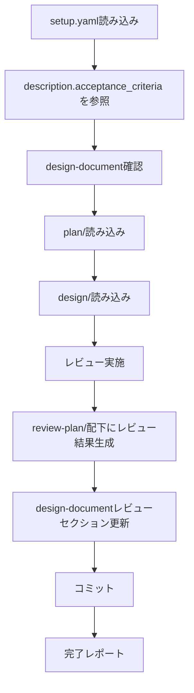

# 計画レビュースキル（review-plan）

setup.yaml + design-document + plan/ + design/を入力として、タスク計画の妥当性を体系的にレビューし、レビュー結果をドキュメント化します。

> **SSOT**: setup.yaml の `description.acceptance_criteria` を計画の妥当性判断基準として参照します。

## 概要

このスキルは以下を実現します：

1. **setup.yaml** からチケット情報・対象リポジトリ・受入基準を取得
2. **setup.yaml の description.acceptance_criteria** を計画の妥当性判断基準として参照
3. **design-document** と **plan/** からタスク計画を読み込み
4. **design/** から設計内容を読み込み（計画が設計に基づいているか検証）
5. **docs/{target_repo}/review-plan/** ディレクトリにレビュー結果を出力
6. **design-document** のレビューセクションを更新

## 入力ファイル

### 1. setup.yaml（必須）

```yaml
ticket_id: "PROJ-123"
task_name: "機能追加タスク"

# SSOT: このスキルは description.acceptance_criteria を参照
description:
  overview: "概要..."
  purpose: "目的..."
  background: "背景..."
  requirements:
    functional: [...]
    non_functional: [...]
  acceptance_criteria:             # ← このスキルが参照
    - "単体テストが全てパスすること"
    - "結合テストが全てパスすること"
    - "既存機能の回帰テストがパスすること"
    - "ドキュメントが更新されていること"
    - "コードレビューが承認されていること"
  scope: [...]
  out_of_scope: [...]

target_repositories:
  - name: "target-repo"
    url: "git@github.com:org/target-repo.git"
    base_branch: "main"
```

### 2. design-document: docs/{ticket_id}.md（必須）

init-work-branchスキルで生成され、各スキルで更新された設計ドキュメント。

### 3. plan/（必須）

planスキルで生成されたタスク計画：

```
docs/
└── {target_repository}/
    └── plan/
        ├── task-list.md               # タスク一覧と依存関係
        ├── task01.md                  # task01用プロンプト
        ├── task02-01.md               # task02-01用プロンプト
        ├── task02-02.md               # task02-02用プロンプト
        ├── ...                        # 各タスク用プロンプト
        └── parent-agent-prompt.md     # 親エージェント統合管理プロンプト
```

### 4. design/（参照）

designスキルで生成された詳細設計（計画が設計に基づいているかの検証に使用）：

```
docs/
└── {target_repository}/
    └── design/
        ├── 01_implementation-approach.md
        ├── 02_interface-api-design.md
        ├── 03_data-structure-design.md
        ├── 04_process-flow-design.md
        ├── 05_test-plan.md
        └── 06_side-effect-verification.md
```

## 処理フロー



## setup.yaml の description.acceptance_criteria 活用

レビューを実施する際に、`setup.yaml` の `description.acceptance_criteria` を読み込み、計画の妥当性判断基準として活用します：

```yaml
# setup.yaml から取得
description:
  acceptance_criteria:
    - "単体テストが全てパスすること"
    - "結合テストが全てパスすること"
    - "既存機能の回帰テストがパスすること"
    - "ドキュメントが更新されていること"
```

**活用方法:**
- **受入基準の網羅性**: タスク計画が全ての受入基準を満たすよう構成されているか検証
- **テストタスクの十分性**: 受入基準のテスト要件に対応するタスクが存在するか確認
- **完了条件の整合性**: 各タスクの完了条件が受入基準と整合しているか検証

## レビュー実施項目

### 1. タスク分割の妥当性レビュー（01_task-decomposition.md）

- タスク粒度の適切性（1-2時間で完了可能か）
- 各タスクが明確な目的を持っているか
- 設計内容の全てがタスク化されているか
- 漏れている作業がないか
- タスク間の重複がないか

### 2. 依存関係の正確性レビュー（02_dependency-accuracy.md）

- 依存関係が正確に定義されているか
- 循環依存がないか
- 暗黙の依存関係が見落とされていないか
- 並列実行グループの適切性
- クリティカルパスの妥当性

### 3. 見積もりの妥当性レビュー（03_estimation-validity.md）

- 各タスクの工数見積もりが現実的か
- 総工数の妥当性
- バッファの考慮
- リスクに対する余裕
- 並列実行による時間短縮の見積もり

### 4. TDD方針の適切性レビュー（04_tdd-approach.md）

- RED-GREEN-REFACTORの方針が適切に定義されているか
- テストケースの網羅性
- テストファイルの配置が適切か
- テスト対象と実装対象の対応関係が明確か

### 5. 受入基準カバレッジレビュー（05_acceptance-coverage.md）

- 全ての受入基準がタスク計画でカバーされているか
- 受入基準とタスクの対応表
- 検証方法の明確性
- 弊害検証タスクの十分性

### 6. レビューサマリー（06_review-summary.md）

- 総合判定（承認/条件付き承認/差し戻し）
- 指摘事項一覧（重大度別）
- 改善提案
- 次のステップ

## 出力ファイル構成

レビュー結果は `docs/{target_repository}/review-plan/` に出力：

```
docs/
└── {target_repository}/
    └── review-plan/
        ├── 01_task-decomposition.md        # タスク分割の妥当性レビュー
        ├── 02_dependency-accuracy.md       # 依存関係の正確性レビュー
        ├── 03_estimation-validity.md       # 見積もりの妥当性レビュー
        ├── 04_tdd-approach.md              # TDD方針の適切性レビュー
        ├── 05_acceptance-coverage.md       # 受入基準カバレッジレビュー
        └── 06_review-summary.md            # レビューサマリー
```

## レビュー判定基準

### 重大度レベル

| レベル     | 説明                           | 対応                             |
| ---------- | ------------------------------ | -------------------------------- |
| 🔴 Critical | 計画を根本的に見直す必要がある | 差し戻し：planの再実施が必要     |
| 🟠 Major    | 重要な修正が必要               | 条件付き承認：修正後に再レビュー |
| 🟡 Minor    | 改善が望ましい                 | 承認：実装フェーズで調整可能     |
| 🔵 Info     | 情報・提案                     | 承認：参考情報として記録         |

### 総合判定

| 判定           | 条件                          | 次のステップ                 |
| -------------- | ----------------------------- | ---------------------------- |
| ✅ 承認         | Critical/Majorの指摘なし      | implementスキルへ進行        |
| ⚠️ 条件付き承認 | Majorの指摘あり、Criticalなし | 指摘事項を修正後、再レビュー |
| ❌ 差し戻し     | Criticalの指摘あり            | planスキルの再実施           |

## design-document更新内容

`docs/{ticket_id}.md` に「3.5 計画レビュー」セクションを追加：

```markdown
### 3.5 計画レビュー

#### レビュー結果

- **総合判定**: {✅ 承認 / ⚠️ 条件付き承認 / ❌ 差し戻し}
- **レビュー日**: {date}

#### 指摘事項サマリー

| No  | 重大度  | カテゴリ   | 指摘内容   | 対応状況 |
| --- | ------- | ---------- | ---------- | -------- |
| 1   | 🟠 Major | タスク分割 | {指摘内容} | ⬜ 未対応 |
| 2   | 🟡 Minor | 見積もり   | {指摘内容} | ⬜ 未対応 |

詳細は [review-plan/](./{target_repo}/review-plan/) を参照。
```

## 実行手順

### 1. setup.yaml読み込み

```bash
YAML_PATH="${1:-setup.yaml}"
test -f "$YAML_PATH" || { echo "Error: $YAML_PATH not found"; exit 1; }
```

### 2. design-document確認

```bash
DOCS_DIR="${options.design_document_dir:-docs}"
DESIGN_DOC="$DOCS_DIR/${ticket_id}.md"
test -f "$DESIGN_DOC" || { echo "Error: $DESIGN_DOC not found"; exit 1; }
```

### 3. plan/確認

```bash
for repo in "${target_repositories[@]}"; do
    PLAN_DIR="docs/${repo}/plan"
    test -d "$PLAN_DIR" || { echo "Error: $PLAN_DIR not found"; exit 1; }
done
```

### 4. design/確認

```bash
for repo in "${target_repositories[@]}"; do
    DESIGN_DIR="docs/${repo}/design"
    test -d "$DESIGN_DIR" || { echo "Warning: $DESIGN_DIR not found. 設計との整合性チェックをスキップします。"; }
done
```

### 5. レビューの実施

各計画ファイルについて、レビュー項目に従い検証を実施：

1. **タスク分割の妥当性レビュー**: 粒度・網羅性・重複の確認
2. **依存関係の正確性レビュー**: 依存関係グラフの検証
3. **見積もりの妥当性レビュー**: 工数見積もりの現実性
4. **TDD方針の適切性レビュー**: テスト戦略の妥当性
5. **受入基準カバレッジレビュー**: acceptance_criteria vs タスク計画
6. **レビューサマリー**: 総合判定と指摘事項一覧

### 6. review-plan/配下にファイル生成

```bash
for repo in "${target_repositories[@]}"; do
    REVIEW_DIR="docs/${repo}/review-plan"
    mkdir -p "$REVIEW_DIR"

    # 各レビューファイルを生成
    # 01_task-decomposition.md
    # 02_dependency-accuracy.md
    # 03_estimation-validity.md
    # 04_tdd-approach.md
    # 05_acceptance-coverage.md
    # 06_review-summary.md
done
```

### 7. design-document更新

`docs/{ticket_id}.md` に「3.5 計画レビュー」セクションを追加。

### 8. コミット

```bash
# 親リポジトリでコミット（docs配下に出力）
git add docs/ setup.yaml
git commit -m "docs: {ticket_id} 計画レビュー結果を追加

- docs/{target_repo}/review-plan/配下にレビュー結果を出力
- design-documentの計画レビューセクションを更新"
```

## 完了レポート

```markdown
## 計画レビュー完了 ✅

### レビュー対象
- チケット: {ticket_id}
- タスク: {task_name}
- リポジトリ: {target_repositories}

### 総合判定
- **判定**: {✅ 承認 / ⚠️ 条件付き承認 / ❌ 差し戻し}

### 指摘事項サマリー
- 🔴 Critical: {count}件
- 🟠 Major: {count}件
- 🟡 Minor: {count}件
- 🔵 Info: {count}件

### 生成されたファイル

#### design-document更新
- docs/{ticket_id}.md - 計画レビューセクション追加

#### レビュー結果
- docs/{target_repo}/review-plan/01_task-decomposition.md
- docs/{target_repo}/review-plan/02_dependency-accuracy.md
- docs/{target_repo}/review-plan/03_estimation-validity.md
- docs/{target_repo}/review-plan/04_tdd-approach.md
- docs/{target_repo}/review-plan/05_acceptance-coverage.md
- docs/{target_repo}/review-plan/06_review-summary.md

### 次のステップ
1. ✅ 承認の場合: implementスキルで実装を開始
2. ⚠️ 条件付き承認の場合: 指摘事項を修正後、再レビュー
3. ❌ 差し戻しの場合: planスキルでタスク計画を再作成
```

## エラーハンドリング

### setup.yamlが見つからない

```
エラー: setup.yamlが見つかりません
ファイル: {yaml_path}

init-work-branchスキルでセットアップを完了してください。
```

### design-documentが見つからない

```
エラー: design-documentが見つかりません
ファイル: docs/{ticket_id}.md

init-work-branchスキルでセットアップを完了してください。
```

### plan/が見つからない

```
エラー: タスク計画が見つかりません
ディレクトリ: docs/{target_repo}/plan/

planスキルでタスク計画を作成してください。
```

## 注意事項

- レビューは `target_repositories` の計画のみ対象
- plan/が存在しない場合はエラー終了
- design/が存在しない場合は警告を出し、設計との整合性チェックをスキップ
- 既存の `review-plan/` ディレクトリがある場合は上書き確認を行う
- **setup.yaml の description.acceptance_criteria を計画の妥当性判断基準として参照**
- レビューは客観的な基準に基づいて実施し、主観的な判断は避ける

## 参照ファイル

- 前提スキル: `init-work-branch` - 作業ブランチ初期化
- 前提スキル: `investigation` - 開発タスク用詳細調査
- 前提スキル: `design` - 設計
- 前提スキル: `plan` - タスク計画
- 後続スキル: `implement` - 実装
- 関連スキル: `requesting-code-review` — 計画レビュー後のコードレビュー依頼
- 関連エージェント: `code-reviewer` (`.github/agents/code-reviewer.agent.md`) — コード品質レビュー
- 参照テンプレート: [references/review-template.md](references/review-template.md) - レビューテンプレート

## SSOT参照

| setup.yaml フィールド             | 用途                                                   |
| --------------------------------- | ------------------------------------------------------ |
| `description.acceptance_criteria` | タスク計画の完了条件網羅性検証、テストタスク十分性確認 |

## 典型的なワークフロー

```
[setup.yaml読み込み] --> YAMLをパースしてバリデーション
        |
[design-document確認] --> docs/{ticket_id}.md の存在確認
        |
[plan/読み込み] --> タスク計画の読み込み
        |
[design/読み込み] --> 設計結果の読み込み（任意）
        |
[レビュー実施] --> タスク分割・依存関係・見積もり・TDD・受入基準
        |
[review-plan/生成] --> レビュー結果ファイルを生成
        |
[design-document更新] --> レビューセクションを更新
        |
[コミット] --> 変更をコミット
        |
[完了レポート] --> レビュー結果を表示
```
