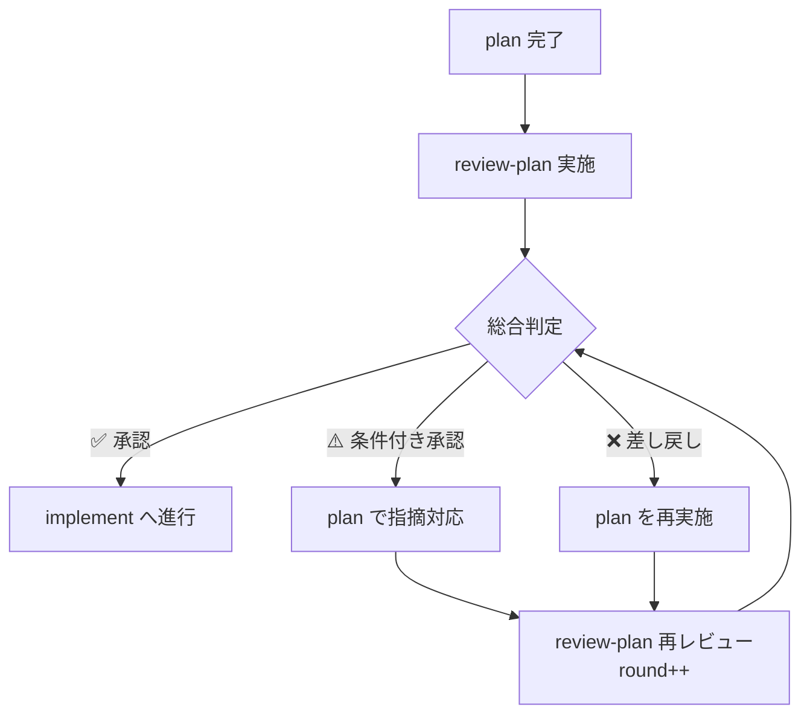
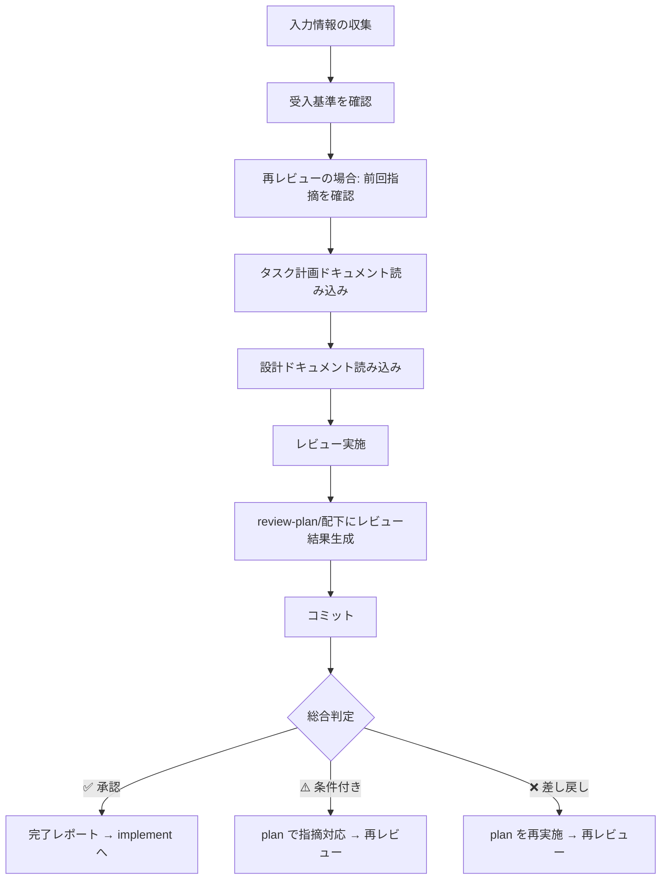

# 計画レビュースキル（review-plan）

タスク計画ドキュメント・設計ドキュメント・受入基準を入力として、タスク計画の妥当性を体系的にレビューし、レビュー結果をドキュメント化します。

> [!CAUTION]
> **レビュー品質方針（ゼロトレランス）**
> - レビュアーは **不具合を出さないことに命が懸かっている** つもりで、些細な問題も見逃さず指摘すること
> - **Minor を含む全ての指摘は修正必須** — 「後で対応」「実装フェーズで調整」は許容しない
> - 軽微に見える計画上の問題も、実装フェーズでの品質劣化の入口となるため必ず指摘する
> - 可能な限り品質向上に努め、「問題ない」と判断する前に本当に問題がないか再度確認する

## 概要

このスキルは以下を実現します：

1. タスク情報・対象リポジトリ・**受入基準**を受け取る
2. 受入基準を計画の妥当性判断基準として参照
3. **タスク計画ドキュメント**を読み込み
4. **設計ドキュメント**を読み込み（計画が設計に基づいているか検証）
5. **docs/{target}/review-plan/** ディレクトリにレビュー結果を出力
6. レビュー結果をコミット

## 再帰的レビューループ


```mermaid
flowchart TD
    A[plan 完了] --> B[review-plan 実施]
    B --> C{総合判定}
    C -->|✅ 承認| D[implement へ進行]
    C -->|⚠️ 条件付き承認| E[plan で指摘対応]
    C -->|❌ 差し戻し| F[plan を再実施]
    E --> G[review-plan 再レビュー\nround++]
    F --> G
    G --> C
```

指摘がなくなるまで plan ⇄ review-plan を再帰的に繰り返します。

## 入力

### 1. タスク計画ドキュメント（必須）

plan スキル等で生成されたタスク計画。タスク分割・依存関係・工数見積もり・TDD 方針を含むドキュメント群。

### 2. 設計ドキュメント（参照）

design スキル等で生成された詳細設計（計画が設計に基づいているかの検証に使用）。

### 3. 受入基準（必須）

タスク計画が満たすべき受入基準の一覧。呼び出し元から提供されるか、プロジェクト管理ファイルから取得する。

### 4. 前回レビュー結果（再レビュー時）

再レビューの場合、前ラウンドの指摘事項一覧（未解決の指摘を優先確認するため）。

## 処理フロー


```mermaid
flowchart TD
    A[入力情報の収集] --> B[受入基準を確認]
    B --> C[再レビューの場合: 前回指摘を確認]
    C --> D[タスク計画ドキュメント読み込み]
    D --> E[設計ドキュメント読み込み]
    E --> F[レビュー実施]
    F --> G[review-plan/配下にレビュー結果生成]
    G --> H[コミット]
    H --> I{総合判定}
    I -->|✅ 承認| J[完了レポート → implement へ]
    I -->|⚠️ 条件付き| K[plan で指摘対応 → 再レビュー]
    I -->|❌ 差し戻し| L[plan を再実施 → 再レビュー]
```

## 受入基準の活用

レビュー時に受入基準を計画の妥当性判断基準として活用します。

**活用方法:**
- **受入基準の網羅性**: タスク計画が全ての受入基準を満たすよう構成されているか検証
- **テストタスクの十分性**: 受入基準のテスト要件に対応するタスクが存在するか確認
- **完了条件の整合性**: 各タスクの完了条件が受入基準と整合しているか検証

**再レビュー時（round > 1）:**
- 前ラウンドの未解決指摘（status: open）を優先確認
- 対応済み指摘の status を resolved に更新し、解決ラウンドを記録

## レビュー実施項目

### 1. タスク分割の妥当性レビュー（01_task-decomposition.md）

- タスク粒度の適切性（1-2時間で完了可能か）
- 各タスクが明確な目的を持っているか
- 設計内容の全てがタスク化されているか
- 漏れている作業がないか
- タスク間の重複がないか

### 2. 依存関係の正確性レビュー（02_dependency-accuracy.md）

- 依存関係が正確に定義されているか
- 循環依存がないか
- 暗黙の依存関係が見落とされていないか
- 並列実行グループの適切性
- クリティカルパスの妥当性

### 3. 見積もりの妥当性レビュー（03_estimation-validity.md）

- 各タスクの工数見積もりが現実的か
- 総工数の妥当性
- バッファの考慮
- リスクに対する余裕
- 並列実行による時間短縮の見積もり

### 4. TDD方針の適切性レビュー（04_tdd-approach.md）

- RED-GREEN-REFACTORの方針が適切に定義されているか
- テストケースの網羅性
- テストファイルの配置が適切か
- テスト対象と実装対象の対応関係が明確か

### 5. 受入基準カバレッジレビュー（05_acceptance-coverage.md）

- 全ての受入基準がタスク計画でカバーされているか
- 受入基準とタスクの対応表
- 検証方法の明確性
- 弊害検証タスクの十分性

### 6. レビューサマリー（06_review-summary.md）

- 総合判定（承認/条件付き承認/差し戻し）
- 指摘事項一覧（重大度別）
- 改善提案
- 次のステップ

## 出力ファイル構成

レビュー結果は `docs/{target}/review-plan/` に出力：

```
docs/
└── {target}/
    └── review-plan/
        ├── 01_task-decomposition.md        # タスク分割の妥当性レビュー
        ├── 02_dependency-accuracy.md       # 依存関係の正確性レビュー
        ├── 03_estimation-validity.md       # 見積もりの妥当性レビュー
        ├── 04_tdd-approach.md              # TDD方針の適切性レビュー
        ├── 05_acceptance-coverage.md       # 受入基準カバレッジレビュー
        └── 06_review-summary.md            # レビューサマリー
```

## レビュー判定基準

### 重大度レベル

| レベル     | 説明                           | 対応                                                   |
| ---------- | ------------------------------ | ------------------------------------------------------ |
| 🔴 Critical | 計画を根本的に見直す必要がある | 差し戻し：planの再実施が必要                           |
| 🟠 Major    | 重要な修正が必要               | 条件付き承認：修正後に再レビュー                       |
| 🟡 Minor    | 改善が必要                     | 条件付き承認：次のフェーズに進む前に修正が必要         |
| 🔵 Info     | 情報・提案                     | 承認：ただし改善提案として記録し、可能な限り対応を推奨 |

### 総合判定

| 判定           | 条件                              | 次のステップ                 |
| -------------- | --------------------------------- | ---------------------------- |
| ✅ 承認         | Critical/Major/Minorの指摘なし    | 実装フェーズへ進行           |
| ⚠️ 条件付き承認 | Minor以上の指摘あり、Criticalなし | 指摘事項を修正後、再レビュー |
| ❌ 差し戻し     | Criticalの指摘あり                | タスク計画の再作成           |

## レビュー結果フォーマット

レビュー結果は以下の情報を含む：

```yaml
review:
  round: 1                           # レビューラウンド番号
  status: approved                   # approved / conditional / rejected
  verdict: "承認"
  completed_at: "2025-01-15T10:30:00+09:00"
  summary: "全指摘解決済み。Critical/Major/Minor指摘なし。"
  issues:
    - id: PR-001
      severity: minor                # critical / major / minor / info
      category: "見積もり"
      description: "task03の工数見積もりが過少"
      status: open                   # open / resolved
      resolved_in_round: ~           # 解決ラウンド番号（解決時に記録）
  artifacts:
    - "docs/{target}/review-plan/06_review-summary.md"
```

### ラウンド管理ルール

- **初回レビュー**: `round: 1` で開始
- **再レビュー**: 前ラウンドの `round` をインクリメント
- **issues**: 全ラウンドの指摘を累積保持（`resolved_in_round` で解決ラウンドを追跡）
- **status 遷移**: `pending` → `rejected` / `conditional` / `approved`

## 実行手順

### 1. 入力情報の収集

以下の情報を収集します：

- **タスク識別情報**: チケットID、タスク名、対象リポジトリ名
- **受入基準**: タスク計画が満たすべき基準の一覧
- **タスク計画ドキュメント**: plan/ 配下のタスク計画ファイル群
- **設計ドキュメント**: design/ 配下の設計ファイル群（任意）
- **前回レビュー結果**: 再レビューの場合、前ラウンドの指摘事項

### 2. レビュー実施・出力

前セクション「レビュー実施項目」に従い検証を実施し、`docs/{target}/review-plan/` に出力。

### 3. コミット

```bash
git add docs/
git commit -m "docs: {ticket_id} 計画レビュー結果を追加 (round {round})

- docs/{target}/review-plan/配下にレビュー結果を出力"
```

## 完了レポート

```markdown
## 計画レビュー完了 ✅

### レビュー対象
- チケット: {ticket_id}
- タスク: {task_name}
- リポジトリ: {target}

### 総合判定
- **判定**: {✅ 承認 / ⚠️ 条件付き承認 / ❌ 差し戻し}

### 指摘事項サマリー
- 🔴 Critical: {count}件
- 🟠 Major: {count}件
- 🟡 Minor: {count}件
- 🔵 Info: {count}件

### 生成されたファイル
- docs/{target}/review-plan/01_task-decomposition.md
- docs/{target}/review-plan/02_dependency-accuracy.md
- docs/{target}/review-plan/03_estimation-validity.md
- docs/{target}/review-plan/04_tdd-approach.md
- docs/{target}/review-plan/05_acceptance-coverage.md
- docs/{target}/review-plan/06_review-summary.md

### 次のステップ
1. ✅ 承認の場合: 実装フェーズを開始
2. ⚠️ 条件付き承認の場合: 指摘事項を修正後、再レビュー
3. ❌ 差し戻しの場合: タスク計画を再作成
```

## エラーハンドリング

### タスク計画が見つからない

```
エラー: タスク計画が見つかりません
ディレクトリ: docs/{target}/plan/

タスク計画を作成してからレビューを実施してください。
```

### 設計ドキュメントが見つからない

```
警告: 設計ドキュメントが見つかりません
ディレクトリ: docs/{target}/design/

設計との整合性チェックはスキップされます。
```

## 注意事項

- タスク計画ドキュメントが存在しない場合はエラー終了
- 設計ドキュメントが存在しない場合は警告を出し、設計との整合性チェックをスキップ
- 既存の `review-plan/` ディレクトリがある場合は上書き（再レビュー時）
- 受入基準を計画の妥当性判断基準として参照
- レビューは客観的な基準に基づいて実施し、主観的な判断は避ける
- **再帰ループ**: 差し戻し/条件付き承認 → plan で指摘対応 → review-plan 再レビューを繰り返す

## 関連スキル

- 前提スキル: `design` - 設計
- 前提スキル: `plan` - タスク計画（差し戻し時に再実施）
- 後続スキル: `implement` - 実装（承認後に進行）
- 関連スキル: `code-review` — コードレビュー

## 典型的なワークフロー

```
[入力情報の収集] --> 受入基準・タスク情報を確認
        |
[再レビュー確認] --> 再レビューの場合、前回指摘を読み込み
        |
[タスク計画読み込み] --> タスク計画ドキュメントの読み込み
        |
[設計読み込み] --> 設計ドキュメントの読み込み（任意）
        |
[レビュー実施] --> タスク分割・依存関係・見積もり・TDD・受入基準
        |
[review-plan/生成] --> レビュー結果ファイルを生成
        |
[コミット] --> 変更をコミット
        |
[判定分岐] --> ✅承認→implement / ⚠️条件付き→plan再修正 / ❌差し戻し→plan再実施
```
