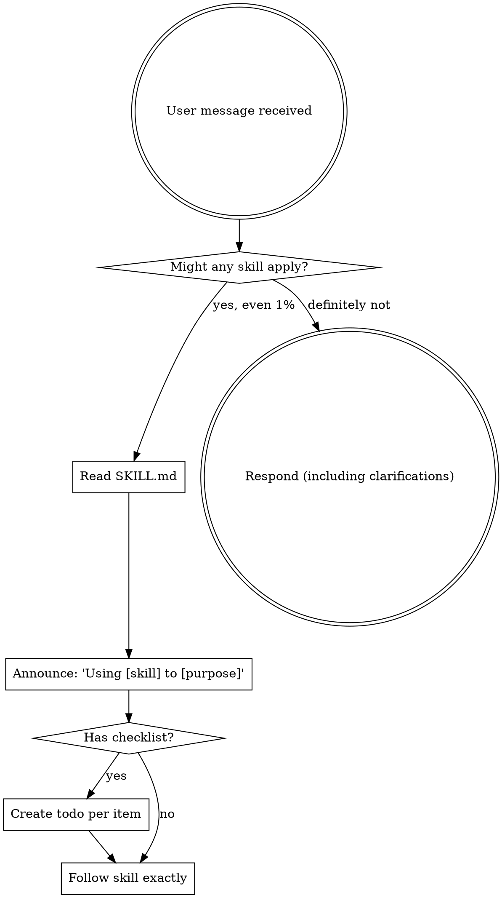

<EXTREMELY-IMPORTANT>
If you think there is even a 1% chance a skill might apply to what you are doing, you ABSOLUTELY MUST invoke the skill.

IF A SKILL APPLIES TO YOUR TASK, YOU DO NOT HAVE A CHOICE. YOU MUST USE IT.

This is not negotiable. This is not optional. You cannot rationalize your way out of this.
</EXTREMELY-IMPORTANT>

## How to Access Skills

**In Claude Code:** Use the `Skill` tool. When you invoke a skill, its content is loaded and presented to you—follow it directly. Never use the Read tool on skill files.

**In GitHub Copilot / other environments:** Read `.claude/skills/*/SKILL.md` files directly.

# Using Skills

## The Rule

**Invoke relevant or requested skills BEFORE any response or action.** Even a 1% chance a skill might apply means that you should invoke the skill to check. If an invoked skill turns out to be wrong for the situation, you don't need to use it.



## Available Skills

```
.claude/skills/
├── brainstorming/               # 要件探索・デザイン
├── code-review/                 # コードレビュー（チェックリストベース）
├── code-review-fix/             # コードレビュー指摘の修正対応
├── commit/                      # コミットメッセージ生成
├── commit-multi-repo/           # マルチリポジトリコミット
├── create-setup-yaml/           # 対話的にsetup.yamlを作成
├── design/                      # 設計
├── finishing-branch/            # ブランチ完了管理
├── implement/                   # 実装
├── init-work-branch/            # 作業ブランチ初期化
├── investigation/               # 詳細調査
├── issue-to-setup-yaml/         # Issue → setup.yaml
├── plan/                        # 計画
├── review-design/               # 設計レビュー
├── review-plan/                 # 計画レビュー
├── skill-usage-protocol/        # このスキル
├── submodule-overview/          # サブモジュール概要
├── systematic-debugging/        # 体系的デバッグ
├── test-driven-development/     # TDD
├── verification/                # 検証（テスト・ビルド・リント実行確認）
├── verification-before-completion/  # 完了前検証（汎用品質ルール）
└── writing-skills/              # スキル作成ガイド
```

## Development Flow

```
issue-to-setup-yaml → init-work-branch → submodule-overview →
brainstorming → investigation → design → review-design →
plan → review-plan → implement (+ test-driven-development) →
verification → code-review → [code-review-fix → code-review]* →
finishing-branch
```

## Project Context

### project.yaml について

`project.yaml` はプロジェクトの進捗管理のためのSSOT（Single Source of Truth）です。

**存在する場合は必ず最初に読み込んでください**。各スキルは対応するセクションを更新します。

```yaml
# project.yaml の主要セクション
setup:           # setup.yamlの内容（初期設定）
brainstorming:   # 要件探索結果
overview:        # サブモジュール概要
investigation:   # 調査フェーズの結果
design:          # 設計フェーズの結果（design.review含む）
plan:            # 計画フェーズの結果（plan.review含む）
implement:       # 実装進捗
verification:    # 検証結果（テスト・ビルド・リント）
code_review:     # コードレビュー進捗・指摘・修正
finishing:       # 完了アクション
```

### スキルとproject.yamlセクションの対応

| スキル               | 更新セクション                   |
| -------------------- | -------------------------------- |
| `brainstorming`      | `meta`, `setup`, `brainstorming` |
| `submodule-overview` | `overview`                       |
| `investigation`      | `investigation`                  |
| `design`             | `design`                         |
| `review-design`      | `design.review`                  |
| `plan`               | `plan`                           |
| `review-plan`        | `plan.review`                    |
| `implement`          | `implement`                      |
| `verification`       | `verification`                   |
| `code-review`        | `code_review`                    |
| `code-review-fix`    | `code_review`（修正記録）        |
| `finishing-branch`   | `finishing`                      |

### ワークフロー

1. **project.yamlが存在する場合**: 現在のステータスを確認し、適切なフェーズから継続
2. **存在しない場合**: `setup.yaml` から開始し、必要に応じて `project.yaml` を生成

### setup.yaml

`setup.yaml` はプロジェクトの初期入力ファイルです（チケット情報、要件など）。

## Red Flags

These thoughts mean STOP—you're rationalizing:

| Thought                             | Reality                                        |
| ----------------------------------- | ---------------------------------------------- |
| "This is just a simple question"    | Questions are tasks. Check for skills.         |
| "I need more context first"         | Skill check comes BEFORE clarifying questions. |
| "Let me explore the codebase first" | Skills tell you HOW to explore. Check first.   |
| "This doesn't need a formal skill"  | If a skill exists, use it.                     |
| "I remember this skill"             | Skills evolve. Read current version.           |
| "The skill is overkill"             | Simple things become complex. Use it.          |
| "I'll just do this one thing first" | Check BEFORE doing anything.                   |

## Skill Priority

When multiple skills could apply, use this order:

1. **Process skills first** (brainstorming, systematic-debugging) - these determine HOW to approach the task
2. **Implementation skills second** (implement, design) - these guide execution

"Let's build X" → brainstorming first, then implementation skills.
"Fix this bug" → systematic-debugging first, then domain-specific skills.

## Skill Types

**Rigid** (test-driven-development, systematic-debugging): Follow exactly. Don't adapt away discipline.

**Flexible** (design, brainstorming): Adapt principles to context.

The skill itself tells you which.

## User Instructions

Instructions say WHAT, not HOW. "Add X" or "Fix Y" doesn't mean skip workflows.
