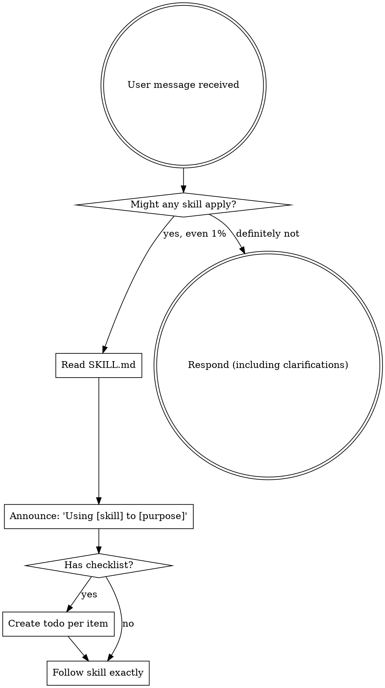

<EXTREMELY-IMPORTANT>
If you think there is even a 1% chance a skill might apply to what you are doing, you ABSOLUTELY MUST invoke the skill.

IF A SKILL APPLIES TO YOUR TASK, YOU DO NOT HAVE A CHOICE. YOU MUST USE IT.

This is not negotiable. This is not optional. You cannot rationalize your way out of this.
</EXTREMELY-IMPORTANT>

## How to Access Skills

**In Claude Code:** Use the `Skill` tool. When you invoke a skill, its content is loaded and presented to you—follow it directly. Never use the Read tool on skill files.

**In GitHub Copilot / other environments:** Read `.claude/skills/*/SKILL.md` files directly.

# Using Skills

## The Rule

**Invoke relevant or requested skills BEFORE any response or action.** Even a 1% chance a skill might apply means that you should invoke the skill to check. If an invoked skill turns out to be wrong for the situation, you don't need to use it.


```dot
digraph skill_flow {
    "User message received" [shape=doublecircle];
    "Might any skill apply?" [shape=diamond];
    "Read SKILL.md" [shape=box];
    "Announce: 'Using [skill] to [purpose]'" [shape=box];
    "Has checklist?" [shape=diamond];
    "Create todo per item" [shape=box];
    "Follow skill exactly" [shape=box];
    "Respond (including clarifications)" [shape=doublecircle];

    "User message received" -> "Might any skill apply?";
    "Might any skill apply?" -> "Read SKILL.md" [label="yes, even 1%"];
    "Might any skill apply?" -> "Respond (including clarifications)" [label="definitely not"];
    "Read SKILL.md" -> "Announce: 'Using [skill] to [purpose]'";
    "Announce: 'Using [skill] to [purpose]'" -> "Has checklist?";
    "Has checklist?" -> "Create todo per item" [label="yes"];
    "Has checklist?" -> "Follow skill exactly" [label="no"];
    "Create todo per item" -> "Follow skill exactly";
}
```

## Available Skills

### 汎用スキル（プロジェクト非依存）

```
.claude/skills/
├── brainstorming/               # 要件探索・デザイン
├── code-review/                 # コードレビュー（チェックリストベース）
├── code-review-fix/             # コードレビュー指摘の修正対応
├── commit/                      # コミットメッセージ生成
├── commit-multi-repo/           # マルチリポジトリコミット
├── design/                      # 設計
├── finishing-branch/            # ブランチ完了管理
├── implement/                   # 実装
├── init-work-branch/            # 作業ブランチ初期化
├── investigation/               # 詳細調査
├── plan/                        # 計画
├── review-design/               # 設計レビュー
├── review-plan/                 # 計画レビュー
├── submodule-overview/          # サブモジュール概要
├── systematic-debugging/        # 体系的デバッグ
├── test-driven-development/     # TDD
├── verification/                # 検証（テスト・ビルド・リント実行確認）
├── verification-before-completion/  # 完了前検証（汎用品質ルール）
└── writing-skills/              # スキル作成ガイド
```

### プロジェクト固有スキル（ワークフロー状態管理）

```
.claude/skills/
├── project-state/               # project.yaml/setup.yaml 状態管理
├── create-setup-yaml/           # 対話的にsetup.yamlを作成
├── issue-to-setup-yaml/         # Issue → setup.yaml
└── skill-usage-protocol/        # このスキル
```

### ワークフロープロンプト（project.yaml連携手順）

```
prompts/workflow/
├── init-work-branch.md          # ブランチ初期化 + setup.yaml連携
├── brainstorming.md             # 要件探索 + project.yaml生成
├── investigation.md             # 調査 + project.yaml更新
├── design.md                    # 設計 + project.yaml更新
├── review-design.md             # 設計レビュー + project.yaml更新
├── plan.md                      # 計画 + project.yaml更新
├── review-plan.md               # 計画レビュー + project.yaml更新
├── implement.md                 # 実装 + project.yaml更新
├── verification.md              # 検証 + project.yaml更新
├── code-review.md               # コードレビュー + project.yaml更新
├── code-review-fix.md           # レビュー修正 + project.yaml更新
└── finishing-branch.md          # ブランチ完了 + project.yaml更新
```

## Development Flow

```
issue-to-setup-yaml → init-work-branch → submodule-overview →
brainstorming → investigation → design → review-design →
plan → review-plan → implement (+ test-driven-development) →
verification → code-review → [code-review-fix → code-review]* →
finishing-branch
```

## Project Context (ワークフロー利用時)

### project.yaml について

`project.yaml` はワークフローの進捗管理ファイルです。
project.yaml の読み書きは `project-state` スキルが担当し、その利用手順を `prompts/workflow/*.md` が定義します。
各汎用スキル自体は project.yaml に依存しません。

**ワークフロー利用時の流れ**:
1. `prompts/workflow/{step}.md` からコンテキスト取得手順を確認
2. `project-state` スキルで project.yaml から必要情報を抽出
3. 汎用スキルを実行（入力はコンテキストとして渡す）
4. `project-state` スキルで結果を project.yaml に書き戻し

### setup.yaml

`setup.yaml` はプロジェクトの初期入力ファイルです（チケット情報、要件など）。

## Red Flags

These thoughts mean STOP—you're rationalizing:

| Thought                             | Reality                                        |
| ----------------------------------- | ---------------------------------------------- |
| "This is just a simple question"    | Questions are tasks. Check for skills.         |
| "I need more context first"         | Skill check comes BEFORE clarifying questions. |
| "Let me explore the codebase first" | Skills tell you HOW to explore. Check first.   |
| "This doesn't need a formal skill"  | If a skill exists, use it.                     |
| "I remember this skill"             | Skills evolve. Read current version.           |
| "The skill is overkill"             | Simple things become complex. Use it.          |
| "I'll just do this one thing first" | Check BEFORE doing anything.                   |

## Skill Priority

When multiple skills could apply, use this order:

1. **Process skills first** (brainstorming, systematic-debugging) - these determine HOW to approach the task
2. **Implementation skills second** (implement, design) - these guide execution

"Let's build X" → brainstorming first, then implementation skills.
"Fix this bug" → systematic-debugging first, then domain-specific skills.

## Skill Types

**Rigid** (test-driven-development, systematic-debugging): Follow exactly. Don't adapt away discipline.

**Flexible** (design, brainstorming): Adapt principles to context.

The skill itself tells you which.

## User Instructions

Instructions say WHAT, not HOW. "Add X" or "Fix Y" doesn't mean skip workflows.
