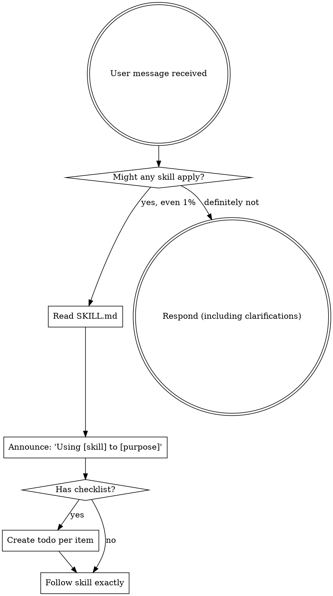

# スキル適用フロー図

```dot
digraph skill_flow {
    "User message received" [shape=doublecircle];
    "Might any skill apply?" [shape=diamond];
    "Read SKILL.md" [shape=box];
    "Announce: 'Using [skill] to [purpose]'" [shape=box];
    "Has checklist?" [shape=diamond];
    "Create todo per item" [shape=box];
    "Follow skill exactly" [shape=box];
    "Respond (including clarifications)" [shape=doublecircle];

    "User message received" -> "Might any skill apply?";
    "Might any skill apply?" -> "Read SKILL.md" [label="yes, even 1%"];
    "Might any skill apply?" -> "Respond (including clarifications)" [label="definitely not"];
    "Read SKILL.md" -> "Announce: 'Using [skill] to [purpose]'";
    "Announce: 'Using [skill] to [purpose]'" -> "Has checklist?";
    "Has checklist?" -> "Create todo per item" [label="yes"];
    "Has checklist?" -> "Follow skill exactly" [label="no"];
    "Create todo per item" -> "Follow skill exactly";
}
```
